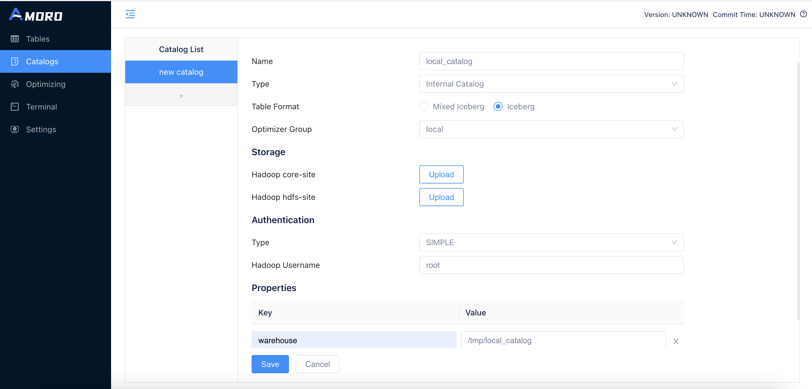
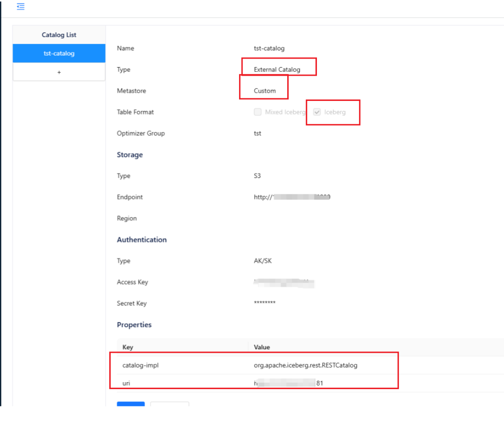

<!--
 - Licensed to the Apache Software Foundation (ASF) under one or more
 - contributor license agreements.  See the NOTICE file distributed with
 - this work for additional information regarding copyright ownership.
 - The ASF licenses this file to You under the Apache License, Version 2.0
 - (the "License"); you may not use this file except in compliance with
 - the License.  You may obtain a copy of the License at
 -
 -   http://www.apache.org/licenses/LICENSE-2.0
 -
 - Unless required by applicable law or agreed to in writing, software
 - distributed under the License is distributed on an "AS IS" BASIS,
 - WITHOUT WARRANTIES OR CONDITIONS OF ANY KIND, either express or implied.
 - See the License for the specific language governing permissions and
 - limitations under the License.
 -->
# Managing Catalogs

Users can import your test or online clusters through the catalog management function provided by the AMS Dashboard. Before adding a new Catalog,
please read the following guidelines and select the appropriate creation according to your actual needs.

## Create catalog
In Amoro, the catalog is a namespace for a group of libraries and tables. Under the catalog, it is further divided into different databases, and under each database, there are different tables. The name of a table in Amoro is uniquely identified by the format `catalog.database.table`. In practical applications, a catalog generally corresponds to a metadata service, such as the commonly used Hive Metastore in big data.

AMS can also serve as a metadata service. In order to differentiate the storage method of metadata, Amoro classifies the catalog type into `Internal Catalog` and `External Catalog`. Catalogs that use AMS as the metadata service are internal catalogs, while others are external catalogs. When creating an external catalog, you need to select the storage backend for its metadata, such as Hive, Hadoop, or Custom.

In addition, when defining a catalog, you also need to select the table format used under it. Currently, Amoro supports the following table formats:
[Iceberg](../iceberg-format/) 、[Paimon](../paimon-format)、[Mixed-Hive](../mixed-hive-format/)、[Mixed-Iceberg](../mixed-iceberg-format/).

You can create a catalog in the AMS frontend:

### Configure basic information

- name: catalog name, only numbers, letters, _, - , starting with letters are supported (lower case letters are recommended)
- type: Internal Catalog or External Catalog
- metastore: storage type for table metadata. Hive Metastore (for using HMS to store metadata), Hadoop (corresponding to iceberg's Hadoop catalog), Glue (for using AWS Glue to store metadata), Custom (other iceberg catalog implementations).
- table format: Iceberg 、Paimon、Mixed-Hive、Mixed-Iceberg.
- optimizer group: tables under the catalog will automatically perform self-optimizing within this group.

### Configure storage
- Type: Hadoop or S3
- core-site: the core-site.xml of the hadoop cluster
- hdfs-site: the hdfs-site.xml of the hadoop cluster
- hive-site: the hive-site.xml for Hive
- Region: region of the S3 bucket
- Endpoint: endpoint of the S3 bucket

### Configure authentication
- Type: SIMPLE, KERBEROS, AK/SK or CUSTOM
- hadoop username: username of the hadoop cluster
- keytab: keytab file
- principal: principal of keytab
- krb5: Kerberos krb5.conf configuration file
- Access Key: Access Key for S3
- Secret Key: Secret Access Key for S3

### Configure properties
Common properties include:
- warehouse: Warehouse **must be configured** for ams/hadoop/glue catalog, as it determines where our database and table files should be placed
- catalog-impl: when the metastore is **Custom**, an additional catalog-impl must be defined, and the user must put the jar package for the custom catalog implementation into the **{AMORO_HOME}/lib** directory, **and the service must be restarted to take effect**
- clients: Hive Catalog connection pool size for accessing HiveMetaStore, default configuration is 20, requires restarting Amoro to take effect.
- database-filter: Configure a regular expression to filter databases in the catalog. If not set then all databases will be displayed in table menu.
- table-filter: Configure a regular expression to filter tables in the catalog. The matching will be done in the format of `database.table`. For example, if it is set to `(A\.a)|(B\.b)`, it will ignore all tables except for table `a` in database `A` and table `b` in database `B`

### Configure table properties
If you want to add the same table properties to all tables under a catalog, you can add these table properties here on the catalog level. If you also configure this property on the table level, the property on the table will take effect.

## REST Catalog
When a user needs to create a Iceberg REST Catalog, they can choose **External Catalog Type**、**Custom Metastore Type**、**Iceberg Table Format**, configure properties include:
**catalog-impl=org.apache.iceberg.rest.RESTCatalog**, **uri=$restCatalog_uri**.

After configuring the above parameters, the final result in the AMS frontend will look like this:

### Nessie's REST Catalog
When a user needs to create a Nessie Rest Catalog, they can also set **catalog-impl=org.apache.iceberg.nessie.NessieCatalog** on top of the above parameters.

## Delete catalog
When a user needs to delete a Catalog, they can go to the details page of the Catalog and click the Remove button at the bottom of the page to perform the deletion.


Before deleting an internal catalog, AMS will verify whether there is metadata for tables under that Catalog.
If there are still tables under that Catalog, AMS will prompt that the deletion failed.

