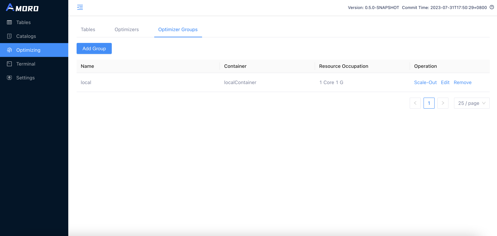
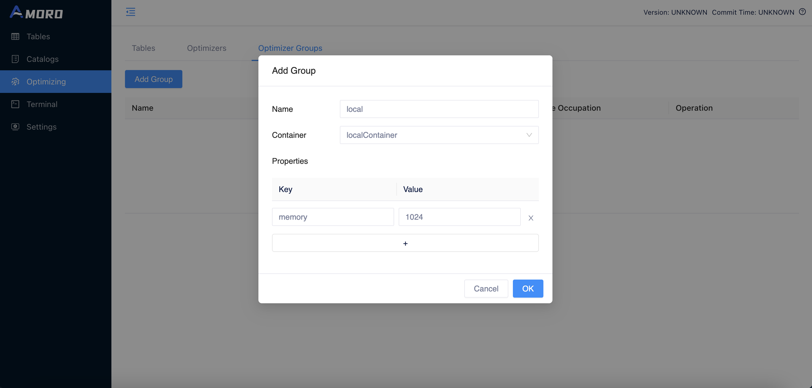
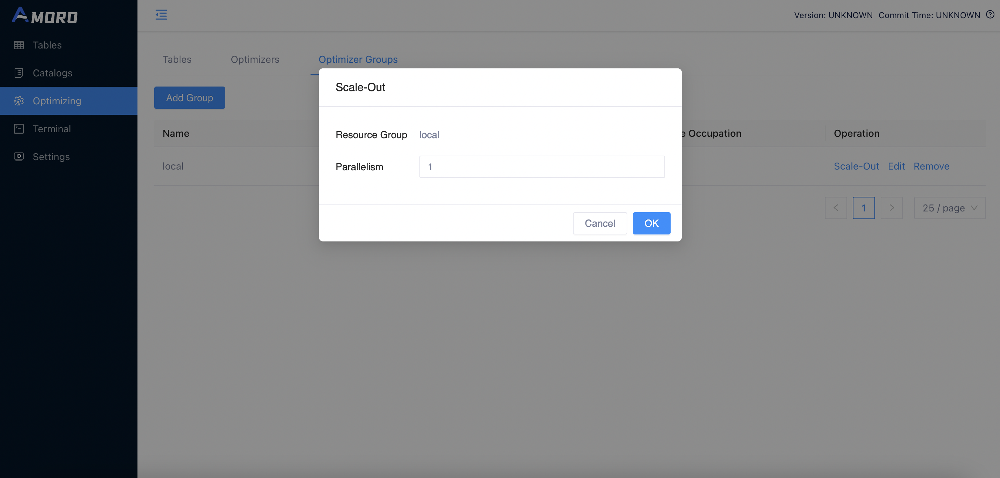
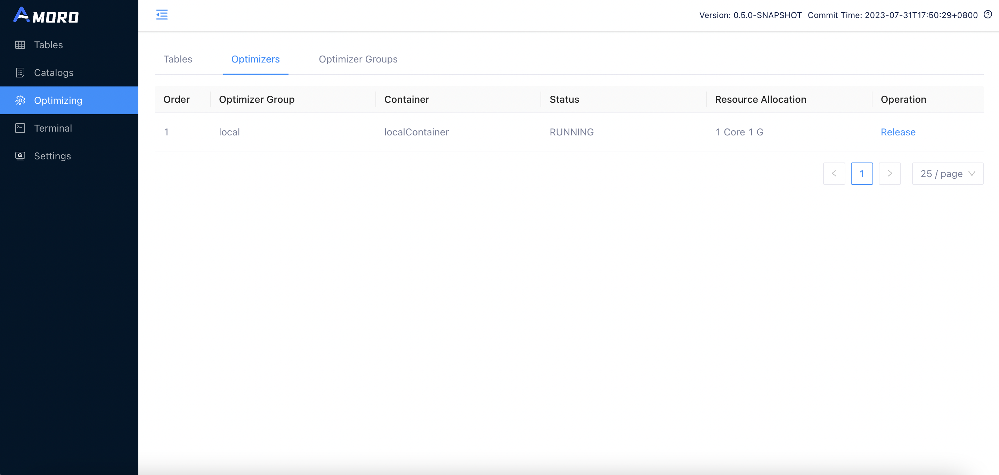

<!--
 - Licensed to the Apache Software Foundation (ASF) under one or more
 - contributor license agreements.  See the NOTICE file distributed with
 - this work for additional information regarding copyright ownership.
 - The ASF licenses this file to You under the Apache License, Version 2.0
 - (the "License"); you may not use this file except in compliance with
 - the License.  You may obtain a copy of the License at
 -
 -   http://www.apache.org/licenses/LICENSE-2.0
 -
 - Unless required by applicable law or agreed to in writing, software
 - distributed under the License is distributed on an "AS IS" BASIS,
 - WITHOUT WARRANTIES OR CONDITIONS OF ANY KIND, either express or implied.
 - See the License for the specific language governing permissions and
 - limitations under the License.
 -->
# Managing Optimizers

The optimizer is the execution unit for performing self-optimizing tasks on a table. To isolate optimizing tasks on different tables and support the deployment of optimizers in different environments, Amoro has proposed the concepts of optimizer containers and optimizer groups:

* Optimizer container: Encapsulate the deployment method of optimizers, there are four implementations for now: `flink container` based on Flink streaming job, `spark container` based on Spark job, `local container` based on Java Application, and `external container` based on manually started by users.
* Optimizer group: A collection of optimizers, where each table must select an optimizer group to perform optimizing tasks on it. Tables under the same optimizer group contribute resources to each other, and tables under different optimizer groups can be isolated in terms of optimizer resources.
* Optimizer: The specific unit that performs optimizing tasks, usually with multiple concurrent units.

## Optimizer container
Before start exploring self-optimizing, you need to configure the container information in the configuration file. Optimizer container represents a specific set of runtime environment configuration. The supported container types include: local, kubernetes, flink, spark, and external.

### Local container
Local container is a way to start Optimizer by local process and supports multi-threaded execution of Optimizer tasks. It is recommended to be used only in demo or local deployment scenarios. If the environment variable for jdk is not configured, the user can configure java_home to point to the jdk root directory. If already configured, this configuration item can be ignored.

Local container support the following properties:

| Property Name         | Required | Default Value | Description                                                                                                   |
|-----------------------|----------|---------------|---------------------------------------------------------------------------------------------------------------|
| ams-optimizing-uri    | false    | N/A           | URI of AMS thrift self-optimizing endpoint. This could be used if the ams.server-expose-host is not available |
| export.JAVA_HOME      | false    | N/A           | Java runtime location                                                                                         |

```yaml
containers:
  - name: localContainer
    container-impl: org.apache.amoro.server.manager.LocalOptimizerContainer
    properties:
      export.JAVA_HOME: "/opt/java"   # JDK environment
```

The format for optimizing URI is `thrift://{host}:{port}?parameter1=value2&parameter2=value2`.
The supported parameters include:

| Parameter Name | efault Value      | Description                                                |
|----------------|-------------------|------------------------------------------------------------|
| autoReconnect  | true              | If reconnect the server when the connection is broken      |
| maxReconnects  | 5                 | Retry times when reconnecting                              |
| connectTimeout | 0 (Forever)       | Timeout in milliseconds when connecting the server         |
| socketTimeout  | 0 (Forever)       | Timeout in milliseconds when communicating with the server |
| maxMessageSize | 104856600 (100MB) | Max message size when communicating with the server        |
| maxMessageSize | 104856600 (100MB) | Max message size when communicating with the server        |
| minIdle        | 0                 | Minimal idle clients in the pool                           |
| maxIdle        | 5                 | Maximal idle clients in the pool                           |

### Kubernetes container

Kubernetes container is a way to start Optimizer On K8s with standalone Optimizer.
To use Kubernetes container, you need to add a new container configuration. 
with container-impl as `org.apache.amoro.server.manager.KubernetesOptimizerContainer`

Kubernetes container support the following properties:


| Property Name             | Required | Default Value | Description                                                                                                   |
|---------------------------|----------|---------------|---------------------------------------------------------------------------------------------------------------|
| kube-config-path          | true     | N/A           | Kubernetes config location                                                                                    |
| image                     | true     | N/A           | Optimizer Image name                                                                                          |
| pullPolicy                | false    | IfNotPresent  | Specify the imagePullPolicy in the container spec                                                             |
| namespace                 | false    | "default"     | The namespace of optimizer to deploy                                                                          |
| ams-optimizing-uri        | false    | N/A           | URI of AMS thrift self-optimizing endpoint. This could be used if the ams.server-expose-host is not available |
| cpu.factor                | false    | "1.0"         | CPU factor when request kubernetes resource. Default 1 Cpu pre thread                                         |
| memory                    | true     | N/A           | Memory usage for pre thread                                                                                   |


```yaml
containers:
  - name: KubernetesContainer
    container-impl: org.apache.amoro.server.manager.KubernetesOptimizerContainer
    properties:
      kube-config-path: ~/.kube/config
      image: apache/amoro:{version}
      pullPolicy: IfNotPresent
```

### Flink container
Flink container is a way to start Optimizer through Flink jobs. With Flink, you can easily deploy Optimizer
on yarn clusters or kubernetes clusters to support large-scale data scenarios. To use flink container, 
you need to add a new container configuration. with container-impl as `org.apache.amoro.server.manager.FlinkOptimizerContainer`

Flink container support the following properties:

| Property Name             | Required | Default Value    | Description                                                                                                                                                                                                                                                                           |
|---------------------------|----------|------------------|---------------------------------------------------------------------------------------------------------------------------------------------------------------------------------------------------------------------------------------------------------------------------------------|
| flink-home                | true     | N/A              | Flink installation location                                                                                                                                                                                                                                                           |
| target                    | true     | yarn-per-job     | flink job deployed target, available values `yarn-per-job`, `yarn-application`, `kubernetes-application`, `session`                                                                                                                                                                   |
| job-uri                   | false    | N/A              | The jar uri of flink optimizer job. This is required if target is application mode.                                                                                                                                                                                                   |
| ams-optimizing-uri        | false    | N/A              | uri of AMS thrift self-optimizing endpoint. This could be used if the ams.server-expose-host is not available                                                                                                                                                                         |
| export.\<key\>            | false    | N/A              | environment variables will be exported during job submit                                                                                                                                                                                                                              |
| export.JAVA_HOME          | false    | N/A              | Java runtime location                                                                                                                                                                                                                                                                 |
| export.HADOOP_CONF_DIR    | false    | N/A              | Direction which holds the configuration files for the hadoop cluster (including hdfs-site.xml, core-site.xml, yarn-site.xml ). If the hadoop cluster has kerberos authentication enabled, you need to prepare an additional krb5.conf and a keytab file for the user to submit tasks  |
| export.JVM_ARGS           | false    | N/A              | you can configure flink to run additional configuration parameters, here is an example of configuring krb5.conf, specify the address of krb5.conf to be used by Flink when committing via `-Djava.security.krb5.conf=/opt/krb5.conf`                                                  |
| export.HADOOP_USER_NAME   | false    | N/A              | the username used to submit tasks to yarn, used for simple authentication                                                                                                                                                                                                             |
| export.FLINK_CONF_DIR     | false    | N/A              | the directory where flink_conf.yaml is located                                                                                                                                                                                                                                        |
| flink-conf.\<key\>        | false    | N/A              | [Flink Configuration Options](https://nightlies.apache.org/flink/flink-docs-master/docs/deployment/config/) will be passed to cli by `-Dkey=value`,                                                                                                                                   |


To better utilize the resources of Flink Optimizer, it is recommended to add the following configuration to the Flink Optimizer Group:
* Set `flink-conf.taskmanager.memory.managed.size` to `32mb` as Flink optimizer does not have any computation logic, it does not need to occupy managed memory.
* Set `flink-conf.taskmanager.memory.network.max` to `32mb` as there is no need for communication between operators in Flink Optimizer.
* Set `flink-conf.taskmanager.memory.network.min` to `32mb` as there is no need for communication between operators in Flink Optimizer.



An example for yarn-per-job mode:

```yaml
containers:
  - name: flinkContainer
    container-impl: org.apache.amoro.server.manager.FlinkOptimizerContainer
    properties:
      flink-home: /opt/flink/                                         #flink install home
      export.HADOOP_CONF_DIR: /etc/hadoop/conf/                       #hadoop config dir
      export.HADOOP_USER_NAME: hadoop                                 #hadoop user submit on yarn
      export.JVM_ARGS: -Djava.security.krb5.conf=/opt/krb5.conf       #flink launch jvm args, like kerberos config when ues kerberos
      export.FLINK_CONF_DIR: /etc/hadoop/conf/                        #flink config dir
```

An example for kubernetes-application mode:

```yaml
containers:
  - name: flinkContainer
    container-impl: org.apache.amoro.server.manager.FlinkOptimizerContainer
    properties:
      flink-home: /opt/flink/                                                        # Flink install home
      target: kubernetes-application                                                 # Flink run as native kubernetes
      pullPolicy: IfNotPresent                                                       # Specify the imagePullPolicy in the container spec  
      job-uri: "local:///opt/flink/usrlib/optimizer-job.jar"                         # Optimizer job main jar for kubernetes application
      ams-optimizing-uri: thrift://ams.amoro.service.local:1261                      # AMS optimizing uri 
      export.FLINK_CONF_DIR: /opt/flink/conf/                                        # Flink config dir
      flink-conf.kubernetes.container.image: "apache/amoro-flink-optimizer:{version}"   # Optimizer image ref
      flink-conf.kubernetes.service-account: flink                                   # Service account that is used within kubernetes cluster.
```

An example for flink session mode:

```yaml
containers:
  - name: flinkContainer
    container-impl: org.apache.amoro.server.manager.FlinkOptimizerContainer
    properties:
      target: session                                                                # Flink run in session cluster
      job-uri: "local:///opt/flink/usrlib/optimizer-job.jar"                         # Optimizer job main jar
      ams-optimizing-uri: thrift://ams.amoro.service.local:1261                      # AMS optimizing uri 
      export.FLINK_CONF_DIR: /opt/flink/conf/                                        # Flink config dir, flink-conf.yaml should e in this dir, contains the rest connection parameters of the session cluster
      flink-conf.high-availability: zookeeper                                        # Flink high availability mode, reference: https://nightlies.apache.org/flink/flink-docs-release-1.18/docs/deployment/config/#high-availability
      flink-conf.high-availability.zookeeper.quorum: xxx:2181
      flink-conf.high-availability.zookeeper.path.root: /flink
      flink-conf.high-availability.cluster-id: amoro-optimizer-cluster
      flink-conf.high-availability.storageDir: hdfs://xxx/xxx/xxx
      flink-conf.rest.address: localhost:8081                                        # If the session cluster is not high availability mode, please configure the restaddress of jobmanager
```


### Spark container
Spark container is another way to start Optimizer through Spark jobs. With Spark, you can easily deploy Optimizer
on yarn clusters or kubernetes clusters to support large-scale data scenarios. To use spark container,
you need to add a new container configuration. with container-impl as `org.apache.amoro.server.manager.SparkOptimizerContainer`

Spark container support the following properties:

| Property Name           | Required | Default Value | Description                                                                                                                                                                                                                                                                          |
|-------------------------|----------|---------------|--------------------------------------------------------------------------------------------------------------------------------------------------------------------------------------------------------------------------------------------------------------------------------------|
| spark-home              | true     | N/A           | Spark installation location                                                                                                                                                                                                                                                          |
| master                  | true     | yarn          | The cluster manager to connect to, available values `yarn`, `k8s://HOST:PORT`                                                                                                                                                                                                        |
| deploy-mode             | true     | client        | Spark job deploy mode, available values `client`, `cluster`                                                                                                                                                                                                                          |
| job-uri                 | false    | N/A           | The jar uri of spark optimizer job. This is required if deploy mode is cluster mode.                                                                                                                                                                                                 |
| ams-optimizing-uri      | false    | N/A           | uri of AMS thrift self-optimizing endpoint. This could be used if the ams.server-expose-host is not available                                                                                                                                                                        |
| export.\<key\>          | false    | N/A           | Environment variables will be exported during job submit                                                                                                                                                                                                                             |
| export.JAVA_HOME        | false    | N/A           | Java runtime location                                                                                                                                                                                                                                                                |
| export.HADOOP_CONF_DIR  | false    | N/A           | Direction which holds the configuration files for the hadoop cluster (including hdfs-site.xml, core-site.xml, yarn-site.xml ). If the hadoop cluster has kerberos authentication enabled, you need to prepare an additional krb5.conf and a keytab file for the user to submit tasks |
| export.JVM_ARGS         | false    | N/A           | You can configure spark to run additional configuration parameters, here is an example of configuring krb5.conf, specify the address of krb5.conf to be used by Spark when committing via `-Djava.security.krb5.conf=/opt/krb5.conf`                                                 |
| export.HADOOP_USER_NAME | false    | N/A           | The username used to submit tasks to yarn, used for simple authentication                                                                                                                                                                                                            |
| export.SPARK_CONF_DIR   | false    | N/A           | The directory where spark_conf.yaml is located                                                                                                                                                                                                                                       |
| spark-conf.\<key\>      | false    | N/A           | [Spark Configuration Options](https://spark.apache.org/docs/latest/configuration.html) will be passed to cli by `-conf key=value`,                                                                                                                                                   |


To better utilize the resources of Spark Optimizer, the DRA(Dynamic Resource Allocation) feature is switched on, and the optimizer parallelism equals `spark.dynamicAllocation.maxExecutors. 
If you don't want this feature, you can use these settings:
* Set `spark-conf.spark.dynamicAllocation.enabled` to `false` as you need allocate proper driver/executor resources Using [Spark Configuration Options](https://spark.apache.org/docs/latest/configuration.html).
* Set `spark-conf.spark.dynamicAllocation.maxExecutors` to `10` as optimizer parallelism can only affect parallelism polling optimizing tasks from AMS.



The spark optimizer may fail due to class conflicts sometimes, you can try to fix by following the steps below：
* Set `spark-conf.spark.driver.userClassPathFirst` to `true`.
* Set `spark-conf.spark.executor.userClassPathFirst` to `true`.


An example for yarn client mode:

```yaml
containers:
  - name: sparkContainer
    container-impl: org.apache.amoro.server.manager.SparkOptimizerContainer
    properties:
      spark-home: /opt/spark/                                         # Spark install home
      master: yarn                                                    # The k8s cluster manager to connect to
      deploy-mode: client                                             # Spark run as client mode 
      export.HADOOP_CONF_DIR: /etc/hadoop/conf/                       # Hadoop config dir
      export.HADOOP_USER_NAME: hadoop                                 # Hadoop user submits on yarn
      export.JVM_ARGS: -Djava.security.krb5.conf=/opt/krb5.conf       # Spark launch jvm args, like kerberos config when ues kerberos
      export.SPARK_CONF_DIR: /etc/hadoop/conf/                        # Spark config dir
```

An example for kubernetes cluster mode:

```yaml
containers:
  - name: sparkContainer
    container-impl: org.apache.amoro.server.manager.SparkOptimizerContainer
    properties:
      spark-home: /opt/spark/                                                                 # Spark install home
      master: k8s://https://<k8s-apiserver-host>:<k8s-apiserver-port>                         # The k8s cluster manager to connect to
      deploy-mode: cluster                                                                    # Spark deploy mode, client or cluster
      pullPolicy: IfNotPresent                                                                # Specify the imagePullPolicy in the container spec 
      job-uri: "local:///opt/spark/usrlib/optimizer-job.jar"                                  # Optimizer job main jar for kubernetes application
      ams-optimizing-uri: thrift://ams.amoro.service.local:1261                               # AMS optimizing uri 
      export.HADOOP_USER_NAME: hadoop                                                         # Hadoop user submits on yarn
      export.HADOOP_CONF_DIR: /etc/hadoop/conf/                                               # Hadoop config dir
      export.SPARK_CONF_DIR: /opt/spark/conf/                                                 # Spark config dir
      spark-conf.spark.kubernetes.container.image: "apache/amoro-spark-optimizer:{version}"   # Optimizer image ref
      spark-conf.spark.dynamicAllocation.enabled: "true"                                      # Enabling DRA feature can make full use of computing resources
      spark-conf.spark.shuffle.service.enabled: "false"                                       # If spark DRA is used on kubernetes, we should set it false
      spark-conf.spark.dynamicAllocation.shuffleTracking.enabled: "true"                      # Enables shuffle file tracking for executors, which allows dynamic allocation without the need for an ESS
      spark-conf.spark.kubernetes.namespace: <spark-namespace>                                # Namespace that is used within kubernetes cluster
      spark-conf.spark.kubernetes.authenticate.driver.serviceAccountName: <spark-sa>          # Service account that is used within kubernetes cluster
```


### External container

External container refers to the way in which the user manually starts the optimizer. The system has a built-in external container called `external`, so you don't need to configure it manually.

## Optimizer group
Optimizer group (optimizer resource group) is a concept introduced to divide Optimizer resources. An Optimizer Group can
contain several optimizers with the same container implementation to facilitate the expansion and contraction of the resource group.

### Add optimizer group

You can add an optimizer group on the Amoro dashboard by following these steps:

1.Click the "Add Group" button in the top left corner of the `Optimizer Groups` page.


2.Configure the newly added Optimizer group.


The following configuration needs to be filled in:

- name: the name of the optimizer group, which can be seen in the list of optimizer groups on the front-end page.
- container: the name of a container configured in containers.
- properties: the default configuration under this group, is used as a configuration parameter for tasks when the optimize page is scaled out. Supports native parameters for `flink on yarn`, and users can set parameters using the `flink-conf.<property>=<value>` or use `flink-conf.yaml` to configure parameters. Supports native parameters for `spark on yarn`, and users can set parameters using the `spark-conf.<property>=<value>` or use `spark-defaults.conf` to configure parameters.

The optimizer group supports the following properties:

| Property                       | Container type | Required | Default                                                                               | Description                                                                                                                                                                                                                                                                                                                                                                                                      |
|--------------------------------|----------------|----------|---------------------------------------------------------------------------------------|------------------------------------------------------------------------------------------------------------------------------------------------------------------------------------------------------------------------------------------------------------------------------------------------------------------------------------------------------------------------------------------------------------------|
| scheduling-policy              | All            | No       | quota                                                                                 | The scheduler group scheduling policy, the default value is `quota`, it will be scheduled according to the quota resources configured for each table, the larger the table quota is, the more optimizer resources it can take. There is also a configuration `balanced` that will balance the scheduling of each table, the longer the table has not been optimized, the higher the scheduling priority will be. |
| memory                         | Local          | Yes      | N/A                                                                                   | The max memory of JVM for local optimizer, in MBs.                                                                                                                                                                                                                                                                                                                                                               |
| max-input-file-size-per-thread | All            | No       | 536870912(512MB)                                                                      | Max input file size per optimize thread.                                                                                                                                                                                                                                                                                                                                                                         |
| ams-optimizing-uri             | All            | No       | thrift://{ams.server-expose-host}:{ams.thrift-server.optimizing-service.binding-port} | Table optimizing service endpoint. This is used when the default service endpoint is not visitable.                                                                                                                                                                                                                                                                                                              |
| flink-conf.\<key\>             | Flink          | No       | N/A                                                                                   | Any flink config options could be overwritten, priority is optimizing-group > optimizing-container > flink-conf.yaml.                                                                                                                                                                                                                                                                                            |
| spark-conf.\<key\>             | Spark          | No       | N/A                                                                                   | Any spark config options could be overwritten, priority is optimizing-group > optimizing-container > spark-defaults.conf.                                                                                                                                                                                                                                                                                        |


To better utilize the resources of Flink Optimizer, it is recommended to add the following configuration to the Flink Optimizer Group:
* Set `flink-conf.taskmanager.memory.managed.size` to `32mb` as Flink optimizer does not have any computation logic, it does not need to occupy managed memory.
* Set `flink-conf.taskmanager.memory.network.max` to `32mb` as there is no need for communication between operators in Flink Optimizer.
* Set `flink-conf.taskmanager.memory.network.min` to `32mb` as there is no need for communication between operators in Flink Optimizer.


### Edit optimizer group

You can click the `edit` button on the `Optimizer Groups` page to modify the configuration of the Optimizer group.

### Remove optimizer group

You can click the `remove` button on the `Optimizer Groups` page to delete the optimizer group, but only if the group is
not referenced by any catalog or table and no optimizer belonging to this group is running.

## Optimizer Scale-out and Release

### Scale out optimizer
You can click the `Scale-Out` button on the `Optimizer Groups` page to scale out the optimizer for the corresponding optimizer
group, and then click `OK` to start the optimizer for this optimizer group according to the parallelism configuration.
If the optimizer runs normally, you will see an optimizer with the status `RUNNING` on the `Optimizers` page.



### Release optimizer

You can click the `Release` button on the `Optimizer` page to release the optimizer.




Currently, only optimizer scaled through the dashboard can be released on dashboard.


### Deploy external optimizer

You can submit optimizer in your own Flink task development platform or local Flink environment with the following configuration. The main parameters include:

```shell
./bin/flink run-application -t yarn-application \
 -Djobmanager.memory.process.size=1024mb \
 -Dtaskmanager.memory.process.size=2048mb \
 -Dtaskmanager.memory.managed.size=32mb \
 -Dtaskmanager.memory.network.max=32mb \
 -Dtaskmanager.memory.network.min=32mb \
 -c org.apache.amoro.optimizer.flink.FlinkOptimizer \
 ${AMORO_HOME}/plugin/optimizer/flink/optimizer-job.jar \
 -a thrift://127.0.0.1:1261 \
 -g flinkGroup \
 -p 1 \
 -eds \
 -dsp /tmp \
 -msz 512
```
The description of the relevant parameters is shown in the following table:

| Property | Required | Description                                                                                                                                                                                                                               |
|----------|----------|-------------------------------------------------------------------------------------------------------------------------------------------------------------------------------------------------------------------------------------------|
| -a       | Yes      | The address of the AMS thrift service, for example: thrift://127.0.0.1:1261, can be obtained from the config.yaml configuration.                                                                                                          |
| -g       | Yes      | Group name created in advance under external container.                                                                                                                                                                                   |
| -p       | Yes      | Optimizer parallelism usage.                                                                                                                                                                                                              |
| -hb      | No       | Heart beat interval with ams, should be smaller than configuration ams.optimizer.heart-beat-timeout in AMS configuration conf/config.yaml which is 60000 milliseconds by default, default 10000(ms).                                      |
| -eds     | No       | Whether extend storage to disk, default false.                                                                                                                                                                                            |
| -dsp     | No       | Defines the directory where the storage files are saved, the default temporary-file directory is specified by the system property `java.io.tmpdir`. On UNIX systems the default value of this property is typically "/tmp" or "/var/tmp". |
| -msz     | No       | Memory storage size limit when extending disk storage(MB), default 512(MB).                                                                                                                                                               |


Or you can submit optimizer in your own Spark task development platform or local Spark environment with the following configuration. The main parameters include:

```shell
./bin/spark-submit --master yarn --deploy-mode cluster \
 --conf "spark.driver.cores=1" \
 --conf "spark.driver.memory=g" \
 --conf "spark.executor.cores=1" \
 --conf "spark.executor.memory=2g" \
 --class org.apache.amoro.optimizer.spark.SparkOptimizer \
 ${AMORO_HOME}/plugin/optimizer/spark/optimizer-job.jar \
 -a thrift://127.0.0.1:1261 \
 -g sparkGroup \
 -p 1 \
 -eds \
 -dsp /tmp \
 -msz 512
```
The description of the relevant parameters is shown in the following table:

| Property | Required | Description                                                                                                                                                                                                                               |
|----------|----------|-------------------------------------------------------------------------------------------------------------------------------------------------------------------------------------------------------------------------------------------|
| -a       | Yes      | The address of the AMS thrift service, for example: thrift://127.0.0.1:1261, can be obtained from the config.yaml configuration.                                                                                                          |
| -g       | Yes      | Group name created in advance under external container.                                                                                                                                                                                   |
| -p       | Yes      | Optimizer parallelism usage.                                                                                                                                                                                                              |
| -hb      | No       | Heart beat interval with ams, should be smaller than configuration ams.optimizer.heart-beat-timeout in AMS configuration conf/config.yaml which is 60000 milliseconds by default, default 10000(ms).                                      |
| -eds     | No       | Whether extend storage to disk, default false.                                                                                                                                                                                            |
| -dsp     | No       | Defines the directory where the storage files are saved, the default temporary-file directory is specified by the system property `java.io.tmpdir`. On UNIX systems the default value of this property is typically "/tmp" or "/var/tmp". |
| -msz     | No       | Memory storage size limit when extending disk storage(MB), default 512(MB).                                                                                                                                                               |
