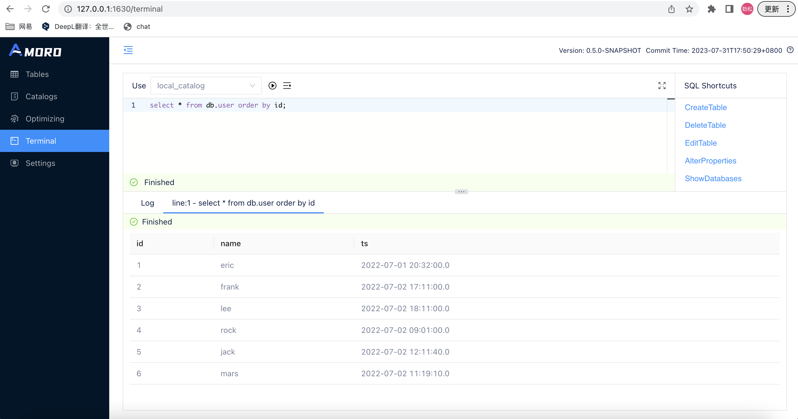

<!--
 - Licensed to the Apache Software Foundation (ASF) under one or more
 - contributor license agreements.  See the NOTICE file distributed with
 - this work for additional information regarding copyright ownership.
 - The ASF licenses this file to You under the Apache License, Version 2.0
 - (the "License"); you may not use this file except in compliance with
 - the License.  You may obtain a copy of the License at
 -
 -   http://www.apache.org/licenses/LICENSE-2.0
 -
 - Unless required by applicable law or agreed to in writing, software
 - distributed under the License is distributed on an "AS IS" BASIS,
 - WITHOUT WARRANTIES OR CONDITIONS OF ANY KIND, either express or implied.
 - See the License for the specific language governing permissions and
 - limitations under the License.
 -->
# Using Kyuubi By Terminal
**Prerequisites**:
- There must be a running Kyuubi. To deploy and run Kyuubi, please refer to [Kyuubi doc](https://kyuubi.readthedocs.io/en/master/)


Terminal supports interfacing with Kyuubi to submit SQL to Kyuubi for execution. All you need to do is add the Kyuubi configuration as instructed below:
```shell
ams:
    terminal:
      backend: kyuubi
      kyuubi.jdbc.url: jdbc:hive2://127.0.0.1:10009/ # kyuubi Connection Address
```

## Kerberos Authentication
Amoro terminal uses the Kerberos authentication information from the catalog to connect to Kyuubi. When configuring the Kyuubi JDBC URL, you only need to configure the connection information and do not need to configure Kerberos authentication information (e.g. principal).

Without configuring Kyuubi, Terminal executes in memory in AMS.

To execute SQL in Terminal, you can refer to the following steps:：

- Please switch Catalog first
- Before writing SQL, you can use the provided SQL Shortcuts function to help you build SQL quickly.
- Writing SQL
- Click the Execute button to run the SQL;



## LDAP Authentication
Except for the configuration of Kerberos authentication, everything else is the same. You can integrate with LDAP using the following configuration: 
set kyuubi.ldap.enabled to true, and then specify the username and password for LDAP in the URL.
```shell
ams:
    terminal:
      backend: kyuubi
      kyuubi.ldap.enabled: true
      kyuubi.jdbc.url: jdbc:hive2://127.0.0.1:10009/default;user=test;password=test # kyuubi Connection Address
```

