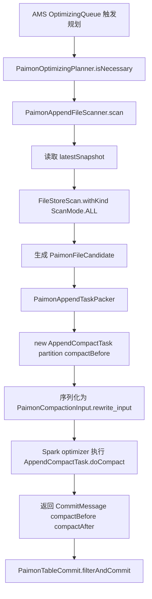

# Paimon BUCKET_UNAWARE APPEND 表优化读到旧 compactBefore 文件分析

## 背景

本文记录一次 Amoro 对 Paimon 1.3.1 BUCKET_UNAWARE APPEND 表执行小文件优化时，规划出的 `AppendCompactTask.compactBefore()` 包含旧文件路径，进而触发 executor 读旧文件失败或 commit 删除冲突的排查过程。

分析范围限定为：

- Amoro Paimon 优化规划链路。
- Paimon 1.3.1 APPEND BUCKET_UNAWARE 表。
- Paimon 原生 `AppendCompactCoordinator` 对照行为。
- 不覆盖 Paimon aware bucket、cluster incremental、data evolution 表。

相关源码：

- `amoro-format-paimon/src/main/java/org/apache/amoro/formats/paimon/optimizing/plan/PaimonAppendFileScanner.java`
- `amoro-format-paimon/src/main/java/org/apache/amoro/formats/paimon/optimizing/plan/PaimonAppendTaskPacker.java`
- `amoro-format-paimon/src/main/java/org/apache/amoro/formats/paimon/optimizing/PaimonCompactionExecutor.java`
- `amoro-format-paimon/src/main/java/org/apache/amoro/formats/paimon/optimizing/commit/PaimonTableCommit.java`
- `/Users/SL/javaProject/paimon/paimon-core/src/main/java/org/apache/paimon/append/AppendCompactCoordinator.java`
- `/Users/SL/javaProject/paimon/paimon-core/src/main/java/org/apache/paimon/operation/AbstractFileStoreScan.java`
- `/Users/SL/javaProject/paimon/paimon-core/src/main/java/org/apache/paimon/append/AppendCompactTask.java`
- `/Users/SL/javaProject/paimon/paimon-core/src/main/java/org/apache/paimon/operation/FileStoreCommitImpl.java`

## 运行时现象

### 现象一：executor 读取 compactBefore 旧文件失败

任务执行阶段失败，核心异常为：

```text
Failed to execute Paimon AppendCompactTask
Caused by: java.io.FileNotFoundException:
File '.../bucket-0/data-xxx.parquet' not found
Possible causes: 1.snapshot expires too fast ...
```

调用栈显示失败发生在 Paimon task 执行阶段：

```text
PaimonCompactionExecutor.execute
AppendCompactTask.doCompact
BaseAppendFileStoreWrite.compactRewrite
RecordReaderIterator
```

这说明 executor 正在读取 `AppendCompactTask.compactBefore()` 中的文件。如果这些文件已经被 snapshot expire / cleanup 物理删除，就会在读取阶段失败。

### 现象二：executor 成功但 commit 删除冲突

后续运行中，executor 可以成功完成 compact，但 commit 阶段失败：

```text
File deletion conflicts detected! Give up committing.
Trying to delete file data-ccddf9b4-7100-40a1-9f5b-02b8b74df7be-0.parquet
for table ecom_orders_append_manual which is not previously added.
```

日志中 `Base entries` 只包含当前 live 文件，例如：

```text
data-b6c2c6eb-...-13.parquet
data-ccddf9b4-...-13.parquet
data-ba32915b-...-0.parquet
```

但 `Changes` 中要 DELETE 大量旧文件，例如：

```text
data-ccddf9b4-...-0.parquet
data-b6c2c6eb-...-0.parquet
data-2ccfbeff-...-0.parquet
data-2def723c-...-0.parquet
...
data-ccddf9b4-...-13.parquet
```

这说明 commit message 中携带的 `compactBefore` 不只包含当前 base snapshot 的 live files，还包含已经被历史 DELETE 抵消的旧 ADD 文件。

## Amoro 优化规划链路

Amoro 对 Paimon BUCKET_UNAWARE APPEND 表的规划链路如下：



其中 `PaimonAppendTaskPacker` 创建 task 时，直接把 candidate file 转成 `compactBefore`：

```java
return new AppendCompactTask(
    evaluation.partition(),
    candidates.stream().map(PaimonFileCandidate::file).collect(Collectors.toList()));
```

因此，只要 `PaimonAppendFileScanner` 扫描结果包含旧文件，这些旧文件就会进入 `AppendCompactTask.compactBefore()`，后续 executor 和 commit 都会基于这批文件继续执行。

## Amoro 当前扫描实现的问题点

`PaimonAppendFileScanner.addFileIterator` 当前使用：

```java
FileStoreScan scan =
    table
        .store()
        .newScan()
        .withSnapshot(snapshot)
        .withKind(ScanMode.ALL)
        .withManifestEntryFilter(entry -> entry.kind() == FileKind.ADD);
```

同时在读取 iterator 后，调用侧又过滤了一次 ADD：

```java
ManifestEntry entry = iterator.next();
if (entry.kind() != FileKind.ADD) {
  continue;
}
```

表面看，scan 层提前过滤 ADD 是为了减少无关 entry；但在 Paimon `ScanMode.ALL` 下，这会破坏 Paimon 内部的 ADD/DELETE 合并语义。

## Paimon ScanMode.ALL 的合并语义

Paimon `AbstractFileStoreScan.readFileIterator()` 在 `ScanMode.ALL` 下会调用 `readAndMergeFileEntries`：

```java
return scanMode == ScanMode.ALL
    ? readAndMergeFileEntries(manifests, Function.identity(), useSequential)
    : readAndNoMergeFileEntries(manifests, Function.identity(), useSequential);
```

`readAndMergeFileEntries` 的关键逻辑是：

```java
Set<Identifier> deletedEntries =
    FileEntry.readDeletedEntries(
        manifest -> readManifest(manifest, FileEntry.deletedFilter(), null),
        manifests,
        parallelism);

Function<ManifestFileMeta, List<T>> processor =
    manifest ->
        converter.apply(
            readManifest(
                manifest,
                FileEntry.addFilter(),
                entry -> !deletedEntries.contains(entry.identifier())));
```

也就是说，Paimon 需要先读取 DELETE entries，得到 `deletedEntries`，再读取 ADD entries，并过滤掉已经被 DELETE 抵消的历史 ADD。

但是 `readManifest` 会同时应用调用方设置的 `manifestEntryFilter`：

```java
entry ->
    (additionalTFilter == null || additionalTFilter.test(entry))
        && (manifestEntryFilter == null || manifestEntryFilter.test(entry))
        && filterByStats(entry)
```

因此，当 Amoro 设置：

```java
withManifestEntryFilter(entry -> entry.kind() == FileKind.ADD)
```

时，Paimon 在读取 DELETE entries 的阶段也会被这个 filter 拦截，导致 DELETE entries 不能进入 `deletedEntries`。结果是：历史 ADD 无法被抵消，旧文件会重新出现在 `readFileIterator()` 结果中。

## Paimon AppendCompactCoordinator 对照

Paimon 原生 `AppendCompactCoordinator` 也会在初始扫描时使用 `ScanMode.ALL`：

```java
if (nextSnapshot == null) {
    nextSnapshot = snapshotManager.latestSnapshotId();
    ...
    snapshotReader.withMode(ScanMode.ALL);
}
```

它也调用了 `withManifestEntryFilter`：

```java
currentIterator =
    snapshotReader
        .withManifestEntryFilter(
            entry -> shouldCompact(entry.partition(), entry.file()))
        .withSnapshot(snapshot)
        .readFileIterator();
```

关键差异是：Paimon 原生 filter 没有使用 `entry.kind() == FileKind.ADD`。它只根据 `entry.file()` 判断该文件是否值得 compact：

```java
private boolean shouldCompact(BinaryRow partition, DataFileMeta file) {
    return file.fileSize() < compactionFileSize || tooHighDeleteRatio(partition, file);
}
```

对于同一个小文件，历史 ADD 和后续 DELETE 携带的是同一个 `DataFileMeta`，都会满足同一类 `shouldCompact` 条件。因此 DELETE entries 不会因为 kind 被提前过滤，Paimon `ScanMode.ALL` 仍然可以完成 ADD/DELETE merge。

在 merge 完成后，`FilesIterator.next()` 才跳过 DELETE：

```java
if (entry.kind() == FileKind.DELETE) {
    continue;
} else {
    return entry;
}
```

这说明 Paimon 原生链路的正确顺序是：

1. `ScanMode.ALL` 阶段允许 DELETE 进入内部 merge。
2. merge 后得到当前有效 ADD。
3. iterator 层再忽略 DELETE。

Amoro 当前实现的顺序变成：

1. scan 层直接过滤 `FileKind.ADD`。
2. DELETE 不能进入 `ScanMode.ALL` 内部 merge。
3. 历史 ADD 没有被抵消。
4. 旧文件进入 `compactBefore`。

因此，`AppendCompactCoordinator` 不是反例，反而证明了 Amoro 当前 filter 条件过窄。

## commit 失败链路

Paimon `AppendCompactTask.doCompact` 在 compact 后构造 `CompactIncrement`：

```java
CompactIncrement compactIncrement =
    new CompactIncrement(
        compactBefore,
        compactAfter,
        Collections.emptyList(),
        newIndexFiles,
        deletedIndexFiles);
```

`CommitMessageSerializer` 会序列化 `compactBefore`：

```java
dataFileSerializer.serializeList(message.compactIncrement().compactBefore(), view);
dataFileSerializer.serializeList(message.compactIncrement().compactAfter(), view);
```

Amoro `PaimonTableCommit` 反序列化 success task 的 commit message 后调用：

```java
try (StreamTableCommit commit = table.newCommit(commitUser)) {
  int committed = commit.filterAndCommit(Collections.singletonMap(commitIdentifier, messages));
}
```

Paimon `FileStoreCommitImpl` 会把 `compactBefore` 转成 DELETE entries：

```java
commitMessage
    .compactIncrement()
    .compactBefore()
    .forEach(
        m ->
            compactTableFiles.add(
                makeEntry(FileKind.DELETE, commitMessage, m)));
```

提交前，Paimon 会读取最新 snapshot 中变更分区的 base entries：

```java
baseDataFiles =
    readAllEntriesFromChangedPartitions(latestSnapshot, changedPartitions);
```

该方法同样使用 `ScanMode.ALL`：

```java
return scan.withSnapshot(snapshot)
    .withKind(ScanMode.ALL)
    .withPartitionFilter(changedPartitions)
    .readSimpleEntries();
```

随后 Paimon 将 base entries 和 delta entries 合并，并检查是否残留 DELETE：

```java
mergedEntries = FileEntry.mergeEntries(allEntries);
assertNoDelete(mergedEntries, conflictException(commitUser, baseEntries, deltaEntries));
```

如果 delta 中存在一个 DELETE，但当前 base entries 中找不到对应 ADD，就会报：

```java
Trying to delete file %s for table %s which is not previously added.
```

这与用户日志完全对应：`Changes` 中包含旧文件 DELETE，但 `Base entries` 只包含当前 live files，所以 commit 被 Paimon 正确拒绝。

## 为什么不是优先怀疑 Snapshot 缓存

Paimon `SnapshotManager.latestSnapshot()` 的主要逻辑是：

```java
public @Nullable Snapshot latestSnapshot() {
    if (snapshotLoader != null) {
        ...
    }
    return latestSnapshotFromFileSystem();
}

public @Nullable Snapshot latestSnapshotFromFileSystem() {
    Long snapshotId = latestSnapshotIdFromFileSystem();
    return snapshotId == null ? null : snapshot(snapshotId);
}
```

即便 snapshot object 按 path 有 cache，latest snapshot id 仍然来自 snapshot loader 或 filesystem。更关键的是，当前问题不需要依赖“读到了旧 snapshot”这个假设：只要在最新 snapshot 上使用 `ScanMode.ALL + manifestEntryFilter(ADD)`，就足以让历史 ADD 残留。

因此，Snapshot 缓存可以作为低优先级排查项，但不是最能解释当前现象的主因。

## 为什么不是单纯旧 task 重试

AMS 在 task 失败时会把同一个 task 放回 retry queue。旧 task retry 确实可能继续携带旧 `compactBefore`，但用户观察到的是：

```java
AppendCompactTask task = plannedTask.task();
```

在新一轮 `PaimonOptimizingPlanner` 规划出的 task 中已经能看到旧 compactBefore。这个证据说明问题发生在规划扫描阶段，而不仅是 retry 队列复用旧 task。

旧 task / 持久化 `rewrite_input` 仍然会放大问题：已经序列化的错误 task 即使修复扫描逻辑，也不能继续复用，需要让 AMS 重新规划生成新的 task。

## 排名结论

| 排名 | 解释 | 置信度 | 依据 |
| --- | --- | --- | --- |
| 1 | Amoro `PaimonAppendFileScanner` 在 `ScanMode.ALL` 上使用 `entry.kind() == FileKind.ADD`，过滤掉 DELETE，破坏 Paimon ADD/DELETE merge，导致旧 ADD 文件进入 `compactBefore` | 高 | Amoro 扫描实现、Paimon `AbstractFileStoreScan` merge 逻辑、Paimon `AppendCompactCoordinator` 对照行为三者闭合 |
| 2 | AMS retry / 持久化 task 复用旧 `rewrite_input`，导致旧 compactBefore 被重复执行 | 中 | 失败 task 会 retry，同一 task 会携带旧输入；但新规划阶段也能看到旧 compactBefore，所以不是主因 |
| 3 | Paimon snapshot cache 导致读取旧 snapshot | 低 | `latestSnapshot` 会基于最新 id 读取；且当前 scan filter 问题无需旧 snapshot 假设即可解释现象 |

## 影响范围

该问题对 Paimon BUCKET_UNAWARE APPEND 表优化链路影响较大：

- 可能导致 Amoro 规划出包含历史文件的 `AppendCompactTask`。
- 如果历史文件已被物理清理，executor 会在 `compactRewrite` 读取阶段报 `FileNotFoundException`。
- 如果历史文件仍在文件系统上，executor 可能成功，但 commit 会因为删除当前 base 中不存在的文件而失败。
- Paimon commit 冲突检测会阻止错误 commit，因此当前证据更指向优化失败和任务循环，而不是已确认的数据损坏。

## 最小判别验证

可以用同一张表、同一个 latest snapshot 做两组只读扫描对比。

### 当前 Amoro 行为

```java
Iterator<ManifestEntry> iterator =
    table.store()
        .newScan()
        .withSnapshot(snapshot)
        .withKind(ScanMode.ALL)
        .withManifestEntryFilter(entry -> entry.kind() == FileKind.ADD)
        .readFileIterator();
```

预期风险结果：可能返回已经被历史 DELETE 抵消的旧 ADD 文件，例如 `...-0.parquet`、`...-1.parquet`、`...-8.parquet`。

### 对照行为

```java
Iterator<ManifestEntry> iterator =
    table.store()
        .newScan()
        .withSnapshot(snapshot)
        .withKind(ScanMode.ALL)
        .readFileIterator();

while (iterator.hasNext()) {
  ManifestEntry entry = iterator.next();
  if (entry.kind() != FileKind.ADD) {
    continue;
  }
  // process current live ADD
}
```

预期结果：只返回当前 latest snapshot 中仍然有效的 ADD 文件，不应包含已经被 DELETE 抵消的历史旧文件。

如果第一组能读到旧文件，第二组不能读到旧文件，则可以直接证明根因在 scan-level `FileKind.ADD` filter。

## 修复方向

修复方向应保持窄范围：

1. 不要在 `ScanMode.ALL` 上设置 `entry.kind() == FileKind.ADD` 这种会排除 DELETE 的 `manifestEntryFilter`。
2. 保留调用侧 `if (entry.kind() != FileKind.ADD) continue;`。
3. 如需保留 scan-level filter，只能使用不区分 ADD/DELETE kind、且对同一文件 ADD/DELETE 一致成立的条件，例如 Paimon `AppendCompactCoordinator` 中的 `shouldCompact(entry.partition(), entry.file())` 形态。
4. 修复后需要丢弃已规划/已序列化的旧 task，让 AMS 重新规划。

建议回归测试覆盖：

- 构造 APPEND BUCKET_UNAWARE 表。
- 写入多批小文件并执行一次 compact，产生 COMPACT snapshot 和 DELETE entries。
- 再次触发 Amoro scanner。
- 断言第二次规划出的 `AppendCompactTask.compactBefore()` 不包含第一次 compact 已删除的旧文件。
- 断言 commit message 中的 `compactBefore` 均能在 latest snapshot base entries 中找到。

## 最终结论

结合 Amoro 当前实现、Paimon `AbstractFileStoreScan` 的 `ScanMode.ALL` 合并逻辑、Paimon 原生 `AppendCompactCoordinator` 的对照实现，以及用户运行日志中的 `Base entries` / `Changes` 差异，可以得出结论：

**当前最可能根因是 Amoro `PaimonAppendFileScanner` 在 `ScanMode.ALL` 上使用了 `withManifestEntryFilter(entry -> entry.kind() == FileKind.ADD)`，导致 Paimon 内部读取 DELETE entries 失败，历史 ADD 文件没有被抵消，最终旧文件进入 `AppendCompactTask.compactBefore()`。**

这能够同时解释：

- 为什么 planner 中新生成的 `AppendCompactTask` 已经带有旧 compactBefore。
- 为什么部分任务在 executor 阶段读取旧 parquet 报 `FileNotFoundException`。
- 为什么部分任务 executor 成功后，commit 阶段报 `Trying to delete file ... which is not previously added`。

`AppendCompactCoordinator` 的实现进一步强化该判断：Paimon 原生实现允许 `withManifestEntryFilter`，但不会用 `FileKind.ADD` 排除 DELETE，而是在 `ScanMode.ALL` 完成 merge 后才在 iterator 层跳过 DELETE。
