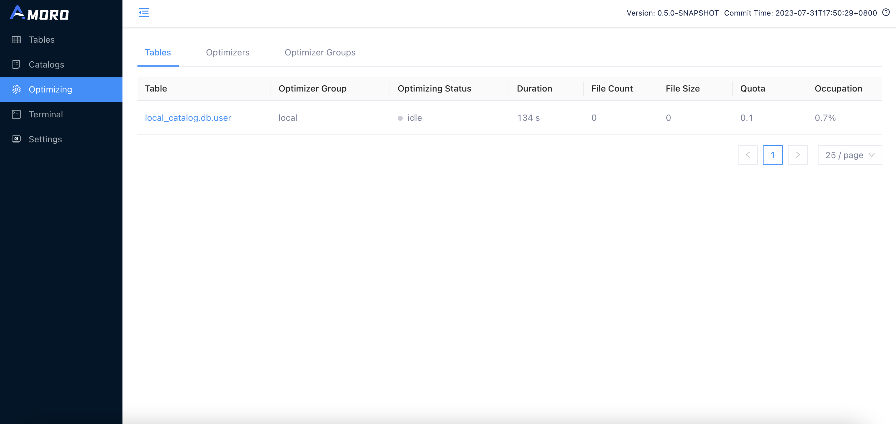

<!--
 - Licensed to the Apache Software Foundation (ASF) under one or more
 - contributor license agreements.  See the NOTICE file distributed with
 - this work for additional information regarding copyright ownership.
 - The ASF licenses this file to You under the Apache License, Version 2.0
 - (the "License"); you may not use this file except in compliance with
 - the License.  You may obtain a copy of the License at
 -
 -   http://www.apache.org/licenses/LICENSE-2.0
 -
 - Unless required by applicable law or agreed to in writing, software
 - distributed under the License is distributed on an "AS IS" BASIS,
 - WITHOUT WARRANTIES OR CONDITIONS OF ANY KIND, either express or implied.
 - See the License for the specific language governing permissions and
 - limitations under the License.
 -->
# Self-optimizing

## Introduction

Lakehouse is characterized by its openness and loose coupling, with data and files maintained by users through various engines. While this
architecture appears to be well-suited for T+1 scenarios, as more attention is paid to applying Lakehouse to streaming data warehouses and real-time
analysis scenarios, challenges arise. For example:

- Streaming writes bring a massive amount of fragment files
- CDC ingestion and streaming updates generate excessive redundant data
- Using the new data lake format leads to orphan files and expired snapshots.

These issues can significantly affect the performance and cost of data analysis. Therefore, Amoro has introduced a Self-optimizing mechanism to
create an out-of-the-box Streaming Lakehouse management service that is as user-friendly as a traditional database or data warehouse. The new table
format is used for this purpose. Self-optimizing involves various procedures such as file compaction, deduplication, and sorting.

The architecture and working mechanism of Self-optimizing are shown in the figure below:


The Optimizer is a component responsible for executing Self-optimizing tasks. It is a resident process managed by AMS. AMS is responsible for
detecting and planning Self-optimizing tasks for tables, and then scheduling them to Optimizers for distributed execution in real-time. Finally, AMS
is responsible for submitting the optimizing results. Amoro achieves physical isolation of Optimizers through the Optimizer Group.

The core features of Amoro's Self-optimizing are:

- Automated, Asynchronous and Transparent — Continuous background detecting of file changes, asynchronous distributed execution of optimizing tasks,
transparent and imperceptible to users
- Resource Isolation and Sharing — Allow resources to be isolated and shared at the table level, as well as setting resource quotas
- Flexible and Scalable Deployment — Optimizers support various deployment methods and convenient scaling

## Self-optimizing mechanism

During the process of writing data, there may be two types of amplification: read amplification and write amplification:

- Read amplification — If an excessive amount of fragment files are generated during the writing process, or if there is an excessive mapping of
delete and insert files (which may be a familiar issue for users of the Iceberg v2 format), and the optimizing cannot keep up with the rate of
fragment file generation, it can significantly degrade reading performance.
- Write amplification — Frequently scheduling optimizing can lead to frequent compaction and rewriting of existing files, which causes resource
competition and waste of CPU/IO/Memory, slows down the optimization speed, and further intensify read amplification.

Frequent execution of optimizing is necessary to alleviate read amplification, but it can lead to write amplification. The design of self-optimizing
needs trade off between read and write amplification. Amoro's Self-optimizing takes inspiration from the Generational Garbage Collection algorithm
in the JVM. Files are divided into Fragments and Segments based on their sizes, and different Self-optimizing processes executed on Fragments and
Segments are classified into two types: minor and major. Therefore, Amoro v0.4 introduces two parameters to define Fragments and Segments:

```SQL
-- Target file Size for Self-optimizing 
self-optimizing.target-size = 134217728(128MB)
-- The fragment file size threshold for Self-optimizing
self-optimizing.fragment-ratio = 8
```

`self-optimizing.target-size` defines the target output size for major optimizing, which is set to 128 MB by default. `self-optimizing.fragment-ratio`
defines the ratio of the fragment file threshold to the target-size, with a value of 8 indicating that the default fragment threshold is 1/8 of the
target-size, or 16 MB for a default target-size of 128 MB. Files smaller than 16 MB are considered fragments, while files larger than 16 MB are
considered segments, as shown in the diagram below:


The goal of Minor optimizing is to alleviate read amplification issues, which entails two tasks：

* Compact fragment files into segment files as quickly as possible. Minor optimizing will be executed more frequently when fragment files are rapidly
generated.
* Converting from a write-friendly file format to a read-friendly file format, which involves transitioning ChangeStore to BaseStore for the
Mixed Format, and eq-delete files to pos-delete files for the Iceberg Format.

After executing Minor optimizing multiple times, there will be many Segment files in the tablespace. Although in most cases, the read efficiency
of Segment files can meet performance requirements, however:

* There may be a significant amount of accumulated delete data on each Segment file
* There may be a lot of duplicate data on primary keys between different Segment files

At this stage, the reading performance problem is no longer caused by the read amplification issue resulting from small file size and file format.
Instead, it is due to the presence of excessive redundant data that needs to be merged and cleaned up during merge-on-read. To address this problem,
Amoro introduces major optimizing which merges Segment files to clean up redundant data and control its amount to a level that is favorable to
reading. Minor optimizing has already performed multiple rounds of deduplication, and major optimizing is not scheduled frequently to avoid write
amplification issues. Additionally, Full optimizing merges all files in the target space into a single file, which is a special case of
major optimizing.


The design of Major optimizing and Minor optimizing takes inspiration from the Generational Garbage Collection algorithm of JVM. The execution
logic of both optimizing is consistent, as they both involve file compaction, data deduplication, and conversion from write-friendly format to
read-friendly format. The input-output relationships of Minor, Major, and Full optimizing are shown in the following table:

| Self-optimizing type  | Input space  | Output space  | Input file types  | Output file types  |
|:----------|:----------|:----------|:----------|:----------|
| minor    | fragment    | fragment/segment    | insert, eq-delete, pos-delete   | insert, pos-delete    |
| major    | fragment, segment    | segment    | insert, eq-delete, pos-delete    | insert, pos-delete    |
| full    | fragment, segment    | segment    | insert, eq-delete, pos-delete   | insert    |


## Self-optimizing scheduling policy

AMS determines the Scheduling Policy to sequence the self-optimization process for different tables. The actual resources allocated for
Self-optimizing for each table are determined based on the chosen Scheduling Policy. Quota is used by Amoro to define the expected resource usage for
each table, while Quota occupation represents the percentage of actual resource usage compared to the expected usage. The AMS page allows viewing of
the Quota and Quota occupation for each table's Self-optimizing:



Different optimizer groups can be configured with different scheduling policies to meet various optimization requirements.
See: [Optimizer Group Configuration](../managing-optimizers#optimizer-group)。

Users can also disable the Self-optimizing for a table by configuring the following settings on the table, which will prevent it from being scheduled
for optimizing.

```SQL
self-optimizing.enabled = false;
```

If you are working with non-updatable tables like logs or sensor data and are used to utilizing the Spark Rewrite Action offered by Iceberg, you can
turn off the Self-optimizing.

However, if the table is configured with a primary key and supports CDC ingestion and streaming updates (e.g., database synchronization tables or
dimensionally aggregated tables), it is advisable to enable the Self-optimizing.

Currently, there are two main scheduling policies available: `Quota` and `Balanced`.

### Quota

The `Quota` strategy is a scheduling policy that schedules based on resource usage. The Self-optimizing resource usage of a single table is managed
by configuring the quota configuration on the table:

```SQL
-- Quota for Self-optimizing, indicating the CPU resource the table can take up
self-optimizing.quota = 0.1;
```
Quota defines the maximum CPU usage that a single table can use, but Self-optimizing is actually executed in a distributed manner, and actual resource
usage is dynamically managed based on actual execution time.In the optimizing management Web UI, the dynamic quota usage of a single table can be
viewed through the "Quota Occupy" metric. From a design perspective, the quota occupy metric should dynamically approach 100%.

In a platform, two situations may occur: overselling and overbuying.

- Overselling — If all optimizer configurations exceed the total quota of all table configurations, the quota occupy metric may dynamically approach
above 100%
- Overbuying — If all optimizer configurations are lower than the total quota of all table configurations, the quota occupy metric should dynamically
approach below 100%

### Balanced

The `Balanced` strategy is a scheduling strategy based on time progression, where tables that have not been Self-optimized for a longer time have a
higher scheduling priority. This strategy aims to keep the self-optimizing progress of each table at a similar level, which can avoid the situation
where tables with high resource consumption do not perform Self-optimizing for a long time, thus affecting the overall query efficiency in the quota
scheduling strategy.

If there is no special requirement for resource usage among the tables in an optimizer group, and all tables are expected to have decent query
efficiency, then the `Balanced` strategy is a good choice.