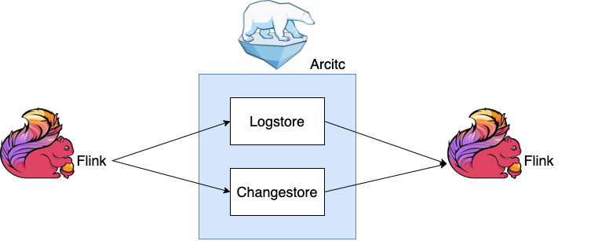

<!--
 - Licensed to the Apache Software Foundation (ASF) under one or more
 - contributor license agreements.  See the NOTICE file distributed with
 - this work for additional information regarding copyright ownership.
 - The ASF licenses this file to You under the Apache License, Version 2.0
 - (the "License"); you may not use this file except in compliance with
 - the License.  You may obtain a copy of the License at
 -
 -   http://www.apache.org/licenses/LICENSE-2.0
 -
 - Unless required by applicable law or agreed to in writing, software
 - distributed under the License is distributed on an "AS IS" BASIS,
 - WITHOUT WARRANTIES OR CONDITIONS OF ANY KIND, either express or implied.
 - See the License for the specific language governing permissions and
 - limitations under the License.
 -->
# Using Logstore
Due to the limitations of traditional offline data warehouse architectures in supporting real-time business needs, real-time data warehousing has experienced rapid evolution in recent years. In the architecture of real-time data warehousing, Apache Kafka is often used as the storage system for real-time data. However, this also brings about the issue of data disconnection between offline data warehouses.

Developers often need to pay attention to data stored in HDFS as well as data in Kafka, which increases the complexity of business development. Therefore, Amoro proposes the addition of an optional parameter, "LogStore enabled" (`log-store.enabled`), to the table configuration. This allows for retrieving data with sub-second and minute-level latency by operating on a single table while ensuring the eventual consistency of data from both sources.

## Real-Time data in LogStore
Amoro tables provide two types of storage: FileStore and LogStore. FileStore stores massive full data, while LogStore stores real-time incremental data.

Real-time data can provide second-level data visibility and ensure data consistency without enabling LogStore transactions.

Its underlying storage system can be connected to external message queuing middleware, currently supporting only Kafka and Pulsar.

Users can enable LogStore by configuring the following parameters when creating an Amoro table. For specific configurations, please refer to [LogStore related configurations](../configurations/#logstore-configurations).

## Overview

| Flink      | Kafka    |
|------------|----------|
| Flink 1.15 | &#x2714; |
| Flink 1.16 | &#x2714; |
| Flink 1.17 | &#x2714; |

Kafka as LogStore Version Description:

| Flink Version | Kafka Versions |
|---------------|  ----------------- |
| 1.15.x        | 0.10.2.\*<br> 0.11.\*<br> 1.\*<br> 2.\*<br> 3.\*            | 
| 1.16.x        | 0.10.2.\*<br> 0.11.\*<br> 1.\*<br> 2.\*<br> 3.\*            | 
| 1.17.x        | 0.10.2.\*<br> 0.11.\*<br> 1.\*<br> 2.\*<br> 3.\*            | 


### Prerequisites for using LogStore

When creating an Amoro table, LogStore needs to be enabled.

- You can create a table after selecting a specific Catalog on the Amoro [Dashboard](http://localhost:1630) - Terminal page

```sql
CREATE TABLE db.log_table (
    id int,
    name string,
    ts timestamp,
    primary key (id)
) using mixed_iceberg
tblproperties (
"log-store.enabled" = "true",
"log-store.topic"="topic_log_test",
"log-store.address"="localhost:9092"
);
```

- You can also use Flink SQL to create tables in Flink-SQL-Client

```sql
-- First use the use catalog command to switch to the mixed-format catalog.
CREATE TABLE db.log_table (
    id int,
    name string,
    ts timestamp,
    primary key (id) not enforced
) WITH (
    'log-store.enabled' = 'true',
    'log-store.topic'='topic_log_test',
    'log-store.address'='localhost:9092');
```

### Double write LogStore and FileStore



Amoro Connector writes data to LogStore and ChangeStore at the same time through double-write operations, without opening Kafka transactions to ensure data consistency between the two, because opening transactions will bring a few minutes of delay to downstream tasks (the specific delay time depends on upstream tasks checkpoint interval).

```sql
INSERT INTO db.log_table /*+ OPTIONS('mixed-format.emit.mode'='log') */
SELECT id, name, ts from sourceTable;
```

> Currently, only the Apache Flink engine implements the dual-write LogStore and FileStore.
