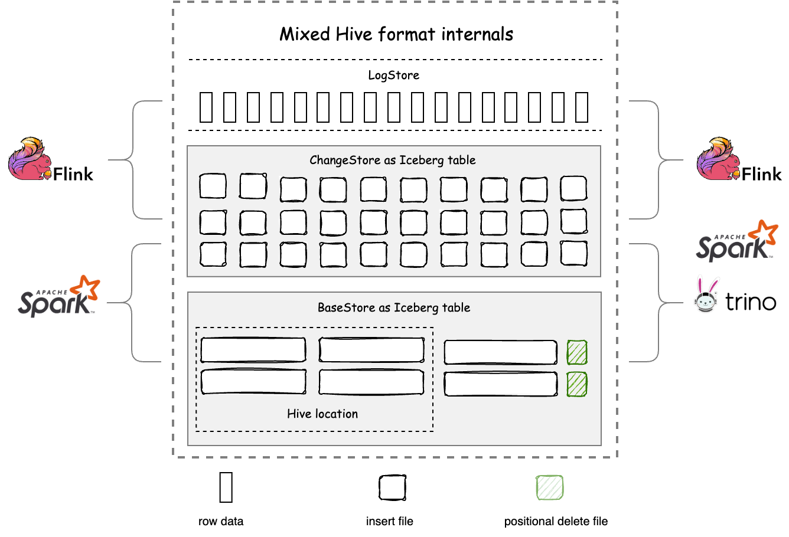

<!--
 - Licensed to the Apache Software Foundation (ASF) under one or more
 - contributor license agreements.  See the NOTICE file distributed with
 - this work for additional information regarding copyright ownership.
 - The ASF licenses this file to You under the Apache License, Version 2.0
 - (the "License"); you may not use this file except in compliance with
 - the License.  You may obtain a copy of the License at
 -
 -   http://www.apache.org/licenses/LICENSE-2.0
 -
 - Unless required by applicable law or agreed to in writing, software
 - distributed under the License is distributed on an "AS IS" BASIS,
 - WITHOUT WARRANTIES OR CONDITIONS OF ANY KIND, either express or implied.
 - See the License for the specific language governing permissions and
 - limitations under the License.
 -->
# Mixed-Hive Format

Mixed-Hive format is a format that has better compatibility with Hive than Mixed-Iceberg format. 
Mixed-Hive format uses a Hive table as the BaseStore and an Iceberg table as the ChangeStore. Mixed-Hive format supports:
- schema, partition, and types consistent with Hive format
- Using the Hive connector to read and write Mixed-Hive format tables as Hive tables
- Upgrading a Hive table in-place to a Mixed-Hive format table without data rewriting or migration, with a response time in seconds
- All the functional features of Mixed-Iceberg format

The structure of Mixed-Hive format is shown below:

In the BaseStore, files under the Hive location are also indexed by the Iceberg manifest, avoiding data redundancy between the two formats. 
Mixed-Hive format combines the snapshot, ACID, and MVCC features of Iceberg, and provides a great degree of compatibility with Hive, offering flexible selection and extension options for data platforms, processes, and products built around Hive format in the past.


The freshness of data under the Hive location is guaranteed by Full optimizing. 
Therefore, the timeliness of native Hive reads is significantly different from that of Mixed-Iceberg tables. 
It is recommended to use Merge-on-read to read data with freshness in the order of minutes in Mixed-Hive format.


