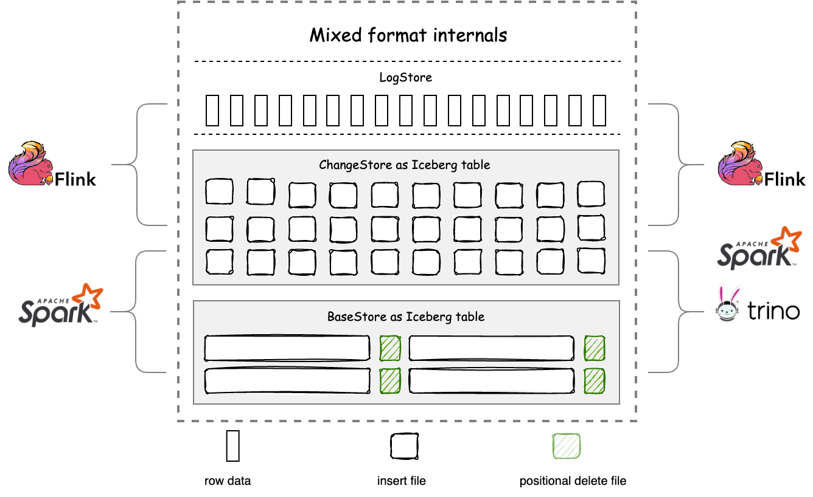

<!--
 - Licensed to the Apache Software Foundation (ASF) under one or more
 - contributor license agreements.  See the NOTICE file distributed with
 - this work for additional information regarding copyright ownership.
 - The ASF licenses this file to You under the Apache License, Version 2.0
 - (the "License"); you may not use this file except in compliance with
 - the License.  You may obtain a copy of the License at
 -
 -   http://www.apache.org/licenses/LICENSE-2.0
 -
 - Unless required by applicable law or agreed to in writing, software
 - distributed under the License is distributed on an "AS IS" BASIS,
 - WITHOUT WARRANTIES OR CONDITIONS OF ANY KIND, either express or implied.
 - See the License for the specific language governing permissions and
 - limitations under the License.
 -->
# Mixed-Iceberg Format

Compared with Iceberg format, Mixed-Iceberg format provides more features:
- Stronger primary key constraints that also apply to Spark
- OLAP performance that is production-ready for real-time data warehouses through the auto-bucket mechanism
- LogStore configuration that can reduce data pipeline latency from minutes to milliseconds/seconds
- Transaction conflict resolution mechanism that enables concurrent writes with the same primary key

The design intention of Mixed-Iceberg format is to provide a storage layer for stream-batch integration and offline-real-time unified data warehouses for big data platforms based on data lakes. 
Under this goal-driven approach, Amoro designs Mixed-Iceberg format as a three-tier structure, with each level named after a different TableStore:



- BaseStore — stores the stock data of the table, usually generated by batch computing or optimizing processes, and is more friendly to ReadStore for reading.
- ChangeStore —  stores the flow and change data of the table, usually written in real-time by streaming computing, and can also be used for downstream CDC consumption, and is more friendly to WriteStore for writing.
- LogStore — serves as a cache layer for ChangeStore to accelerate stream processing. Amoro manages the consistency between LogStore and ChangeStore.

The design philosophy of TableStore in Mixed-Iceberg format is similar to that of clustered indexes in databases. Each TableStore can use different table formats. Mixed-Iceberg format provides high freshness OLAP through merge-on-read between BaseStore and ChangeStore. 
To provide high-performance merge-on-read, BaseStore and ChangeStore use completely consistent partition and layout, and both support auto-bucket.

The Auto-bucket feature helps the self-optimizing process control the file size of BaseStore within the target-size, and dynamically scale the data volume through bucket splitting and merging while maintaining the base file size as much as possible. 
Auto-bucket divides the data under a partition into sets of non-intersecting primary keys in a hash-based manner, greatly reducing the amount of data that needs to be scanned during optimizing and merge-on-read, and improving performance. For more details, please refer to [benchmark](../../../benchmark-report/)

The auto-bucket feature of the Mixed-Iceberg format references the paper: [Scalable, Distributed Data Structures for Internet Service Construction](https://people.eecs.berkeley.edu/~culler/papers/dds.pdf)

There are some limitations in using the Mixed-Iceberg format:

- Compatibility limited — In scenarios where Hive and Iceberg are compatible, there may be a violation of primary key uniqueness or the failure of conflict resolution.
- Primary key constraint — When the primary key does not include partition keys and there are no updates to the stream data, normalized operators or other methods need to be used to restore the previous data to ensure primary key uniqueness.
- Engines integrated — Currently supports reading and writing with Flink and Spark, and querying data with Trino.

The BaseStore and ChangeStore of the Mixed-Iceberg format both use the Iceberg format and are consistent with Iceberg in schema, types, and partition usage. 
While possessing the features of the Mixed-Iceberg format, the BaseStore and ChangeStore can be read and written using the native Iceberg connector, thus having all the functional features of the Iceberg format. 
Taking Spark as an example, this paper describes how to operate on the Mixed-Iceberg format table created by Quick demo using the Iceberg connector. We can use the following command to open a Spark SQL client:

```shell
spark-sql --packages org.apache.Iceberg:Iceberg-spark-runtime-3.2_2.12:0.14.0\
    --conf spark.sql.extensions=org.apache.Iceberg.spark.extensions.IcebergSparkSessionExtensions \
    --conf spark.sql.catalog.local=org.apache.Iceberg.spark.SparkCatalog \
    --conf spark.sql.catalog.local.type=hadoop \
    --conf spark.sql.catalog.local.warehouse=/tmp/Amoro/warehouse
```

After that, we can use the following command to read from or write to the Iceberg tables managed by Amoro:

```shell
-- Switch to Iceberg catalog
use local;

-- Show all Iceberg tables
show tables;

-- Query BaseStore
select * from local.test_db.test_table.base;

-- Query ChangeStore
select * from local.test_db.test_table.change;

-- Insert BaseStore
insert into local.test_db.test_table.base value(10, 'tony', timestamp('2022-07-03 12:10:30'));
```

More Iceberg-compatible usage can be found in the [Iceberg docs](https://Iceberg.apache.org/docs/latest/).


The Minor optimizing feature of Amoro generally ensures that the data freshness of the Iceberg BaseStore is maintained at the minute level.
