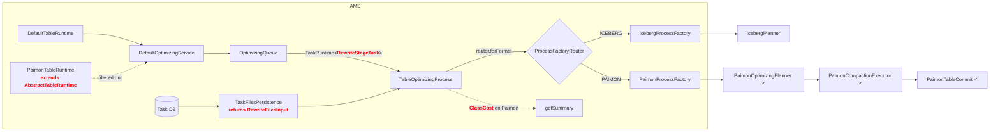
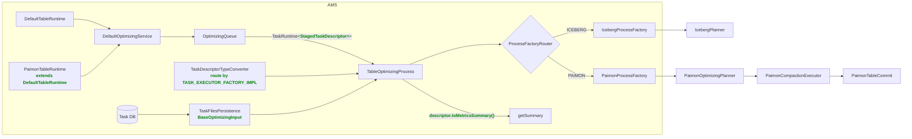
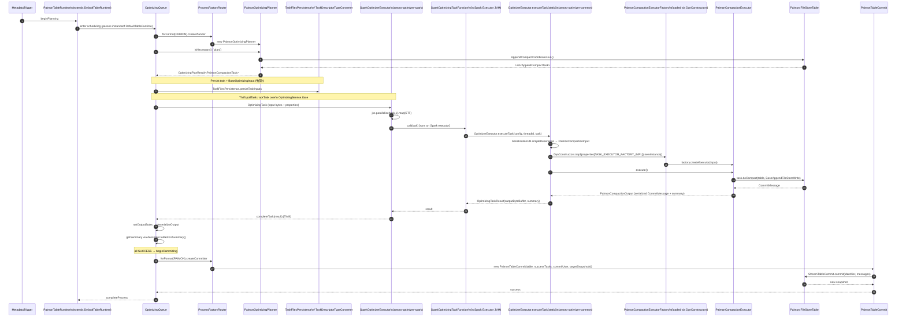
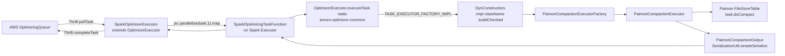
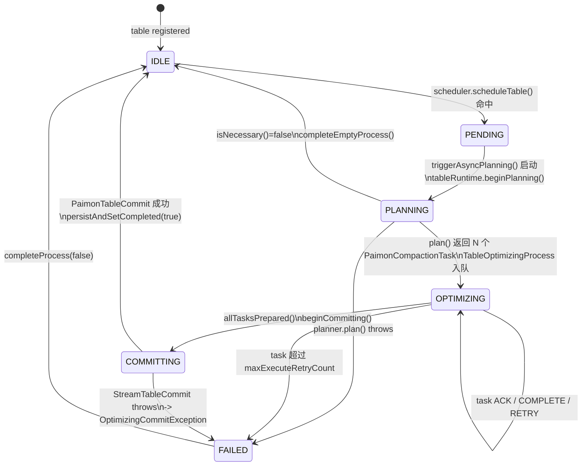
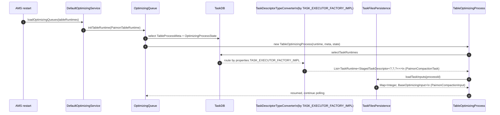
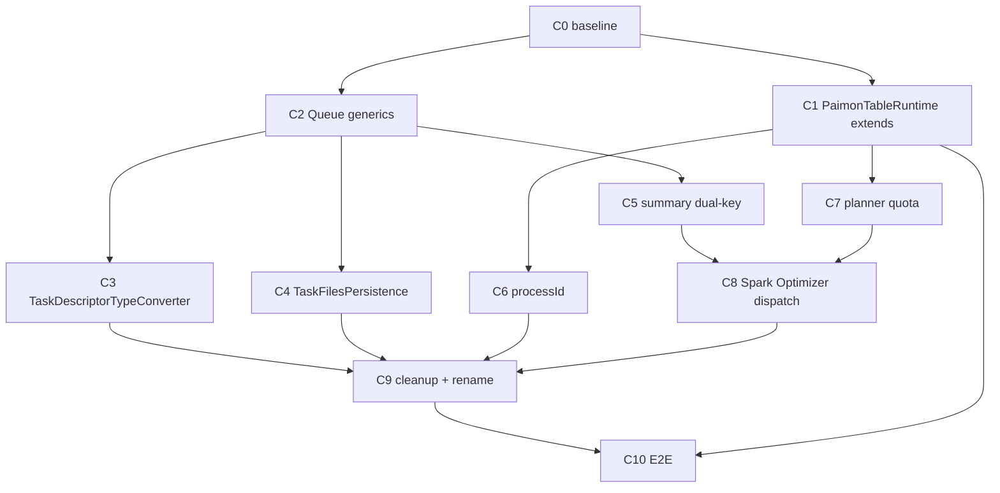

# Paimon BUCKET_UNAWARE Compaction —— AMS 调度链路闭环重构 Plan

> **版本**：v1（2026-04-18）
> **面向执行器**：Claude Code / Codex / 多 SubAgent 顺序执行
> **REQUIRED SUB-SKILL**：`superpowers:executing-plans`（每个 Task = 一次独立 commit，带 JUnit5 单测）
> **上游文档**：`docs/plans/2026-04-17-paimon-bucket-unaware-optimizer-plan.md`（原始方案 §1~§15，本文件是对它的 Review-driven 重构补全）

---

## 0. Context & Goal

### 0.1 已完成成果（3cd2852..HEAD）
- Paimon 侧三层（Planner / Executor / Committer）完整实现，语义等价于 `paimon-spark-common/CompactProcedure#compactUnAwareBucketTable`。
- AMS 侧落地 `ProcessFactoryRouter` + `ProcessFactory` SPI，使 `createPlanner` / `createCommitter` 能按 `TableFormat` 分发。
- Feature flag `paimon-optimizer.enabled`（默认 `false`）作为灰度开关，Iceberg 路径 0 影响。

### 0.2 已暴露断点
本次 Review 确认 **Paimon task 在当前主干上无法真正流过 AMS 调度链**，断点集中在：

| # | 位置 | 现象 | 等级 |
|---|---|---|---|
| P0-1 | `DefaultOptimizingService#initHandler` L517 `filter(t -> t instanceof DefaultTableRuntime)`；`handleStatusChanged/handleConfigChanged/handleTableAdded/handleTableRemoved` L469/478/500/507 全部强转 | `PaimonTableRuntime extends AbstractTableRuntime`，Paimon 表**进不了 `OptimizingQueue`** | 阻塞上线 |
| P0-2 | `OptimizingQueue.TableOptimizingProcess.taskMap / taskQueue / resetTask / loadTaskRuntimes / getSummary` | 类型硬编码 `RewriteStageTask`；塞入 `PaimonCompactionTask` 会在 `RewriteStageTask::getSummary` 触发 ClassCastException | 阻塞上线 |
| P0-3 | `TaskFilesPersistence.loadTaskInputs(processId)` 返回 `Map<Integer, RewriteFilesInput>`；`TaskDescriptorTypeConverter` 仅反序列化 `RewriteStageTask` | AMS 重启后 Paimon 进程无法恢复；Commit 阶段拿不到 `PaimonCompactionInput` | 阻塞 HA |
| P1-1 | `PaimonCompactionOutput.summary()` key=`compacted-files/produced-files`；`MetricsSummary.fromMap` 读 `input-data-files/output-data-files` | Dashboard 上 Paimon 任务摘要缺字段 | 影响可观测性 |
| P1-2 | `PaimonProcessFactory.generateProcessId()` 用 `ThreadLocalRandom.nextLong` | DB 主键风格与 Iceberg 不一致，极端情况下理论冲突（~10⁻¹⁸） | 工程对齐 |
| P1-3 | `PaimonOptimizingPlanner` 忽略 `availableCore / maxInputSizePerThread`（`@SuppressWarnings("unused")`） | 对大表 task 切分不受 quota 约束 | 影响调度公平 |
| P2-1 | `PaimonProcessFactory.recover()` 抛 `RecoverProcessFailedException` | 死代码（AMS 用 `TableOptimizingProcess(runtime, meta, state)` 直接重建）；仅语义误导 | 清理项 |
| P2-2 | `PaimonOptimizingPlanner.getCommitUser()` javadoc 要求 caller 持久化到 `TableProcessStore.properties`，但 `PaimonProcessFactory.createPlanner` 未实现 | 注释与行为不一致；当前因 `commitUser` 随 input 入库，功能上 OK | 清理项 |
| P2-3 | AMS 与 paimon 模块各有一个 `PaimonProcessFactory`（前者仅处理 `EXPIRE_SNAPSHOT`） | 同名类易混淆 | 清理项 |

### 0.3 目标（本次 Plan 的验收口径）
完整打通 **AMS 生成计划 → AMS 分发 Task → Optimizer 执行 → 回传结果 → 聚合 Commit → 完成优化** 全链路，并保证：

- Iceberg/Mixed 现有调度、持久化、Dashboard 路径 **零行为回归**。
- AMS 重启后，进行中的 Paimon 进程可从 DB 中恢复（与 Iceberg 对等）。
- Dashboard 对 Paimon 任务的 summary 展示字段完整。

### 0.4 明确不做
- 不接入 Paimon `sortCompactUnAwareBucketTable` / `clusterIncrementalUnAwareBucketTable` / aware-bucket compaction（上游 Plan §2.2 已声明）。
- 不重写 Paimon 的 compaction 算法；Paimon 原生 `AppendCompactCoordinator` / `AppendCompactTask.doCompact` / `CommitMessageSerializer` / `StreamTableCommit` 为唯一可信边界。
- 不在本期引入「Optimizer 直接提交」语义，AMS 统一提交保留。

---

## 1. 架构视图

### 1.1 Before（当前断点架构）



断点标红：**Paimon 流不进 Queue、Queue 装不下 Paimon 任务、DB 里取不回 Paimon input**。

### 1.2 After（目标架构）



### 1.3 Full E2E 时序



### 1.4 Spark Optimizer 侧分发链（amoro-optimizer-spark ✕ amoro-optimizer-common）



**关键事实**：
- `OptimizerExecutor.executeTask(static)`（`amoro-optimizer-common/src/main/.../OptimizerExecutor.java` L210–250）通过读取 task `properties[TASK_EXECUTOR_FACTORY_IMPL]`（由 `PaimonOptimizingPlanner.plan()` 写入），用 `DynConstructors` 反射实例化任意 `OptimizingExecutorFactory`。
- 入口是 `SparkOptimizingTaskFunction.call(task)` → 委托到 `OptimizerExecutor.executeTask`。所以 **Paimon `doCompact` 真实执行地是 Spark Executor JVM**（和 Iceberg `RewriteFilesExecutor` 共用同一分发机制）。
- Classpath：`amoro-optimizer-common/pom.xml` 已显式依赖 `amoro-format-paimon`；`amoro-optimizer-spark` → `common` → `paimon`，Paimon 原生类 + `AppendCompactTask.doCompact` 在 Spark Executor 端可见，无需新增依赖。
- Flink Optimizer 同机制，但 Plan §9 声明 Flink 适配留到后续（`FlinkOptimizerExecutor` 的反射链已具备，仅需 classpath + 跨 JVM serde 验证）。

### 1.5 PaimonTableRuntime 全生命周期（定期扫描 → Plan → Dispatch → Execute → Commit）

#### 1.5.1 状态机总览

`PaimonTableRuntime extends DefaultTableRuntime` 之后，与 Iceberg 共享 `OptimizingStatus` 状态机。完整状态转换：



#### 1.5.2 触发源：AMS 的 3 类定期动作

Paimon 表被「扫到」并不是单条定时任务，而是 **3 条互补的周期性驱动**：

| 触发者 | 周期 | 关注点 | 对 PaimonTableRuntime 的影响 |
|---|---|---|---|
| `TableRuntimeRefreshExecutor` | 可配置（默认 10s） | 刷新 Paimon 表的 snapshot / metadata 到 `PaimonTableRuntime` 内部状态 | 更新 `currentSnapshotId`、最近写入时间等字段；标记是否需要 optimize |
| `OptimizingQueue.scheduleTableIfNecessary` | 每次 `pollTask()` tick 隐式触发 | 从 `SchedulingPolicy` 挑一张 table 放入 planning | 调 `triggerAsyncPlanning(tableRuntime)` 进入 PLANNING |
| `OptimizerKeeper` / `OptimizerGroupKeeper` | `optimizerTouchTimeout / 4`（默认 ~30s） | optimizer 心跳、挂掉检测、stuck task 重试 | 把 suspend 的 task 重新塞回 taskQueue（不新建 process） |

> **结论**：Paimon 表的"定期扫描"是由 **Optimizer 侧不断 `pollTask` → AMS `scheduleTableIfNecessary`** 共同驱动的拉模式，而不是 AMS 侧主动 push；这与 Iceberg 完全一致。

#### 1.5.3 完整生命周期流程图（一个 plan 周期从头到尾）

```mermaid
flowchart TD
    subgraph PHASE0 ["Phase 0 · Register & Refresh"]
        A1[PaimonTableRuntime 注册 / 加载]
        A2[TableRuntimeRefreshExecutor\n周期刷新 snapshot metadata]
        A1 --> A2
    end

    subgraph PHASE1 ["Phase 1 · 定期扫描 & 选表（IDLE → PENDING）"]
        B1[OptimizerThread 通过 Thrift 调 DefaultOptimizingService.pollTask]
        B2[OptimizingQueue.pollTask → waitTask → scheduleTableIfNecessary]
        B3{planningTables.size<br/>< maxPlanningParallelism?}
        B4[SchedulingPolicy.scheduleTable<br/>按 quota / lastPlan / size 挑 table]
        B5{命中 PaimonTableRuntime?}
        B1 --> B2 --> B3
        B3 -->|yes| B4 --> B5
        B3 -->|no| BX1[[return null, 本 tick 不 plan]]
        B5 -->|no| BX2[[换 Iceberg 或其他表]]
    end

    subgraph PHASE2 ["Phase 2 · 异步规划（PENDING → PLANNING）"]
        C1[triggerAsyncPlanning → CompletableFuture on planExecutor]
        C2[tableRuntime.beginPlanning<br/>status=PLANNING]
        C3[catalogManager.loadTable → 最新 PaimonTable]
        C4[tableRuntime.refresh]
        C5[router.forFormat PAIMON .createPlanner<br/>→ PaimonOptimizingPlanner]
        C6[planner.isNecessary<br/>= AppendOnly + BUCKET_UNAWARE + snapshot!=null]
        C7{isNecessary?}
        C8[planner.plan<br/>AppendCompactCoordinator.run<br/>→ List AppendCompactTask]
        C9[C7 quota filter<br/>cap=availableCore, size ≤ maxInputSizePerThread]
        C10[1:1 包装 → List PaimonCompactionTask<br/>commitUser=UUID per plan<br/>targetSnapshotId=当前 snapshot]
        C11[new TableOptimizingProcess]
        B5 -->|Paimon| C1 --> C2 --> C3 --> C4 --> C5 --> C6 --> C7
        C7 -->|yes| C8 --> C9 --> C10 --> C11
        C7 -->|no| CX1[completeEmptyProcess<br/>status=IDLE]
    end

    subgraph PHASE3 ["Phase 3 · 持久化 + 入队（PLANNING → OPTIMIZING）"]
        D1[beginAndPersistProcess 事务]
        D2[TableProcessMapper.insertProcess]
        D3[OptimizingProcessMapper.insertInternalProcessState<br/>targetSnapshotId/fromSeq/toSeq]
        D4[OptimizingProcessMapper.insertTaskRuntimes<br/>TaskDescriptorTypeConverter 序列化]
        D5[TaskFilesPersistence.persistTaskInputs<br/>BaseOptimizingInput 通用化]
        D6[tableRuntime.beginProcess → status=OPTIMIZING]
        D7[tableQueue.offer process<br/>N 个 TaskRuntime PLANNED]
        C11 --> D1 --> D2 --> D3 --> D4 --> D5 --> D6 --> D7
    end

    subgraph PHASE4 ["Phase 4 · 下发任务（每个 task 独立走一遍）"]
        E1[OptimizerThread poll → Thrift pollTask]
        E2[TaskRuntime.schedule thread<br/>status=SCHEDULED]
        E3[StagedTaskDescriptor.extractProtocolTask<br/>SerializationUtil.simpleSerialize input + properties]
        E4[Thrift 返回 OptimizingTask]
        E5[Optimizer ackTask<br/>AMS 侧 status=ACKED]
        D7 --> E1 --> E2 --> E3 --> E4 --> E5
    end

    subgraph PHASE5 ["Phase 5 · 执行任务（Spark Executor JVM）"]
        F1[SparkOptimizerExecutor.executeTask<br/>jsc.parallelize of,1 .map]
        F2[SparkOptimizingTaskFunction.call 在 Executor]
        F3[OptimizerExecutor.executeTask static<br/>amoro-optimizer-common]
        F4[SerializationUtil.simpleDeserialize<br/>→ PaimonCompactionInput]
        F5[DynConstructors.impl<br/>TASK_EXECUTOR_FACTORY_IMPL → PaimonCompactionExecutorFactory]
        F6[factory.createExecutor → PaimonCompactionExecutor]
        F7[PaimonCompactionExecutor.execute<br/>1. AppendCompactTaskSerializer.deserialize<br/>2. table.store .newWrite commitUser<br/>3. task.doCompact → CommitMessage<br/>4. CommitMessageSerializer.serialize<br/>5. 填 Paimon/Iceberg 双 key summary]
        F8[→ PaimonCompactionOutput]
        F9[OptimizingTaskResult taskOutput + summary]
        E5 --> F1 --> F2 --> F3 --> F4 --> F5 --> F6 --> F7 --> F8 --> F9
    end

    subgraph PHASE6 ["Phase 6 · 回传 & 状态聚合"]
        G1[Thrift completeTask → AMS]
        G2[TaskRuntime.complete<br/>setOutputBytes → deserializeOutput<br/>→ PaimonCompactionOutput<br/>calculateSummary → PaimonMetricsSummary<br/>status=SUCCESS]
        G3[acceptResult<br/>decrement quota]
        G4{allTasksPrepared?}
        G5{task.FAILED<br/>& retry<maxRetry?}
        F9 --> G1 --> G2 --> G3 --> G4
        G4 -->|no 还有 PLANNED/ACKED| GX1[等下一批 pollTask]
        G4 -->|yes 全部 SUCCESS| G6[tableRuntime.beginCommitting<br/>status=COMMITTING]
        G5 -->|yes| GX2[retryTask<br/>status→PLANNED, 回 taskQueue]
        G5 -->|no| G7[process.status=FAILED<br/>persistAndSetCompleted false]
    end

    subgraph PHASE7 ["Phase 7 · 聚合提交（COMMITTING → IDLE/FAILED）"]
        H1[process.commit<br/>筛 SUCCESS tasks]
        H2[buildCommit<br/>router.forFormat PAIMON .createCommitter]
        H3[PaimonTableCommit.commit]
        H4[反序列化每个 CommitMessage<br/>CommitMessageSerializer + version]
        H5[table.newStreamWriteBuilder .withCommitUser commitUser]
        H6[StreamTableCommit.commit commitIdentifier=targetSnapshotId, messages<br/>Paimon 内置 user+identifier 幂等]
        H7{commit 成功?}
        H8[status=SUCCESS<br/>endTime=now<br/>persistAndSetCompleted true<br/>tableRuntime.completeProcess true]
        H9[OptimizingCommitException<br/>status=FAILED<br/>persistAndSetCompleted false]
        G6 --> H1 --> H2 --> H3 --> H4 --> H5 --> H6 --> H7
        H7 -->|yes| H8
        H7 -->|no| H9
    end

    subgraph PHASE8 ["Phase 8 · 回到 IDLE / 等待下一轮"]
        Z1[PaimonTableRuntime status=IDLE]
        Z2[Paimon 表新增 1 个 compact snapshot<br/>小文件被合并]
        Z3[下一次 pollTask tick 回到 Phase 1]
        H8 --> Z1 --> Z2 --> Z3
        H9 --> Z1
    end

    style PHASE0 fill:#f0f8ff
    style PHASE1 fill:#fff8e7
    style PHASE2 fill:#e8f5e9
    style PHASE3 fill:#f3e5f5
    style PHASE4 fill:#fff8e7
    style PHASE5 fill:#ffebee
    style PHASE6 fill:#e8f5e9
    style PHASE7 fill:#f3e5f5
    style PHASE8 fill:#f0f8ff
```



#### 1.5.4 各阶段责任 / 触点表

| Phase | 位置（文件） | 关键方法 | 涉及持久化 | 涉及本次 Plan Commit |
|---|---|---|---|---|
| 0 注册 & 刷新 | `PaimonTableRuntime` / `TableRuntimeRefreshExecutor` | `refresh(AmoroTable)` | StateKey 持久化 | C1（extends DefaultTableRuntime） |
| 1 定期扫描 | `OptimizingQueue` / `SchedulingPolicy` | `pollTask` → `scheduleTableIfNecessary` → `scheduler.scheduleTable` | 无 | C1（Paimon 进入 `instanceof DefaultTableRuntime` filter） |
| 2 异步规划 | `OptimizingQueue#planInternal` / `ProcessFactoryRouter` / `PaimonOptimizingPlanner` | `beginPlanning` / `createPlanner` / `isNecessary` / `plan` | 无（计划态） | C7（Planner 消费 quota） |
| 3 持久化入队 | `TableOptimizingProcess#beginAndPersistProcess` / `TaskFilesPersistence` | `insertProcess` / `insertInternalProcessState` / `insertTaskRuntimes` / `persistTaskInputs` | TableProcessMeta + OptimizingProcessState + TaskRuntime rows + 文件输入 | C2（Queue 泛型）/ C3（TypeConverter）/ C4（Persistence 通用化） |
| 4 下发任务 | `OptimizingQueue#pollTask` / `TaskRuntime#schedule` / `StagedTaskDescriptor#extractProtocolTask` | Thrift pollTask / ackTask | TaskRuntime status 更新 | C2（Queue 泛型解除 RewriteStageTask 限制） |
| 5 执行任务 | `SparkOptimizerExecutor` / `SparkOptimizingTaskFunction` / `OptimizerExecutor.executeTask` / `PaimonCompactionExecutor` | `executeTask` / `DynConstructors` / `doCompact` | 无（Spark Executor JVM 内） | C8（Spark dispatch + jobDescription） |
| 6 回传聚合 | `TableOptimizingProcess#completeTask` / `TaskRuntime#complete` / `acceptResult` | `setOutputBytes` / `calculateSummary` / `beginCommitting` | TaskRuntime status=SUCCESS 持久化 | C2（getSummary 用 toMetricsSummary）/ C5（summary 双写） |
| 7 聚合提交 | `TableOptimizingProcess#commit` / `PaimonTableCommit` | `buildCommit` / `StreamTableCommit.commit(identifier,msgs)` | `TableProcessMeta` 终态 | C9（factory cleanup） |
| 8 收尾 | `persistAndSetCompleted` / `tableRuntime.completeProcess` | - | Dashboard 摘要 | C10（E2E 回归） |

#### 1.5.5 关键并行度说明（与 Iceberg 对齐）

- **Phase 2 并行度** = `maxPlanningParallelism`（多表并发 plan）。
- **Phase 4-6 并行度** = `OptimizerThread` 数量（多 task 并发执行）。
  - N 个 `PaimonCompactionTask` 进 taskQueue → 多个 Thread 并发 `pollTask` → 每个 Thread 一个 Spark Job（Paimon 原生 `CompactProcedure` 是 1 Spark Job × N partition；Amoro 是 N Spark Job × 1 partition）。
- **Phase 7 并行度** = 1（per-process）。单 process 内所有 CommitMessage 在同一 `StreamTableCommit.commit` 原子提交，保持 snapshot 一致性。

#### 1.5.6 与 Iceberg 调度等价性对照

| 生命周期阶段 | Iceberg（RewriteStageTask） | Paimon（PaimonCompactionTask） | 共用的 AMS 代码 |
|---|---|---|---|
| 定期扫描触发 | `OptimizingQueue.scheduleTableIfNecessary` | **同一路径**（C1 后 PaimonTableRuntime 通过 filter） | `SchedulingPolicy` |
| Planner 创建 | `router.forFormat(ICEBERG).createPlanner` | `router.forFormat(PAIMON).createPlanner` | `ProcessFactoryRouter` |
| Plan 产出 | `IcebergOptimizingPlanner → List<RewriteStageTask>` | `PaimonOptimizingPlanner → List<PaimonCompactionTask>` | `OptimizingPlanResult<T>` |
| Task 入队 / 调度 / 回传 | 同一条 `OptimizingQueue` 路径 | **同一条 `OptimizingQueue` 路径**（C2 后泛型解除） | `TableOptimizingProcess`, `TaskRuntime` |
| Spark 执行反射 | `RewriteFilesExecutorFactory` | `PaimonCompactionExecutorFactory` | `OptimizerExecutor.executeTask` (static) |
| Commit | `router.forFormat(ICEBERG).createCommitter → UnKeyedTableCommit` | `router.forFormat(PAIMON).createCommitter → PaimonTableCommit` | `ProcessFactoryRouter` |
| 终态持久化 | `persistAndSetCompleted` | **同一路径** | `TableProcessMapper` / `OptimizingProcessMapper` |

---

### 1.6 AMS 重启恢复（P0-3 解决后）



---

## 2. 数据模型与接口改动清单

### 2.1 amoro-common（公共抽象）

| 文件 | 改动 |
|---|---|
| `process/StagedTaskDescriptor.java` | 新增 `public abstract TaskMetricsSummary toMetricsSummary()` —— Iceberg 在 `RewriteStageTask` 返回现有 `MetricsSummary`；Paimon 在 `PaimonCompactionTask` 返回 `PaimonMetricsSummary.toMetricsSummary()` 的结果 |
| `optimizing/TaskMetricsSummary.java` | **新增**（原计划 §2.1 误把 `MetricsSummary` 放在 amoro-common —— C2 SubAgent review 时发现 `MetricsSummary` 实际在 `amoro-format-iceberg`，跨模块会成环）。`TaskMetricsSummary` 是 amoro-common 的最小接口，只含 `Map<String,String> summaryAsMap(boolean humanReadable)`。`MetricsSummary` (iceberg) 与 Paimon 的 summary 都实现它 |
| `optimizing/BaseOptimizingInput.java` | 已存在，本次沿用；在 C4 中作为 `TaskFilesPersistence` 的新公共返回类型 |

### 2.2 amoro-format-iceberg

| 文件 | 改动 |
|---|---|
| `optimizing/RewriteStageTask.java` | 实现 `toMetricsSummary() { return summary; }`（显式，无行为变化） |

### 2.3 amoro-format-paimon

| 文件 | 改动 |
|---|---|
| `optimizing/PaimonCompactionTask.java` | 实现 `toMetricsSummary()` —— 输出带 Iceberg 兼容 key 的 `MetricsSummary`（`input-data-files`/`output-data-files`/`input-data-size`/`output-data-size`） |
| `optimizing/PaimonMetricsSummary.java` | 新增 `MetricsSummary toMetricsSummary()`；保留原 4 字段原始统计 |
| `optimizing/PaimonCompactionOutput.java` | `summary()` 同时写入 Paimon 原 key 与 Iceberg 兼容 key（双写，向下兼容现有测试） |
| `process/PaimonProcessFactory.java` | `generateProcessId` 改用 AMS 统一单调生成器；`recover()` 返回 `Optional.empty()` 或对齐 `DefaultTableRuntime` recover 契约；`createPlanner` 将 `commitUser` 持久化到 `TableProcessStore`（若 recover 需要） |
| `PaimonSnapshot.java`（若 `PaimonTableRuntime` 扩展 DefaultTableRuntime 需要额外状态） | 评估 StateKey 冲突 |

### 2.4 amoro-ams

| 文件 | 改动 |
|---|---|
| `server/table/paimon/PaimonTableRuntime.java` | **核心**：`extends DefaultTableRuntime`；保留 Paimon 专属 StateKey 扩展（若与 `DefaultTableRuntime.REQUIRED_STATES` 冲突，用不同 key 前缀） |
| `server/table/DefaultTableRuntimeFactory.java` | 删除 `PaimonTableRuntimeCreatorImpl` 分支；Paimon 复用 `TableRuntimeCreatorImpl`（因为现在 PaimonTableRuntime 就是 DefaultTableRuntime） |
| `server/optimizing/OptimizingQueue.java` | `taskMap` / `taskQueue` / `resetTask` / `retryTask` / `loadTaskRuntimes` 参数泛化到 `StagedTaskDescriptor<?,?,?>`；`getSummary()` 改用 `descriptor.toMetricsSummary()`；`loadTaskRuntimes(List<?>)` 移除对 `RewriteStageTask` 的强依赖 |
| `server/persistence/converter/TaskDescriptorTypeConverter.java` | 按 task `properties.get(TASK_EXECUTOR_FACTORY_IMPL)` 路由：Iceberg → `RewriteStageTask`，Paimon → `PaimonCompactionTask`；注册表通过 SPI 或常量列表维护 |
| `server/persistence/TaskFilesPersistence.java` | `persistTaskInputs` / `loadTaskInputs` 返回类型从 `RewriteFilesInput` 泛化到 `BaseOptimizingInput`；序列化走 `SerializationUtil.simpleSerialize/Deserialize`（与 StagedTaskDescriptor 一致） |
| `server/process/paimon/PaimonProcessFactory.java` | 重命名 → `PaimonMaintainProcessFactory`（仅服务 EXPIRE_SNAPSHOT action），避免与 `amoro-format-paimon` 的 `PaimonProcessFactory` 混淆 |

---

## 3. 关键设计决策

### 3.1 Summary 双写策略（C5）
为了 Dashboard 展示路径 **一行代码不改**，`PaimonCompactionOutput.summary()` 同时输出：

```java
return Map.of(
  // Paimon 原语义 —— 保留
  "compacted-files", Long.toString(compactedFileCount),
  "compacted-bytes", Long.toString(compactedFileSize),
  "produced-files", Long.toString(producedFileCount),
  "produced-bytes", Long.toString(producedFileSize),
  // Iceberg 兼容 key —— MetricsSummary.fromMap 读得到
  "input-data-files", Long.toString(compactedFileCount),
  "input-data-size", Long.toString(compactedFileSize),
  "output-data-files", Long.toString(producedFileCount),
  "output-data-size", Long.toString(producedFileSize));
```

**理由**：Paimon 的 `AppendCompactTask` 不暴露 `recordCount`（`DataFileMeta` 有但调用链未传递），暂不支持 `*-records` 字段。若后续需要，`AppendCompactTask.compactBefore()/compactAfter()` 里的 `DataFileMeta.rowCount()` 可补充。

### 3.2 `StagedTaskDescriptor.toMetricsSummary()` 契约

**模块边界修正（C2 发现）**：`MetricsSummary` 在 `amoro-format-iceberg`，不是 `amoro-common`，所以 `StagedTaskDescriptor`（在 common）直接返回它会形成跨模块环。引入 amoro-common 层的最小接口：

```java
// amoro-common/.../optimizing/TaskMetricsSummary.java
public interface TaskMetricsSummary {
  /**
   * 返回与 Dashboard 兼容的摘要键值对。humanReadable=true 时单位换算为字符串。
   * Iceberg 的 MetricsSummary 直接实现本接口；Paimon 侧由 PaimonMetricsSummary 提供实现。
   */
  Map<String, String> summaryAsMap(boolean humanReadable);
}
```

```java
public abstract class StagedTaskDescriptor<I,O,S> {
  /** 格式无关的 summary；由具体子类把自己的 S 映射为 TaskMetricsSummary。 */
  public abstract TaskMetricsSummary toMetricsSummary();
}
```
- `amoro-format-iceberg/.../MetricsSummary.java`: `public class MetricsSummary implements TaskMetricsSummary`（已有 `summaryAsMap(boolean)` 方法，加 implements 即可；0 行为变化）
- `RewriteStageTask.toMetricsSummary()` → `return summary;`（summary 字段类型 S = `MetricsSummary`；因 `MetricsSummary implements TaskMetricsSummary`，协变返回合法）
- `PaimonCompactionTask.toMetricsSummary()` → `return summary.toMetricsSummary();`（委托 `PaimonMetricsSummary`）
- `PaimonMetricsSummary.toMetricsSummary()` 返回一个 `TaskMetricsSummary` 简单实现（lambda 或内部类），emit Iceberg 兼容 key

**OptimizingQueue.getSummary() 的聚合**：从 N 个 `TaskMetricsSummary` 合并成最终 `MetricsSummary` 仍然在 iceberg 模块里完成（OptimizingQueue 已经依赖 iceberg）。`MetricsSummary` 增加一个 `public MetricsSummary(List<TaskMetricsSummary>)` 构造器或者 `static fromTaskSummaries(List<TaskMetricsSummary>)` 工厂即可。

### 3.3 `TaskDescriptorTypeConverter` 路由注册

```java
// amoro-ams/.../converter/TaskDescriptorTypeConverter.java
// 按 task properties 中的 TASK_EXECUTOR_FACTORY_IMPL 路由：
// - RewriteFilesExecutorFactory (iceberg)             → RewriteStageTask
// - MixRewriteFilesExecutorFactory (mixed)            → RewriteStageTask
// - PaimonCompactionExecutorFactory (paimon)          → PaimonCompactionTask
// 未匹配抛 IllegalStateException（早期失败，不静默降级）
```

注册表采用 **枚举 + switch**，避免引入 ServiceLoader 循环依赖（`amoro-ams` 已经依赖 `amoro-format-paimon`）。

### 3.4 任务拆分契约（Iceberg 等价）

**分层责任**

```
Paimon AppendCompactCoordinator.run()
  ↓ 按 partition + size budget 分组
List<AppendCompactTask>   ← N 个独立可 commit 的 compaction 单元（Paimon 的原子边界）
  ↓ PaimonOptimizingPlanner 1:1 包装
List<PaimonCompactionTask>
  ↓ OptimizingQueue 入队，N 条 TaskRuntime
(Thrift) pollTask 一个一个拉
  ↓ SparkOptimizerExecutor.executeTask
N × (1 Spark Job × 1 Partition × 1 doCompact)
  ↓ 返回 N 条 CommitMessage
PaimonTableCommit.commit(identifier, messages)   ← AMS 单次聚合 commit
```

**关键不变量**：
1. **拆分者只有 Paimon**。Amoro Planner 不重组 `DataFileMeta`，不合并 / 不拆分 `AppendCompactTask` —— 一切文件分组策略留给 Paimon 的 LSM / size 决策。
2. **Amoro 侧 1:1 包装**。`PaimonOptimizingPlanner#plan` 里 `for (AppendCompactTask t : cachedTasks) wrapped.add(new PaimonCompactionTask(...))` 保持严格一对一。
3. **调度粒度 = Paimon 原子单元**。`OptimizingQueue` 把每个 `PaimonCompactionTask` 当独立 TaskRuntime 处理，`poll / ack / complete / retry` 都是 per-task —— 这是 Amoro 优于 Paimon 原生 `CompactProcedure` 的地方（后者全 job 级重试）。
4. **Commit 点只有一个**。`PaimonTableCommit` 聚合同一 process 下所有 SUCCESS task 的 `CommitMessage`，一次 `StreamTableCommit.commit(identifier, messages)` 产出 1 个 snapshot；与 Iceberg `UnKeyedTableCommit.commit(rewriteResults)` 语义完全对齐。

**与原生 `compactUnAwareBucketTable` 的并行度差异**

| 维度 | Paimon CompactProcedure | Amoro 调度 |
|---|---|---|
| 并行载体 | 1 Spark Job × N Spark Partition | N Spark Job × 1 Spark Partition |
| Driver 内 RDD | `parallelize(serializedTasks, readParallelism)` | `parallelize(of, 1)` per Amoro task |
| 失败隔离 | 1 task OOM 拖崩整个 job | 单 task 重试不干扰其他 task |
| Quota 语义 | 不存在 | 每 task 占用 1 个 optimizer core |
| 最终 commit | 1 次 `TableCommitImpl.commit(messages)` | 1 次 `StreamTableCommit.commit(identifier, messages)` |
| 最终产物 | 1 个 compact snapshot | **等价的 1 个 snapshot**（files 相同、content 相同） |

这个拓扑差异是**与 Iceberg RewriteStageTask 对齐的显式选择**：牺牲少量 Spark Driver 调度开销，换取 task 级独立重试、per-task quota、按 token 分配 —— 复用 Amoro 的所有现有 runtime 机制。

### 3.5 AMS 重启恢复 —— 关键不变量
- 一个 process 的所有 task 共享同一 `commitUser`（在 `PaimonOptimizingPlanner#plan()` 生成时固化，随 `PaimonCompactionInput` 持久化）。
- `commitIdentifier` = 规划时 `targetSnapshotId`（单调）。
- 恢复后再次 commit 时，Paimon 内置 `(user, identifier)` 幂等 → 重复提交无副作用。

---

## 4. 提交顺序（11 个 Commit，严格串行）

> 每个 Commit **必须包含 JUnit5 单测 + Iceberg 回归 Pass 证据**。命名风格沿用 `[AMORO-4200]`。

### C0 · Baseline（verification-only，0 代码改动）

**目的**：锁定 Iceberg/Mixed 现有行为基线，作为后续回归比较锚点。

**动作**：
- 运行 Iceberg + Mixed 全量 test，记录 `PASSED` 数量。
- 产出 `docs/plans/2026-04-18-baseline.txt`（纯文本）记录基线。

**Commands**：
```bash
./mvnw -pl amoro-format-iceberg -am test
./mvnw -pl amoro-ams -am test
```

**Commit message**：`[AMORO-4200] plan: baseline test pass list before refactor`

---

### C1 · PaimonTableRuntime extends DefaultTableRuntime（去重）

**目的**：让 Paimon 表被 `DefaultOptimizingService.initHandler` 收集，响应 `handleStatusChanged` 等事件；同时消除 `PaimonTableRuntime` 与 `DefaultTableRuntime` 的 StateKey 重复声明。

**Review finding**：`PaimonTableRuntime` 当前 L79-97 声明了 4 个 StateKey —— `optimizing_state` / `pending_input` / `cleanup_state` / `process_id`，**与 `DefaultTableRuntime` L68-83 的 4 个 StateKey 完全同名、同类型**。`DefaultTableRuntimeFactory.TableRuntimeCreatorImpl#requiredStateKeys()` 在合并时有 duplicate-key fast-fail（同名直接 throw `IllegalStateException`），所以单纯把 extends 改过去会在运行时 crash。**真正要做的是：让 `PaimonTableRuntime` 继承 `DefaultTableRuntime` 并删掉这 4 个重复 StateKey 与伴随的 getter/setter，直接复用父类字段**。

**Files**
- M `amoro-ams/src/main/java/org/apache/amoro/server/table/paimon/PaimonTableRuntime.java`（大改：继承切换 + 删重复 state + 删重复 getter/setter）
- M `amoro-ams/src/main/java/org/apache/amoro/server/table/DefaultTableRuntimeFactory.java`（保留 `PaimonTableRuntimeCreatorImpl` —— 现在只做 `new PaimonTableRuntime` 实例化，不再重复 StateKey；或让 `TableRuntimeCreatorImpl` 按 format 分支实例化）
- A `amoro-ams/src/test/java/org/apache/amoro/server/table/paimon/TestPaimonTableRuntimeScheduling.java`

**Steps**
1. `PaimonTableRuntime extends DefaultTableRuntime`（原 `extends AbstractTableRuntime`）。
2. **删除** `PaimonTableRuntime` 里的 4 个重复 StateKey 常量：`OPTIMIZING_STATE_KEY` / `PENDING_INPUT_KEY` / `CLEANUP_STATE_KEY` / `PROCESS_ID_KEY`。
3. **删除** `PaimonTableRuntime.REQUIRED_STATES` 列表（改为直接复用 `DefaultTableRuntime.REQUIRED_STATES`），并更新所有引用点（`DefaultTableRuntimeFactory.PaimonTableRuntimeCreatorImpl#requiredStateKeys()` 改成返回 `DefaultTableRuntime.REQUIRED_STATES`，或交给 `TableRuntimeCreatorImpl` 的既有合并逻辑）。
4. **删除** `PaimonTableRuntime` 里已经在父类提供的重复 getter/setter（例如若存在 `getPendingInput / setPendingInput / getProcessId / setProcessId`，直接复用父类版本）。保留真正 Paimon-specific 的行为（如基于 Paimon `Snapshot` 的 `refresh` 实现）。
5. **保留或合并** `PaimonTableRuntimeCreatorImpl`：现在它只负责 `new PaimonTableRuntime(store, loader)`，不再返回 Paimon 独有的 StateKey；也可以进一步简化成 `TableRuntimeCreatorImpl` 按 format 分支实例化 `PaimonTableRuntime`，二选一，以代码少为准。
6. 新增 `TestPaimonTableRuntimeScheduling`：
   - 构造 `PaimonTableRuntime` → 断言 `instanceof DefaultTableRuntime`
   - 构造 `DefaultTableRuntimeFactory` 初始化流程 → 断言 `requiredStateKeys()` 不抛 duplicate-key 异常
   - 模拟 `DefaultOptimizingService.initHandler` 的 `filter(instanceof DefaultTableRuntime)` → 断言 Paimon 实例通过
   - 调 `handleStatusChanged(paimonRuntime, status)` → 不抛 `ClassCastException`
   - 对 `getPendingInput / setPendingInput`（父类方法）做一次 set→get round-trip 回归，确保继承后行为一致

**Run**
```bash
./mvnw -pl amoro-ams -Dtest='TestPaimonTableRuntime*,TestPaimonExpireSnapshotProcess' test
./mvnw -pl amoro-format-paimon test
```

**Regression guard**：
- `TestPaimonExpireSnapshotProcess` 必须全部通过（Paimon 维护路径不受影响）。
- 既有依赖 `PaimonTableRuntime.REQUIRED_STATES` 的静态引用必须全部 grep 替换为 `DefaultTableRuntime.REQUIRED_STATES`（或直接走 Factory 的合并路径）。

**Commit message**：`[AMORO-4200] ams: PaimonTableRuntime extends DefaultTableRuntime + drop duplicated StateKeys`

---

### C2 · StagedTaskDescriptor.toMetricsSummary + OptimizingQueue 泛化

**目的**：解除 `OptimizingQueue` 对 `RewriteStageTask` 的内部硬编码。

**Files**
- M `amoro-common/src/main/java/org/apache/amoro/process/StagedTaskDescriptor.java`
- M `amoro-format-iceberg/src/main/java/org/apache/amoro/optimizing/RewriteStageTask.java`
- M `amoro-format-paimon/src/main/java/org/apache/amoro/formats/paimon/optimizing/PaimonCompactionTask.java`
- M `amoro-format-paimon/src/main/java/org/apache/amoro/formats/paimon/optimizing/PaimonMetricsSummary.java`
- M `amoro-ams/src/main/java/org/apache/amoro/server/optimizing/OptimizingQueue.java`
- A `amoro-ams/src/test/java/org/apache/amoro/server/optimizing/TestOptimizingQueueMultiFormat.java`

**Steps**
1. `StagedTaskDescriptor` 新增 `public abstract MetricsSummary toMetricsSummary()`；
2. `RewriteStageTask.toMetricsSummary()` = `return summary;`；
3. `PaimonMetricsSummary.toMetricsSummary()` 产出带 Iceberg 兼容 key 的 `MetricsSummary`；
4. `PaimonCompactionTask.toMetricsSummary()` 委托 `summary.toMetricsSummary()`；
5. 修改 `OptimizingQueue.TableOptimizingProcess`：
   - `Map<OptimizingTaskId, TaskRuntime<StagedTaskDescriptor<?,?,?>>> taskMap`
   - `Queue<TaskRuntime<StagedTaskDescriptor<?,?,?>>> taskQueue`
   - `resetTask(TaskRuntime<?> task)` / `retryTask(TaskRuntime<?>)` 统一通配
   - `loadTaskRuntimes(List<? extends StagedTaskDescriptor<?,?,?>> taskDescriptors)` 通用化
   - `getSummary()` 改 `.map(taskRuntime -> taskRuntime.getTaskDescriptor().toMetricsSummary())`
6. `OptimizingQueue.retryTask(TaskRuntime<?> taskRuntime)` 去掉 `(TaskRuntime<RewriteStageTask>) taskRuntime` 强转。

**Tests**
- `TestOptimizingQueueMultiFormat`:
  - **Iceberg 不回归**：塞入一个 Mock `RewriteStageTask`，走完 poll/ack/complete/commit，断言 `getSummary()` 返回的 `MetricsSummary` 字段正确。
  - **Paimon 可容纳**：塞入一个 Mock `PaimonCompactionTask`，同样走完生命周期，断言无 ClassCastException、`getSummary()` 键名为 `input-data-files` 等。
  - **混合场景**：在同一 `OptimizingQueue` 跨 group 并发 Iceberg + Paimon，断言互不干扰。
- 重跑既有 `TestOptimizingQueue`（915 行）全量通过。

**Run**
```bash
./mvnw -pl amoro-common,amoro-format-iceberg,amoro-format-paimon,amoro-ams -Dtest='TestOptimizingQueue*,TestPaimonCompactionTask*,TestPaimonMetricsSummary*' test
```

**Commit message**：`[AMORO-4200] core: OptimizingQueue generics use StagedTaskDescriptor<?,?,?>`

---

### C3 · TaskDescriptorTypeConverter route by TASK_EXECUTOR_FACTORY_IMPL

**目的**：DB 里的 task 行能恢复成正确的 descriptor 子类。

**Files**
- M `amoro-ams/src/main/java/org/apache/amoro/server/persistence/converter/TaskDescriptorTypeConverter.java`
- A `amoro-ams/src/test/java/org/apache/amoro/server/persistence/converter/TestTaskDescriptorTypeConverter.java`
- 可能 M `amoro-ams/src/main/java/org/apache/amoro/server/persistence/mapper/OptimizingProcessMapper.java`（若 MyBatis XML 也需要调整）

**Steps**
1. `TaskDescriptorTypeConverter` 读 `TASK_EXECUTOR_FACTORY_IMPL` 属性决定反序列化类：
   - `RewriteFilesExecutorFactory` → `RewriteStageTask`
   - `MixRewriteFilesExecutorFactory` → `RewriteStageTask`（Mixed 复用 Iceberg 的 Input/Output）
   - `PaimonCompactionExecutorFactory` → `PaimonCompactionTask`
   - 其他 → 抛 `IllegalStateException`（fail-fast，避免静默降级）
2. 注册映射用 `Map<String, Class<? extends StagedTaskDescriptor>>` 常量；新增格式在表尾加一行即可。
3. 单测覆盖：Iceberg row 反序列化、Paimon row 反序列化、未知 factoryImpl 报错、`properties` 为 null 走默认（保持 Iceberg 兼容）。

**Run**
```bash
./mvnw -pl amoro-ams -Dtest='TestTaskDescriptorTypeConverter*' test
```

**Commit message**：`[AMORO-4200] ams: TaskDescriptorTypeConverter routes by TASK_EXECUTOR_FACTORY_IMPL`

---

### C4 · TaskFilesPersistence: BaseOptimizingInput 通用化

**目的**：AMS 重启时能恢复 `PaimonCompactionInput`。

**Files**
- M `amoro-ams/src/main/java/org/apache/amoro/server/persistence/TaskFilesPersistence.java`
- M `amoro-ams/src/main/java/org/apache/amoro/server/optimizing/OptimizingQueue.java`（调用点类型更新）
- A `amoro-ams/src/test/java/org/apache/amoro/server/persistence/TestTaskFilesPersistenceMultiFormat.java`

**Steps**
1. `TaskFilesPersistence.loadTaskInputs(processId)` 返回 `Map<Integer, BaseOptimizingInput>`；
2. `persistTaskInputs` 签名从 `Collection<TaskRuntime<RewriteStageTask>>` 改 `Collection<TaskRuntime<? extends StagedTaskDescriptor<? extends BaseOptimizingInput, ?, ?>>>`；
3. `OptimizingQueue.TableOptimizingProcess.loadTaskRuntimes(OptimizingProcess)` 改 `Map<Integer, BaseOptimizingInput> inputs = ...`；`taskRuntime.getTaskDescriptor().setInput(inputs.get(...))` 保持不变（`setInput` 接受 `I`，通配后各自子类擦除匹配）。
4. 测试：
   - Iceberg round-trip：persist → load → 断言 `RewriteFilesInput` 字段完整
   - Paimon round-trip：persist → load → 断言 `PaimonCompactionInput.commitUser / taskBytes / serializerVersion / targetSnapshotId` 完整
   - 跨 process id 混合：同一个 DB 里交错存 Iceberg 与 Paimon，分别能正确加载

**Run**
```bash
./mvnw -pl amoro-ams -Dtest='TestTaskFilesPersistence*,TestOptimizingQueue*' test
```

**Commit message**：`[AMORO-4200] ams: TaskFilesPersistence returns BaseOptimizingInput (Paimon recoverable)`

---

### C5 · PaimonCompactionOutput summary 双写 + PaimonMetricsSummary dashboard 兼容

**目的**：Dashboard 对 Paimon 任务摘要展示与 Iceberg 对齐。

**Files**
- M `amoro-format-paimon/src/main/java/org/apache/amoro/formats/paimon/optimizing/PaimonCompactionOutput.java`
- A `amoro-format-paimon/src/test/java/org/apache/amoro/formats/paimon/optimizing/TestPaimonCompactionOutputSummary.java`
- A `amoro-ams/src/test/java/org/apache/amoro/server/dashboard/TestPaimonDashboardSummary.java`

**Steps**
1. `PaimonCompactionOutput.summary()` 双写（见 §3.1）：保留 Paimon 原 key（`compacted-files/compacted-bytes/produced-files/produced-bytes`）+ 追加 Iceberg 兼容 key（`input-data-files/input-data-size/output-data-files/output-data-size`）。
2. `TestPaimonCompactionOutputSummary` 断言 summary map 同时包含两套 key，值相等。
3. `TestPaimonDashboardSummary`：模拟 Dashboard 路径 `MetricsSummary.fromMap(output.summary())`，断言 `inputFileCount / outputFileCount / inputFileSize / outputFileSize` 与 planner/executor 计算一致。

**备注**：`PaimonMetricsSummary.toMetricsSummary()` 在 C2 已落地，本 Commit 不再改它；只需保证 `PaimonCompactionOutput` 层面的 summary map 向 Dashboard 暴露兼容 key。

**Run**
```bash
./mvnw -pl amoro-format-paimon,amoro-ams -Dtest='TestPaimon*Summary*,TestPaimonDashboard*' test
```

**Commit message**：`[AMORO-4200] paimon: dashboard-compatible summary (dual-key)`

---

### C6 · processId 生成对齐

**目的**：消除 `ThreadLocalRandom.nextLong` 带来的 DB 主键风格分裂（极低概率冲突）。

**Files**
- M `amoro-format-paimon/src/main/java/org/apache/amoro/formats/paimon/process/PaimonProcessFactory.java`
- M `amoro-format-paimon/src/test/java/org/apache/amoro/formats/paimon/process/TestPaimonProcessFactory.java`

**Steps**
1. 调研 AMS Iceberg 侧现有 processId 生成器（很可能是 DB 自增 / `SnowflakeId` / `AtomicLong`）。
2. `PaimonProcessFactory.generateProcessId()` 改为同款生成器（若无全局工具，则用 `System.currentTimeMillis() << 20 | seq.getAndIncrement()` 类的单调方案）。
3. 测试：`testProcessIdMonotonic` 快速调用 1k 次断言单调递增；`testProcessIdNoCollision` 2 个线程各 1k 次断言无重复。

**Run**
```bash
./mvnw -pl amoro-format-paimon -Dtest='TestPaimonProcessFactory*' test
```

**Commit message**：`[AMORO-4200] paimon: align processId generator with AMS convention`

---

### C7 · Planner 消费 availableCore / maxInputSizePerThread

**目的**：Paimon 候选 task 生成尊重 Optimizer quota 预算，避免大表一次性把 OptimizingQueue 打爆。

**边界（参见 §3.4 拆分契约）**：C7 **不重新切分** Paimon 的 `AppendCompactTask`。文件分组策略继续属于 Paimon `AppendCompactCoordinator`；Amoro 只决定"本 tick 放行多少个 task"和"过大的 task 是否延后执行"。

**Files**
- M `amoro-format-paimon/src/main/java/org/apache/amoro/formats/paimon/optimizing/plan/PaimonOptimizingPlanner.java`
- M `amoro-format-paimon/src/test/java/org/apache/amoro/formats/paimon/optimizing/plan/TestPaimonOptimizingPlanner.java`

**Steps**
1. **Plan tick 级限流**：`PaimonOptimizingPlanner.plan()` 保持 `AppendCompactCoordinator.run()` 输出的原始 N 个 task 不动，只取前 `ceil(availableCore)` 个（或 `availableCore * factor`，factor 默认 1；超额 task 下一 tick 的 plan 会再次从 coordinator 拿到）。不改变任务内部文件组。
2. **超大 task 延后**：若某个 `AppendCompactTask.compactBefore()` 总 size > `maxInputSizePerThread`，本 tick 跳过该 task（打 INFO log 说明延后原因）。下一次 plan 如果资源仍不足，仍会 skip；让人工通过 `max-input-size-per-thread` 调大或保证 task 不再膨胀。
3. **不合并、不拆分**：禁止在 Planner 里合并若干 AppendCompactTask 或拆 `compactBefore()` 列表 —— 两者都会破坏 Paimon 的原子 commit 单元。
4. 测试：
   - 大表场景：100 个小文件（Paimon 生成 5 个 AppendCompactTask），`availableCore=2` → 断言只返回 2 个；剩余 3 个在下一个 plan tick 再返回。
   - 超大 task 场景：coordinator 返回 1 个 task 总 size=200MB，`maxInputSizePerThread=64MB` → 断言空 plan + skip log。
   - 小表场景：coordinator 返回 3 个 task 均小于 limit，`availableCore=4` → 返回全部 3 个，无变化回归。

**Run**
```bash
./mvnw -pl amoro-format-paimon -Dtest='TestPaimonOptimizingPlanner*' test
```

**Commit message**：`[AMORO-4200] paimon: planner honors availableCore/maxInputSizePerThread`

---

### C8 · Spark Optimizer 分发链验证 + jobDescription Paimon 分支

**目的**：确保 Paimon task 在 Spark Optimizer 上可被正确反射加载与执行；补 Spark UI 观测性。

**背景**：
- `SparkOptimizerExecutor.executeTask` 把 task 塞进 `jsc.parallelize(of, 1).map(SparkOptimizingTaskFunction)`，在 Spark Executor JVM 上调用 `OptimizerExecutor.executeTask(static)` → `DynConstructors.impl(TASK_EXECUTOR_FACTORY_IMPL).newInstance()` → `PaimonCompactionExecutorFactory.createExecutor`。
- `SparkOptimizerExecutor#jobDescription(task)`（L82–95）当前仅识别 `RewriteFilesInput`，对 `PaimonCompactionInput` fall through 成 `"Amoro optimizing task, task id:..."`，Spark UI 观测性欠佳。

**Files**
- M `amoro-optimizer/amoro-optimizer-spark/src/main/java/org/apache/amoro/optimizer/spark/SparkOptimizerExecutor.java`
- A `amoro-optimizer/amoro-optimizer-spark/src/test/java/org/apache/amoro/optimizer/spark/TestSparkOptimizerExecutorPaimon.java`
- A `amoro-optimizer/amoro-optimizer-common/src/test/java/org/apache/amoro/optimizer/common/TestPaimonExecutorSparkDispatch.java`（可选：若 spark 模块 test 爬起来困难，放 common 模拟）

**Steps**
1. `SparkOptimizerExecutor#jobDescription`：增加 `else if (input instanceof PaimonCompactionInput)` 分支，格式化 `"Amoro paimon compaction task, table:<id>, partition:<partition>, task id:<id>"`。避免在 `amoro-optimizer-spark` 直接引用 `amoro-format-paimon` 类造成循环 —— 用 `instanceof` + 反射读取字段，或在 `PaimonCompactionInput` 里实现一个公共 `OptimizingInput.describe()` 方法。推荐第二种（在 `TableOptimizing.OptimizingInput` 接口里加 `default String describe() { return getClass().getSimpleName(); }`，`RewriteFilesInput` / `PaimonCompactionInput` 各自 override），保持模块边界。
2. 单测 `TestSparkOptimizerExecutorPaimon`：
   - 构造一个本地 `JavaSparkContext`（`SparkConf().setMaster("local[1]")`）
   - 构造一个真实 `PaimonCompactionInput`（用 FileSystem catalog 起一张 tiny Paimon 表）
   - 用 `PaimonOptimizingPlanner` 生成 task → `extractProtocolTask` → 塞给 `SparkOptimizerExecutor.executeTask`
   - 断言：`OptimizingTaskResult.taskOutput` 可反序列化为 `PaimonCompactionOutput`，`errorMessage == null`，`summary` 含 `input-data-files/output-data-files`
   - 断言 `jobDescription` 包含 table name + partition
3. 补充 `TestPaimonExecutorIntegration`（已存在于 common）+1 条用例：验证 task properties 中 `TASK_EXECUTOR_FACTORY_IMPL` 缺失或值错 → `executeTask` 返回 `errorMessage` 而非抛出（保证 AMS 侧能记录失败理由）。

**Run**
```bash
./mvnw -pl amoro-optimizer/amoro-optimizer-spark,amoro-optimizer/amoro-optimizer-common -Dtest='TestSparkOptimizerExecutorPaimon*,TestPaimonExecutorIntegration*,TestOptimizerExecutor*' test
```

**Regression guard**：既有 `TestOptimizerExecutor` / `TestOptimizer` / `TestOptimizerToucher` 全部通过；Iceberg rewrite 提交 Spark Optimizer 的 ITCase 无行为变化。

**Commit message**：`[AMORO-4200] optimizer-spark: dispatch PaimonCompactionExecutorFactory + Paimon-aware jobDescription`

---

### C9 · 清理 PaimonProcessFactory 语义 + rename AMS 旧 factory

**目的**：把 P2-1 / P2-2 / P2-3 一次处理干净。

**Files**
- M `amoro-format-paimon/src/main/java/org/apache/amoro/formats/paimon/process/PaimonProcessFactory.java`
- R `amoro-ams/src/main/java/org/apache/amoro/server/process/paimon/PaimonProcessFactory.java` → `PaimonMaintainProcessFactory.java`
- 对应测试重命名与调整
- M `META-INF/services/org.apache.amoro.process.ProcessFactory`（若同时声明了 AMS 侧旧类）

**Steps**
1. `PaimonProcessFactory.recover()` → `return Optional.empty()`（或按 `DefaultTableRuntime.recover` 契约返回无 process）。
2. `PaimonProcessFactory.createPlanner` 将 `planner.getCommitUser()` 写入 `TableProcessStore.properties.put("paimon.commit.user", commitUser)`（对齐 Planner javadoc）。
3. `amoro-ams/.../server/process/paimon/PaimonProcessFactory.java` rename 为 `PaimonMaintainProcessFactory`；更新 SPI 文件。
4. 测试：`TestPaimonProcessFactory` 的 `testRecover` 改为断言 `Optional.empty()`；`TestPaimonMaintainProcessFactory` 验证 `EXPIRE_SNAPSHOT` action 路径无回归。

**Run**
```bash
./mvnw -pl amoro-format-paimon,amoro-ams -Dtest='TestPaimon*ProcessFactory*,TestPaimonExpireSnapshotProcess' test
```

**Commit message**：`[AMORO-4200] paimon: tidy ProcessFactory semantics + rename AMS maintain factory`

---

### C10 · E2E Integration Test

**目的**：一个可执行的「AMS 生成计划 → Optimizer → Commit」全链路测试，作为后续任何改动的金线回归。

**Files**
- A `amoro-ams/src/test/java/org/apache/amoro/server/optimizing/TestPaimonOptimizingE2E.java`

**Steps**
1. 用 FileSystem catalog 创建一张 Paimon `AppendOnly BUCKET_UNAWARE` 表，写入 5~10 次小批 → 产生多个小文件。
2. 启动 in-memory `AmoroServiceContainer`（或直接手工装配 `DefaultOptimizingService`）+ 启用 `paimon-optimizer.enabled=true`。
3. 注入一个 Mock `OptimizerThread`：真正 poll 任务 → 调 `PaimonCompactionExecutor.execute` → `completeTask`。
4. 断言：
   - Paimon 表新增 1 个 compact snapshot
   - 旧小文件被合并，DataFile 数量减少
   - `TableProcessMeta.status == SUCCESS`
   - Dashboard `MetricsSummary` 字段正确
   - 重启 AMS（重建 `DefaultOptimizingService`）后 task 能恢复（`TestPaimonOptimizingE2E#testRestartMidway`）
5. 并行跑一个 Iceberg 小规模 E2E 对照，断言 Iceberg 路径没有被改动干扰。

**Run**
```bash
./mvnw -pl amoro-ams -Dtest='TestPaimonOptimizingE2E*,TestIcebergHadoopOptimizing' test
```

对照组类名 `TestIcebergHadoopOptimizing` 已验证存在于 `amoro-ams/src/test/java/org/apache/amoro/server/optimizing/`。

**Regression guard**：**同 C0 baseline 对比**，Iceberg + Mixed 测试通过数不下降。

**Commit message**：`[AMORO-4200] e2e: Paimon BUCKET_UNAWARE optimizing full loop + restart recovery`

---

## 5. 依赖拓扑



C2~C5 是互依赖的**泛化中心**，C1 可以和 C2 并行但最好顺序做以降低 rebase 复杂度。C6/C7 独立于泛化轴；C8 验证 Paimon task 能真正被 `SparkOptimizerExecutor` 反射分发并执行（Optimizer 侧金线保障）；C9 是清理 + rename；C10 是所有变更的最终 guard。

---

## 6. 风险与缓释

| 风险 | 可能性 | 影响 | 缓释 |
|---|---|---|---|
| `OptimizingQueue` 泛化打破 Iceberg MyBatis 反序列化 | 低 | 高 | C0 基线 + C2/C3/C4 每个都跑完整 Iceberg 测试；C10 E2E 同时跑两格式 |
| `PaimonTableRuntime extends DefaultTableRuntime` 触发 StateKey 冲突 | 中 | 中 | C1 第一步先 list 两边 StateKey → 有冲突则加 `paimon.` 前缀 |
| `TaskFilesPersistence` 序列化格式改变破坏 AMS 原地升级 | 低 | 高 | 使用 `SerializationUtil.simpleSerialize` 包装；写 v1 header；C4 补 DB migration smoke test |
| `summary` 双写导致 Paimon 旧字段被 Dashboard 覆盖 | 低 | 低 | C5 保留 Paimon 原 key；Dashboard 只读 Iceberg 兼容 key |
| 多 SubAgent 并发执行相邻 Commit rebase 冲突 | 中 | 低 | 严格顺序执行；每个 Commit 一次 push，后续 Commit rebase 到最新 |
| `commitIdentifier = targetSnapshotId` 在没有新 snapshot 的重试下可能重复 | 低 | 中 | Paimon 内置 `(user, identifier)` 幂等；`commitUser` 每 plan 新生成不重合；C10 覆盖重启重提交 |
| Spark Executor JVM 上反射加载 `PaimonCompactionExecutorFactory` 失败（ClassPath / shade 冲突） | 低 | 高 | C8 单测在真实 `local[1]` Spark Context 下验证端到端；出错时任务返回 `errorMessage` 而非崩溃（由 `OptimizerExecutor.executeTask` catch 保障） |
| `SparkOptimizerExecutor.jobDescription` 直接 import `amoro-format-paimon` 造成模块耦合 | 中 | 低 | C8 Step 1 强制通过 `OptimizingInput.describe()` 默认方法；`amoro-optimizer-spark` 不直接 import Paimon 类 |

---

## 7. 验收 Checklist（最终）

- [ ] **Iceberg 回归 0 失败**：C0 baseline vs C10 结束后全量测试对比，数量与结果一致。
- [ ] **Paimon 表进 Queue**：C1 ut 证明 `instanceof DefaultTableRuntime == true`。
- [ ] **Queue 容纳 Paimon task**：C2 ut 在同一 queue 放入 Iceberg + Paimon task，各自 poll/ack/complete 无 ClassCastException。
- [ ] **DB 反序列化正确类**：C3 ut 覆盖 Iceberg / Paimon 两种 factoryImpl 反序列化。
- [ ] **AMS 重启 Paimon 恢复**：C4/C10 ut 证明重启后 task 状态 + input 完整。
- [ ] **Dashboard summary 完整**：C5 ut 证明 `MetricsSummary.fromMap` 能从 Paimon summary 取出 `input-data-files/output-data-files` 等字段。
- [ ] **processId 风格一致**：C6 ut 证明无碰撞，形态与 Iceberg 对齐。
- [ ] **Planner 尊重 quota**：C7 ut 证明 `availableCore` / `maxInputSizePerThread` 被消费；同时证明 Planner **不**合并/不拆分 Paimon 原生 `AppendCompactTask`（§3.4 契约）。
- [ ] **Task 拆分 1:1 包装**：C2 + C10 ut 证明 `AppendCompactCoordinator.run()` 返回的 N 个 AppendCompactTask 在 OptimizingQueue 里是 N 个独立 TaskRuntime，各自独立 poll / ack / complete / retry；最终 AMS 汇总 N 条 CommitMessage 一次 commit。
- [ ] **Spark Optimizer 成功分发 Paimon task**：C8 ut 证明 `SparkOptimizerExecutor.executeTask(task)` 在本地 Spark Context 下能完整执行 Paimon compaction 并返回正确 `OptimizingTaskResult`；Spark UI `jobDescription` 含 table + partition。
- [ ] **旧 factory 命名清理**：C9 后 `grep PaimonProcessFactory` 在 AMS 模块只剩 maintain 语义的 rename 后版本。
- [ ] **E2E 通过**：C10 新建 Paimon 表 → compact → 新 snapshot + 文件变少 + task/process metadata 完整；Iceberg 对照组同批次通过。

---

## 8. SubAgent 执行建议

> 每个 Commit 起一个独立 SubAgent（`superpowers:executing-plans`）执行，上一 Commit `verification-before-completion` 通过后再启动下一。

推荐提示词模板：

```
你现在是 Apache Amoro 大数据架构 Java 专家，接续 Plan docs/plans/2026-04-18-paimon-bucket-unaware-refactor-plan.md 的 Cx。

【前置】必须在当前分支 `dev-paimon-compact` 上，且前一 Commit 已 merge。
【任务】按 Plan §4 Cx 的 Files / Steps / Tests / Run 指令严格执行。
【产出】一个独立 git commit（使用 Heredoc + Co-Authored-By footer），commit message 以 [AMORO-4200] 开头并按 §4 指定文案。
【验收】Run 指令必须全部 pass，否则在 commit message 附上失败原因并停手，等待 user 决策。
【禁止】跨 Commit 改动、引入未 Plan 中列出的依赖、修改 Iceberg/Mixed 现有字段。
```

---

## 9. 后续（本 Plan 不做）

- Paimon sort / incremental cluster compaction（原 plan §15）
- Aware-bucket compaction（原 plan §15）
- Paimon 专属 dashboard 展示页（原 plan §15）
- optimizing plan 生产链路（AMS 向量化决策、partition filter 下推） —— C7 只是简单 quota 消费，完整版本留给下一迭代
- Flink Optimizer 适配 Paimon（目前仅 Spark Optimizer 能跑 `doCompact`；Flink 侧需要验证 Classpath + `SerializationUtil` 跨 JVM 语义）
