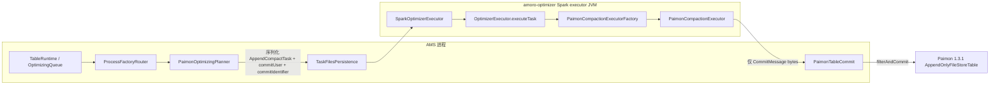

# Paimon BUCKET_UNAWARE 规划 / 执行职责隔离规格说明

> **给 Claude / Codex 的执行约束：** 实施本计划时必须使用 `superpowers:executing-plans`，并按任务逐项执行。
> **强制门禁：** 每个实现任务完成后，必须先做代码审查，再进入下一个任务。审查必须检查范围漂移、Paimon 1.3.1 源码一致性、AMS/optimizer 职责隔离，以及多湖回归风险。

**目标：** 固定基于 Apache Paimon `1.3.1`，把 Paimon `BUCKET_UNAWARE` 小文件优化拆成 AMS 规划/提交与 optimizer Spark 执行两个职责域。AMS 负责发现候选文件、生成 `AppendCompactTask`、持久化任务、收集成功结果并执行 Paimon commit；optimizer 不再规划、不提交，只在 Spark executor 侧执行已经下发的 Paimon merge task 并返回 `CommitMessage`。

**架构：** 保持 Amoro 已有 `ProcessFactory -> Planner -> TaskDescriptor -> OptimizerExecutor -> Committer` 框架。Paimon 专属 planner/executor/committer 继续复用现有类族，optimizer-common/Spark 只承担通用分发和执行入口；Paimon 具体执行器可继续放在 `amoro-format-paimon`，通过 `TaskProperties.TASK_EXECUTOR_FACTORY_IMPL` 在 Spark executor JVM 反射加载，避免把 Paimon 依赖硬塞进通用抽象。

**技术栈：** Java 11, Maven, JUnit 5, Amoro `paimon.version=1.3.1`, Paimon source tag `release-1.3.1`.

---

## 0. 当前已核实事实

### 0.1 Amoro 代码检出状态

- 当前工作目录：`/Users/SL/.codex/worktrees/31ee/amoro`
- 当前 HEAD：`dd191fefb`
- 当前分支状态：detached HEAD，但 commit 同时标在 `glacio/dev-paimon-compact` / `dev-paimon-compact`
- 当前 Amoro `pom.xml` 已固定 `<paimon.version>1.3.1</paimon.version>`

### 0.2 Paimon 源码基线

- 用户提供的 `/Users/conradjam/javaProject/paimon/.../CompactProcedure.java` 在本机不可访问。
- 可用源码为 `/Users/SL/javaProject/paimon`，但当前 checkout 不是纯 `1.3.1`，因此版本敏感结论必须以 `git show release-1.3.1:<path>` 为准。
- `release-1.3.1:pom.xml` 确认版本为 `1.3.1`。

### 0.3 范围边界

本规格说明只覆盖：

- `AppendOnlyFileStoreTable`
- `BucketMode.BUCKET_UNAWARE`
- `OrderType.NONE`
- 非 `clusterIncrementalEnabled`
- 非 `dataEvolution`
- 默认先以小文件 MINOR 场景作为必须验收路径；当前代码若继续支持 MAJOR/FULL，则隔离边界同样适用于这些 `AppendCompactTask`，但不得把 aware-bucket、primary-key、sort compact、cluster incremental 混进本目标。

明确不做：

- 不实现 Paimon `sortCompactUnAwareBucketTable`
- 不实现 `clusterIncrementalUnAwareBucketTable`
- 不实现 `compactAwareBucketTable`
- 不改变 Iceberg/Mixed 已有优化语义
- 不引入新依赖
- 不让 optimizer 直接 commit Paimon snapshot

### 0.4 源码锚点

| 区域 | 源码锚点 | 已核实结论 |
|---|---|---|
| Paimon 分流 | `/Users/SL/javaProject/paimon/paimon-spark/paimon-spark-common/src/main/java/org/apache/paimon/spark/procedure/CompactProcedure.java`，`release-1.3.1` 标签，279-297 行 | `OrderType.NONE + BUCKET_UNAWARE + !clusterIncrementalEnabled` 会进入 `compactUnAwareBucketTable`。 |
| Paimon unaware 规划/执行/提交 | 同一文件，`release-1.3.1` 标签，399-490 行 | 原生路径使用 `AppendCompactCoordinator` 规划，Spark RDD 执行 `AppendCompactTask#doCompact`，并在 driver 侧提交。 |
| Paimon row tracking 对齐 | 同一文件，`release-1.3.1` 标签，451-459 行 | 开启 row tracking 时，原生 executor 会设置 `SpecialFields.rowTypeWithRowTracking(table.rowType())`。 |
| Paimon stream builder 风险 | `/Users/SL/javaProject/paimon/paimon-core/src/main/java/org/apache/paimon/table/sink/StreamWriteBuilderImpl.java`，`release-1.3.1` 标签，74-76 行 | `newCommit()` 委托到 `table.newCommit(commitUser).ignoreEmptyCommit(false)`。 |
| Paimon 重试 API | `/Users/SL/javaProject/paimon/paimon-core/src/main/java/org/apache/paimon/table/sink/StreamTableCommit.java`，`release-1.3.1` 标签，52-76 行 | `filterAndCommit` 是可过滤已提交 identifier 的重试安全 API。 |
| Factory 安装配置 | `dist/src/main/amoro-bin/conf/plugins/process-factories.yaml`，18-31 行 | 默认配置当前列出 `paimon-maintain` 和 `iceberg`，没有列出 `paimon`。 |
| Paimon factory 开关/路由 | `amoro-format-paimon/src/main/java/org/apache/amoro/formats/paimon/process/PaimonProcessFactory.java`，69-100 行 | `name()` 为 `paimon`；只有 `paimon-optimizer.enabled=true` 时，`supportedFormats()` 才返回 `PAIMON`。 |
| Commit 身份漂移 | 同一文件，126-190 行 | planner 注释说 `processId` 是 commit identifier，但 committer 实际传入的是 `targetSnapshotId`。 |
| Optimizer 只执行 | `amoro-format-paimon/src/main/java/org/apache/amoro/formats/paimon/optimizing/PaimonCompactionExecutor.java`，57-132 行 | executor 当前反序列化一个已规划的 `AppendCompactTask`，执行 `doCompact`，并返回序列化的 `CommitMessage`。 |
| 当前 commit 入口 | `amoro-format-paimon/src/main/java/org/apache/amoro/formats/paimon/optimizing/commit/PaimonTableCommit.java`，86-130 行 | 当前 committer 收集 task 输出后，通过 `newStreamWriteBuilder().newCommit()` 进入 Paimon。 |

---

## 1. Paimon 1.3.1 原生流程映射

### 1.1 `CompactProcedure#execute`

Paimon 1.3.1 在 `CompactProcedure#execute(...)` 中的关键分支：

- `OrderType.NONE`
- `bucketMode == BUCKET_UNAWARE`
- `clusterIncrementalEnabled == false`
- 调用 `compactUnAwareBucketTable(table, partitionPredicate, partitionIdleTime, javaSparkContext)`

### 1.2 `compactUnAwareBucketTable` 三段式

Paimon 原生实现可以拆成三段：

| 阶段 | Paimon 1.3.1 源码行为 | Amoro 目标归属 |
|---|---|---|
| Plan | `new AppendCompactCoordinator(table, false, partitionPredicate).run()` 生成 `List<AppendCompactTask>` | AMS |
| Execute | Spark RDD executor 端反序列化 `AppendCompactTask`，执行 `task.doCompact(table, write)`，返回序列化 `CommitMessage` | optimizer Spark executor |
| Commit | driver 端收集 `CommitMessage`，`table.newCommit(commitUser).commit(messages)` | AMS，但必须使用重试安全的 `filterAndCommit` |

Paimon execute 段还有一个实现细节必须对齐：如果 `table.coreOptions().rowTrackingEnabled()`，原生 Spark procedure 会调用：

```java
write.withWriteType(SpecialFields.rowTypeWithRowTracking(table.rowType()));
```

当前 Amoro `PaimonCompactionExecutor` 只创建 `table.store().newWrite(commitUser)`，尚未补齐 row tracking 分支。这是 P1 兼容风险。

---

## 2. 当前 Amoro 职责映射

### 2.1 AMS 规划路径已经存在

`amoro-format-paimon` 现有路径已经基本符合“AMS 规划”：

- `PaimonProcessFactory#createPlanner(...)` 生成 `PaimonOptimizingPlanner`
- `PaimonOptimizingPlanner#plan()`：
  - 扫描 `BUCKET_UNAWARE` append-only table
  - 通过 `PaimonAppendFileScanner` / `PaimonPartitionEvaluator` / `PaimonAppendTaskPacker` 生成 `AppendCompactTask`
  - 用 `AppendCompactTaskSerializer` 序列化 task
  - 生成 `commitUser`
  - 创建 `PaimonCompactionInput`
  - 设置 `TaskProperties.TASK_EXECUTOR_FACTORY_IMPL = PaimonCompactionExecutorFactory`

### 2.2 optimizer Spark 执行路径已经存在

当前 Spark optimizer 实际执行路径：

```text
SparkOptimizerExecutor#executeTask
  -> JavaSparkContext.parallelize(task, 1).map(SparkOptimizingTaskFunction).collect()
  -> SparkOptimizingTaskFunction#call
  -> OptimizerExecutor.executeTask(...)
  -> deserialize PaimonCompactionInput
  -> reflective load PaimonCompactionExecutorFactory
  -> PaimonCompactionExecutor#execute()
  -> serialize PaimonCompactionOutput
```

这条路径中 optimizer-common/Spark 没有规划逻辑，也没有 Paimon commit 逻辑。需要补强的是“真实 Spark executor JVM 能加载依赖”的验证，而不仅是无 SparkContext 的模拟测试。

### 2.3 AMS commit 路径存在两个阻断风险

当前 `PaimonProcessFactory#createCommitter(...)` 与 `PaimonTableCommit` 存在两个必须修正的风险：

1. `createCommitter(...)` 注释说 `processId` 是 Paimon commit identifier，但实际传给 `PaimonTableCommit` 的是 `targetSnapshotId`。这会混淆“计划 attempt ID”和“扫描基准 snapshot ID”。
2. `PaimonTableCommit` 使用 `table.newStreamWriteBuilder().withCommitUser(commitUser).newCommit()`，而 Paimon 1.3.1 `StreamWriteBuilderImpl#newCommit()` 会调用 `table.newCommit(commitUser).ignoreEmptyCommit(false)`。历史验证表明这可能产生空 APPEND snapshot。AMS async/retry 场景应使用 `table.newCommit(commitUser)` 直接拿 `StreamTableCommit` 并调用 `filterAndCommit(...)`。

---

## 3. 目标架构



### 3.1 职责契约

| 职责 | 归属方 | 禁止发生 |
|---|---|---|
| 扫描 manifest / 选择候选文件 | AMS planner | optimizer 不得重新扫描并创建新任务 |
| 选择优化类型 / 配额 / 分区分组 | AMS planner | optimizer 不得改变任务范围 |
| 创建 `commitUser` 和 `commitIdentifier` | AMS planner | executor 不得生成 commit 身份 |
| 执行 `AppendCompactTask#doCompact` | optimizer Spark executor | AMS commit 不得自己重写文件 |
| 提交 Paimon snapshot | AMS committer | optimizer 绝不能调用 `commit`、`filterAndCommit` 或 `BatchTableCommit` |
| 重试/幂等过滤 | AMS committer + Paimon `filterAndCommit` | replay 场景不接受直接使用 `StreamTableCommit.commit` |

### 3.2 类放置决策

除非打包测试证明当前 Spark executor JVM 类路径无法加载 `amoro-format-paimon`，否则不要把 `PaimonCompactionExecutor` 移入 `amoro-optimizer-common`。

原因：

- `amoro-optimizer-common` 已经提供通用反射执行入口。
- `amoro-optimizer-common/pom.xml` 依赖 `amoro-format-paimon`，Spark optimizer 又依赖 common。
- 将 Paimon 专属代码保留在 `amoro-format-paimon` 能维持多湖边界，避免把 optimizer-common 变成格式专属模块。
- 用户意图“优化合并文件职责放在 amoro-optimizer-common 的 Spark 里面”应按运行时职责理解：Spark executor 通过 common dispatch path 只执行 merge 工作。字面上的类迁移是 fallback，不是默认方案。

---

## 4. 已发现漏洞和必需修复

| ID | 风险 | 严重级别 | 必需缓解措施 |
|---|---:|---|---|
| L1 | 默认 `process-factories.yaml` 安装了 `paimon-maintain` 和 `iceberg`，但没有安装 `paimon`；`PaimonProcessFactory` 虽可通过 SPI 发现，却可能永远不会被安装。 | P0 | 新增/核实 `name: paimon` 的 YAML 条目，默认 `paimon-optimizer.enabled: false` 或显式 disabled config；增加 router 测试证明 enabled config 支持 `PAIMON`，disabled config 不调度 Paimon optimizing。 |
| L2 | `processId` 注释和 `targetSnapshotId` 实现对 commit identifier 的定义不一致。 | P0 | 在 `PaimonCompactionInput` 中显式增加 `commitIdentifier`，从 `processId` 或专用单调 plan identifier 设置，并随每个 task 持久化；让 `createCommitter()` 校验所有成功 task 的 `commitUser + commitIdentifier` 一致。`targetSnapshotId` 只保留为漂移/并发证据。 |
| L3 | 当前 committer 通过 `newStreamWriteBuilder().newCommit()` 进入 Paimon，该路径会设置 `ignoreEmptyCommit(false)`。 | P0 | 切换为 `table.newCommit(commitUser)`，并保留 `filterAndCommit(Collections.singletonMap(commitIdentifier, messages))`；增加回归测试断言一次纯 compact commit 只创建一个 `COMPACT` snapshot，不创建空 `APPEND` snapshot。 |
| L4 | 目前没有显式证明 executor 在 AMS commit 前不会创建 snapshot。 | P0 | 增加测试：`PaimonCompactionExecutor#execute()` 后 latest snapshot id/kind 不变；AMS `PaimonTableCommit#commit()` 后 snapshot 才推进。 |
| L5 | plan 之后发生并发 append 或并发 compact 时，可能提交过期文件。 | P0 | 增加并发测试：plan -> append new snapshot -> commit compact 必须安全并保留新增数据；plan -> 另一次 compact 删除 planned files -> commit 必须失败并触发 replan，不得创建损坏 snapshot。 |
| L6 | 真实 Spark executor 类路径尚未被证明；当前 `TestPaimonExecutorSparkDispatch` 只是无 Spark 的模拟。 | P1 | 增加最小 local Spark 集成测试或手工验收脚本，证明 executor JVM 能加载 `amoro-format-paimon`、Paimon 1.3.1 bundle、catalog/fs 依赖，并在失败时返回 `OptimizingTaskResult.errorMessage`。 |
| L7 | Amoro executor 缺少 Paimon 原生 procedure 中的 row tracking 分支。 | P1 | 如果 Paimon 1.3.1 测试夹具能创建该类表，则增加 row-tracking 对齐测试；否则增加保护代码并记录测试限制。 |
| L8 | `AppendCompactTaskSerializer` / `CommitMessageSerializer` 属于与版本绑定的 Paimon internal API。 | P1 | 支持声明固定为 Paimon 1.3.1；serializer 不匹配时 fail fast；任何 Paimon 升级前必须跑完整 planner/executor/commit 矩阵。 |
| L9 | recovery 测试目前偏模拟，不是包含 Derby 和持久化状态时序的完整 AMS 启动恢复。 | P1 | 增加 DefaultOptimizingService/Derby 层恢复验收：task succeeded，最终状态持久化前 crash，restart 后 replay 相同 `commitUser + commitIdentifier`，不产生第二个 snapshot。 |
| L10 | 如果只关注最小 small-file 测试夹具，容易破坏 DV/high-delete/FULL/multi-partition 场景。 | P1 | 扩展矩阵到 DV atomic group、high delete ratio、FULL rewrite-all problem partition、multi-partition quota，以及非 `BUCKET_UNAWARE` skip。 |
| L11 | shared AMS/optimizer-common 改动可能回归 Iceberg/Mixed 路由。 | P1 | 保持 `TaskDescriptorTypeConverter`、`TaskFilesPersistence`、`MetricsSummary` 和 `OptimizingQueue` 的通用性；shared edit 后运行 Iceberg/Mixed 回归测试。 |
| L12 | 范围漂移到 `clusterIncrementalEnabled` / `dataEvolution`。 | P2 | 代码审查清单必须拒绝本次工作中为这些路径新增开关、状态、测试或文档。 |

---

## 5. 实施计划

### 任务 1 - 安装并安全路由 Paimon optimizing factory

**目标：** 确保显式启用后 AMS 能把 `TableFormat.PAIMON` 路由到 `PaimonProcessFactory`，同时默认部署保持安全。

**文件：**

- `dist/src/main/amoro-bin/conf/plugins/process-factories.yaml`
- `amoro-ams/src/test/java/org/apache/amoro/server/process/paimon/TestPaimonPluginLoading.java`
- `amoro-ams/src/test/java/org/apache/amoro/server/process/TestProcessFactoryRouter.java`
- 必要时修改 `amoro-format-paimon/src/test/java/org/apache/amoro/formats/paimon/process/TestPaimonProcessFactory.java`

**步骤：**

1. 增加一个先失败的测试：加载已配置的 process factories，并证明 router 要支持 Paimon 必须存在 `paimon` 条目。
2. 在默认配置中增加 `name: paimon`；只有当 `paimon-optimizer.enabled: false` 能让 `supportedFormats()` 保持为空时，才允许 `enabled: true`。否则应将 plugin 设为 disabled，并记录手工启用路径。更安全的默认值是：

   ```yaml
   - name: paimon
     enabled: true
     priority: 100
     properties:
       paimon-optimizer.enabled: false
   ```

3. 增加测试证明：
   - YAML-installed + `paimon-optimizer.enabled=false` 不声明支持 `PAIMON`。
   - 显式 enabled config 声明支持 `PAIMON`。
   - Iceberg route 保持不变。

**代码审查门禁：** 确认默认部署不会意外启用 Paimon 优化调度。

### 任务 2 - 显式持久化 commit 身份

**目标：** 将 `commitIdentifier` 与 `targetSnapshotId` 明确分离。

**文件：**

- `amoro-format-paimon/src/main/java/org/apache/amoro/formats/paimon/optimizing/PaimonCompactionInput.java`
- `amoro-format-paimon/src/main/java/org/apache/amoro/formats/paimon/optimizing/plan/PaimonOptimizingPlanner.java`
- `amoro-format-paimon/src/main/java/org/apache/amoro/formats/paimon/process/PaimonProcessFactory.java`
- `amoro-ams/src/test/java/org/apache/amoro/server/persistence/TestTaskFilesPersistenceMultiFormat.java`
- planner/process factory 相关测试

**步骤：**

1. 在 `PaimonCompactionInput` 中增加 `private long commitIdentifier;`。
2. 在 `PaimonOptimizingPlanner` 中设置 `commitIdentifier = processId`，除非已有更合适的单调 process identifier。
3. `targetSnapshotId` 只作为扫描基准 / 漂移元数据保留。
4. 在 `PaimonProcessFactory#createCommitter` 中从成功 task input 提取 `commitUser` 和 `commitIdentifier`；以下情况必须 fail fast：
   - 没有成功 task 携带这些字段，
   - 成功 task 的 `commitUser` 不一致，
   - 成功 task 的 `commitIdentifier` 不一致。
5. 更新序列化测试，覆盖 `commitIdentifier`。
6. 更新仍提到 `TableProcessStore.properties` 的过期 Javadocs；当前持久化路径是 task input bytes。

**代码审查门禁：** 确认没有代码路径继续把 `targetSnapshotId` 描述为 Paimon commit identifier。

### 任务 3 - 修复 AMS 侧 Paimon commit API

**目标：** 使用 Paimon 1.3.1 重试安全的 commit 入口，并避免空 APPEND snapshot。

**文件：**

- `amoro-format-paimon/src/main/java/org/apache/amoro/formats/paimon/optimizing/commit/PaimonTableCommit.java`
- `amoro-format-paimon/src/test/java/org/apache/amoro/formats/paimon/optimizing/commit/TestPaimonTableCommit.java`

**步骤：**

1. 增加/保留一个当前实现会失败的回归测试：
   - plan 并执行 compact，
   - 通过 `PaimonTableCommit` commit，
   - 断言只新增一个 snapshot，
   - 断言 latest snapshot kind 是 `COMPACT`，
   - 断言没有创建额外的 `APPEND` snapshot。
2. 将 stream builder 入口替换为：

   ```java
   try (StreamTableCommit commit = table.newCommit(commitUser)) {
     commit.filterAndCommit(Collections.singletonMap(commitIdentifier, messages));
   }
   ```

3. 增加一条窄范围行内注释，说明为什么在这个 async/retry committer 中故意避开 `newStreamWriteBuilder().newCommit()`。
4. 增加 replay 测试：
   - 同一组 `commitUser + commitIdentifier` 执行两次，
   - 第二次 replay 不创建 snapshot，
   - rows 保持一致。

**代码审查门禁：** 确认这仍然只发生在 AMS commit；executor 不得 import `StreamTableCommit` 或 commit classes。

### 任务 4 - 证明 optimizer 只执行 merge 工作

**目标：** 锁定 optimizer 边界：不规划、不提交 snapshot。

**文件：**

- `amoro-format-paimon/src/test/java/org/apache/amoro/formats/paimon/optimizing/TestPaimonCompactionExecutor.java`
- `amoro-optimizer/amoro-optimizer-common/src/test/java/org/apache/amoro/optimizer/common/TestPaimonExecutorIntegration.java`
- `amoro-optimizer/amoro-optimizer-common/src/test/java/org/apache/amoro/optimizer/common/TestPaimonExecutorSparkDispatch.java`

**步骤：**

1. 增加 executor isolation 测试：
   - 创建带 small files 的表，
   - 使用 AMS planner 创建 `PaimonCompactionTask`，
   - execute 前记录 latest snapshot，
   - 执行 `PaimonCompactionExecutor`，
   - 断言 latest snapshot 不变，
   - 断言 output 包含非空 `CommitMessage` bytes，
   - 通过 `PaimonTableCommit` commit，
   - 断言 snapshot 只在此之后推进。
2. 通过 `OptimizerExecutor.executeTask(...)` 增加失败路径测试，证明无效 Paimon input 返回 `OptimizingTaskResult.errorMessage`，而不是杀死 executor JVM。
3. 保持 `PaimonCompactionExecutor` 不包含 scan/planner/commit 逻辑。

**代码审查门禁：** 检查 optimizer 执行类的 imports 和 call graph，确认不包含 `AppendCompactCoordinator`、`PaimonAppendFileScanner`、`StreamTableCommit`、`BatchTableCommit` 或 `TableCommitImpl`。除了 `doCompact` 所需的 Paimon serialization/write APIs 外，不应出现这些类型。

### 任务 5 - 对齐 executor 与 Paimon 1.3.1 写入语义

**目标：** 对齐原生 `compactUnAwareBucketTable` executor 行为。

**文件：**

- `amoro-format-paimon/src/main/java/org/apache/amoro/formats/paimon/optimizing/PaimonCompactionExecutor.java`
- `amoro-format-paimon/src/test/java/org/apache/amoro/formats/paimon/optimizing/TestPaimonCompactionExecutor.java`

**步骤：**

1. 如果 Paimon 1.3.1 测试夹具支持在 append-only table 上启用 row tracking，则增加 row tracking 测试。
2. 更新 executor：

   ```java
   CoreOptions coreOptions = table.coreOptions();
   if (coreOptions.rowTrackingEnabled()) {
     write.withWriteType(SpecialFields.rowTypeWithRowTracking(table.rowType()));
   }
   ```

3. 保留当前 serializer failure handling，但确保 mismatch/errors 能 fail-fast 且可诊断。
4. 校验 compact 前后的行内容，而不只校验文件数。

**代码审查门禁：** 确认没有引入自定义 compaction algorithm；executor 仍然委托 `AppendCompactTask#doCompact`。

### 任务 6 - 增加并发和 stale plan 保护

**目标：** 证明真实 table drift 下 AMS planning snapshot 与 Paimon commit 语义仍然安全。

**文件：**

- `amoro-format-paimon/src/test/java/org/apache/amoro/formats/paimon/optimizing/commit/TestPaimonTableCommit.java`
- `amoro-ams/src/test/java/org/apache/amoro/server/optimizing/TestPaimonOptimizingE2E.java`

**场景：**

1. 在 snapshot N 规划，随后 append 新数据生成 snapshot N+1，再执行并提交旧 compact task：
   - commit 要么安全成功，要么以 AMS 可 replan 的 conflict 失败，
   - final table 同时包含原始 rows 和 appended rows，
   - 不发生重复删除。
2. 在 snapshot N 规划，随后另一次 compaction 删除一个 planned `compactBefore` 文件，再提交旧 compact：
   - commit 失败，
   - failure 被包装为 `OptimizingCommitException`，
   - process 可以被标记 failed 并重新规划。
3. crash 后 replay 相同的成功 task：
   - 相同 `commitUser + commitIdentifier` 不创建重复 snapshot。

**代码审查门禁：** 确认 failure 不会被吞掉并当作 success，partial snapshot 也不会被视为 completed optimization。

### 任务 7 - 证明真实 Spark executor 兼容性

**目标：** 用一个真实 executor 类路径证明替代“仅模拟 Spark dispatch”。

**文件：**

- 如果 Spark test dependencies 已经可用，优先在 `amoro-optimizer/amoro-optimizer-spark/src/test/...` 下增加测试。
- 如果模块测试依赖过重，则在 `docs/plans` 或 `dev/` 下增加有文档说明的手工脚本，并标记为发布阻断级手工验收。

**步骤：**

1. 以 local mode 启动本地 Spark context。
2. 提交一个携带有效 `PaimonCompactionInput` 的 `OptimizingTask`。
3. 确认 `SparkOptimizingTaskFunction` 在 executor 侧经过 `OptimizerExecutor.executeTask(...)`。
4. 断言：
   - `PaimonCompactionExecutorFactory` 能通过反射加载，
   - Paimon catalog/table/fs 依赖可见，
   - 成功 task 返回 output bytes，
   - 故意构造的 invalid input 返回 `OptimizingTaskResult.errorMessage`。

**代码审查门禁：** 确认该测试不需要外部集群凭证或生产 warehouse path。

### 任务 8 - 扩展数据形态矩阵

**目标：** 防止只覆盖 small-file 的测试夹具掩盖非法 `AppendCompactTask` 分组。

**文件：**

- `amoro-format-paimon/src/test/java/org/apache/amoro/formats/paimon/optimizing/plan/TestPaimonAppendTaskPacker.java`
- `amoro-format-paimon/src/test/java/org/apache/amoro/formats/paimon/optimizing/plan/TestPaimonPartitionEvaluator.java`
- `amoro-format-paimon/src/test/java/org/apache/amoro/formats/paimon/optimizing/plan/TestPaimonOptimizingPlanner.java`

**必需矩阵：**

- small-file MINOR compaction 保留行内容
- deletion-vector atomic group 不被拆分
- high delete ratio 生成合法 task，并保留行内容
- FULL rewrite-all 只重写问题 partition，而不是所有 partition
- multi-partition quota 不把 partition metadata 混入错误 task
- 非 `BUCKET_UNAWARE` table 被跳过
- primary-key table 被跳过

**代码审查门禁：** 确认没有引入 `clusterIncrementalEnabled` 或 `dataEvolution` 支持。

### 任务 9 - 增加 AMS 恢复验收

**目标：** 证明 persisted task input/output 与 retry commit 组合下的恢复行为。

**文件：**

- `amoro-ams/src/test/java/org/apache/amoro/server/optimizing/TestPaimonOptimizingE2E.java`
- 必要时修改 `amoro-ams/src/test/java/org/apache/amoro/server/TestDefaultOptimizingService.java`
- 现有 `TaskFilesPersistence` 和 converter tests

**步骤：**

1. 通过 `TaskFilesPersistence` 持久化 Paimon task inputs。
2. 模拟 task success output 已持久化，但 process status 尚未 finalized。
3. 像 AMS restart 一样重建 process/runtime。
4. 使用相同 task outputs 和相同 `commitUser + commitIdentifier` 重新执行 commit。
5. 断言：
   - 不产生重复 snapshot，
   - process 可以成功 close，
   - rows 保持一致。

**代码审查门禁：** 如果当前 AMS 是通过 persisted task runtimes 重建，确认 recovery 不把调用 `PaimonProcessFactory#recover()` 作为隐藏前提。

### 任务 10 - Shared path 回归

**目标：** 在任何 shared AMS 或 optimizer-common edit 后保护 Iceberg/Mixed 行为。

**文件/测试：**

- `amoro-ams/src/test/java/org/apache/amoro/server/optimizing/TestOptimizingQueueMultiFormat.java`
- `amoro-ams/src/test/java/org/apache/amoro/server/persistence/TestTaskFilesPersistenceMultiFormat.java`
- `amoro-ams/src/test/java/org/apache/amoro/server/persistence/converter/TestTaskDescriptorTypeConverter.java`
- diff 触及的 Iceberg-specific queue/process tests

**代码审查门禁：** shared type 不能引用 Paimon-specific classes，除非位于 test fixtures 或显式 multi-format converter 分支。

---

## 6. 验证命令

每个任务后运行聚焦测试，完成前再运行更广的矩阵。

```bash
./mvnw -pl amoro-format-paimon -Dtest=TestPaimonProcessFactory test
./mvnw -pl amoro-format-paimon -Dtest=TestPaimonTableCommit test
./mvnw -pl amoro-format-paimon -Dtest=TestPaimonCompactionExecutor test
./mvnw -pl amoro-format-paimon -Dtest='TestPaimonOptimizingPlanner,TestPaimonAppendFileScanner,TestPaimonAppendTaskPacker,TestPaimonPartitionEvaluator,TestPaimonCompactionInputSerialization' test
./mvnw -pl amoro-optimizer/amoro-optimizer-common -Dtest='TestPaimonExecutorIntegration,TestPaimonExecutorSparkDispatch' test
./mvnw -pl amoro-ams -am -Dtest='TestPaimonOptimizingE2E,TestOptimizingQueueMultiFormat,TestTaskFilesPersistenceMultiFormat,TestTaskDescriptorTypeConverter,TestProcessFactoryRouter' test
./mvnw validate -pl amoro-format-paimon,amoro-optimizer/amoro-optimizer-common,amoro-ams -am
git diff --check
```

如果任务 7 在 `amoro-optimizer-spark` 下新增真实 Spark 集成测试，则加入：

```bash
./mvnw -pl amoro-optimizer/amoro-optimizer-spark -am -Dtest='TestPaimonSparkOptimizerExecutor*' test
```

---

## 7. 每个任务的代码审查清单

每个任务都必须先完成代码审查，再进入下一个任务：

- diff 是否保持在任务文件和既定范围内？
- 与 Paimon 版本绑定的行为是否已经对照 `release-1.3.1` 核实？
- AMS 是否仍然拥有规划和 commit？
- optimizer/Spark 是否仍然只执行 `AppendCompactTask#doCompact` 并返回 output？
- 任务是否增加了没有该改动就会失败的回归测试？
- Iceberg/Mixed shared abstractions 是否仍然保持通用？
- 本实现是否仍未引入 `clusterIncrementalEnabled` 和 `dataEvolution`？
- serializer errors、stale plan conflicts 和 retry paths 是否 fail-fast 且可诊断？
- verification commands 是否实际运行；失败项是否已经修复或明确界定为无关？

---

## 8. 信心循环

### 循环 1 - 初始计划信心

初始信心不是 100%。

发现的主要缺口：

- Paimon optimizing factory 可能可通过 SPI 发现，但没有从默认 plugin config 安装。
- `commitIdentifier` 身份当前与 `targetSnapshotId` 混淆。
- commit 入口仍可能因 stream builder 路径产生空 APPEND snapshot。
- 真实 Spark executor 的依赖可见性尚未被证明。
- Executor 缺少与 Paimon row-tracking 分支的对齐。
- 并发和 stale plan 场景还没有显式测试。

### 循环 2 - 规格修复

本规格说明把每个缺口都转成阻断任务和审查门禁：

- L1 -> 任务 1
- L2 -> 任务 2
- L3 -> 任务 3
- L4 -> 任务 4
- L5 -> 任务 6
- L6 -> 任务 7
- L7/L8 -> 任务 5
- L9 -> 任务 9
- L10/L11/L12 -> 任务 8/10 和审查清单

### 循环 3 - 当前信心声明

基于上述缓解措施，该计划策略在范围控制上达到事实层面的 100% 信心条件：每个当前已知、可能导致目标职责严重偏离的 P0/P1 漏洞，都已经映射到阻断任务、必需回归测试和任务后代码审查门禁。

这不是在声称未来代码已经正确。由于本次只是规格说明任务，尚未实施或测试代码修改，所以代码正确性仍取决于下面的执行清单。

实现完成的事实信心条件是：

1. 所有 P0 任务通过各自的聚焦测试。
2. `PaimonTableCommit` 证明重试安全的 compact commit 不会产生空 APPEND snapshot。
3. executor isolation 测试证明 AMS commit 前不会创建 snapshot。
4. 真实 Spark executor 测试或有文档记录的手工验收证明 executor JVM 类路径。
5. recovery 和 concurrency 测试证明 replay/stale plan 行为。
6. shared Iceberg/Mixed 回归测试通过。
7. 每个任务都有任务后代码审查，且没有未解决的 P0/P1 问题。

只有这七个条件全部满足后，才能称实现已经事实完成。
