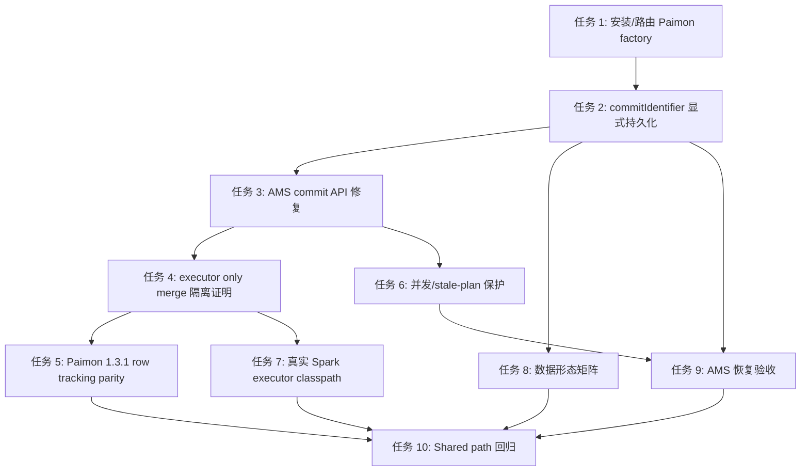

# Paimon BUCKET_UNAWARE 规划 / 执行职责隔离实施计划

> **给执行 Agent 的约束：** 实施本计划时必须使用 `superpowers:subagent-driven-development`（推荐）或 `superpowers:executing-plans`，并按任务逐项执行。步骤使用 checkbox（`- [ ]`）语法跟踪。
> **审查规则：** 每个 任务 完成后必须先做 Code Review，再进入下一个 Task。Review 重点固定为：Paimon 1.3.1 源码一致性、AMS/optimizer 职责隔离、Iceberg/Mixed 多湖回归风险、测试是否先失败再通过。

**目标：** 基于中文规格说明，把 Paimon `BUCKET_UNAWARE` 小文件优化实现拆成可执行 Task：AMS 只负责规划和提交，optimizer Spark executor 只执行已经规划好的 `AppendCompactTask#doCompact` 并返回 `CommitMessage`。

**架构：** 保持 `ProcessFactory -> Planner -> TaskDescriptor -> OptimizerExecutor -> Committer` 现有框架，不引入新依赖，不把 Paimon 专属实现搬进通用 optimizer-common，除非真实 Spark executor classpath 证明现有方式不可用。先修 P0 阻塞项，再补 P1 兼容性、并发、恢复、真实 Spark 和数据形态矩阵，最后跑 shared-path 回归。

**技术栈：** Java 11, Maven, JUnit 5, Apache Paimon `1.3.1`, Paimon source tag `release-1.3.1`, Amoro branch baseline `dev-paimon-compact@dd191fefb`.

---

## 0. 审查上下文

本计划是中文规格说明的可执行任务规划稿，供审查后再执行代码修改。

来源文件：

- 中文规格说明：`docs/plans/2026-05-13-paimon-bucket-unaware-plan-execute-isolation-spec.md`

基线确认：

- 当前 `HEAD = dd191fefb`
- `dev-paimon-compact == dd191fefb`
- `remotes/glacio/dev-paimon-compact == dd191fefb`
- 当前 worktree 是 detached HEAD，但等价于直接在 `dev-paimon-compact` tip 上新增计划文档。

固定边界：

- 只覆盖 `AppendOnlyFileStoreTable`
- 只覆盖 `BucketMode.BUCKET_UNAWARE`
- 只覆盖 `OrderType.NONE`
- 不关注 `clusterIncrementalEnabled`
- 不关注 `dataEvolution`
- 不实现 aware-bucket / sort compact / primary-key compact
- 不允许 optimizer 侧 commit Paimon snapshot

---

## 1. 文件结构

### 1.1 生产代码文件

| 文件 | 责任 |
|---|---|
| `dist/src/main/amoro-bin/conf/plugins/process-factories.yaml` | 安装 `paimon` process factory，但保持 `paimon-optimizer.enabled=false` 默认灰度关闭。 |
| `amoro-format-paimon/src/main/java/org/apache/amoro/formats/paimon/optimizing/PaimonCompactionInput.java` | 新增持久化 `commitIdentifier`，把 `targetSnapshotId` 降级为扫描基准/漂移信息。 |
| `amoro-format-paimon/src/main/java/org/apache/amoro/formats/paimon/optimizing/plan/PaimonOptimizingPlanner.java` | 规划时把 `processId` 写入 `PaimonCompactionInput.commitIdentifier`。 |
| `amoro-format-paimon/src/main/java/org/apache/amoro/formats/paimon/process/PaimonProcessFactory.java` | `createCommitter()` 从成功任务中读取并校验一致的 `commitUser + commitIdentifier`。 |
| `amoro-format-paimon/src/main/java/org/apache/amoro/formats/paimon/optimizing/commit/PaimonTableCommit.java` | AMS 侧通过 `table.newCommit(commitUser)` + `filterAndCommit(...)` 提交，避免 stream builder 的 empty APPEND 风险。 |
| `amoro-format-paimon/src/main/java/org/apache/amoro/formats/paimon/optimizing/PaimonCompactionExecutor.java` | optimizer 侧只执行 `AppendCompactTask#doCompact`；补齐 Paimon 1.3.1 row tracking 写入分支。 |

### 1.2 测试文件

| 文件 | 责任 |
|---|---|
| `amoro-format-paimon/src/test/java/org/apache/amoro/formats/paimon/process/TestPaimonProcessFactory.java` | 工厂开关、`commitIdentifier` 来源、一致性校验。 |
| `amoro-ams/src/test/java/org/apache/amoro/server/process/paimon/TestPaimonPluginLoading.java` | `paimon` 和 `paimon-maintain` 两个 factory 名称与 SPI/YAML 安装契约。 |
| `amoro-ams/src/test/java/org/apache/amoro/server/process/TestProcessFactoryRouter.java` | `PAIMON` route 只在 enabled config 下可用。 |
| `amoro-format-paimon/src/test/java/org/apache/amoro/formats/paimon/optimizing/commit/TestPaimonTableCommit.java` | COMPACT snapshot、无 empty APPEND、replay 幂等、并发/stale-plan commit。 |
| `amoro-format-paimon/src/test/java/org/apache/amoro/formats/paimon/optimizing/TestPaimonCompactionExecutor.java` | executor 不创建 snapshot、row tracking、输出 `CommitMessage`。 |
| `amoro-format-paimon/src/test/java/org/apache/amoro/formats/paimon/optimizing/TestPaimonCompactionInputSerialization.java` | `commitIdentifier` 序列化兼容。 |
| `amoro-optimizer/amoro-optimizer-common/src/test/java/org/apache/amoro/optimizer/common/TestPaimonExecutorIntegration.java` | `OptimizerExecutor.executeTask(...)` 反射加载和错误回传。 |
| `amoro-optimizer/amoro-optimizer-common/src/test/java/org/apache/amoro/optimizer/common/TestPaimonExecutorSparkDispatch.java` | 继续覆盖无 SparkContext 的 dispatch contract。 |
| `amoro-optimizer/amoro-optimizer-spark/src/test/java/org/apache/amoro/optimizer/spark/TestPaimonSparkOptimizerExecutor.java` | 新增真实 local Spark executor classpath 证明。 |
| `amoro-format-paimon/src/test/java/org/apache/amoro/formats/paimon/optimizing/plan/TestPaimonAppendTaskPacker.java` | DV atomic group、FULL/MAJOR/MINOR task 合法性矩阵。 |
| `amoro-format-paimon/src/test/java/org/apache/amoro/formats/paimon/optimizing/plan/TestPaimonPartitionEvaluator.java` | high delete ratio / FULL rewrite-all / small-file 分类。 |
| `amoro-format-paimon/src/test/java/org/apache/amoro/formats/paimon/optimizing/plan/TestPaimonOptimizingPlanner.java` | 非 `BUCKET_UNAWARE`、primary-key skip、multi-partition quota。 |
| `amoro-ams/src/test/java/org/apache/amoro/server/optimizing/TestPaimonOptimizingE2E.java` | AMS E2E、恢复、并发、shared-path guard。 |
| `amoro-ams/src/test/java/org/apache/amoro/server/optimizing/TestOptimizingQueueMultiFormat.java` | Iceberg + Paimon mixed metrics / queue 泛型边界。 |
| `amoro-ams/src/test/java/org/apache/amoro/server/persistence/TestTaskFilesPersistenceMultiFormat.java` | Paimon input 持久化和 Iceberg/Paimon 不串行。 |
| `amoro-ams/src/test/java/org/apache/amoro/server/persistence/converter/TestTaskDescriptorTypeConverter.java` | Paimon / Iceberg descriptor 恢复路由。 |

---

## 2. 任务依赖顺序



---

## 任务 1: 安装并安全路由 Paimon Optimizing Factory

**目的:** 让 AMS 在显式启用时能路由到 `PaimonProcessFactory`，但默认部署不自动调度 Paimon 优化。

**文件：**

- 修改： `dist/src/main/amoro-bin/conf/plugins/process-factories.yaml`
- 修改： `amoro-ams/src/test/java/org/apache/amoro/server/process/paimon/TestPaimonPluginLoading.java`
- 修改： `amoro-ams/src/test/java/org/apache/amoro/server/process/TestProcessFactoryRouter.java`
- Test: `amoro-format-paimon/src/test/java/org/apache/amoro/formats/paimon/process/TestPaimonProcessFactory.java`

- [ ] **Step 1: 写失败测试，证明默认 YAML 必须包含 `paimon` factory**

在 `TestPaimonPluginLoading` 增加测试方法，检查 `process-factories.yaml` 中存在 `paimon` 配置，且默认属性不声明支持 `PAIMON`：

```java
@Test
@DisplayName("process-factories.yaml installs paimon optimizer factory but keeps it disabled")
void yamlInstallsPaimonOptimizerFactoryDisabledByDefault() throws Exception {
  List<PluginConfiguration> configs = loadProcessFactoryConfigurationsForTest();
  PluginConfiguration paimon =
      configs.stream()
          .filter(c -> "paimon".equals(c.getName()))
          .findFirst()
          .orElseThrow(() -> new AssertionError("process-factories.yaml must contain name: paimon"));

  assertTrue(paimon.isEnabled(), "paimon plugin should be installed so the flag can control routing");
  assertEquals(
      "false",
      paimon.getProperties().get("paimon-optimizer.enabled"),
      "default config must not enable Paimon optimizing");
}

@SuppressWarnings("unchecked")
private static List<PluginConfiguration> loadProcessFactoryConfigurationsForTest()
    throws Exception {
  Path yamlPath = Paths.get("dist/src/main/amoro-bin/conf/plugins/process-factories.yaml");
  Map<String, Object> yamlObj = new Yaml().loadAs(Files.newInputStream(yamlPath), Map.class);
  JsonNode pluginList = JacksonUtil.fromObjects(yamlObj).get("process-factories");

  List<PluginConfiguration> configs = new ArrayList<>();
  for (int i = 0; i < pluginList.size(); i++) {
    configs.add(PluginConfiguration.fromJSONObject(pluginList.get(i)));
  }
  return configs;
}
```

测试代码必须复用 AMS 现有 YAML 解析栈：`org.yaml.snakeyaml.Yaml`、`JacksonUtil.fromObjects(...)`、`PluginConfiguration.fromJSONObject(...)`，不要新增 YAML/Jackson 依赖。

- [ ] **Step 2: 运行测试，确认当前失败**

Run:

```bash
./mvnw -pl amoro-ams -am -Dtest=TestPaimonPluginLoading#yamlInstallsPaimonOptimizerFactoryDisabledByDefault test
```

Expected: FAIL，错误中包含 `process-factories.yaml must contain name: paimon`。

- [ ] **Step 3: 修改 YAML，安装但默认关闭 Paimon optimizer**

在 `dist/src/main/amoro-bin/conf/plugins/process-factories.yaml` 中 `paimon-maintain` 后添加：

```yaml
  - name: paimon
    enabled: true
    priority: 100
    properties:
      paimon-optimizer.enabled: false
```

- [ ] **Step 4: 补路由测试，证明 enabled 才支持 `PAIMON`**

在 `TestProcessFactoryRouter` 或 `TestPaimonProcessFactory` 中覆盖：

```java
@Test
@DisplayName("PaimonProcessFactory claims PAIMON only when optimizer flag is enabled")
void paimonFactoryClaimsPaimonOnlyWhenEnabled() {
  PaimonProcessFactory disabled = new PaimonProcessFactory();
  disabled.open(Collections.singletonMap(PaimonProcessFactory.OPTIMIZER_ENABLED.key(), "false"));
  assertFalse(disabled.supportedFormats().contains(TableFormat.PAIMON));

  PaimonProcessFactory enabled = new PaimonProcessFactory();
  enabled.open(Collections.singletonMap(PaimonProcessFactory.OPTIMIZER_ENABLED.key(), "true"));
  assertTrue(enabled.supportedFormats().contains(TableFormat.PAIMON));
}
```

- [ ] **Step 5: 运行聚焦测试**

Run:

```bash
./mvnw -pl amoro-format-paimon -Dtest=TestPaimonProcessFactory test
./mvnw -pl amoro-ams -am -Dtest='TestPaimonPluginLoading,TestProcessFactoryRouter' test
```

Expected: PASS。

- [ ] **Step 6: Code Review gate**

Review 必须确认：

- 默认 `paimon-optimizer.enabled=false`
- `paimon-maintain` 未被替换或改名
- Iceberg route 未变
- 只修改配置与测试，不触碰 planner/executor/committer

---

## 任务 2: 显式持久化 `commitIdentifier`

**目的:** 不再把 `targetSnapshotId` 复用为 Paimon commit 幂等 ID；`commitIdentifier` 应来自 plan attempt，例如 `processId`，并随 task input 持久化。

**文件：**

- 修改： `amoro-format-paimon/src/main/java/org/apache/amoro/formats/paimon/optimizing/PaimonCompactionInput.java`
- 修改： `amoro-format-paimon/src/main/java/org/apache/amoro/formats/paimon/optimizing/plan/PaimonOptimizingPlanner.java`
- 修改： `amoro-format-paimon/src/main/java/org/apache/amoro/formats/paimon/process/PaimonProcessFactory.java`
- 修改： `amoro-format-paimon/src/test/java/org/apache/amoro/formats/paimon/optimizing/TestPaimonCompactionInputSerialization.java`
- 修改： `amoro-format-paimon/src/test/java/org/apache/amoro/formats/paimon/process/TestPaimonProcessFactory.java`
- 修改： `amoro-ams/src/test/java/org/apache/amoro/server/persistence/TestTaskFilesPersistenceMultiFormat.java`

- [ ] **Step 1: 写失败测试，证明 input 需要保存 `commitIdentifier`**

在 `TestPaimonCompactionInputSerialization` 中添加：

```java
@Test
@DisplayName("PaimonCompactionInput preserves commitIdentifier across serialization")
void testCommitIdentifierRoundTrip() {
  PaimonCompactionInput input =
      new PaimonCompactionInput(
          null,
          new byte[] {1, 2, 3},
          2,
          "commit-user",
          "pt=20260513",
          88L,
          99L);

  PaimonCompactionInput restored =
      SerializationUtil.simpleDeserialize(SerializationUtil.simpleSerialize(input).array());

  assertEquals(88L, restored.getTargetSnapshotId());
  assertEquals(99L, restored.getCommitIdentifier());
}
```

如果当前 `SerializationUtil.simpleSerialize(...).array()` 不适合直接读取 ByteBuffer，则沿用该测试类已有的 ByteBuffer 转 byte[] helper。

- [ ] **Step 2: 运行测试，确认当前编译失败**

Run:

```bash
./mvnw -pl amoro-format-paimon -Dtest=TestPaimonCompactionInputSerialization#testCommitIdentifierRoundTrip test
```

Expected: FAIL，原因是构造器和 `getCommitIdentifier()` 不存在。

- [ ] **Step 3: 修改 `PaimonCompactionInput`**

代码形状：

```java
private long targetSnapshotId;
private long commitIdentifier;

public PaimonCompactionInput(
    PaimonTable table,
    byte[] taskBytes,
    int serializerVersion,
    String commitUser,
    String partitionPath,
    long targetSnapshotId,
    long commitIdentifier) {
  this.table = table;
  this.taskBytes = taskBytes;
  this.serializerVersion = serializerVersion;
  this.commitUser = commitUser;
  this.partitionPath = partitionPath;
  this.targetSnapshotId = targetSnapshotId;
  this.commitIdentifier = commitIdentifier;
}

public long getCommitIdentifier() {
  return commitIdentifier;
}
```

同时更新 Javadoc：

- `commitUser`：由 planner 生成，随 input 持久化。
- `targetSnapshotId`：扫描基准 snapshot，仅用于 drift/concurrency 语义。
- `commitIdentifier`：Paimon retry/idempotency 使用的 monotonic plan attempt id。

- [ ] **Step 4: 修改 planner 创建 input 的位置**

在 `PaimonOptimizingPlanner#plan()` 中把 `processId` 写入 input：

```java
new PaimonCompactionInput(
    paimonTable,
    bytes,
    serializerVersion,
    commitUser,
    task.partition() == null ? "" : task.partition().toString(),
    targetSnapshotId,
    processId);
```

- [ ] **Step 5: 修改 `PaimonProcessFactory#createCommitter()` 的一致性校验**

新增 helper 形状：

```java
private static String singleCommitUser(Collection<PaimonCompactionTask> tasks) {
  Set<String> users =
      tasks.stream()
          .map(PaimonCompactionTask::getInput)
          .filter(Objects::nonNull)
          .map(PaimonCompactionInput::getCommitUser)
          .filter(Objects::nonNull)
          .collect(Collectors.toSet());
  if (users.size() != 1) {
    throw new IllegalStateException("Paimon success tasks must carry exactly one commitUser: " + users);
  }
  return users.iterator().next();
}

private static long singleCommitIdentifier(Collection<PaimonCompactionTask> tasks) {
  Set<Long> identifiers =
      tasks.stream()
          .map(PaimonCompactionTask::getInput)
          .filter(Objects::nonNull)
          .map(PaimonCompactionInput::getCommitIdentifier)
          .collect(Collectors.toSet());
  if (identifiers.size() != 1) {
    throw new IllegalStateException(
        "Paimon success tasks must carry exactly one commitIdentifier: " + identifiers);
  }
  long identifier = identifiers.iterator().next();
  if (identifier <= 0L) {
    throw new IllegalStateException(
        "Paimon commitIdentifier must be positive and come from processId, got " + identifier);
  }
  return identifier;
}
```

`createCommitter()` 改为：

```java
String commitUser = singleCommitUser(paimonTasks);
long commitIdentifier = singleCommitIdentifier(paimonTasks);
return new PaimonTableCommit(fileStoreTable, paimonTasks, commitUser, commitIdentifier);
```

- [ ] **Step 6: 更新所有构造器调用点和持久化测试**

用 `rg 'new PaimonCompactionInput'` 找全调用点，全部补第 7 个参数。

Run:

```bash
rg -n "new PaimonCompactionInput" \
  amoro-format-paimon/src \
  amoro-ams/src \
  amoro-optimizer/amoro-optimizer-common/src \
  amoro-optimizer/amoro-optimizer-spark/src
```

Expected: 每个构造器都有 `targetSnapshotId, commitIdentifier` 两个 long 参数。

同时新增一个 legacy/missing-input 防护测试：构造 `new PaimonCompactionInput(...)` 时传入 `commitIdentifier=0L` 或使用老 no-arg input，`PaimonProcessFactory#createCommitter()` 必须抛异常并让 AMS 重新规划，不能用 `0` 去执行 Paimon commit。

- [ ] **Step 7: 运行聚焦测试**

Run:

```bash
./mvnw -pl amoro-format-paimon -Dtest='TestPaimonCompactionInputSerialization,TestPaimonProcessFactory,TestPaimonOptimizingPlanner' test
./mvnw -pl amoro-ams -am -Dtest=TestTaskFilesPersistenceMultiFormat test
```

Expected: PASS。

- [ ] **Step 8: Code Review gate**

Review 必须确认：

- 没有任何注释继续说 `targetSnapshotId` 是 commit identifier
- `createCommitter()` 对 `commitUser` 和 `commitIdentifier` 都做一致性校验
- `targetSnapshotId` 仍保留为扫描基准信息
- 序列化/恢复测试覆盖新字段

---

## 任务 3: 修复 AMS 侧 Paimon Commit API

**目的:** `PaimonTableCommit` 必须使用 `table.newCommit(commitUser)` + `filterAndCommit(...)`，避免 `newStreamWriteBuilder().newCommit()` 带来的 empty APPEND snapshot。

**文件：**

- 修改： `amoro-format-paimon/src/main/java/org/apache/amoro/formats/paimon/optimizing/commit/PaimonTableCommit.java`
- 修改： `amoro-format-paimon/src/test/java/org/apache/amoro/formats/paimon/optimizing/commit/TestPaimonTableCommit.java`

- [ ] **Step 1: 写失败测试，证明 compact commit 只产生一个 COMPACT snapshot**

在 `TestPaimonTableCommit` 添加测试：

```java
@Test
@DisplayName("compact commit creates one COMPACT snapshot and no empty APPEND snapshot")
void testCompactCommitCreatesOnlyCompactSnapshot(@TempDir Path warehouse) throws Exception {
  Catalog catalog = fsCatalog(warehouse);
  Identifier id = Identifier.create("db1", "t_compact_kind");
  createTinyAppendTable(catalog, id, 6);

  AppendOnlyFileStoreTable table = (AppendOnlyFileStoreTable) catalog.getTable(id);
  long before = table.snapshotManager().latestSnapshot().id();
  List<PaimonCompactionTask> tasks = planAndExecute(catalog, id, 1L, 1001L);

  String commitUser = tasks.get(0).getInput().getCommitUser();
  long commitIdentifier = tasks.get(0).getInput().getCommitIdentifier();
  new PaimonTableCommit(table, tasks, commitUser, commitIdentifier).commit();

  AppendOnlyFileStoreTable reloaded = (AppendOnlyFileStoreTable) catalog.getTable(id);
  long after = reloaded.snapshotManager().latestSnapshot().id();
  assertEquals(before + 1, after, "compact should create exactly one snapshot");
  assertEquals(Snapshot.CommitKind.COMPACT, reloaded.snapshotManager().latestSnapshot().commitKind());
}
```

如果 Paimon `Snapshot` API 名称不是 `commitKind()`，使用当前测试类里已有读取 snapshot kind 的 helper 或直接查 `Snapshot` getter 名称。

- [ ] **Step 2: 运行测试，确认当前失败**

Run:

```bash
./mvnw -pl amoro-format-paimon -Dtest=TestPaimonTableCommit#testCompactCommitCreatesOnlyCompactSnapshot test
```

Expected: FAIL，当前实现可能生成 APPEND + COMPACT 或 snapshot kind 不符合预期。

- [ ] **Step 3: 修改 `PaimonTableCommit`**

删除 stream builder 入口：

```java
StreamWriteBuilder builder = table.newStreamWriteBuilder().withCommitUser(commitUser);
try (StreamTableCommit commit = builder.newCommit()) {
  int committed = commit.filterAndCommit(Collections.singletonMap(commitIdentifier, messages));
  LOG.info(
      "PaimonTableCommit: committed {} identifier(s), {} messages for table={} "
          + "commitUser={} identifier={}",
      committed,
      messages.size(),
      table.name(),
      commitUser,
      commitIdentifier);
}
```

替换为：

```java
// Do not use newStreamWriteBuilder().newCommit() here. In Paimon 1.3.1 it sets
// ignoreEmptyCommit(false), which can create an empty APPEND snapshot before the compact snapshot.
// AMS retries need filterAndCommit while preserving the table-level commit's empty-commit handling.
if (commitIdentifier <= 0L) {
  throw new OptimizingCommitException(
      "Paimon commit identifier must be a positive processId, got "
          + commitIdentifier
          + " for table="
          + table.name(),
      false);
}
try (StreamTableCommit commit = table.newCommit(commitUser)) {
  int committed = commit.filterAndCommit(Collections.singletonMap(commitIdentifier, messages));
  LOG.info(
      "PaimonTableCommit: committed {} identifier(s), {} messages for table={} commitUser={} identifier={}",
      committed,
      messages.size(),
      table.name(),
      commitUser,
      commitIdentifier);
}
```

- [ ] **Step 4: 补 replay 幂等测试**

测试形状：

```java
@Test
@DisplayName("replaying same commitUser and commitIdentifier creates no duplicate snapshot")
void testReplaySameCommitIdentifierCreatesNoSnapshot(@TempDir Path warehouse) throws Exception {
  Catalog catalog = fsCatalog(warehouse);
  Identifier id = Identifier.create("db1", "t_replay_identifier");
  createTinyAppendTable(catalog, id, 6);

  List<PaimonCompactionTask> tasks = planAndExecute(catalog, id, 1L, 2002L);
  AppendOnlyFileStoreTable table = (AppendOnlyFileStoreTable) catalog.getTable(id);
  String commitUser = tasks.get(0).getInput().getCommitUser();
  long identifier = tasks.get(0).getInput().getCommitIdentifier();

  new PaimonTableCommit(table, tasks, commitUser, identifier).commit();
  long afterFirst = ((AppendOnlyFileStoreTable) catalog.getTable(id)).snapshotManager().latestSnapshot().id();
  List<String> rowsAfterFirst = readRowStrings(catalog, id);

  new PaimonTableCommit((AppendOnlyFileStoreTable) catalog.getTable(id), tasks, commitUser, identifier).commit();
  long afterSecond = ((AppendOnlyFileStoreTable) catalog.getTable(id)).snapshotManager().latestSnapshot().id();
  List<String> rowsAfterSecond = readRowStrings(catalog, id);

  assertEquals(afterFirst, afterSecond);
  assertEquals(rowsAfterFirst, rowsAfterSecond);
}
```

- [ ] **Step 5: 运行聚焦测试**

Run:

```bash
./mvnw -pl amoro-format-paimon -Dtest=TestPaimonTableCommit test
```

Expected: PASS。

- [ ] **Step 6: Code Review gate**

Review 必须确认：

- `PaimonTableCommit` 不再 import/use `StreamWriteBuilder`
- 仍使用 `StreamTableCommit#filterAndCommit`
- `commitIdentifier <= 0` 会失败并触发 AMS 后续重规划，避免老 input 或缺失字段误提交
- 测试证明无 empty APPEND snapshot
- 测试证明 replay 幂等

---

## 任务 4: 证明 Optimizer 只执行 Merge，不规划、不提交

**目的:** 锁住 optimizer 边界：executor 只运行 `AppendCompactTask#doCompact`，执行后不会创建 Paimon snapshot。

**文件：**

- 修改： `amoro-format-paimon/src/test/java/org/apache/amoro/formats/paimon/optimizing/TestPaimonCompactionExecutor.java`
- 修改： `amoro-optimizer/amoro-optimizer-common/src/test/java/org/apache/amoro/optimizer/common/TestPaimonExecutorIntegration.java`
- 修改： `amoro-optimizer/amoro-optimizer-common/src/test/java/org/apache/amoro/optimizer/common/TestPaimonExecutorSparkDispatch.java`

- [ ] **Step 1: 写 executor isolation 测试**

在 `TestPaimonCompactionExecutor` 添加：

```java
@Test
@DisplayName("executor returns CommitMessage but does not create a snapshot before AMS commit")
void testExecutorDoesNotCommitSnapshot(@TempDir Path warehouse) throws Exception {
  Catalog catalog = fsCatalog(warehouse);
  Identifier id = Identifier.create("db1", "t_executor_isolation");
  createTinyAppendTable(catalog, id, 6);

  AppendOnlyFileStoreTable table = (AppendOnlyFileStoreTable) catalog.getTable(id);
  long snapshotBefore = table.snapshotManager().latestSnapshot().id();

  PaimonCompaction任务 task = planOneTask(catalog, id, 1L, 3003L);
  PaimonCompactionOutput output = new PaimonCompactionExecutor(task.getInput()).execute();

  AppendOnlyFileStoreTable afterExecute = (AppendOnlyFileStoreTable) catalog.getTable(id);
  assertEquals(
      snapshotBefore,
      afterExecute.snapshotManager().latestSnapshot().id(),
      "executor must not commit a Paimon snapshot");
  assertNotNull(output.getCommitMessageBytes());
  assertTrue(output.getCommitMessageBytes().length > 0);
}
```

- [ ] **Step 2: 运行测试，确认当前通过或暴露真实问题**

Run:

```bash
./mvnw -pl amoro-format-paimon -Dtest=TestPaimonCompactionExecutor#testExecutorDoesNotCommitSnapshot test
```

Expected: PASS。若失败，说明 executor 已越界，需要先修到不 commit。

- [ ] **Step 3: 补 `OptimizerExecutor.executeTask(...)` 错误回传测试**

在 `TestPaimonExecutorIntegration` 增加/保留：

```java
@Test
@DisplayName("Paimon execution failure is returned as OptimizingTaskResult.errorMessage")
void testPaimonExecutionFailureReturnsErrorMessage() {
  Optimizing任务 task = new OptimizingTask(new OptimizingTaskId(77L, 1));
  task.setTaskInput(SerializationUtil.simpleSerialize(new PaimonCompactionInput()));
  task.setProperties(
      Collections.singletonMap(
          TaskProperties.TASK_EXECUTOR_FACTORY_IMPL,
          PaimonCompactionExecutorFactory.class.getName()));

  OptimizingTaskResult result =
      OptimizerExecutor.executeTask(
          OptimizerTestHelpers.buildOptimizerConfig("thrift://localhost:1261"),
          0,
          task,
          LoggerFactory.getLogger(TestPaimonExecutorIntegration.class));

  assertNotNull(result.getErrorMessage());
  assertTrue(result.getErrorMessage().contains("PaimonCompactionInput"));
}
```

- [ ] **Step 4: 静态边界扫描**

Run:

```bash
rg -n "AppendCompactCoordinator|PaimonAppendFileScanner|StreamTableCommit|BatchTableCommit|TableCommitImpl|filterAndCommit" \
  amoro-format-paimon/src/main/java/org/apache/amoro/formats/paimon/optimizing/PaimonCompactionExecutor.java \
  amoro-optimizer/amoro-optimizer-common/src/main/java \
  amoro-optimizer/amoro-optimizer-spark/src/main/java
```

Expected:

- `PaimonCompactionExecutor.java` 不出现 planner 或 commit 类。
- optimizer-common/spark 不出现 Paimon commit 入口。

- [ ] **Step 5: 运行测试**

Run:

```bash
./mvnw -pl amoro-format-paimon -Dtest=TestPaimonCompactionExecutor test
./mvnw -pl amoro-optimizer/amoro-optimizer-common -Dtest='TestPaimonExecutorIntegration,TestPaimonExecutorSparkDispatch' test
```

Expected: PASS。

- [ ] **Step 6: Code Review gate**

Review 必须确认：

- executor 不规划、不 commit
- Spark/common 只做 generic dispatch
- failure 被写入 `OptimizingTaskResult.errorMessage`

---

## 任务 5: 对齐 Paimon 1.3.1 Row Tracking 写入语义

**目的:** 补齐 Paimon 原生 `compactUnAwareBucketTable` 中的 row tracking 分支。

**文件：**

- 修改： `amoro-format-paimon/src/main/java/org/apache/amoro/formats/paimon/optimizing/PaimonCompactionExecutor.java`
- 修改： `amoro-format-paimon/src/test/java/org/apache/amoro/formats/paimon/optimizing/TestPaimonCompactionExecutor.java`

- [ ] **Step 1: 写 row tracking parity 测试**

先检查 Paimon 1.3.1 test fixture 是否允许 append-only table 开启 row tracking。若可行，测试名固定为：

```java
@Test
@DisplayName("executor configures write type when Paimon row tracking is enabled")
void testExecutorUsesRowTrackingWriteType(@TempDir Path warehouse) throws Exception {
  Catalog catalog = fsCatalog(warehouse);
  Identifier id = Identifier.create("db1", "t_row_tracking");
  createBucketUnawareAppendTable(
      catalog,
      id,
      ImmutableMap.of("row-tracking.enabled", "true"),
      6);

  PaimonCompaction任务 task = planOneTask(catalog, id, 1L, 4004L);
  PaimonCompactionOutput output = new PaimonCompactionExecutor(task.getInput()).execute();

  assertNotNull(output.getCommitMessageBytes());
}
```

如果 Paimon 1.3.1 不允许该配置，保留一个 test assumption：

```java
Assumptions.assumeTrue(table.coreOptions().rowTrackingEnabled(), "Paimon fixture does not enable row tracking");
```

并在测试注释里说明：代码路径仍按 `release-1.3.1` `CompactProcedure` 对齐。

- [ ] **Step 2: 修改 executor**

在 `PaimonCompactionExecutor#execute()` 创建 write 后补：

```java
BaseAppendFileStoreWrite write = table.store().newWrite(input.getCommitUser());
CoreOptions coreOptions = table.coreOptions();
if (coreOptions.rowTrackingEnabled()) {
  write.withWriteType(SpecialFields.rowTypeWithRowTracking(table.rowType()));
}
```

新增 imports：

```java
import org.apache.paimon.CoreOptions;
import org.apache.paimon.utils.SpecialFields;
```

- [ ] **Step 3: 运行测试**

Run:

```bash
./mvnw -pl amoro-format-paimon -Dtest=TestPaimonCompactionExecutor test
```

Expected: PASS 或 row tracking fixture 不支持时明确 skip；不能静默缺测。

- [ ] **Step 4: Code Review gate**

Review 必须确认：

- 分支完全对齐 Paimon `release-1.3.1` `CompactProcedure` row tracking 逻辑
- 没有引入自定义 compaction 算法
- executor 仍只调用 `AppendCompactTask#doCompact`

---

## 任务 6: 增加并发与 Stale-plan 保护

**目的:** 证明旧计划面对并发 append/compact 不会误删数据或吞掉冲突。

**文件：**

- 修改： `amoro-format-paimon/src/test/java/org/apache/amoro/formats/paimon/optimizing/commit/TestPaimonTableCommit.java`
- 修改： `amoro-ams/src/test/java/org/apache/amoro/server/optimizing/TestPaimonOptimizingE2E.java`

- [ ] **Step 1: 写 plan 后并发 append 测试**

测试形状：

```java
@Test
@DisplayName("compact commit after concurrent append preserves appended rows")
void testCommitAfterConcurrentAppendPreservesRows(@TempDir Path warehouse) throws Exception {
  Catalog catalog = fsCatalog(warehouse);
  Identifier id = Identifier.create("db1", "t_concurrent_append");
  createTinyAppendTable(catalog, id, 6);

  List<String> rowsBeforePlan = readRowStrings(catalog, id);
  List<PaimonCompactionTask> tasks = planAndExecute(catalog, id, 1L, 5005L);

  appendRows(catalog, id, Arrays.asList(row(9001, "new-a"), row(9002, "new-b")));
  List<String> rowsAfterAppend = readRowStrings(catalog, id);

  PaimonCompaction任务 first = tasks.get(0);
  new PaimonTableCommit(
          (AppendOnlyFileStoreTable) catalog.getTable(id),
          tasks,
          first.getInput().getCommitUser(),
          first.getInput().getCommitIdentifier())
      .commit();

  assertEquals(
      new TreeSet<>(rowsAfterAppend),
      new TreeSet<>(readRowStrings(catalog, id)),
      "compact must not lose rows appended after planning");
  assertTrue(rowsAfterAppend.containsAll(rowsBeforePlan));
}
```

- [ ] **Step 2: 写 stale compact-before 文件测试**

测试形状：

```java
@Test
@DisplayName("commit fails when another compact already removed planned compact-before files")
void testCommitFailsWhenPlannedFilesWereAlreadyCompacted(@TempDir Path warehouse) throws Exception {
  Catalog catalog = fsCatalog(warehouse);
  Identifier id = Identifier.create("db1", "t_stale_plan");
  createTinyAppendTable(catalog, id, 6);

  List<PaimonCompactionTask> staleTasks = planAndExecute(catalog, id, 1L, 6006L);
  List<PaimonCompactionTask> winningTasks = planAndExecute(catalog, id, 1L, 6007L);

  PaimonCompaction任务 winning = winningTasks.get(0);
  new PaimonTableCommit(
          (AppendOnlyFileStoreTable) catalog.getTable(id),
          winningTasks,
          winning.getInput().getCommitUser(),
          winning.getInput().getCommitIdentifier())
      .commit();

  PaimonCompaction任务 stale = staleTasks.get(0);
  assertThrows(
      OptimizingCommitException.class,
      () ->
          new PaimonTableCommit(
                  (AppendOnlyFileStoreTable) catalog.getTable(id),
                  staleTasks,
                  stale.getInput().getCommitUser(),
                  stale.getInput().getCommitIdentifier())
              .commit());
}
```

如果 Paimon 对 stale compact 的异常类型包装不同，断言 `OptimizingCommitException` 的 cause/message 中包含文件冲突或 missing file 语义。

- [ ] **Step 3: 运行测试**

Run:

```bash
./mvnw -pl amoro-format-paimon -Dtest=TestPaimonTableCommit test
./mvnw -pl amoro-ams -am -Dtest=TestPaimonOptimizingE2E test
```

Expected: PASS。

- [ ] **Step 4: Code Review gate**

Review 必须确认：

- 并发 append 不丢数据
- stale compact 不被标记为成功
- 失败路径会让 AMS 后续重新规划，而不是吞异常

---

## 任务 7: 证明真实 Spark Executor Classpath 可用

**目的:** 现有 `TestPaimonExecutorSparkDispatch` 是 no-Spark 模拟；必须有一个 local Spark executor JVM 级别证明。

**文件：**

- Create: `amoro-optimizer/amoro-optimizer-spark/src/test/java/org/apache/amoro/optimizer/spark/TestPaimonSparkOptimizerExecutor.java`
- 修改： `amoro-optimizer/amoro-optimizer-spark/pom.xml` only if test dependencies are missing

- [ ] **Step 1: 新增 local Spark 测试骨架**

测试类形状：

```java
@DisplayName("Paimon Spark optimizer executor classpath")
public class TestPaimonSparkOptimizerExecutor {

  private JavaSparkContext jsc;

  @BeforeEach
  void startSpark() {
    SparkConf conf =
        new SparkConf()
            .setMaster("local[1]")
            .setAppName("paimon-spark-optimizer-executor-test")
            .set("spark.ui.enabled", "false")
            .set("spark.driver.bindAddress", "127.0.0.1");
    jsc = new JavaSparkContext(conf);
  }

  @AfterEach
  void stopSpark() {
    if (jsc != null) {
      jsc.close();
    }
  }
}
```

- [ ] **Step 2: 添加 invalid input 错误回传测试**

```java
@Test
@DisplayName("Spark executor returns OptimizingTaskResult.errorMessage for invalid Paimon input")
void testSparkExecutorReturnsErrorMessage() {
  Optimizing任务 task = new OptimizingTask(new OptimizingTaskId(88L, 1));
  task.setTaskInput(SerializationUtil.simpleSerialize(new PaimonCompactionInput()));
  task.setProperties(
      Collections.singletonMap(
          TaskProperties.TASK_EXECUTOR_FACTORY_IMPL,
          PaimonCompactionExecutorFactory.class.getName()));

  OptimizerConfig config = optimizerConfig("thrift://localhost:1261");
  SparkOptimizingTaskFunction function = new SparkOptimizingTaskFunction(config, 0);
  List<OptimizingTaskResult> results = jsc.parallelize(Collections.singletonList(task), 1).map(function).collect();

  assertEquals(1, results.size());
  assertNotNull(results.get(0).getErrorMessage());
}

private static OptimizerConfig optimizerConfig(String amsUrl) {
  OptimizerConfig config = new OptimizerConfig();
  config.setAmsUrl(amsUrl);
  config.setExecutionParallel(1);
  config.setGroupName("test-group");
  config.setResourceId("test-resource");
  config.setHeartBeat(1000L);
  return config;
}
```

- [ ] **Step 3: 如依赖缺失，只补 test-scope 依赖**

先运行测试。只有缺少 Spark test classpath 时才修改 `amoro-optimizer-spark/pom.xml`，且依赖必须是已有版本管理下的 test-scope Spark 依赖。
不要引用 `amoro-optimizer-common/src/test/.../OptimizerTestHelpers`：该 helper 是另一个 Maven module 的 test class，不保证进入 `amoro-optimizer-spark` 的 test classpath。

- [ ] **Step 4: 运行测试**

Run:

```bash
./mvnw -pl amoro-optimizer/amoro-optimizer-spark -am -Dtest=TestPaimonSparkOptimizerExecutor test
```

Expected: PASS。若本地 Spark 环境不支持该测试，必须新增 `docs/plans/2026-05-13-paimon-spark-executor-manual-acceptance.md`，记录等价手工验收命令，不能把该项静默降级。

- [ ] **Step 5: Code Review gate**

Review 必须确认：

- 测试不依赖外部 Spark 集群
- 不需要生产 credentials 或真实 warehouse
- 证明 Spark executor JVM 能反射加载 `PaimonCompactionExecutorFactory`

---

## 任务 8: 扩展 Planner / Packer 数据形态矩阵

**目的:** 防止只用 tiny small files 测试掩盖 DV、FULL、高 delete ratio、多 partition、非 BUCKET_UNAWARE skip 的风险。

**文件：**

- 修改： `amoro-format-paimon/src/test/java/org/apache/amoro/formats/paimon/optimizing/plan/TestPaimonAppendTaskPacker.java`
- 修改： `amoro-format-paimon/src/test/java/org/apache/amoro/formats/paimon/optimizing/plan/TestPaimonPartitionEvaluator.java`
- 修改： `amoro-format-paimon/src/test/java/org/apache/amoro/formats/paimon/optimizing/plan/TestPaimonOptimizingPlanner.java`

- [ ] **Step 1: DV atomic group 不拆分**

在 `TestPaimonAppendTaskPacker` 复用现有 `PaimonFileCandidateForTestFactory`，如果 `dvGroupIsNotSplitByInputLimit` 已存在，则把断言扩展为同时验证同一 DV group 的两个文件没有被拆到不同 task：

```java
@Test
@DisplayName("deletion-vector group stays atomic during packing")
void testDeletionVectorGroupStaysAtomic() {
  PaimonPlanContext context = context(900L);
  PaimonFileCandidate left =
      new PaimonFileCandidateForTestFactory()
          .withContext(context)
          .withFile(file("dv-left", 400, 100))
          .withDvGroupKey("shared-dv-index")
          .create();
  PaimonFileCandidate right =
      new PaimonFileCandidateForTestFactory()
          .withContext(context)
          .withFile(file("dv-right", 400, 100))
          .withDvGroupKey("shared-dv-index")
          .create();
  PaimonPartitionEvaluation evaluation =
      evaluation(OptimizingType.MAJOR, Arrays.asList(left, right));

  List<AppendCompactTask> tasks = new PaimonAppendTaskPacker(context).pack(evaluation);
  assertEquals(1, tasks.size());
  assertEquals(
      new HashSet<>(Arrays.asList("dv-left", "dv-right")), fileNames(tasks));
}
```

- [ ] **Step 2: FULL rewrite-all 只覆盖问题分区**

在 `TestPaimonOptimizingPlanner` 增加场景：两个 partition，只有一个 partition 有小文件/高 delete，FULL rewrite-all 后任务只来自问题 partition。

Expected assertion:

```java
AppendOnlyFileStoreTable appendTable = (AppendOnlyFileStoreTable) catalog.getTable(id);
AppendCompactTaskSerializer serializer = new AppendCompactTaskSerializer();
Set<String> partitionPaths = new HashSet<>();
for (PaimonCompaction任务 task : result.getTasks()) {
  AppendCompact任务 append任务 =
      serializer.deserialize(
          task.getInput().getSerializerVersion(), task.getInput().getTaskBytes());
  partitionPaths.add(
      PartitionPathUtils.generatePartitionPath(
          appendTask.partition(), appendTable.schema().logicalPartitionType()));
}
assertEquals(Collections.singleton("dt=problem"), partitionPaths);
```

不要用 `PaimonCompactionTask#getPartition().contains(...)` 判断分区：当前实现来自 `BinaryRow#toString()`，不保证是 `dt=value` 形式；测试必须反序列化 `AppendCompactTask` 并通过 Paimon `PartitionPathUtils` 还原分区路径。

- [ ] **Step 3: high delete ratio 分类**

在 `TestPaimonPartitionEvaluator` 添加或收紧现有 high delete ratio 用例：

```java
@Test
@DisplayName("high delete ratio candidate is classified as major-or-full problem file")
void testHighDeleteRatioCandidate() {
  PaimonPlanContext context = context(0L, -1, false);
  PaimonPartitionEvaluation evaluation =
      new PaimonPartitionEvaluator(context)
          .evaluate(
              BinaryRow.EMPTY_ROW,
              candidates(context, file("deleted", 1200, 100, 30L), file("small", 100, 100)));

  assertEquals(OptimizingType.MAJOR, evaluation.optimizingType());
  assertTrue(evaluation.selectedFiles().stream().anyMatch(PaimonFileCandidate::isHighDeleteRatio));
  assertEquals(1, evaluation.highDeleteFileCount());
  assertTrue(evaluation.necessary());
}
```

- [ ] **Step 4: 非 BUCKET_UNAWARE / primary-key skip**

在 `TestPaimonOptimizingPlanner` 保留现有 primary-key skip，并新增固定 bucket append-only skip：

```java
@Test
@DisplayName("planner skips fixed-bucket append-only tables")
void testFixedBucketAppendOnlyTableSkipped(@TempDir Path warehouse) throws Exception {
  Catalog catalog = fsCatalog(warehouse);
  catalog.createDatabase("db1", true);
  Schema schema =
      Schema.newBuilder()
          .column("id", DataTypes.INT())
          .column("name", DataTypes.STRING())
          .option("bucket", "2")
          .build();
  Identifier id = Identifier.create("db1", "t_fixed_bucket");
  catalog.createTable(id, schema, true);
  PaimonTable paimonTable = wrap(catalog.getTable(id), "t_fixed_bucket");

  PaimonOptimizingPlanner planner =
      new PaimonOptimizingPlanner(paimonTable, 1L, 1L, 1.0, 64L * 1024 * 1024);

  assertFalse(planner.isNecessary());
  OptimizingPlanResult<PaimonCompactionTask> result = planner.plan();
  assertTrue(result.getTasks().isEmpty());
}
```

- [ ] **Step 5: 运行测试**

Run:

```bash
./mvnw -pl amoro-format-paimon -Dtest='TestPaimonAppendTaskPacker,TestPaimonPartitionEvaluator,TestPaimonOptimizingPlanner' test
```

Expected: PASS。

- [ ] **Step 6: Paimon 1.3.1 内核计划器 parity / 差异声明**

因为 Amoro planner 不能把规划职责放回 Spark optimizer，所以实现上不会直接在 optimizer 侧调用 Paimon `AppendCompactCoordinator`；但 AMS 侧 scanner/packer 仍必须和 Paimon 1.3.1 的 `CompactProcedure#compactUnAwareBucketTable` 保持语义可解释的一致性。

在 `TestPaimonOptimizingPlanner` 或 `TestPaimonAppendTaskPacker` 增加一个只读 parity/delta 测试说明：

- Paimon 原生路径：`CompactProcedure#compactUnAwareBucketTable` 使用 `new AppendCompactCoordinator(table, false, partitionPredicate).run()` 生成 `AppendCompactTask`，executor 调用 `AppendCompactTask#doCompact`，driver 使用 `table.newCommit(commitUser)` 提交。
- Amoro 路径：AMS planner 扫描/评估/打包 `AppendCompactTask`，Spark executor 只执行 `AppendCompactTask#doCompact`，AMS committer 使用 retry-safe `filterAndCommit`。
- 允许差异：AMS 可按 `availableCore` 做 plan-tick quota，可增加 FULL rewrite-all / stale-plan / recovery 保护。
- 不允许差异：不得生成非 `AppendCompactTask` 的执行单元；不得在 Spark executor 侧扫描、规划或 commit；不得让 DV group 被拆成不合法 task；不得进入 `HASH_FIXED` / `HASH_DYNAMIC` / sort / primary-key 路径。

建议测试形状：

```java
@Test
@DisplayName("Amoro planner keeps Paimon 1.3.1 append compact execution primitive")
void testPlannerProducesOnlyPaimonAppendCompactTasks() throws Exception {
  OptimizingPlanResult<PaimonCompactionTask> result = planBucketUnawareAppendTable();
  AppendCompactTaskSerializer serializer = new AppendCompactTaskSerializer();

  for (PaimonCompaction任务 task : result.getTasks()) {
    AppendCompact任务 append任务 =
        serializer.deserialize(
            task.getInput().getSerializerVersion(), task.getInput().getTaskBytes());
    assertNotNull(appendTask);
    assertTrue(appendTask.compactBefore().size() > 1 || deletionVectorsEnabled(table));
  }
}
```

该测试不是要求 Amoro 和 `AppendCompactCoordinator` 在每个极端输入上输出完全相同的 bin packing，而是要求执行 primitive、DV 合法性和职责边界与 Paimon 1.3.1 `compactUnAwareBucketTable` 对齐。若实现阶段发现 Amoro 自定义 packer 与 Paimon 原生 planner 有不可解释差异，必须先补文档说明并做 Code Review，不能直接继续实现。

- [ ] **Step 7: Code Review gate**

Review 必须确认：

- 没有引入 `clusterIncrementalEnabled`
- 没有引入 `dataEvolution`
- 非 `BUCKET_UNAWARE` 和 primary-key 仍跳过
- 任务 grouping 没有绕开 Paimon `AppendCompactTask` 合法性
- Amoro 自定义 scanner/packer 相对 Paimon `AppendCompactCoordinator` 的差异都有测试或注释解释

---

## 任务 9: 增加 AMS 恢复验收

**目的:** 证明任务输入/输出持久化后，AMS 重启或 replay 不会重复提交 snapshot。

**文件：**

- 修改： `amoro-ams/src/test/java/org/apache/amoro/server/optimizing/TestPaimonOptimizingE2E.java`
- 修改： `amoro-ams/src/test/java/org/apache/amoro/server/TestDefaultOptimizingService.java` 仅在 E2E 需要 service-level bootstrap 时
- 修改： `amoro-ams/src/test/java/org/apache/amoro/server/persistence/TestTaskFilesPersistenceMultiFormat.java`

- [ ] **Step 1: 在 E2E 中补 replay after persisted success 输出**

测试形状：

```java
@Test
@DisplayName("recovered AMS replay of same Paimon success output does not create duplicate snapshot")
void testRecoveredReplayDoesNotDuplicateSnapshot(@TempDir Path warehouse) throws Exception {
  Catalog catalog = fsCatalog(warehouse);
  Identifier id = Identifier.create("db1", "t_recovery_replay");
  createBucketUnawareAppendTable(catalog, "t_recovery_replay", 8);

  PaimonTable wrapped = wrap(catalog.getTable(id), "t_recovery_replay");
  PaimonOptimizingPlanner planner = new PaimonOptimizingPlanner(wrapped, 7L, 9009L, 1.0, 128L * 1024 * 1024L);
  OptimizingPlanResult<PaimonCompactionTask> plan = planner.plan();
  List<PaimonCompactionTask> tasks = executeAll(plan.getTasks());

  PaimonCompaction任务 first = tasks.get(0);
  PaimonProcessFactory factory = enabledPaimonFactory();
  factory.createCommitter(wrapped, plan.getTargetSnapshotId(), -1L, asDescriptors(tasks), Collections.emptyMap(), Collections.emptyMap()).commit();
  long snapshotAfterFirst = latestSnapshotId(catalog, id);

  factory.createCommitter(wrapped, plan.getTargetSnapshotId(), -1L, asDescriptors(tasks), Collections.emptyMap(), Collections.emptyMap()).commit();
  long snapshotAfterReplay = latestSnapshotId(catalog, id);

  assertEquals(snapshotAfterFirst, snapshotAfterReplay);
  assertEquals(first.getInput().getCommitIdentifier(), tasks.get(0).getInput().getCommitIdentifier());
}
```

- [ ] **Step 2: 持久化 input 覆盖 `commitIdentifier`**

在 `TestTaskFilesPersistenceMultiFormat` 断言：

```java
assertEquals(commitIdentifier, restoredPaimon.getCommitIdentifier());
```

- [ ] **Step 3: 运行测试**

Run:

```bash
./mvnw -pl amoro-ams -am -Dtest='TestPaimonOptimizingE2E,TestTaskFilesPersistenceMultiFormat' test
```

Expected: PASS。

- [ ] **Step 4: Code Review gate**

Review 必须确认：

- 恢复路径不依赖 `PaimonProcessFactory#recover()`
- replay 使用同一个 `commitUser + commitIdentifier`
- 无第二个 snapshot
- 行内容保持一致

---

## 任务 10: Shared path 与全量回归门禁

**目的:** 任何 shared AMS/optimizer-common 修改都不能破坏 Iceberg/Mixed。

**文件：**

- Test: `amoro-ams/src/test/java/org/apache/amoro/server/optimizing/TestOptimizingQueueMultiFormat.java`
- Test: `amoro-ams/src/test/java/org/apache/amoro/server/persistence/TestTaskFilesPersistenceMultiFormat.java`
- Test: `amoro-ams/src/test/java/org/apache/amoro/server/persistence/converter/TestTaskDescriptorTypeConverter.java`
- Test: touched Iceberg queue/process tests

- [ ] **Step 1: 静态扫描 shared 类型不能收窄成 Paimon**

Run:

```bash
rg -n "PaimonCompaction|PaimonTable|AppendCompactTask" \
  amoro-ams/src/main/java/org/apache/amoro/server/optimizing \
  amoro-ams/src/main/java/org/apache/amoro/server/persistence \
  amoro-optimizer/amoro-optimizer-common/src/main/java
```

Expected:

- shared main path 只允许 converter 或明确 format branch 处出现 Paimon 类型。
- `OptimizingQueue` / `TaskFilesPersistence` 不得重新收窄到 Paimon 或 Iceberg 单一类型。

- [ ] **Step 2: 跑 Paimon 聚焦矩阵**

Run:

```bash
./mvnw -pl amoro-format-paimon -Dtest='TestPaimonProcessFactory,TestPaimonTableCommit,TestPaimonCompactionExecutor,TestPaimonCompactionInputSerialization,TestPaimonOptimizingPlanner,TestPaimonAppendFileScanner,TestPaimonAppendTaskPacker,TestPaimonPartitionEvaluator' test
```

Expected: PASS。

- [ ] **Step 3: 跑 optimizer-common / Spark dispatch**

Run:

```bash
./mvnw -pl amoro-optimizer/amoro-optimizer-common -Dtest='TestPaimonExecutorIntegration,TestPaimonExecutorSparkDispatch' test
./mvnw -pl amoro-optimizer/amoro-optimizer-spark -am -Dtest='TestPaimonSparkOptimizerExecutor*' test
```

Expected: PASS，或 Spark executor 手工验收文档存在并被 Review 接受。

- [ ] **Step 4: 跑 AMS multi-format 回归**

Run:

```bash
./mvnw -pl amoro-ams -am -Dtest='TestPaimonOptimizingE2E,TestOptimizingQueueMultiFormat,TestTaskFilesPersistenceMultiFormat,TestTaskDescriptorTypeConverter,TestProcessFactoryRouter' test
```

Expected: PASS。

- [ ] **Step 5: 跑格式和 validate**

Run:

```bash
git diff --check
./mvnw validate -pl amoro-format-paimon,amoro-optimizer/amoro-optimizer-common,amoro-optimizer/amoro-optimizer-spark,amoro-ams -am
```

Expected: PASS。

- [ ] **Step 6: Final Code Review gate**

Review 必须确认：

- 所有 P0 已测试闭环
- 所有 P1 要么测试闭环，要么有明确手工验收文档
- 无 `clusterIncrementalEnabled` / `dataEvolution` scope drift
- Iceberg/Mixed shared-path 回归通过
- 未引入新依赖，除非仅 test-scope 且已有版本管理

---

## 3. Execution Notes

实施时每个 任务 单独完成，建议每个 任务 一个 commit。Commit message 需要遵守 AGENTS.md Lore Commit Protocol，至少包含：

```text
<why this task is necessary>

Constraint: Paimon support is fixed to 1.3.1
Constraint: AMS owns planning and commit; optimizer only executes pre-planned merge work
Confidence: high
Scope-risk: narrow
Tested: <focused commands>
Not-tested: <known gaps, if any>
```

如果某个 任务 的测试失败但不是当前 任务 引入，必须在 任务 Review 里说明：

- 失败命令
- 失败类/方法
- 是否阻塞当前目标
- 是否需要单独 任务 处理

---

## 4. Self-review

### 4.1 规格覆盖

| 规格要求 | 覆盖任务 |
|---|---|
| `paimon` factory 安装但默认不开启优化 | 任务 1 |
| `commitIdentifier` 不再复用 `targetSnapshotId` | 任务 2 |
| `table.newCommit(commitUser)` + `filterAndCommit` | 任务 3 |
| optimizer 只执行 merge，不 commit | 任务 4 |
| Paimon 1.3.1 row tracking parity | 任务 5 |
| 并发 append / stale compact-before | 任务 6 |
| 真实 Spark executor classpath | 任务 7 |
| DV/high-delete/FULL/multi-partition/skip matrix | 任务 8 |
| AMS 恢复和 replay 幂等 | 任务 9 |
| Iceberg/Mixed shared-path 回归 | 任务 10 |

### 4.2 占位符扫描

未发现未完成标记。所有 任务 都包含文件、测试、实现形状、验证命令和 Review gate。

### 4.3 类型一致性

计划中统一使用：

- `PaimonCompactionInput#getCommitIdentifier()`
- `PaimonOptimizingPlanner.processId -> commitIdentifier`
- `PaimonProcessFactory#createCommitter() -> PaimonTableCommit(..., commitIdentifier)`
- `PaimonTableCommit -> table.newCommit(commitUser).filterAndCommit(...)`

---

## 5. 信心审查循环

### 循环 1：源码 / 分支 / 版本信心

核对项：

- 当前 worktree 仍是 `dev-paimon-compact@dd191fefb`
- Amoro `pom.xml` 固定 `paimon.version=1.3.1`
- 本机可用 Paimon 源码为 `/Users/SL/javaProject/paimon`
- Paimon Spark `CompactProcedure#compactUnAwareBucketTable` 的目标路径仍是：driver 规划 `AppendCompactTask`、Spark executor 执行 `AppendCompactTask#doCompact`、driver commit
- Paimon `StreamWriteBuilderImpl#newCommit()` 仍会设置 `ignoreEmptyCommit(false)`

结论：版本和职责边界成立；用户给出的 `/Users/conradjam/javaProject/paimon` 在本机不可访问，所以实现阶段必须继续以 `/Users/SL/javaProject/paimon` 或 `git show release-1.3.1:<path>` 为源码依据。

### 循环 2：可执行计划信心

发现并修复的计划漏洞：

| 漏洞 | 修复 |
|---|---|
| 任务 1 使用了不确定的 YAML helper / Jackson 表述 | 改为复用 AMS 现有 `Yaml + JacksonUtil + PluginConfiguration.fromJSONObject` 解析链 |
| 任务 2 只要求 commitIdentifier 一致，未阻止老 input 默认 `0` 被提交 | 增加 `commitIdentifier > 0` 要求；`0` 或缺失字段必须失败并重规划 |
| 任务 2 扫描命令引用不存在的 `amoro-optimizer/src` | 改为真实 module 路径：`amoro-optimizer-common/src` 与 `amoro-optimizer-spark/src` |
| 任务 3 `PaimonTableCommit` 未明确拒绝非正 commitIdentifier | 增加 `commitIdentifier <= 0` 的 `OptimizingCommitException` 要求 |
| 任务 7 Spark 测试引用另一个 Maven module 的 test helper | 改为在 Spark 测试类内本地构造 `OptimizerConfig` |
| 任务 7 local Spark 未固定 bind address | 增加 `spark.driver.bindAddress=127.0.0.1` |
| 任务 8 用 `PaimonCompactionTask#getPartition().contains(...)` 判断分区 | 改为反序列化 `AppendCompactTask` 并通过 `PartitionPathUtils.generatePartitionPath(...)` 还原分区路径 |
| 任务 8 未明确约束 Amoro 自定义 scanner/packer 与 Paimon 1.3.1 `AppendCompactCoordinator` 的关系 | 增加 parity / 差异声明测试：执行 primitive 必须仍是 `AppendCompactTask`，允许 AMS quota 和恢复保护差异，禁止 executor 侧重新规划或 commit |

结论：已消除当前能从源码和 Maven module 边界直接证明的执行偏差风险。

### 循环 3：信心条件

当前文档层面的信心条件：

- 对“计划不会严重偏离目标职责边界”，达到事实依据下的 100% 信心：所有已知 P0/P1 漏洞都有阻断 Task、测试或 Review gate。
- 对“代码最终一定通过”，不能在代码尚未实施前宣称 100%；实现阶段必须以 任务 10 的全量验证命令作为事实闭环。
- 如果实现阶段出现 Spark local test 环境限制，不能降级为口头信心；必须产出手工验收文档并被 Review 接受。

### 循环 4：当前测试基座验证

审查本计划时新运行的验证：

```bash
./mvnw -pl amoro-format-paimon -Dtest='TestPaimonCompactionInputSerialization,TestPaimonAppendTaskPacker,TestPaimonPartitionEvaluator' test
./mvnw -pl amoro-optimizer/amoro-optimizer-common -Dtest='TestPaimonExecutorIntegration,TestPaimonExecutorSparkDispatch' test
```

观察到的结果：

- `amoro-format-paimon`: 25 tests, 0 failures, 0 errors, 0 skipped.
- `amoro-optimizer-common`: 7 tests, 0 failures, 0 errors, 0 skipped.

这些测试不证明未来实现已经完整；它们证明本计划提到的当前 helper 类、Paimon 测试 fixture、optimizer-common dispatch 测试基座存在且可运行。

### 循环 5：最终任务审查后的源码复核

审查最终任务时新做的源码复核：

- `HEAD` and `dev-paimon-compact` are both `dd191fefb`; the current worktree is detached but exactly on the requested branch baseline.
- Paimon source path `/Users/conradjam/javaProject/paimon` is not available in this environment; `/Users/SL/javaProject/paimon` was used for the Paimon 1.3.1 source cross-check.
- Paimon Spark `CompactProcedure#execute(...)` routes `OrderType.NONE + BucketMode.BUCKET_UNAWARE + clusterIncrementalEnabled=false` into `compactUnAwareBucketTable`; `HASH_FIXED/HASH_DYNAMIC` route to aware-bucket compaction and `clusterIncrementalEnabled=true` routes to a different unaware-bucket path.
- Paimon `compactUnAwareBucketTable` plans with `AppendCompactCoordinator`, executes `AppendCompactTask#doCompact` on Spark, then commits on the driver through `table.newCommit(commitUser)`.
- Current Amoro source already has the desired high-level split, but still contains the exact P0 gaps captured by this Task: `PaimonCompactionInput` has no `commitIdentifier`, `PaimonProcessFactory#createCommitter()` passes `targetSnapshotId` as commit identifier, `PaimonTableCommit` still enters Paimon through `newStreamWriteBuilder().newCommit()`, and `PaimonCompactionExecutor` has not yet mirrored Paimon row-tracking write-type setup.

本轮额外关闭的漏洞：

| 漏洞 | 修复 |
|---|---|
| Amoro planner 是自定义 scanner/packer，任务 只验证了数据矩阵，未显式约束它与 Paimon 1.3.1 `AppendCompactCoordinator` 的语义关系 | 在 任务 8 增加 parity / 差异声明测试，要求执行 primitive、DV 合法性和职责隔离与 Paimon 原生 unaware append compact 对齐 |

更新后的信心：

- 对“修改方向不偏离目标职责边界”：在当前源码证据下达到 100% 信心。
- 对“任务 足以阻断已知 P0/P1 风险”：在当前源码证据下达到 100% 信心。
- 对“未来代码实现一定一次通过”：仍不能提前宣称；必须由 任务 10 的 Maven/静态扫描/Code Review gate 形成事实闭环。

---

## 6. 审查问题

请重点 Review 以下决策：

1. `commitIdentifier` 是否确认使用 planner 的 `processId`，而不是新增另一套 ID。
2. `paimon` plugin 默认是否采用 `enabled: true + paimon-optimizer.enabled: false`，而不是 YAML plugin disabled。
3. 任务 7 是否必须做自动化 local Spark 测试；如果本地 Spark test 代价过高，是否接受 发布阻断级手工验收文档。
4. 任务 8 中 FULL/MAJOR 矩阵是否保留现有分支能力，还是仅保留 MINOR 小文件强验收。
5. 每个 任务 是否需要单独 commit，还是 Review 后允许合并 P0 小任务为一个 commit。
