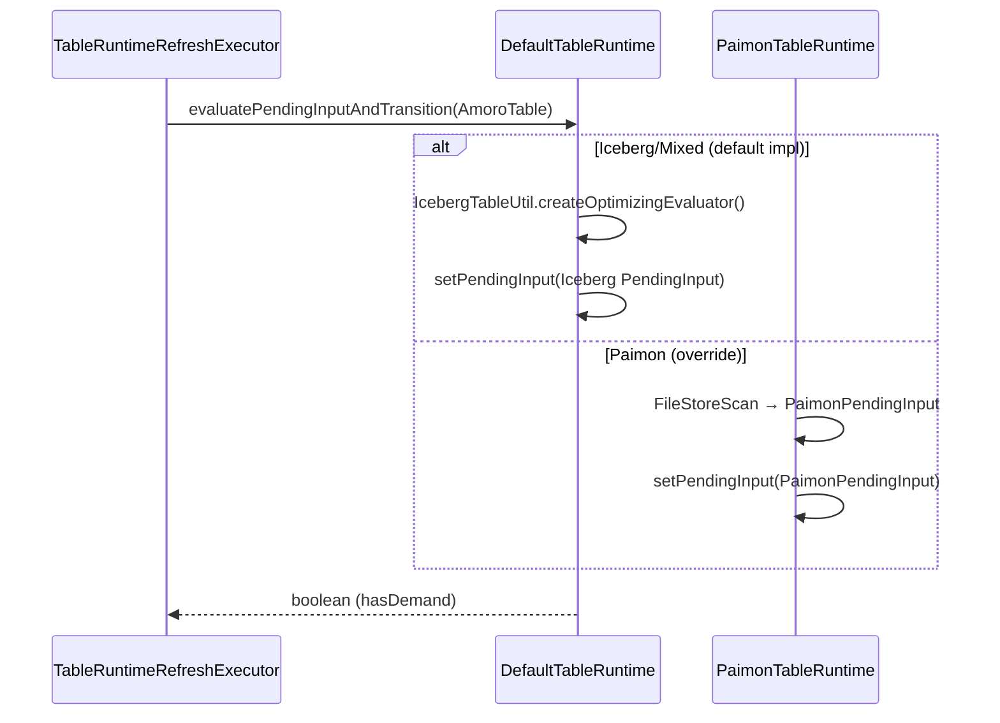

# PaimonPendingInput Design Spec

## Problem

Paimon tables in Amoro persist `pending_input` state as an empty JSON object (all fields zero). This means:

1. Dashboard shows 0 for pending file count/size on Paimon tables
2. No health score is available for Paimon tables
3. Scheduling priority cannot distinguish Paimon tables by compaction urgency

Root cause: `tryEvaluatingPendingInputForPaimon()` creates `new AbstractOptimizingEvaluator.PendingInput()` (empty) and only uses it as a state transition signal (IDLE -> PENDING). The real file evaluation is deferred to `PaimonOptimizingPlanner.planInternal()`.

## Design Decisions

| Decision | Choice | Rationale |
|----------|--------|-----------|
| Purpose | Both urgency + workload estimate | Align with Iceberg's dual-purpose PendingInput |
| Collection timing | Refresh phase | Iceberg does file scan in Refresh; Paimon follows same pattern |
| Table type scope | AppendOnly only | Only AppendOnly+BUCKET_UNAWARE is currently supported for Paimon compaction |
| Collection method | FileStoreScan | Proven API used by `PaimonTableDescriptor.getTablePartitions()` |
| Data structure | New `PaimonPendingInput` class | Avoids polluting Iceberg's PendingInput with Paimon-specific fields |
| Health score | Multi-dimensional | Small file ratio + delete vector ratio + partition distribution skew |
| Dispatch pattern | Template Method | Avoids type mismatch between DefaultTableRuntime and PaimonPendingInput |
| Module dependency | `amoro-format-paimon` as compile scope in `amoro-ams` | Lift Paimon from profile-only to compile, same as Iceberg |
| StateKey strategy | Override in PaimonTableRuntime | Each format owns its StateKey type; no cross-format impact |

## Architecture: Template Method Pattern

### Problem it solves

`TableRuntimeRefreshExecutor.tryEvaluatingPendingInputForPaimon(DefaultTableRuntime)` receives a `DefaultTableRuntime` reference. If we add `setPendingInput(PaimonPendingInput)` to `PaimonTableRuntime`, it's a different method signature (overload, not override) — the executor can't call it through the parent type.

Additionally, `DefaultTableRuntime.optimizingProcess` is `private`, preventing subclass overrides of `beginProcess()`/`completeEmptyProcess()`.

### Solution

Move the evaluation + persist logic into the runtime class hierarchy via a template method. `TableRuntimeRefreshExecutor` calls a polymorphic method on `DefaultTableRuntime`, which dispatches to the correct implementation.



## PaimonPendingInput Class

Location: `amoro-format-paimon/src/main/java/org/apache/amoro/formats/paimon/optimizing/PaimonPendingInput.java`

```java
public class PaimonPendingInput {

    // ---- Workload dimension ----
    private int dataFileCount;       // total active data files
    private long dataFileSize;       // total active data size (bytes)
    private long dataRecordCount;    // total active record count

    // ---- Urgency dimension ----
    private int smallFileCount;      // files where fileSize < targetFileSize
    private long smallFileSize;      // total size of small files (bytes)
    private int partitionCount;      // number of partitions with data

    // ---- Delete vector dimension ----
    private int fileWithDeleteCount; // files with non-empty deleteRowCount
    private long deleteRecordCount;  // total deleted records across all files

    // ---- Health score ----
    private int healthScore;         // composite 0-100, 100 = fully healthy

    // Default constructor for Jackson deserialization
    public PaimonPendingInput() {}

    public PaimonPendingInput(
            int dataFileCount, long dataFileSize, long dataRecordCount,
            int smallFileCount, long smallFileSize, int partitionCount,
            int fileWithDeleteCount, long deleteRecordCount,
            int healthScore) {
        this.dataFileCount = dataFileCount;
        this.dataFileSize = dataFileSize;
        this.dataRecordCount = dataRecordCount;
        this.smallFileCount = smallFileCount;
        this.smallFileSize = smallFileSize;
        this.partitionCount = partitionCount;
        this.fileWithDeleteCount = fileWithDeleteCount;
        this.deleteRecordCount = deleteRecordCount;
        this.healthScore = healthScore;
    }

    // getters ... (standard)
}
```

## Health Score Calculation

Three sub-scores weighted and summed:

```
healthScore = smallFileScore * 0.60 + deleteScore * 0.20 + distributionScore * 0.20
```

**Note on deleteScore**: For AppendOnly tables, delete vectors (DV) are rare — `deleteScore` will typically be 100, effectively reducing healthScore to `smallFileScore * 0.60 + distributionScore * 0.20 + 20`. The delete dimension is reserved for future PrimaryKey table support where DVs are common. The weight allocation (60/20/20) ensures smallFileScore remains the dominant driver for current AppendOnly use cases.

### smallFileScore (weight 60%)

Measures small file accumulation. A table is "healthy" when all files are at or above `targetFileSize`.

```
smallFileScore = 100 * (1 - smallFileCount / max(dataFileCount, 1))
```

| Scenario | smallFileCount | dataFileCount | Score |
|----------|---------------|---------------|-------|
| No small files | 0 | 20 | 100 |
| Half small files | 10 | 20 | 50 |
| All small files | 20 | 20 | 0 |

### deleteScore (weight 20%)

Measures delete vector accumulation. A table is "healthy" when no records are deleted.

```
deleteScore = 100 * (1 - deleteRecordCount / max(dataRecordCount, 1))
```

| Scenario | deleteRecordCount | dataRecordCount | Score |
|----------|-------------------|-----------------|-------|
| No deletes | 0 | 1M | 100 |
| 10% deleted | 100K | 1M | 90 |
| 50% deleted | 500K | 1M | 50 |

### distributionScore (weight 20%)

Measures partition distribution skew. A table is "healthy" when files are evenly distributed across partitions.

```
avgFilesPerPartition = dataFileCount / max(partitionCount, 1)
variance = sum((filesInPartition - avgFilesPerPartition)^2) / partitionCount
stdDev = sqrt(variance)
distributionScore = 100 * (1 - min(stdDev / max(avgFilesPerPartition, 1), 1.0))
```

| Scenario | Partitions | Files/Partition | Score |
|----------|-----------|-----------------|-------|
| Even | 5 | [10, 10, 10, 10, 10] | 100 |
| Mild skew | 5 | [5, 8, 10, 12, 15] | ~60 |
| Heavy skew | 5 | [1, 1, 1, 1, 46] | ~5 |

**Note on sensitivity**: When `avgFilesPerPartition < 5` (small data volume), standard deviation relative to mean can fluctuate significantly. However, since distributionScore only carries 20% weight, total healthScore impact is bounded.

### Edge Cases

- `dataFileCount == 0`: healthScore = 100 (empty table is healthy)
- `partitionCount == 0`: healthScore = 100 (no data)
- `dataRecordCount == 0` but `dataFileCount > 0`: treat as empty files, smallFileScore drives health down

## DefaultTableRuntime Changes

### Add template method

```java
// DefaultTableRuntime.java

/**
 * Evaluate pending input and transition state if necessary.
 * Called by TableRuntimeRefreshExecutor when a snapshot change is detected.
 *
 * <p>Default implementation returns false (no demand). Subclasses (e.g.,
 * PaimonTableRuntime) override to provide format-specific evaluation.
 * Iceberg/Mixed formats use TableRuntimeRefreshExecutor's existing
 * tryEvaluatingPendingInput() and do NOT call this method.
 *
 * @param table the current AmoroTable (for file scanning)
 * @return true if optimizing demand exists, false otherwise
 */
protected boolean evaluatePendingInputAndTransition(AmoroTable<?> table) {
    return false;
}
```

### Make optimizingProcess accessible to subclasses

Change `private volatile OptimizingProcess optimizingProcess` to `protected volatile OptimizingProcess optimizingProcess` so `PaimonTableRuntime` can set it in overridden `beginProcess()`/`completeEmptyProcess()`.

This is a minimal change — the field is already accessed within `DefaultTableRuntime`'s own methods. No external code gains access.

## PaimonTableRuntime Changes

### Override template method

```java
// PaimonTableRuntime.java

private static final StateKey<PaimonPendingInput> PAIMON_PENDING_INPUT_KEY =
    StateKey.stateKey("pending_input")
        .jsonType(PaimonPendingInput.class)
        .defaultValue(new PaimonPendingInput());

@Override
protected boolean evaluatePendingInputAndTransition(AmoroTable<?> table) {
    if (!getOptimizingConfig().isEnabled()) {
        return false;
    }
    if (!getOptimizingStatus().equals(OptimizingStatus.IDLE)) {
        return true;
    }

    PaimonPendingInput pendingInput = collectPaimonPendingInput(table);

    // Persist and transition IDLE → PENDING
    store()
        .begin()
        .updateState(PAIMON_PENDING_INPUT_KEY, i -> pendingInput)
        .updateStatusCode(code -> {
            if (code == OptimizingStatus.IDLE.getCode()) {
                return OptimizingStatus.PENDING.getCode();
            }
            return code;
        })
        .updateTableSummary(summary -> {
            summary.setTotalFileSize(pendingInput.getDataFileSize());
            summary.setTotalFileCount(pendingInput.getDataFileCount());
        })
        .commit();

    // Also update TableSummary health scores
    setTableSummaryFromPaimon(pendingInput);

    return true;
}
```

### FileStoreScan collection

```java
private PaimonPendingInput collectPaimonPendingInput(AmoroTable<?> table) {
    PaimonTable paimonTable = (PaimonTable) table;
    FileStoreTable fileStoreTable = (FileStoreTable) paimonTable.originalTable();
    FileStoreScan scan = fileStoreTable.store().newScan();
    List<ManifestEntry> entries = scan.plan().files(FileKind.ADD);

    long targetFileSize = CoreOptions.fromMap(fileStoreTable.options()).targetFileSize();
    Map<BinaryRow, List<DataFileMeta>> partitionFiles = new HashMap<>();

    int dataFileCount = 0;
    long dataFileSize = 0;
    long dataRecordCount = 0;
    int smallFileCount = 0;
    long smallFileSize = 0;
    int fileWithDeleteCount = 0;
    long deleteRecordCount = 0;

    for (ManifestEntry entry : entries) {
        DataFileMeta file = entry.file();
        dataFileCount++;
        dataFileSize += file.fileSize();
        dataRecordCount += file.rowCount();

        if (file.fileSize() < targetFileSize) {
            smallFileCount++;
            smallFileSize += file.fileSize();
        }

        if (file.deleteRowCount().isPresent() && file.deleteRowCount().get() > 0) {
            fileWithDeleteCount++;
            deleteRecordCount += file.deleteRowCount().get();
        }

        partitionFiles
            .computeIfAbsent(entry.partition(), k -> new ArrayList<>())
            .add(file);
    }

    int partitionCount = partitionFiles.size();
    int healthScore = computeHealthScore(
        dataFileCount, smallFileCount,
        dataRecordCount, deleteRecordCount,
        partitionFiles);

    return new PaimonPendingInput(
        dataFileCount, dataFileSize, dataRecordCount,
        smallFileCount, smallFileSize, partitionCount,
        fileWithDeleteCount, deleteRecordCount,
        healthScore);
}
```

### Lifecycle overrides

```java
@Override
public void beginProcess(OptimizingProcess process) {
    this.optimizingProcess = process;
    store()
        .begin()
        .updateState(PROCESS_ID_KEY, any -> process.getProcessId())
        .updateStatusCode(code ->
            OptimizingStatus.ofOptimizingType(process.getOptimizingType()).getCode())
        .updateState(PAIMON_PENDING_INPUT_KEY, any -> new PaimonPendingInput())
        .commit();
}

@Override
public void completeEmptyProcess() {
    if (getOptimizingStatus() == OptimizingStatus.IDLE) {
        return;
    }
    store()
        .begin()
        .updateStatusCode(code -> OptimizingStatus.IDLE.getCode())
        .updateState(
            OPTIMIZING_STATE_KEY,
            state -> {
                state.setLastOptimizedSnapshotId(state.getCurrentSnapshotId());
                state.setLastOptimizedChangeSnapshotId(state.getCurrentChangeSnapshotId());
                return state;
            })
        .updateState(PAIMON_PENDING_INPUT_KEY, any -> new PaimonPendingInput())
        .commit();
    optimizingProcess = null;
}

public PaimonPendingInput getPaimonPendingInput() {
    return store().getState(PAIMON_PENDING_INPUT_KEY);
}
```

**Note**: `getPendingInput()` from parent is NOT overridden. Paimon code paths use `getPaimonPendingInput()` instead. Both share the same `"pending_input"` storage key string. Cross-deserialization is safe because Jackson `FAIL_ON_UNKNOWN_PROPERTIES` is disabled — extra fields are ignored, missing fields default to 0.

## TableRuntimeRefreshExecutor Changes

### Simplify Paimon branch

```java
// TableRuntimeRefreshExecutor.execute()

// Before:
} else if (table.format() == TableFormat.PAIMON) {
    boolean snapshotChanged =
        lastOptimizedSnapshotId != defaultTableRuntime.getCurrentSnapshotId();
    if (snapshotChanged) {
        hasOptimizingDemand = tryEvaluatingPendingInputForPaimon(defaultTableRuntime);
    }
}

// After:
} else if (table.format() == TableFormat.PAIMON) {
    boolean snapshotChanged =
        lastOptimizedSnapshotId != defaultTableRuntime.getCurrentSnapshotId();
    if (snapshotChanged) {
        hasOptimizingDemand = defaultTableRuntime.evaluatePendingInputAndTransition(table);
    }
}
```

### Remove tryEvaluatingPendingInputForPaimon

The entire method is deleted — its logic moves into `PaimonTableRuntime.evaluatePendingInputAndTransition()`.

## requiredStateKeys Override

`PaimonTableRuntimeCreatorImpl` must override `requiredStateKeys()` to include `PAIMON_PENDING_INPUT_KEY`:

```java
@Override
public List<StateKey<?>> requiredStateKeys() {
    return Lists.newArrayList(
        DefaultTableRuntime.OPTIMIZING_STATE_KEY,
        PaimonTableRuntime.PAIMON_PENDING_INPUT_KEY,  // Paimon-specific
        DefaultTableRuntime.PROCESS_ID_KEY,
        DefaultTableRuntime.CLEANUP_STATE_KEY);
}
```

Both use the same storage key string `"pending_input"`, so the database column is identical. Only the Java type for deserialization differs.

## TableSummary Integration

`evaluatePendingInputAndTransition` updates `TableSummary` inline. A separate helper sets health scores:

```java
private void setTableSummaryFromPaimon(PaimonPendingInput pendingInput) {
    store()
        .begin()
        .updateTableSummary(summary -> {
            summary.setHealthScore(pendingInput.getHealthScore());
        })
        .commit();
}
```

This matches the Iceberg pattern where `setPendingInput` and `setTableSummary` are called in sequence.

## Database Impact

The `table_runtime_state` table stores `pending_input` as a JSON string. The change from empty object to populated object is backward-compatible:

Before:
```json
{"dataFileCount":0,"dataFileSize":0,"dataRecordCount":0,...}
```

After:
```json
{"dataFileCount":47,"dataFileSize":2147483648,"dataRecordCount":5600000,"smallFileCount":23,"smallFileSize":536870912,"partitionCount":3,"fileWithDeleteCount":0,"deleteRecordCount":0,"healthScore":51}
```

No schema migration required. Old JSON with missing fields deserializes correctly (Jackson ignores unknown/missing fields, and defaults are 0).

## Files Changed

| File | Change |
|------|--------|
| `amoro-format-paimon/.../optimizing/PaimonPendingInput.java` | **New** — data class with 9 fields + health score |
| `amoro-ams/pom.xml` | Lift `amoro-format-paimon` from profile to compile scope (match `amoro-format-iceberg`) |
| `amoro-ams/.../table/DefaultTableRuntime.java` | Add `evaluatePendingInputAndTransition()` template method (default: return false); change `optimizingProcess` to `protected` |
| `amoro-ams/.../table/paimon/PaimonTableRuntime.java` | Override `evaluatePendingInputAndTransition`, `beginProcess`, `completeEmptyProcess`; add `collectPaimonPendingInput`, `getPaimonPendingInput`, `setTableSummaryFromPaimon` |
| `amoro-ams/.../table/DefaultTableRuntimeFactory.java` | Update `PaimonTableRuntimeCreatorImpl.requiredStateKeys()` |
| `amoro-ams/.../scheduler/inline/TableRuntimeRefreshExecutor.java` | Simplify Paimon branch to call `evaluatePendingInputAndTransition(table)`; delete `tryEvaluatingPendingInputForPaimon()` |

## Out of Scope

- PrimaryKey table (LSM-tree) support — deferred to future iteration
- `TableSummary` health score fields beyond `healthScore` (`smallFileScore`, `equalityDeleteScore`, `positionalDeleteScore`) — Paimon does not have Iceberg's delete file categories
- Changing `SchedulingPolicy` to use `healthScore` for priority — separate enhancement
- Paimon `CompactionMetrics` integration (Flink/Spark metrics reporter) — separate concern
- Moving Iceberg evaluation into `DefaultTableRuntime.evaluatePendingInputAndTransition()` — can be done later as cleanup, not required for this change

## Module Dependency Change

`amoro-ams/pom.xml` currently lists `amoro-format-paimon` in `dependencyManagement` and only includes it in `support-paimon-format` / `support-all-formats` Maven profiles. For this change, `PaimonTableRuntime` needs compile-time access to `PaimonPendingInput` and Paimon APIs (`FileStoreScan`, `DataFileMeta`, etc.) from `amoro-format-paimon`.

Change: move `amoro-format-paimon` to the top-level `<dependencies>` section (compile scope), matching how `amoro-format-iceberg` is already declared (L39-42). The profile entries remain for the test-jar.

```xml
<!-- amoro-ams/pom.xml: add alongside existing amoro-format-iceberg -->
<dependency>
    <groupId>org.apache.amoro</groupId>
    <artifactId>amoro-format-paimon</artifactId>
</dependency>
```

## Testing Plan

1. **Unit test**: `PaimonPendingInput` serialization/deserialization round-trip
2. **Unit test**: `healthScore` calculation with known inputs (verify each sub-score)
3. **Unit test**: `PaimonTableRuntime.evaluatePendingInputAndTransition` persists to `PAIMON_PENDING_INPUT_KEY`
4. **Unit test**: `PaimonTableRuntime.beginProcess` and `completeEmptyProcess` clear `PAIMON_PENDING_INPUT_KEY`
5. **Integration test**: `TableRuntimeRefreshExecutor` calls `evaluatePendingInputAndTransition` and produces non-empty `PaimonPendingInput`
6. **Backward compatibility test**: Old JSON (empty object) deserializes to default `PaimonPendingInput` without error
7. **Existing test**: `TestTableRuntimeRefreshExecutorForPaimon` and `TestPaimonTableRuntimeScheduling` continue to pass
