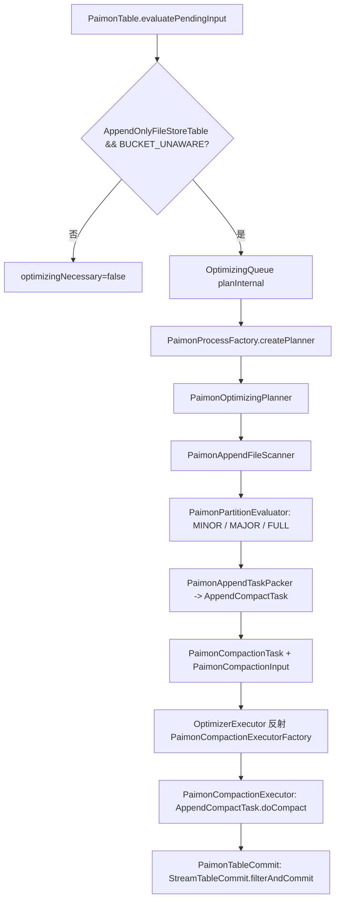
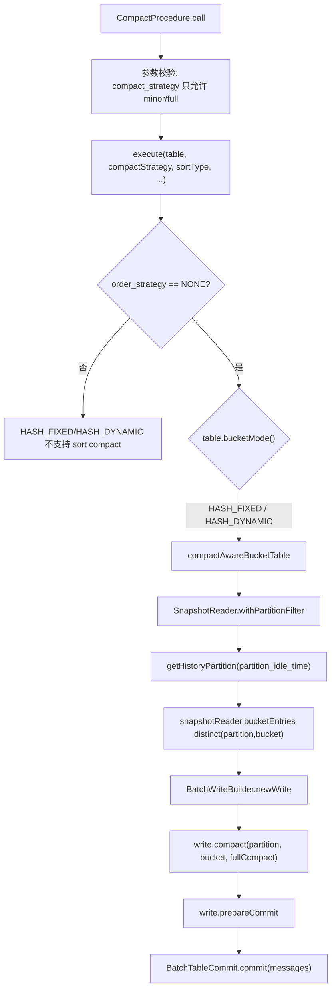

# Paimon HASH 主键表 Compaction 探索基线

**Date:** 2026-06-17
**Scope:** 为 Apache Paimon 主键表 `HASH_FIXED`、`HASH_DYNAMIC` 增加 Amoro self-optimizing 支持前的源码事实、架构边界和待确认问题。
**Status:** 探索文档，不是最终设计 Spec。

---

## 结论摘要

当前 `amoro-format-paimon` 的优化链路只支持 `AppendOnlyFileStoreTable + BUCKET_UNAWARE`，并且入口、planner、executor、committer 都有显式保护。主键表 `HASH_FIXED`、`HASH_DYNAMIC` 不能直接复用现有 `AppendCompactTask` 执行路径，否则会突破 APPEND 表边界并引入错误的表类型强转。

Paimon 上游对 `HASH_FIXED` 和 `HASH_DYNAMIC` 的 compact 方式是一致的：按当前快照枚举真实存在的 `(partition, bucket)`，对每个 bucket 调用 `BatchTableWrite.compact(partition, bucket, fullCompaction)`，再通过 `BatchTableCommit.commit(messages)` 原子提交。两种 bucket mode 的差异在写入 bucket 分配和动态 bucket index 维护，不在 compact procedure 层。

Paimon 原生 compact procedure 只支持 `minor` 和 `full` 两种策略参数。`MAJOR` 不是 Paimon 原生参数，Amoro 如果保留 `OptimizingType.MAJOR`，必须定义为 Amoro 侧的调度/展示类型，执行时仍只能映射到 `fullCompaction=false`，不能向 Paimon 传入 `major`。

---

## 当前 Amoro Paimon 优化架构

关键源码：

- `/Users/SL/.codex/worktrees/e09a/amoro/amoro-format-paimon/src/main/java/org/apache/amoro/formats/paimon/PaimonTable.java`
- `/Users/SL/.codex/worktrees/e09a/amoro/amoro-format-paimon/src/main/java/org/apache/amoro/formats/paimon/process/PaimonProcessFactory.java`
- `/Users/SL/.codex/worktrees/e09a/amoro/amoro-format-paimon/src/main/java/org/apache/amoro/formats/paimon/optimizing/plan/PaimonOptimizingPlanner.java`
- `/Users/SL/.codex/worktrees/e09a/amoro/amoro-format-paimon/src/main/java/org/apache/amoro/formats/paimon/optimizing/PaimonCompactionExecutor.java`
- `/Users/SL/.codex/worktrees/e09a/amoro/amoro-format-paimon/src/main/java/org/apache/amoro/formats/paimon/optimizing/commit/PaimonTableCommit.java`
- `/Users/SL/.codex/worktrees/e09a/amoro/amoro-ams/src/main/java/org/apache/amoro/server/persistence/converter/TaskDescriptorRecoveryTypes.java`

当前硬边界：

1. `PaimonTable.evaluatePendingInput()` 只让 `AppendOnlyFileStoreTable && BucketMode.BUCKET_UNAWARE` 返回 `optimizingNecessary=true`。
2. `PaimonOptimizingPlanner.unwrapBucketUnawareTable()` 只接受 append-only unaware bucket。
3. `PaimonCompactionExecutor` 强制要求 `AppendOnlyFileStoreTable`，并反序列化 `AppendCompactTask`。
4. `PaimonTableCommit` 强制要求 `AppendOnlyFileStoreTable`，通过 `StreamTableCommit.filterAndCommit` 提交 append compact 结果。
5. `TaskDescriptorRecoveryTypes` 当前只把 `PaimonCompactionExecutorFactory` 映射到现有 append task/input/output/summary 类型。

---

## Paimon 主键表 Compact 路径

上游关键源码：

- `/Users/SL/javaProject/paimon/docs/analysis/CompactProcedure-主键表Compaction优化分析.md`
- `/Users/SL/javaProject/paimon/paimon-spark/paimon-spark-common/src/main/java/org/apache/paimon/spark/procedure/CompactProcedure.java`
- `/Users/SL/javaProject/paimon/paimon-common/src/main/java/org/apache/paimon/table/BucketMode.java`
- `/Users/SL/javaProject/paimon/paimon-core/src/main/java/org/apache/paimon/KeyValueFileStore.java`
- `/Users/SL/javaProject/paimon/paimon-core/src/main/java/org/apache/paimon/table/sink/TableWrite.java`
- `/Users/SL/javaProject/paimon/paimon-core/src/main/java/org/apache/paimon/table/sink/TableWriteImpl.java`
- `/Users/SL/javaProject/paimon/paimon-core/src/main/java/org/apache/paimon/mergetree/compact/MergeTreeCompactManager.java`
- `/Users/SL/javaProject/paimon/paimon-core/src/main/java/org/apache/paimon/mergetree/compact/CompactStrategy.java`
- `/Users/SL/javaProject/paimon/paimon-core/src/main/java/org/apache/paimon/mergetree/compact/UniversalCompaction.java`

事实约束：

1. `HASH_FIXED` 和 `HASH_DYNAMIC` 都进入 `compactAwareBucketTable`。
2. compact 的最小并发单元是 `(partition, bucket)`，不跨 bucket 合并。
3. `HASH_DYNAMIC` 的普通 compaction 不做 rebucket，不改变 key-to-bucket 映射。
4. `SnapshotReader.bucketEntries()` 枚举真实存在的 bucket entry，不枚举理论 bucket 范围。
5. `partition_idle_time` 是 partition 级过滤，不是 bucket 级过滤。

---

## Spark Producer 对主键表 Full Compaction 的启发

Spark Producer 写入路由会区分 bucket mode，但 full compaction producer 不按 `HASH_FIXED` / `HASH_DYNAMIC` 拆两套 compact 逻辑：

1. `PaimonSparkWriter` 在写入阶段区分 bucket mode：
   - `HASH_DYNAMIC`：首次写入走 `SimpleHashBucketAssigner`，已有 snapshot 后走 `DynamicBucketProcessor`。
   - `HASH_FIXED`：如果 extension 支持 bucket UDF，则直接计算 fixed bucket 后按 partition + bucket shuffle；否则走 `CommonBucketProcessor`。
2. `DataWrite` 在 `full-compaction.delta-commits` 生效时维护 `writtenBuckets`，只记录本次 writer 实际写入触达的 `(partition,bucket)`。
3. `preCommit()` 对 `writtenBuckets` 循环调用 `write.compact(partition,bucket,true)`，然后沿用 writer 的 commit message 机制提交。
4. 这个 producer 逻辑没有扫描 manifest，也没有尝试全表候选选择；它是写入内联场景下的“触达 bucket 局部 full compaction”。

对 Amoro 设计的结论：

1. `HASH_FIXED` / `HASH_DYNAMIC` 的优化执行层可以共用同一套实现；差异只保留在表 eligibility 和 Paimon 写入路由内部。
2. Amoro 自优化是异步调度，没有 Producer 的 `writtenBuckets` 天然输入，因此 Planner 需要从 `SnapshotReader.bucketEntries()` 枚举真实存在的 `(partition,bucket)`。
3. Amoro task 内批量处理多个 bucket 是符合 Paimon Spark 代码形态的：Spark procedure 在一个 `BatchTableWrite` 内循环多个 bucket，`prepareCommit()` 后由 driver 汇总 commit message 再统一 `BatchTableCommit.commit(messages)`。
4. `MAJOR` 可以借鉴 Producer 的“局部 full compaction”模型：Amoro 只选择局部高压力 bucket，但执行时传 `fullCompaction=true`，与 `FULL` 的区别是范围，不是 Paimon API。

---

## MINOR / MAJOR / FULL 语义基线

Amoro 通用层只有 `OptimizingType.MINOR`、`MAJOR`、`FULL` 三个枚举。枚举本身没有行为，行为由各格式 planner 决定；AMS 只用它更新状态、指标、最近优化时间和 process 类型。

Paimon 主键表原生只有 `minor` 和 `full`：

| Amoro 类型 | Paimon 执行映射 | 事实依据 | 设计含义 |
|---|---|---|---|
| `MINOR` | `fullCompaction=false` | `TableWrite.compact(partition,bucket,false)` 触发 `strategy.pick(...)` | 非强制 compact；可能无任务，也可能因 Paimon early full/size amplification 产生近似 full 的结果 |
| `MAJOR` | `fullCompaction=true` | Paimon procedure 不接受 `major`，但 Java API 支持按 bucket 强制 full compact | Amoro 扩展语义：局部高压力 bucket 的 full compact，process 类型记为 `MAJOR` |
| `FULL` | `fullCompaction=true` | `CompactStrategy.pickFullCompaction(...)` | 全部 eligible 冷却 bucket 的 full compact；活跃 partition 不进入 FULL |

已确认的 `MAJOR` 定义：`MAJOR` 是 Amoro 对 Paimon 主键表扩展出来的优化指标，不是 Paimon 原生 compact strategy。它选择局部高压力 `(partition,bucket)`，执行 `fullCompaction=true`；`FULL` 选择全部 eligible 且冷却的 `(partition,bucket)`，也执行 `fullCompaction=true`。

---

## 推荐复用与隔离点

必须复用：

1. `ProcessFactory`：继续由 Paimon factory 创建 planner 和 committer。
2. `TableOptimizingPlanner`、`OptimizingPlanResult`：继续把 `OptimizingType`、process id、snapshot id、tasks 交给 AMS queue。
3. `StagedTaskDescriptor`、`BaseOptimizingInput`、`TaskProperties.TASK_EXECUTOR_FACTORY_IMPL`：保持 Optimizer 端反射执行和 AMS 持久化恢复契约。
4. `PaimonCompactionOutput` 的 commit message bytes + metrics summary 思路可以复用或抽象。
5. `PaimonPlanContext` 的 `OptimizingConfig`、interval、task quota 等上下文可以复用或提取公共基类。

必须隔离：

1. 不复用 `AppendCompactTask` 作为主键表任务 payload。
2. 不让 `PaimonCompactionExecutor` 接受主键表。
3. 不让 `PaimonTableCommit` 继续强转 `AppendOnlyFileStoreTable` 后处理主键表。
4. 不改变现有 append-only unaware bucket 的 eligibility、planner、executor、committer 行为。
5. 不直接依赖 `MergeTreeCompactManager`、`CompactStrategy`、`Levels`、`DynamicBucketIndexMaintainer` 等 Paimon 内部类。

---

## 待确认问题

这些问题会决定正式 Spec。没有确认前，不应开始代码实现。

1. 主键表 `MINOR` / `MAJOR` 的候选 bucket 是否只使用 `BucketEntry` 的轻量元数据，还是第一版就读取更深的 manifest / file level 信息？
2. 主键表 `MAJOR` 的默认阈值应如何定义，是否需要和现有 Amoro major 指标保持相同触发口径？
3. 主键表 `FULL` 是否只由 `self-optimizing.full.trigger.interval` 触发，还是需要支持手动 action 或表参数强制触发？
4. 对 `self-optimizing.filter` 的 partition-only 校验，错误应该落在哪个可观测位置：planner log、table optimizing status，还是新增 runtime status message？

---

## 当前置信度与风险

对以下结论有源码事实级置信：

1. 当前 Amoro Paimon 优化链路只支持 append-only bucket-unaware。
2. Paimon 上游 `HASH_FIXED` / `HASH_DYNAMIC` compact 走同一 `(partition,bucket)` 路径。
3. Paimon compact procedure 只接受 `minor` / `full`，不接受 `major`。
4. 主键表实现应通过 public `BatchTableWrite.compact` / `BatchTableCommit.commit` 路径触达 Paimon，而不是直接调用 MergeTree 内部实现。

仍需修复或确认的漏洞：

1. `MAJOR` 没有 Paimon 原生 strategy 名称，必须在文档和日志中明确它是 Amoro 局部 full compact 语义，避免用户误认为 Paimon procedure 支持 `major` 参数。
2. 主键表是否进入 queue 需要改变 `PaimonTable.evaluatePendingInput()` 的测试锁定行为，必须新增开关和回归测试保护 APPEND 表。
3. 现有 task 恢复映射只认识 append executor factory。若新增主键表 executor factory，必须同步扩展 `TaskDescriptorRecoveryTypes`。
4. 一个 Amoro task 内批量循环多个 bucket 已确认，但失败重试、metrics 粒度和 COMPLETE payload 风险会变粗；当前版本不提供合并多个 bucket 的配置，固定一个 partition-bucket unit 一个 task。
5. `HASH_DYNAMIC` 与 `HASH_FIXED` 共用实现已确认，但仍需要在 eligibility、日志和测试中覆盖动态桶表，避免只在固定桶表上验证通过。
