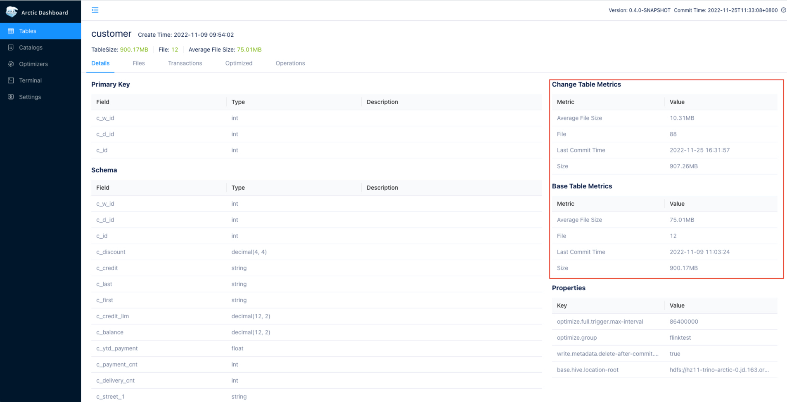
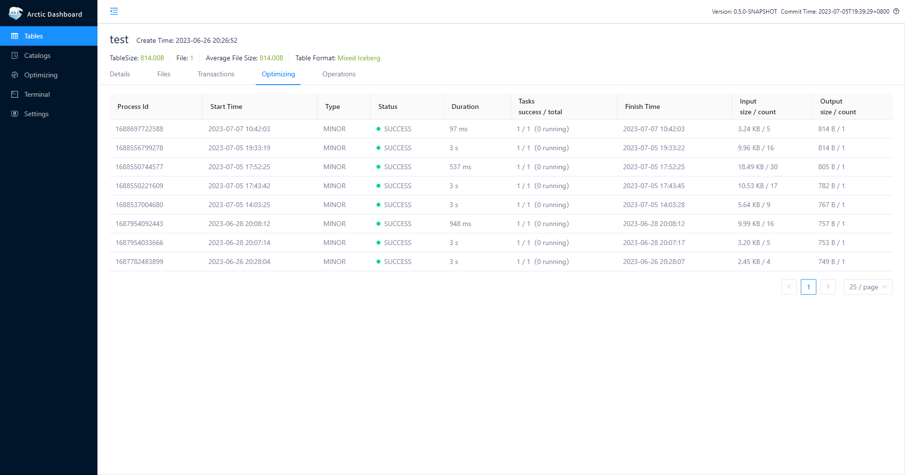
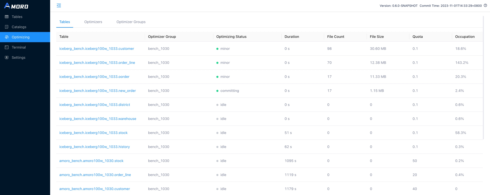

<!--
 - Licensed to the Apache Software Foundation (ASF) under one or more
 - contributor license agreements.  See the NOTICE file distributed with
 - this work for additional information regarding copyright ownership.
 - The ASF licenses this file to You under the Apache License, Version 2.0
 - (the "License"); you may not use this file except in compliance with
 - the License.  You may obtain a copy of the License at
 -
 -   http://www.apache.org/licenses/LICENSE-2.0
 -
 - Unless required by applicable law or agreed to in writing, software
 - distributed under the License is distributed on an "AS IS" BASIS,
 - WITHOUT WARRANTIES OR CONDITIONS OF ANY KIND, either express or implied.
 - See the License for the specific language governing permissions and
 - limitations under the License.
 -->
# Using Tables

The SQL execution tool `Terminal` is provided in AMS dashboard to help users quickly create, modify and delete tables.
It is also available in [Spark](../spark-ddl/) and [Flink](../flink-ddl/) and other engines to manage tables using SQL.

## Create table
After logging into AMS dashboard, go to `Terminal`, enter the table creation statement and execute it to complete the table creation.
The following is an example of table creation:

```sql
create table test_db.test_log_store(
  id int,
  name string,
  op_time timestamp,
  primary key(id)
) using mixed_iceberg
partitioned by(days(op_time))
tblproperties(
  'log-store.enable' = 'true',
  'log-store.type' = 'kafka',
  'log-store.address' = '127.0.0.1:9092',
  'log-store.topic' = 'local_catalog.test_db.test_log_store.log_store',
  'table.event-time-field' = 'op_time',
  'table.watermark-allowed-lateness-second' = '60');
```

Currently, terminal uses Spark Engine for SQL execution. For more information on the syntax of creating tables, refer to [Spark DDL](../spark-ddl/#create-table). Different Catalogs create different table formats, refer to [Create Catalog](../managing-catalogs/#create-catalog)

### Configure LogStore
As described in [Mixed-Iceberg format](../mixed-iceberg-format/), Mixed-Iceberg format may consist of several components, and BaseStore and ChangeStore will be automatically created upon table creation.
LogStore, as an optional component, requires separate configuration to specify, The complete configuration for LogStore can be found in [LogStore Configuration](../configurations/#logstore-configurations).

In the example above, the Kafka cluster 127.0.0.1:9092 and the topic local_catalog.test_db.test_log_store.log_store are used as the LogStore for the new table. 
Before executing the above statement, you need to manually create the corresponding topic in the Kafka cluster or enable the automatic creation of topics feature for the cluster.

### Configure watermark
Watermark is used to describe the write progress of a table. Specifically, it is a timestamp attribute on the table, indicating that all data with a timestamp smaller than the watermark has been written to the table. 
It is generally used to observe the write progress of a table and can also serve as a trigger metric for downstream batch computing tasks.


In the example above, op_time is set as the event time field of the table, and the op_time of the written data is used to calculate the watermark of the table. 
To handle out-of-order writes, the permitted lateness of data when calculating the watermark is set to one minute.
You can view the current watermark of the table in the table details on the AMS Dashboard at AMS dashboard.


You can also use the following SQL statement in the `Terminal` to query the watermark of a table:

```sql
SHOW TBLPROPERTIES test_db.test_log_store ('watermark.table');
```

You can expect to get the following results:

```text
+-----------------+---------------+
| key             | value         |
+-----------------+---------------+
| watermark.table | 1668579055000 |
+-----------------+---------------+
```


Watermark configuration is only supported in Mixed-Hive format and Mixed-Iceberg format, and is not supported in Iceberg format for now.

    
## Modify table

After logging into the AMS dashboard, go to the `Terminal` and enter the 
modification statement to complete the table modification. The current `Terminal` uses Spark Engine to execute SQL. For 
more information on modifying tables, please refer to the syntax guide [Spark DDL](../spark-ddl#alter-statement).

## Upgrade a Hive table
Amoro supports [Mixed-Hive format](../mixed-hive-format/) table, which combines the capabilities of Hive formats to directly implement new table formats on top of Hive.

After logging into the AMS dashboard, select a table under a certain Hive Catalog from the `Tables` menu to perform the upgrade operation.


Click the `Upgrade` button in the upper right corner of the table details (this button is not displayed for Hive tables that have already been upgraded).


On the upgrade page, select the primary key for the table and add additional parameters, then click `OK` to complete the upgrade of the Hive table.

## Configure self-optimizing

Amoro provides a self-optimizing feature, which requires an active optimizer in the Optimizer Group configured for the table.

### Modify optimizer group
To use an optimizer launched under a specific optimizer group to perform self-optimizing, you need to modify the `self-optimizing.group` parameter of the table to specify a specific resource pool for the table. 
The setting method is as follows:

```sql
ALTER TABLE test_db.test_log_store set tblproperties (
    'self-optimizing.group' = 'group_name');
```

In default，`'self-optimizing.group' = 'default'`。

### Adjust optimizing resources 

If there are multiple tables to be optimized under the same Optimizer Group, you can manually adjust the resource proportion of each table by adjusting the `quota`.

```sql
ALTER TABLE test_db.test_log_store set tblproperties (
    'self-optimizing.quota' = '0.1');
```

For more information, please refer to [Self-optimizing quota](../self-optimizing/#quota)。

### Adjust optimizing parameters

You can manually set parameters such as execution interval, task size, and execution timeout for different types of Optimize. 
For example, to set the execution interval for minor optimizing, you can do the following:

```sql
ALTER TABLE test_db.test_log_store set tblproperties (
    'self-optimizing.minor.trigger.interval' = '3600000');
```

More optimization parameter adjustment refer to [Self-optimizing configuration](../configurations/#self-optimizing-configurations)。

### Enable or disable self-optimizing

The Optimize of the table is enabled by default. If you want to disable the Optimize feature, execute the following command. 
Conversely, you can re-enable it:

```sql
ALTER TABLE test_db.test_log_store set tblproperties (
    'self-optimizing.enabled' = 'false');
```

## Configure data expiration

Amoro can periodically clean data based on the table's expiration policy, which includes properties such as whether to enable expiration, retention duration, expiration level, and the selection of the field for expiration. 
it's also necessary for AMS to have the data expiration thread enabled. You can enable the 'data-expiration' property in the configuration file

### Enable or disable data expiration

By default, Amoro has data expiration disabled. If you want to enable data expiration, please execute the following command.

```sql
ALTER TABLE test_db.test_log_store set tblproperties (
    'data-expire.enabled' = 'true');
```

### Set retention period

The configuration for data retention duration consists of a number and a unit. For example, '90d' represents retaining data for 90 days, and '12h' indicates 12 hours.

```sql
ALTER TABLE test_db.test_log_store set tblproperties (
    'data-expire.retention-time' = '90d');
```

### Select expiration field

Data expiration requires users to specify a field for determining expiration. 
In addition to supporting timestampz/timestamp field types for this purpose, it also supports string and long field type. 
String field require a date pattern for proper parsing, with the default format being 'yyyy-MM-dd'. Additionally, long fields can be chosen as the expiration event time, but you need to specify the timestamp's unit, which can be in `TIMESTAMP_MS` or `TIMESTAMP_S`.
Note that timestamp, timestampz, and long field types use UTC, while others use the local time zone.

```sql
ALTER TABLE test_db.test_log_store set tblproperties (
    'data-expire.field' = 'op_time');

-- select string field
ALTER TABLE test_db.test_log_store set tblproperties (
    'data-expire.field' = 'op_time',
    'data-expire.datetime-string-pattern' = 'yyyy-MM-dd');

-- select long field
ALTER TABLE test_db.test_log_store set tblproperties (
    'data-expire.field' = 'op_time',
    'data-expire.datetime-number-format' = 'TIMESTAMP_MS');
```

### Adjust expiration level

Data expiration supports two levels, including `PARTITION` and `FILE`. The default level is `PARTITION`, which means that AMS deletes files only when all the files within a partition have expired.

```sql
ALTER TABLE test_db.test_log_store set tblproperties (
    'data-expire.level' = 'partition');
```

### Specify start time

Amoro expire data since `LAST_COMMIT_TIME` or `CURRENT_TIME`. `LAST_COMMIT_TIME` will follow the timestamp of the table's most recent snapshot as the start time of the expiration, which ensures that the table has `data-expire.retention-time` data; while `CURRENT_TIME` will follow the current time of the service.

```sql
ALTER TABLE test_db.test_log_store set tblproperties (
    'data-expire.base-on-rule' = 'CURRENT_TIME');
```

## Delete table

After logging into the AMS Dashboard. To modify a table, enter the modification statement in the `terminal` and execute it.


Here is an example of how to delete a table：

```sql
DROP TABLE test_db.test_log_store;
```

The current terminal is using the Spark engine to execute SQL. For more information about deleting tables, you can refer to  [Spark DDL](../spark-ddl/#drop-table).

## Explore table details
The Amoro Tables details page provides multiple tabs to display the status of the table from various dimensions, mainly including:

| **Tab Name** | **Description**                                                                                                                                                                                                                                                                          |
|--------------|------------------------------------------------------------------------------------------------------------------------------------------------------------------------------------------------------------------------------------------------------------------------------------------|
| Details      | Display the table's schema, primary key configuration, partition configuration, properties; as well as the metric information of the files stored in ChangeStore and BaseStore, including the number of files and average file size, as well as the latest submission time of the files. |
| Files        | Display all partitions and files of the table.                                                                                                                                                                                                                                           |
| Snapshots    | Display all snapshots of the table, which can be filtered by branch and tag.                                                                                                                                                                                                             |
| Optimizing   | Display all the self-optimizing processes of the table, each record shows the number and average size of files before and after Optimize, as well as the execution time of each process.                                                                                                 |
| Operations   | Display the current table's DDL historical change records.                                                                                                                                                                                                                               |





## Explore self-optimizing status
The Optimizing page displays self-optimizing status of all tables.



- **Optimizing Status**: The current optimizing status of the table, including idle, pending, planning, minor, major, full, committing.
  - idle: means that self-optimizing is not required on the table.
  - pending: means that self-optimizing is required on the table and is waiting for resources.
  - planning: means that self-optimizing process is being planed.
  - minor: means that minor optimizing is being executed on the table. 
  - major: means that major optimizing is being executed on the table.
  - full: means that full optimizing is being executed on the table.
  - committing: means that self-optimizing process is being committed.
- **Duration**: The duration of the current status.
- **File Count**: The total number of files involved in the current Self-optimizing, including base, insert, eq-delete, and pos-delete file types.
- **File Size**: The total size of files involved in the current self-optimizing.
- **Quota**: The proportion of self-optimizing execution time executed per unit time.
- **Quota Occupation**: The actual Quota used for self-optimizing during execution of the table in the last hour. When optimizer resources are sufficient and the table requires more resources for self-optimizing, this value will be greater than 100%. When resources are scarce or the table requires fewer resources for self-optimizing, this value will be less than 100%.