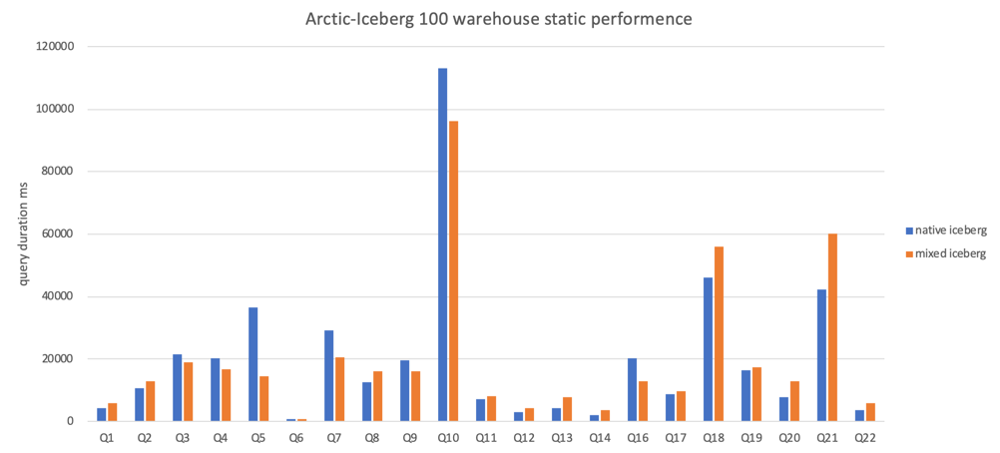
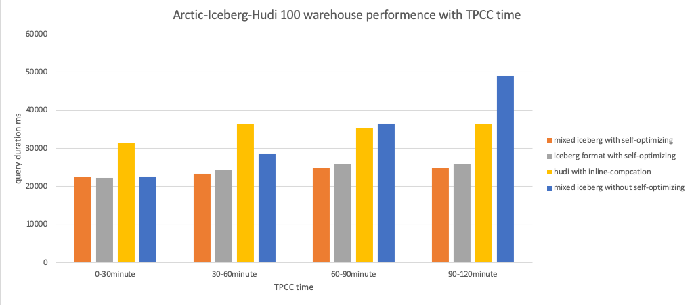
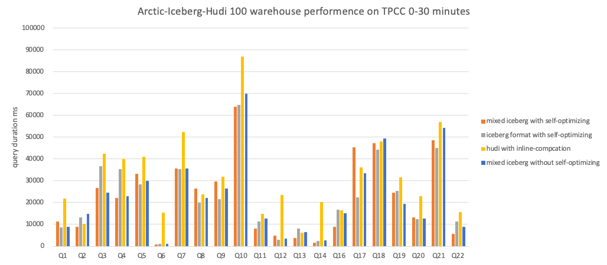
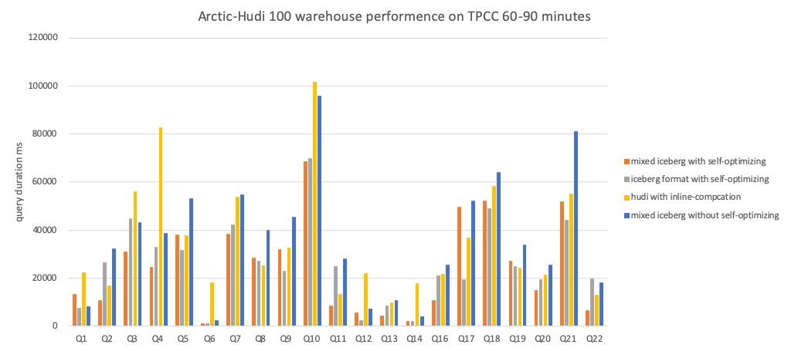

# Benchmark Report 

## Test purpose

This test aims at comparing the OLAP benchmark performance of various data lake formats in the scenario of continuous streaming ingestion in the CDC database.

Meanwhile, particular attention was paid during the testing process to the impact of enabling self-optimizing on the analytical performance of the table.

## Test envrionment

### Hardware configuration

| Number | OS | Cpu core | Memory | Disk type   | Deployed components  |
| ---- | -------- | --------- | ---- | -------- | ---- |
| 1    | CentOS 7 | 40        | 256  | SAS      | HDFS、Hive、Yarn |
| 2    | CentOS 7 | 40        | 256  | SAS      | HDFS、Hive、Yarn |
| 3    | CentOS 7 | 40        | 256  | SAS      | HDFS、Hive、Yarn |
| 4    | CentOS 7 | 40        | 256  | SAS      | Trino、Presto |
| 5    | CentOS 7 | 40        | 256  | SAS      | Trino、Presto |
| 6    | CentOS 7 | 40        | 256  | SAS      | Trino、Presto |

### Software version

| Software | Version |
| ---- | -------- | 
| Trino    | 380 | 
| Presto    | 274 | 
| Iceberg    | 0.13 | 
| Amoro    | 0.4 | 
| Hudi    | 0.11.1 | 

## Test plan

### Overview

This test is based on CHbenchmark, which is a hybrid testing standard that integrates TPCC and TPCH. The overall testing workload can be divided into two categories:

- 5 OLTP workloads based on TPC-C: NewOrder, Payment, OrderStatus, Delivery, and StockLevel.

- 22 OLAP workloads based on TCP-H, where Q15 was abandoned in this test due to its association with views and the lack of view rewriting.


### Prepare test data

Based on the TPC-C, the raw data was constructed in MySQL for this test. The dataset includes a total of 12 tables, with the relationship between TPC-C and TPC-H tables shown in the following diagram:


In addition, the relationship between the data sizes of each table is shown in the following table, where `w` represents the number of warehouses. It can be observed that the data sizes of intermediate tables such as `new_order` and `stock` are affected by the number of warehouses. Therefore, the data set size can be adjusted by controlling the number of warehouses during testing.


In this test, the number of warehouses was set to 100, and the initial data set size in the MySQL database was approximately 10GB. The following table shows the number of data records for each table in the initial data set and the changes in the number of data records for each table after running the one-hour TPC-C test.

| Table name | The number of records (rows) in beginning | The number of records (rows) after running a one-hour TPC-C test |
| ---------- | ---------------------------- | ------------------------------------ |
| warehouse  | 100                          | 100                                  |
| item       | 100000                       | 100000                               |
| stock      | 10000000                     | 10000000                             |
| district   | 1000                         | 1000                                 |
| customer   | 3000000                      | 3000000                              |
| history    | 3000000                      | 3119285（+119285）                   |
| oorder     | 3000000                      | 3124142（+124142）                   |
| new_order  | 893709                       | 907373（+13664）                     |
| order_line | 29996774                     | 31252799（+1256025）                 |
| region     | 5                            | 5                                    |
| nation     | 62                           | 62                                   |
| supplier   | 1000                         | 1000                                 |

### Perform the test

Before starting TPC-H testing, start a Flink job to synchronize both the history data and real-time data from MySQL into the data lake.
Afterwards, execute TPC-H testing through query engines such as Trino or Presto.

TPC-H contains 22 query statements, only three of which are listed here due to space limitation:

```sql
-- query1 
SELECT ol_number,
    sum(ol_quantity) AS sum_qty,
    sum(ol_amount) AS sum_amount,
    avg(ol_quantity) AS avg_qty,
    avg(ol_amount) AS avg_amount,
    count(*) AS count_order
FROM order_line
WHERE ol_delivery_d > '2007-01-02 00:00:00.000000'
GROUP BY ol_number
ORDER BY ol_number;
        
 -- query2 
SELECT su_suppkey,
    su_name,
    n_name,
    i_id,
    i_name,
    su_address,
    su_phone,
    su_comment
FROM item, supplier, stock, nation, region, 
    (SELECT s_i_id AS m_i_id,
        MIN(s_quantity) AS m_s_quantity
    FROM stock, supplier, nation, region
    WHERE MOD((s_w_id*s_i_id), 10000) = su_suppkey
        AND su_nationkey = n_nationkey
        AND n_regionkey = r_regionkey
        AND r_name LIKE 'Europ%'
    GROUP BY s_i_id) m
WHERE i_id = s_i_id
    AND MOD((s_w_id * s_i_id), 10000) = su_suppkey
    AND su_nationkey = n_nationkey
    AND n_regionkey = r_regionkey
    AND i_data LIKE '%b'
    AND r_name LIKE 'Europ%'
    AND i_id=m_i_id
    AND s_quantity = m_s_quantity
ORDER BY n_name, su_name, i_id;
        
 -- query3 
SELECT ol_o_id,
    ol_w_id,
    ol_d_id,
    sum(ol_amount) AS revenue,
    o_entry_d
FROM customer, new_order, oorder, order_line
WHERE c_state LIKE 'A%'
    AND c_id = o_c_id
    AND c_w_id = o_w_id
    AND c_d_id = o_d_id
    AND no_w_id = o_w_id
    AND no_d_id = o_d_id
    AND no_o_id = o_id
    AND ol_w_id = o_w_id
    AND ol_d_id = o_d_id
    AND ol_o_id = o_id
    AND o_entry_d > '2007-01-02 00:00:00.000000'
GROUP BY ol_o_id, ol_w_id, ol_d_id, o_entry_d
ORDER BY revenue DESC, o_entry_d;
```

## Test results

### Static result


The figure above shows a performance comparison of Iceberg and Mixed-Iceberg table formats for querying static data. It can be seen from the figure that the query performance of the two table formats is similar.

### Dynamic result



The figure above shows a performance comparison of Iceberg 、Mixed-Iceberg and Hudi table formats for querying dynamic data. The test recorded the results of running TPC-C for different time periods.

The following are the specific results of each test group:







## Conclusion

- In the case of static data, the query performance of Iceberg and Mixed-Iceberg tables is similar.
- Without enabling self-optimizing, the query performance of all table formats will continue to decline as dynamic data is continuously written.
- After enabling self-optimizing, the query performance of all table formats remains stable as dynamic data is continuously written. 
   