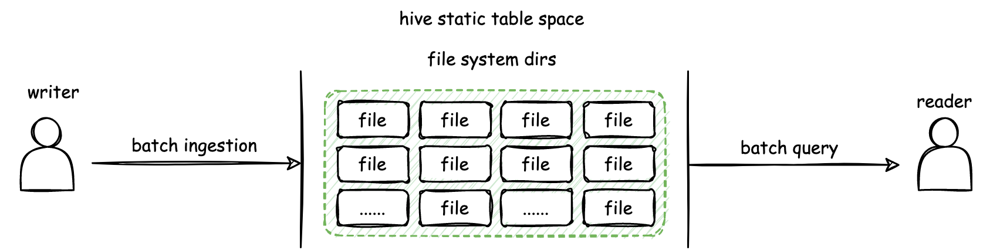
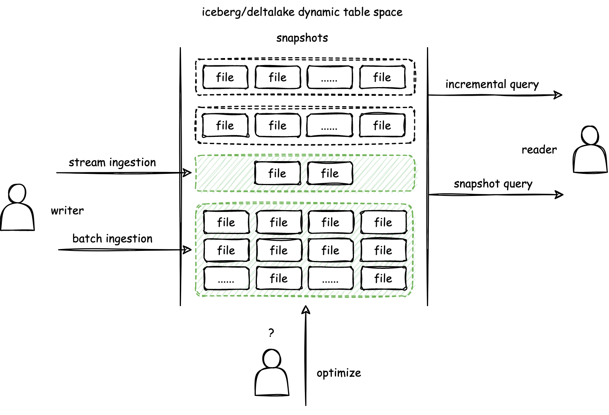
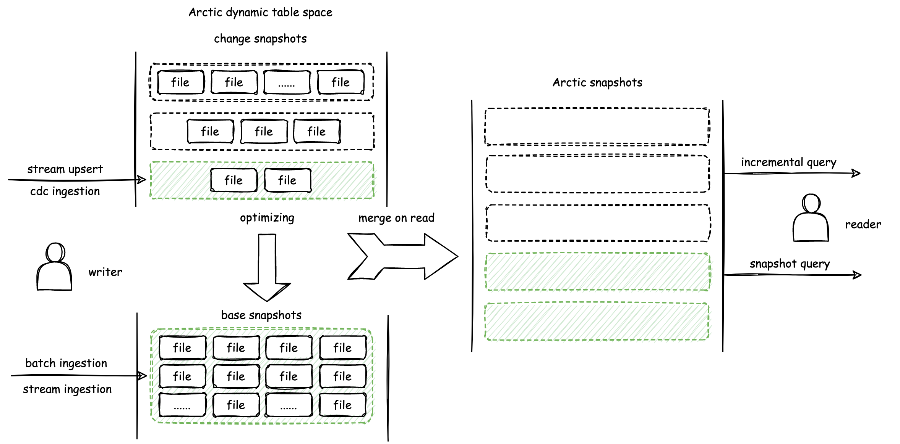
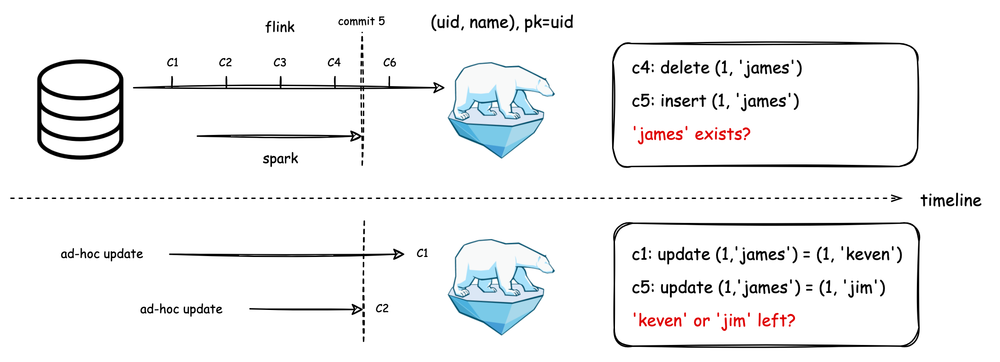
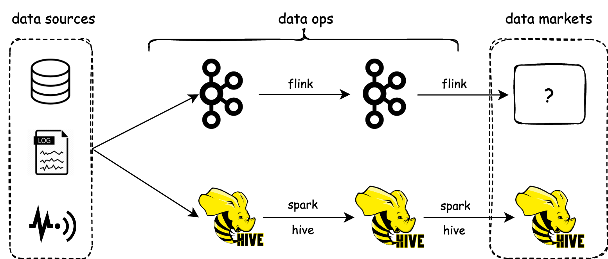
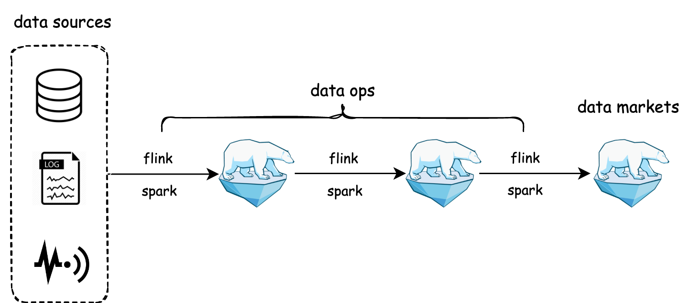
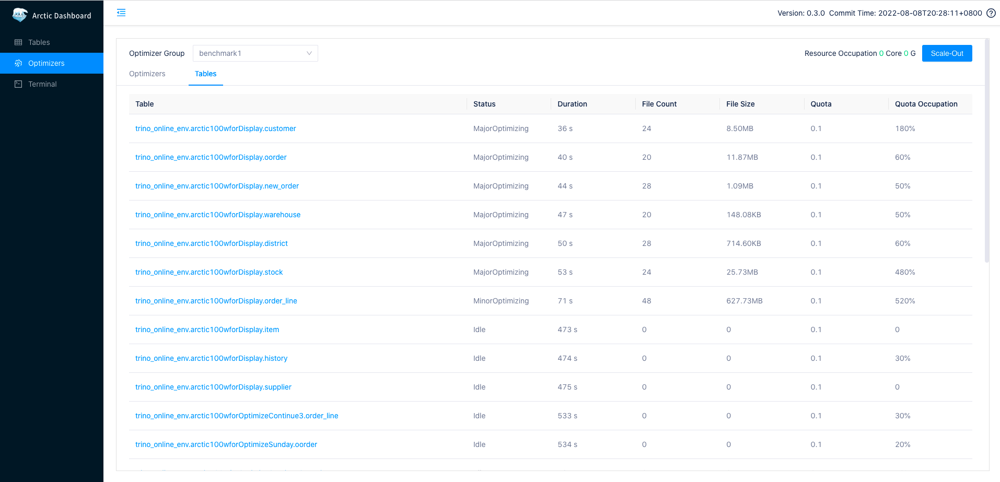

# Arctic motivation

Table format 最早由 Iceberg 提出，截止目前已经成为行业共识的概念， table format 是什么？简单概括的话：

* Table format 定义了哪些文件构成一张表，这样任何引擎都可以根据 table format 查询和检索数据
* Table format 规范了数据和文件的分布方式，任何引擎写入数据都要遵照这个标准，通过 format 定义的标准支持 ACID，模式演进等高阶功能 
  
目前国内外同行将 Delta、Iceberg 和 Hudi 作为数据湖 table format 的对标方案，Delta、Iceberg 和 Hudi 的竞争变得白热化的同时，企业已经相关的供应商应当开始认真考虑怎样引入数据湖 table format 技术，给平台用户带来 LakeHouse 的最佳实践。

LakeHouse 给企业带来的价值，应当是用一套数据湖底座，拓展数据平台的边界，改善产品、数据孤岛和流程规范割裂带来的低效和成本浪费，首先要做的，是将围绕传统离线数仓打造的数据中台，或者衍生的 DataOps 方法论，拓展到实时场景，未来的数据产品方法论，在 LakeHouse 以及相关技术的推动下，相信会向流批融合的大方向上大步前进。

但是企业和开发者需要理解，开源的数据湖 format 不等价于 LakeHouse，包括创造出 LakeHouse 这个概念的 databricks 自己，也从未将 Delta 与 LakeHouse 划等号，如何帮助企业构建 LakeHouse，是我们此次开源 Arctic 项目的意义，Arctic 目前的定位是流式湖仓服务，流式强调向实时能力的拓展，服务则强调管理，标准化度量，以及其他可以抽象到基础软件中的 LakeHouse 能力。

### Continuous self-optimized

Hive 作为目前使用最为广泛的数据湖离线数仓方案，由于其表格式与数据文件的静态关系，缺乏数据写入和读取的 ACID 保障，适合 T+1 或 T+H 等离线摄取和计算场景，如下图所示：

近年来 Iceberg/DeltaLake 在数据湖之上开创了新的理念，与 Hive 相比，Iceberg/DeltaLake 在表格式中抽象出快照的概念，表的任何数据变更都会构造出新的快照，Iceberg/DeltaLake 通过快照的隔离实现数据写入的 ACID 和读取的 MVCC，更好地支持数据实时摄取和计算，如下图所示：

Iceberg/DeltaLake 的表格式是数据湖之上进一步的元数据封装，遵循所读即所写的原则，但是一些情况下用户想要读的不是直接写入的数据：

* CDC ingestion 的场景，写入端写入的是 CDC 数据，用户做 OLAP 想要读的是按主键去重的数据
* Stream ingestion 场景，写入过多的小文件，查询性能差，用户想要读合并后读取性能更高的结果
* 对特殊的分析场景，按某些字段排序可以带来性能巨大提升，但无法要求数据按排序字段的要求写入

针对上述情况，主流解决方案是提供指令给用户调用，比如 CDC ingestion 通过 merge into 来实现，小文件合并通过 optimize 指令触发合并，optimize 也可以触发 zorder 排序。这些命令能够实现特定功能，但是也给用户带来了心智负担，很多场景下，用户不明确以什么样的频率，花费什么样的代价去做这些事，进一步说，除了数据生产和消费的角色外，为了应对更加多样的数据写入和查询需求，还需要为数据湖引入负责优化存储结构的角色。

Arctic 的核心目标之一是在 DataOps 的场景中消除优化者的角色，Arctic 提供托管的持续 optimizing 机制实现流批写入的存储结构转换，对流批读取的场景，也可以提供不同的存储结构响应，后续，Arctic 也可以扩展存储结构以支持排序和聚合：

持续优化的特性让数据湖除了离线场景，也能适用于更多实时场景，同时数据湖开放性，弹性以及存算分离的优势让湖仓可以轻便地作用于 AI，数据科学，数仓等领域。托管的持续优化能力也能让 Arctic 的用户体验尽可能贴近数据库或传统数仓，减少用户对性能和成本的担忧。

### Concurrent conflicts resolving
Iceberg 和 DeltaLake 通过 format 元数据定义了表和快照一对多关系，快照和文件的一对多关系，计算引擎调用一次 commit api 会生成一个快照，基于快照的个例管理保障了 commit 的 ACID 特性，query 时不会读到快照的不一致状态。

与 DeltaLake/Iceberg table format 不同的是，Arctic 支持在 schema 中设置主键，并保障数据并发写入时数据按主键具有事务的一致性语义，考虑下面两个场景：

**场景一：数据库 CDC 同步**

在数据库 CDC 同步中，由于源端异常，不可兼容的结构变更等场景下，需要从源端批量回补数据，这时可能会出现 CDC 实时摄取和批量回补同时操作的情况，如果批写和流写操作到同一行数据，应当以谁为准？对 Iceberg/Delta 这类 table format 而言，通常提供了乐观并发控制的语义，但乐观并发的语义本质上是不允许并发操作，而不是解决冲突，在流批并发的场景下，乐观通常意味着批写很大的概率一直提交失败。

**场景二：并发 ad-hoc 更改**

这是一个更加直观的案例，在多个业务对一个共享的数仓上做 ad-Hoc 更新（如隐私保护，数据订正）时，可能出现并发冲突的情况，如果我们使用 table format 的文件覆盖来实现更新，可以如上文利用乐观并发控制规避冲突，但如果我们想用 Iceberg row-delete 功能减少写放大问题，或者不希望因为冲突而提交失败，Arctic 实现了一套逻辑自洽的冲突检测和解决机制，让后开始的事务数据覆盖先开始的事务，而不是由事务提交时间决定覆盖顺序。

### Batch and stream fused solution
实时计算中通常使用 kafka 这类消息队列作为流表方案，对应离线计算下的 hive，但由于消息队列不支持 AP 查询，实时场景下还需要一个实时 OLAP 系统如 Kudu，Druid：

对 Lambda 架构，最明显的问题是冗余带来的浪费以及多套系统维护和重复开发带来的低效，另外在两个系统中同时建模会打来语义二义性问题，而在真实的生产场景中，业务还需要应对实时和离线视图合并的问题，或者引入 KV 实现实时场景的维表关联。

Arctic 的核心目标之一，是为业务提供基于数据湖的去 Lambda 化，业务可以使用一套 Arctic 服务替代 Kafka 流表与 Hive 批表的数据生产和查询，实现存储底座的流批一体：

为此 Arctic 满足以下特性：

* 通过 hidden kafka 一类的功能，将 broker service 和数据湖封装成一个表，在 Spark、Flink、Trino 访问时不需要区分流表和批表。
* 通过 broker service 提供毫秒到秒级的延迟，数据写入和读取保障 broker service 与数据湖的一致性
* broker service 的数据作为数据湖的实时 cache 使用，意味着 broker service 可以从数据湖恢复数据，可以减少 broker service 在数据可靠性上的成本
* 通过 Merge on read 提供分钟级别数据新鲜度的 olap 查询功能

### Freshness、cost and performance management
Arctic 目前的定位是流式湖仓服务，流式强调向实时能力的拓展，服务则强调管理，标准化度量，以及其他可以抽象到基础软件中的 LakeHouse 能力。 以持续自优化的功能举例：

Arctic 为管理员和开发者提供了持续优化的度量和管理工具，以帮助用户实现时效性，存储和计算成本的测量，标定和规划。进一步说，在以数据湖构建的离线场景中，成本和性能呈非常线性的关系，当性能或容量不足时，SRE 只需要考虑加多少机器。而当我们将数据湖的能力拓展到实时场景，成本，性能和数据新鲜度的关系将呈现更为复杂和微妙的状态，arcitic 的服务和管理功能，将为用户和上层平台理清这一层三角关系：

Arctic 管理功能聚焦在回答以下几个问题：

* 表的时效性怎么量化，是否达到用户预期
* 怎样在时效性，成本和性能之间 trade off
* 湖仓表当前的查询性能有多少可优化空间
* 数据优化的资源怎样量化，怎样最大化利用
* 怎样灵活分配资源，为高优先调度资源 
  
管理功能的丰富和增量，将推动 Arctic 向一个成熟的湖仓管理系统过渡，我们有理由相信，在这个过程中用户、开发者和平台将共同积累丰富的 LakeHouse 实践。