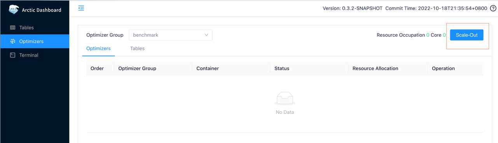
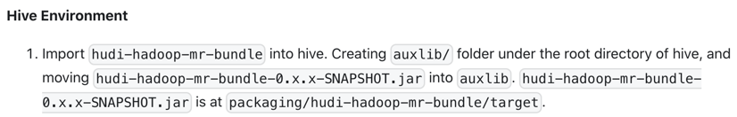

# 环境
## 基础软件
### Mysql
Mysql 主要是用来生产 TPCC 数据然后通过同步工具同步到 Arctic，Hudi，Iceberg 等数据湖中。本文档使用5.7，mysql8 也可以。
安装可以参考下列文档：[Mysql-Install](mysql-install.md),此为 Mysql mgr 集群模式，用户可以只安装一个节点即可。

### Hadoop
Hadoop体系包含 Hdfs,Yarn,Hive。安装方式有很多，可以选择 Ambari 安装，安装文档可以参考：[Ambari-Install](ambari-hadoop-install.md)

### Trino
Trino 主要是用来最终执行 TPCH 查询，是最主要的一环。当前使用380版本

[Trino-Install](https://trino.io/docs/current/installation/deployment.html)

如果要测试 Arctic 需要安装配置 Arctic 插件：

[Arctic-Plugin-Install](mysql-install.md)

如果需要测试 Iceberg 需要配置 Iceberg 插件：

[Iceberg-Plugin-Install](https://trino.io/docs/current/connector/iceberg.html)

### Presto
Hudi 的 rt 表的查询也就是实时查询目前不支持 Trino，只支持 Presto,如果需要测试 Hudi 需要安装配置 Presto。

[Presto-Install](https://prestodb.io/docs/current/installation/deployment.html)

配置 Hudi 插件：

[Hudi-Plugin-Install](https://prestodb.io/docs/current/connector/hudi.html)

### Ams
Arctic 的元数据服务，当前使用0.4版本，如果需要测试 Arctic 需要安装此服务

[Ams-Install](../meta-service/dashboard.md)

根据文档描述，配置一个 optimize-group 例如名称 "benchmark-group"，然后在页面

点击 Scale-Out 按钮启动 optimize 服务。

##测试工具

### data-lake-benchmark
Benchmark 的核心工具，负责生成 TPCC 数据进 Mysql 和通过 Trino 执行 ap 标准查询语句，最后输出 Benchmark 结果。注意这个工具需要 java17。

[Oltpbench-Install](https://github.com/NetEase/data-lake-benchmark#readme)

###同步工具
暂略

#测试流程
- 把 Mysql 信息配置进 data-lake-benchmark 的 config/mysql/sample_chbenchmark_config.xml 文件中。其中 "scalefactor" 表示的 warehouse 数量用于控制整体数据量的，一般选择10或者100。
- 执行 data-lake-benchmark 命令往 Mysql 生成全量数据，命令如下：
  ```
  java -jar lakehouse-benchmark.jar -b tpcc,chbenchmark -c config/mysql/sample_chbenchmark_config.xml --create=true --load=true
  ```
  执行完了以后 Mysql 的指定数据库下面就能看到这12张表：warehouse,item,stock,district,customer,history,oorder,new_order,order_line,region,nation,supplier
- 同步工具步骤暂略。
- 当全量同步完了，这时候可以用 data-lake-benchmark 工具进行全量静态数据的测试。首先把 Trino 信息配置进 data-lake-benchmark 的 config/trino/trino_chbenchmark_config.xml中,主要是 url 要改成当前 Trino 的地址，
  还有 works.work.time 参数表示 Benchmark 运行时间，单位是秒，全量测试时间可以短一点10分钟左右就行。命令如下：
  ```
  java -jar lakehouse-benchmark.jar -b chbenchmarkForTrino -c config/trino/trino_chbenchmark_config.xml --create=false --load=false --execute=true
  ```
- 再次启动 data-lake-benchmark 程序向 Mysql 里面生产增量数据，这些数据会通过已经运行的数据同步工具源源不断写入 Arctic，
  需要修改 config/mysql/sample_chbenchmark_config.xml配置文件中的works.work.time参数控制生成时间，一般半小时，命令如下：
  ```
  java -jar lakehouse-benchmark.jar -b tpcc,chbenchmark -c config/mysql/sample_chbenchmark_config.xml --execute=true -s 5
  ```
- 在mysql生产增量数据的同时，启动 data-lake-benchmark 的 TPCH 性能测试命令，其中执行时间要和生成增量的时间相同：
  ```
  java -jar lakehouse-benchmark.jar -b chbenchmarkForTrino -c config/trino/trino_chbenchmark_config.xml --create=false --load=false --execute=true
  ```
- 重复上两个步骤就可以得到增量30分钟，60分钟，90分钟，120分钟的性能测试报告。

## Hudi
上述测试流程在测试 Hudi 的时候需要做一些补充:
1. 首先 Hudi 的 rt 表也就是走 MOR 读取的表只有 Presto 支持，所以需要用 Presto 作为最终的 ap 引擎，
   需要使用config/trino/presto_chbenchmark_config.xml配置
2. Hudi 使用 Hive 的元数据的时候需要额外添加一些依赖，官网描述见 [Hudi](https://hudi.apache.org/docs/syncing_metastore)
   主要是:

   
4. Hudi 的表名是带有后缀的，ro 表示读优化表，rt 表示全量表，可以在执行 data-lake-benchmark 程序之前设置环境变量如：
   ```
   export tpcc_name_suffix=_rt
   ```
## 测试结果
data-lake-benchmark 跑完以后会生成一个 results 目录，测试结果都在里面，主要关注两个文件，第一：.summary.json 文件，
这里面的 Average Latency 项显示的是本次性能测试的平均相应时间，第二：.statistic.csv 文件，里面记录了每个 Query 类型的最大，最小，平均耗时。

## docker流程
benchmark还提供了一套docker容器，可以帮助用户单机版本熟悉流程。工程地址 [benchmark-url](https://github.com/NetEase/lakehouse-benchmark)。
在docker/benchmark目录下又相应的镜像构建和运行文件，具体说明见docker/benchmark/README.md