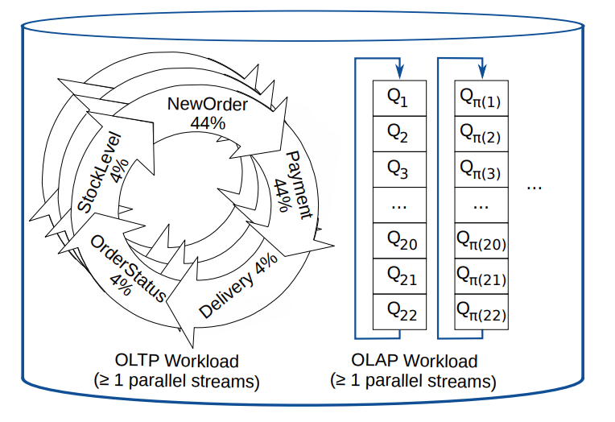
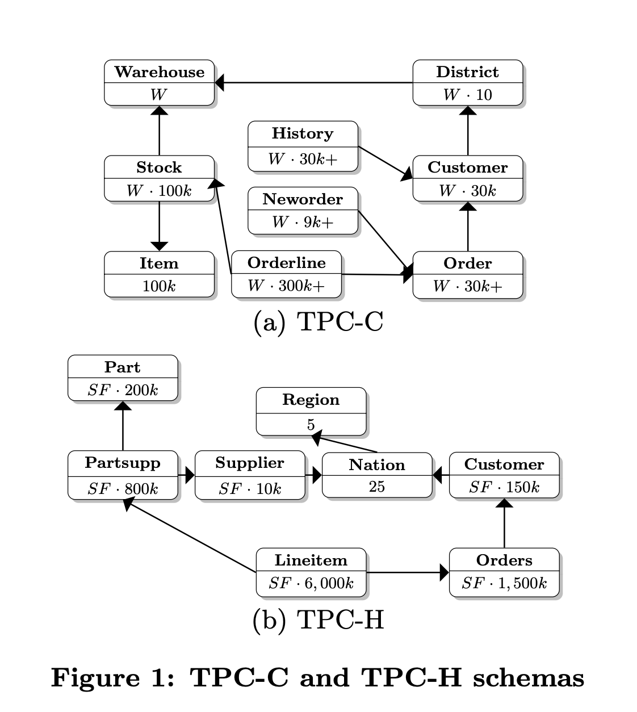
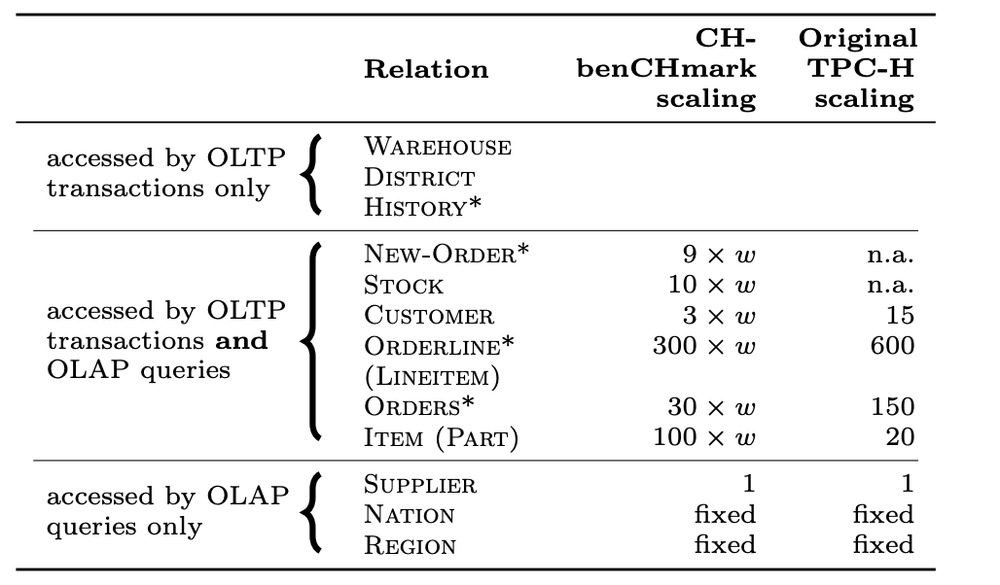
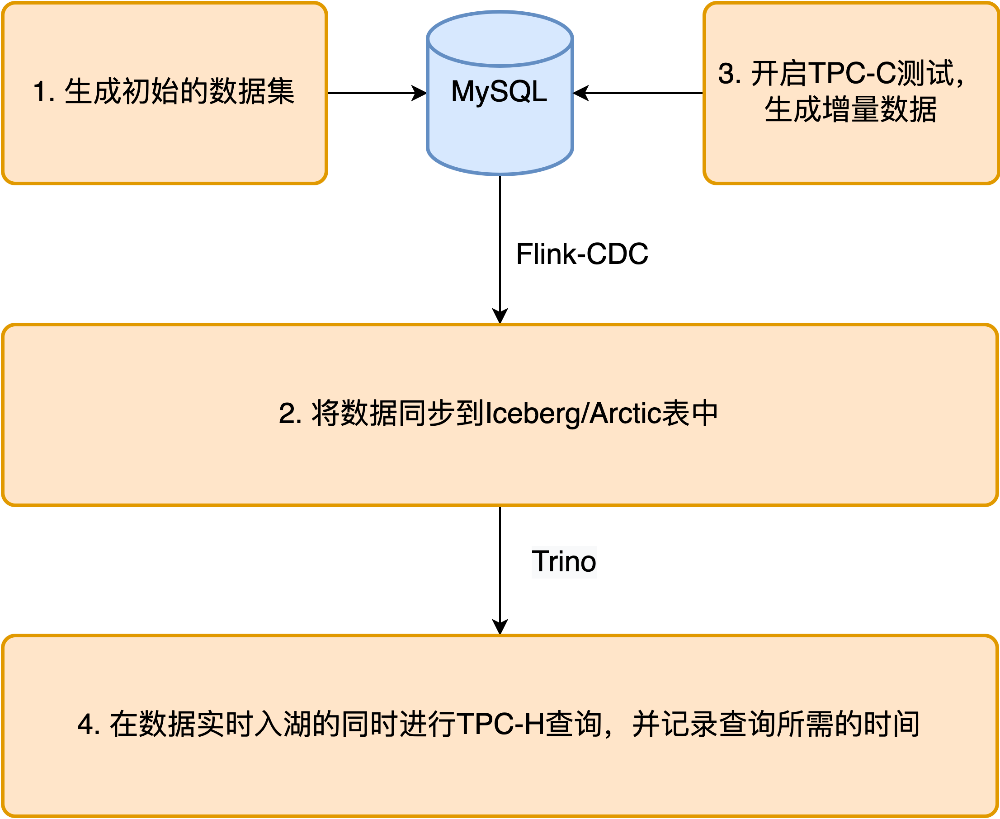
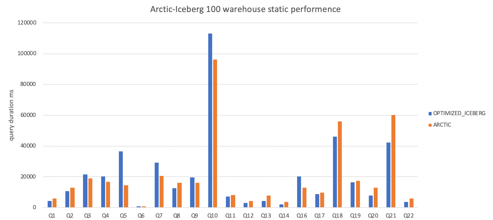
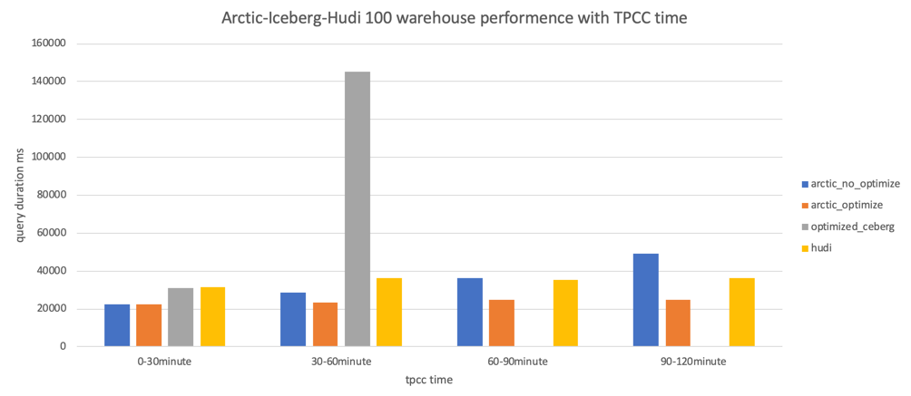
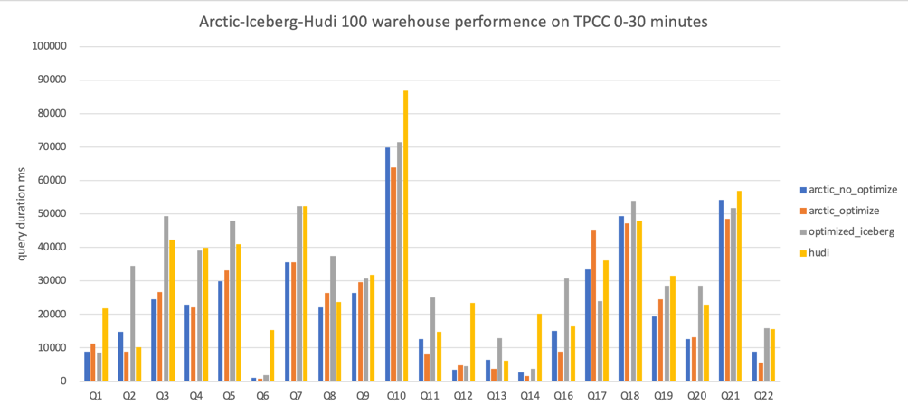
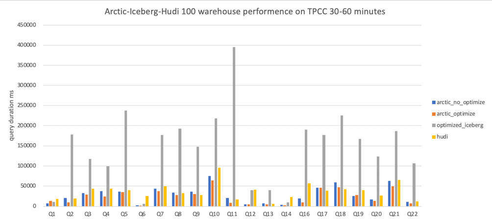
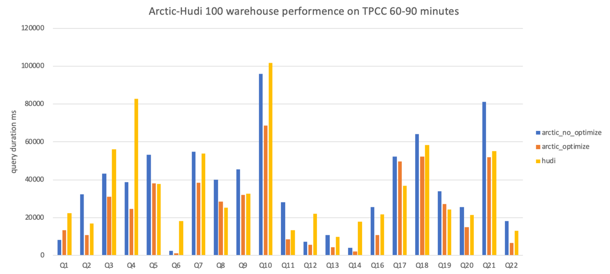
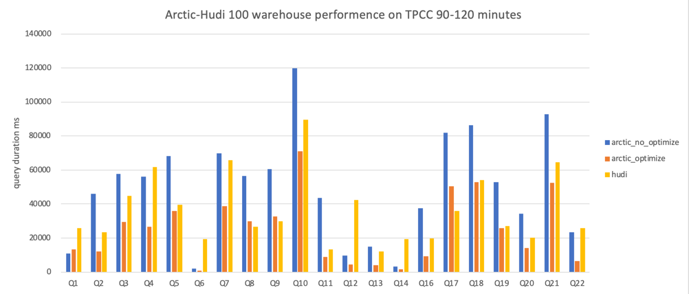

# Lakehouse 性能对比测试报告

## 测试目标
此次测试目标是比较在数据库 CDC 持续流式摄取的场景下，各个数据湖 Format 的 OLAP benchmark 性能。

## 测试环境
### 机器环境

| 编号 | 操作系统 | cpu 线程数 | 内存 | 磁盘类型 |
| ---- | -------- | --------- | ---- | -------- |
| 1    | CentOS 7 | 40        | 256  | SAS      |
| 2    | CentOS 7 | 40        | 256  | SAS      |
| 3    | CentOS 7 | 40        | 256  | SAS      |
| 4    | CentOS 7 | 40        | 256  | SAS      |
| 5    | CentOS 7 | 40        | 256  | SAS      |
| 6    | CentOS 7 | 40        | 256  | SAS      |

### 软件环境

Trino 版本：380(用于 Iceberg 和 Arctic的测试)

Presto: 274(用于 Hudi 的测试，Trino 不支持 Hudi 的 MOR 实时查询)

Iceberg 版本：0.13  （由于开源的 iceberg 在 trino 查询中的性能非常低，所以后面的测试均采用的是内部优化过后的版本，相关优化也提交社区见: https://github.com/apache/iceberg/issues/5245, https://github.com/apache/iceberg/pull/5264）

Arctic 版本：0.3

1，2，3机器部署 Hadoop 集群包括 Hive，Yarn，HDFS，最终 Iceberg 和 Arctic 的数据是落在这三台机器上并且负责 Flink 写入任务，MySQL 服务。

4，5，6机器部署查询 Trino 查询引擎，部署了3个节点每个节点设置64G内存。

## 测试方案

### CHbenchmark

本次测试规范基于 CHbenchmark，CHbenchmark 是一个集成了 TPCC 和 TPCH 的混合测试标准，测试负载整体上可分成两类：

- 基于 TPC-C 的5个 OLTP 型负载：NewOrder, Payment, OrderStatus, Delivery 和 StockLevel

- 基于 TCP-H 改写的22个 OLAP 型负载，其中由于 Q15 查询和视图相关，此次测试并没有做视图改写故舍弃了 Q15

{:height="60%" width="60%"}

### 基于 TPC-C 的数据构造

基于 TPC-C 标准，本次测试在 MySQL 中构造了原始数据，数据集总共包括12张表，其中 TPC-C 和 TPC-H 表的关系如下图所示：

{:height="60%" width="60%"}

此外，各个数据表数据规模间的联系如下表所示，其中 w 表示 warehouse 的数量。可以观察到中间的 new_order, stock 等表的数据规模受到 warehouse 数量的影响，
因此在测试过程中可以通过控制 warehouse 的数量来调整数据集的规模。

{:height="60%" width="60%"}

在本次测试中，设置 warehouse 数量为100，MySQL 数据库中对应的初始数据集大小约为10G。下表展示了初始数据集下各张表的数据记录数以及开启一小时 TPC-C 测试后各张表的数据记录变化情况。

| 表名称     | 初始数据集下表的记录数（行） | 开启一小时TPCC测试后表的记录数（行） |
| ---------- | ---------------------------- | ------------------------------------ |
| warehouse  | 100                          | 100                                  |
| item       | 100000                       | 100000                               |
| stock      | 10000000                     | 10000000                             |
| district   | 1000                         | 1000                                 |
| customer   | 3000000                      | 3000000                              |
| history    | 3000000                      | 3119285（+119285）                   |
| oorder     | 3000000                      | 3124142（+124142）                   |
| new_order  | 893709                       | 907373（+13664）                     |
| order_line | 29996774                     | 31252799（+1256025）                 |
| region     | 5                            | 5                                    |
| nation     | 62                           | 62                                   |
| supplier   | 1000                         | 1000                                 |

### 基于TPC-H的查询场景

TPC-H 面向模拟的业务系统设计了22个 Query ，受限于篇幅，这里列举前3条 Query 语句作为参考：
```
-- SQL编号：query1 
SELECT ol_number,
    sum(ol_quantity) AS sum_qty,
    sum(ol_amount) AS sum_amount,
    avg(ol_quantity) AS avg_qty,
    avg(ol_amount) AS avg_amount,
    count(*) AS count_order
FROM order_line
WHERE ol_delivery_d > '2007-01-02 00:00:00.000000'
GROUP BY ol_number
ORDER BY ol_number;
        
 -- SQL编号：query2 
SELECT su_suppkey,
    su_name,
    n_name,
    i_id,
    i_name,
    su_address,
    su_phone,
    su_comment
FROM item, supplier, stock, nation, region, 
    (SELECT s_i_id AS m_i_id,
        MIN(s_quantity) AS m_s_quantity
    FROM stock, supplier, nation, region
    WHERE MOD((s_w_id*s_i_id), 10000) = su_suppkey
        AND su_nationkey = n_nationkey
        AND n_regionkey = r_regionkey
        AND r_name LIKE 'Europ%'
    GROUP BY s_i_id) m
WHERE i_id = s_i_id
    AND MOD((s_w_id * s_i_id), 10000) = su_suppkey
    AND su_nationkey = n_nationkey
    AND n_regionkey = r_regionkey
    AND i_data LIKE '%b'
    AND r_name LIKE 'Europ%'
    AND i_id=m_i_id
    AND s_quantity = m_s_quantity
ORDER BY n_name, su_name, i_id;
        
 -- SQL编号：query3 
SELECT ol_o_id,
    ol_w_id,
    ol_d_id,
    sum(ol_amount) AS revenue,
    o_entry_d
FROM customer, new_order, oorder, order_line
WHERE c_state LIKE 'A%'
    AND c_id = o_c_id
    AND c_w_id = o_w_id
    AND c_d_id = o_d_id
    AND no_w_id = o_w_id
    AND no_d_id = o_d_id
    AND no_o_id = o_id
    AND ol_w_id = o_w_id
    AND ol_d_id = o_d_id
    AND ol_o_id = o_id
    AND o_entry_d > '2007-01-02 00:00:00.000000'
GROUP BY ol_o_id, ol_w_id, ol_d_id, o_entry_d
ORDER BY revenue DESC, o_entry_d;
```
### 测试整体流程

1. 基于 TPC-C 标准在 MySQL 中生成初始的数据集

2. 使用 Flink-CDC 将 MySQL 中的数据导入到 Iceberg/Arctic/Hudi 表中

3. 开启 TPC-C 测试，OLTP 型负载会不断生成增量数据，同时 Flink-CDC 将这部分增量数据实时同步到 Iceberg/Arctic 表中

4. 基于 TPC-H 标准，通过 Trino 进行查询，并记录每个查询花费的时间以及所有查询的平均查询时间

{:height="60%" width="60%"}

## 测试结果

## 静态数据


上图表示100个 warehouse 数据量下，纯静态数据没有更新的情况下，10个查询并发 Mixed Iceberg 和 Iceberg 查询性能比较，通过上图可以看出每个 Query 的查询耗时非常接近。

## 动态持续查询性能



在测试时间内 TPCC 持续进行，横轴表示的是查询的时间范围，纵轴表示21个查询（去除Q15）的平均时间，基础静态数据量为100个 warehouse, 查询并发数是10。

mixed iceberg without self-optimizing：表示的是不带自优化的 Mixed Iceberg 表

mixed iceberg with self-optimizing：表示的是带自优化的 Mixed Iceberg 表

native iceberg with self-optimizing：表示的是带自优化的 Native Iceberg 表

hudi with inline-compaction：表示的是带有 Compaction 的 Hudi 表

具体query详情见下图：









# 小结

- 静态数据情况下 Mixed Iceberg 和 Iceberg 的查询性能几乎相同，但是随着 TPCC 的进行，CDC 数据的增多，不带 Self-Optimizing 的 Mixed Iceberg 和 Iceberg 的性能都会线性增长，
  而带有 Self-Optimizing 的表都能稳定在一个合理的范围内
- Hudi 的性能因为写入任务自带 Self-Optimizing，所以查询性能也能很好的收敛，总体是优于不带 Self-Optimizing 的 Mix Iceberg，弱于带 Self-Optimizing 的 Mixed Iceberg 和 Native Iceberg。
   