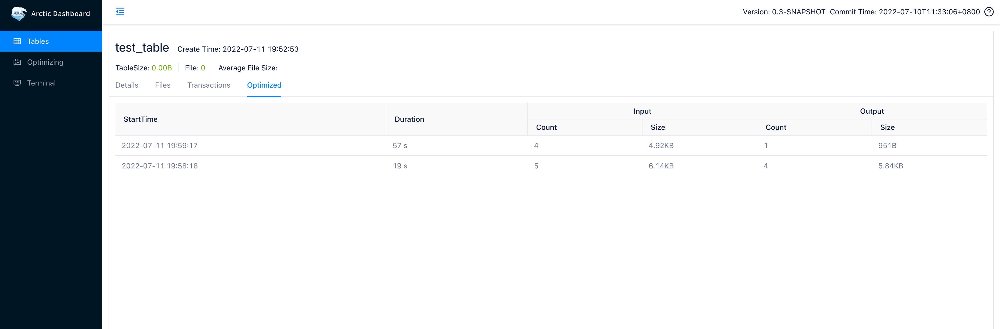
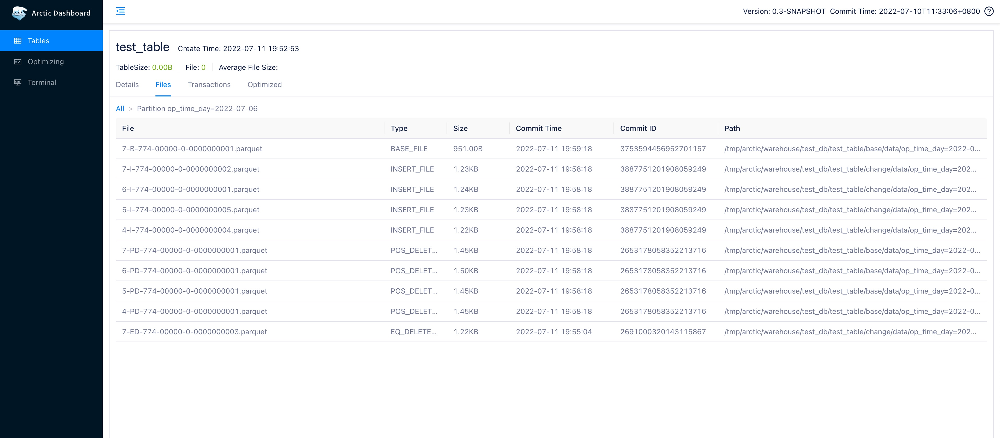

# 使用Docker快速开始
本指南将用Docker帮助您快速启动并部署AMS(Arctic Meta Service),Spark和Flink环境，并体验Arctic的各种功能。

## Docker-Compose
使用Docker-Compose将很快帮助您搭建起一套Arctic使用所需的环境，相关镜像已上传到Docker Hub中。[arctic163/ams](https://hub.docker.com/repository/docker/arctic163/ams)镜像已包含AMS及所需环境。[arctic163/flink](https://hub.docker.com/repository/docker/arctic163/flink)镜像已包含Flink及所需环境。(Spark相关镜像已上传到[arctic163/spark](https://hub.docker.com/repository/docker/arctic163/spark)，如有需要请您自行拉取使用)
  
要使用Docker以及Docker-Compose，您需要安装[Docker CLI](https://docs.docker.com/get-docker/)以及[Docker Compose CLI](https://github.com/docker/compose-cli/blob/main/INSTALL.md)。  
  
如果您已经万事俱备，请新建一个名为```docker-compose.yml```的文件，并写入以下内容。您也可以在[docker-compose.yml](https://github.com/NetEase/arctic/tree/master/docker/docker-compose.yml)处查看。  
```yaml
version: "3"
services:
  ams:
    image: arctic163/ams
    container_name: ams
    volumes:
      - ./data:/tmp/arctic/warehouse
    ports:
      - 1630:1630
      - 1260:1260
    networks:
      - arctic_network
    tty: true
    stdin_open: true
  flink:
    image: arctic163/flink
    depends_on:
      - ams
    container_name: arctic_flink
    volumes:
      - ./data:/tmp/arctic/warehouse
    ports:
      - 8081:8081
    networks:
      - arctic_network
    tty: true
    stdin_open: true

networks:
  arctic_network:
    driver: bridge
```
然后，请在您的docker-compose.yml文件所在目录下，使用以下命令启动docker容器：
```shell
docker-compose up -d
```
启动成功后，使用```docker ps```命令查看当前已启动的容器，您将看到两个个容器，分别为ams和arctic_flink。 
## 启动AMS
如[概述](index.md)中所述，AMS(Arctic Meta Service)是Arctic中负责元数据管理与结构优化的独立服务，使用Arctic的第一步就是启动AMS。  

**1.启动AMS**  

我们已经在ams容器中自动为您启动了AMS服务，如果您的ams容器已经启动成功，可通过 [AMS Dashboard](http://localhost:1630) 来访问ams页面，默认的用户名密码为：`admin/admin`。

**2.启动Optimizer**

AMS中的optimizer负责自动为表进行结构优化，AMS默认配置下会有一个类型为local的optimizer group，这里需要在此group下创建一个optimizer。
进入AMS的Optimizing页面，选择Optimizers。


点击`Scale-Out`按钮选择对应`Optimizer Group`并且配置optimizer并发度，点击OK后即完成了optimizer的创建。


### 建表

登录并进入[AMS Dashboard](http://localhost:1630)，通过左侧菜单进入`Terminal`页面，在SQL输入框中输入下面的SQL并执行：

```sql
create database test_db;
create table test_db.test_table(
  id int,
  name string,
  op_time timestamp,
  primary key(id)
) partitioned by(days(op_time)) using arctic;
```

## 实时写入与读取
入门试用推荐使用 [Flink SQL Client](https://nightlies.apache.org/flink/flink-docs-release-1.12/dev/table/sqlClient.html),
将任务提交到 [Flink Standalone](https://nightlies.apache.org/flink/flink-docs-release-1.12/deployment/resource-providers/standalone/)
的集群上运行。

**1.启动flink sql client**  

使用以下命令进入arctic_flink容器。
```shell
docker exec -it arctic_flink /bin/bash
```

启动flink sql client:
```shell
./bin/start-cluster.sh
./bin/sql-client.sh embedded
```
**2.启动 Flink 实时任务**  

在sql client中输入下面的sql:

```sql
-- 创建 catalog
CREATE CATALOG arctic WITH (
  'type' = 'arctic',
  'metastore.url'='thrift://ams:1260/local_catalog'
);
-- 创建 CDC Socket 源表
CREATE TABLE cdc_source(
  id      INT,
  name    STRING,
  op_time STRING
) WITH (
    'connector' = 'socket',
    'hostname' = 'localhost',
    'port' = '9999',
    'format' = 'changelog-csv',
    'changelog-csv.column-delimiter' = '|'
);
-- 往 Arctic 表实时写入数据
INSERT INTO arctic.test_db.test_table
SELECT id,
       name,
       CAST(TO_TIMESTAMP(op_time) AS TIMESTAMP(6) WITH LOCAL TIME ZONE) op_time
FROM cdc_source;

-- 打开表的动态配置 HINT
SET table.dynamic-table-options.enabled=true;

-- 读 Arctic 表的 CDC 数据，观察主键表的聚合结果
SELECT id, `name` FROM arctic.test_db.test_table/*+OPTIONS('streaming' = 'true')*/;
```

**3.模拟测试数据**  

打开一个新的arctic_flink容器窗口。(注意，不是创建一个新的容器)  
```shell
docker exec -it arctic_flink /bin/bash
```
在新的窗口中执行下面的命令以往socket中写入CDC数据：
```shell
nc -lk 9999
```
输入测试数据，可以一条一条输入观察中间过程，也可以全量复制粘贴，观察最终结果。

```text
INSERT|1|eric|2022-07-01 12:32:00
INSERT|2|frank|2022-07-02 09:11:00
DELETE|2|frank|2022-07-02 09:11:00
INSERT|3|lee|2022-07-01 10:11:00
INSERT|4|rock|2022-07-02 09:01:00
INSERT|5|jack|2022-07-02 12:11:40
INSERT|6|mars|2022-07-02 11:19:10
```

此时预期的结果集为：

```text
+---+----+
| id|name|
+---+----+
|  1|eric|
|  3|lee |
|  4|rock|
|  5|jack|
|  6|mars|
+---+----+
```

继续输入数据：

```text
DELETE|1|eric|2022-07-01 12:32:00
INSERT|7|randy|2022-07-03 19:11:00
DELETE|4|rock|2022-07-02 09:01:00
DELETE|3|lee|2022-07-01 10:11:00
```

此时预期的结果集为：

```text
+---+-----+
| id|name |
+---+-----+
|  5|jack |
|  6|mars |
|  7|randy|
+---+-----+
```
### 批量修改

**1.查询已有数据**

登录并进入[AMS Dashboard](http://localhost:1630)，通过左侧菜单进入`Terminal`页面，如果按照流程完成了[实时写入与读取](#_3)，在SQL窗口输入并执行如下SQL：

```sql
select * from test_db.test_table order by id;
```

预期将会得到如下结果：

```text
+---+-----+-------------------+
| id| name|            op_time|
+---+-----+-------------------+
|  5| jack|2022-07-02 12:11:40|
|  6| mars|2022-07-02 11:19:10|
|  7|randy|2022-07-03 19:11:00|
+---+-----+-------------------+
```

如若未完成[实时写入与读取](#_3)，也可以通过下面的SQL补充数据：

```sql
insert overwrite 
  test_db.test_table
values
  (5, 'jack', timestamp('2022-07-02 12:11:40')),
  (6, 'mars', timestamp('2022-07-02 11:19:10')),
  (7, 'randy', timestamp('2022-07-03 19:11:00'));
```

**2.批量修改数据**

可以通过下执行下面的SQL批量修改表中的数据：

```sql
set spark.sql.sources.partitionOverwriteMode=DYNAMIC;
insert overwrite 
  test_db.test_table
values
  (5, 'peter', timestamp('2022-07-02 08:11:40')),
  (8, 'alice', timestamp('2022-07-04 19:11:00'));
```

**3.查询修改结果**

重新查询表中的数据：

```sql
select * from test_db.test_table order by id;
```

预期将会得到如下结果：

```text
+---+-----+-------------------+
| id| name|            op_time|
+---+-----+-------------------+
|  5|peter|2022-07-02 08:11:40|
|  7|randy|2022-07-03 19:11:00|
|  8|alice|2022-07-04 19:11:00|
+---+-----+-------------------+
```

## 结构优化

**1.查看结构优化状态**

启动optimizer之后，表的结构优化会自动触发。
登录并进入[AMS Dashboard](http://localhost:1630)，从左侧菜单进入到`Optimizing`页面，在`Tables`目录下可以看到当前所有表的结构优化状态。


其中：

- Status：结构优化的状态，可能为：Idle，Pending，MinorOptimizing，MajorOptimizing

- Duration：进入到该状态的持续时间

- File Count：准备或者正在进行合并的文件个数

- File size：准备或者正在进行合并的文件大小

- Quota：表的资源配额

- Quota Occupation：最近1个小时内，该表的实际配额占用百分比

**2.查看结构优化历史**

从左侧菜单进入到`Tables`页面，选择测试表并进入到`Optimized目录`可以看到表的历史结构优化记录。
如果已经完成[实时写入与读取](#实时写入与读取)，测试表预期会进行两次结构优化，分别是一次minor optimize, 一次major optimize。



上图中，第一行提交为 major optimize，第二行提交为 minor optimize，其中：

- StartTime：结构优化的开始时间

- Duration：结构优化的持续时间

- Input：合并之前的文件个数和文件大小

- Output：合并生成的文件个数和文件大小

两次 Optimize 之后，文件情况如下



新增的4个 pos-delete 是 minor optimize 的结果，而新增的一个 base file 是 major optimize 的最终结果，由于当前的 pos-delete 的数据量还比较少，因此 major optimize 并没有将它们删除。

更多有关结构优化的相关信息可以查看[结构优化的具体介绍](table-structure.md#_3)。
