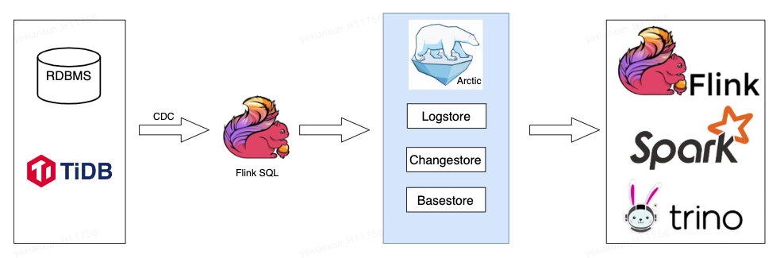
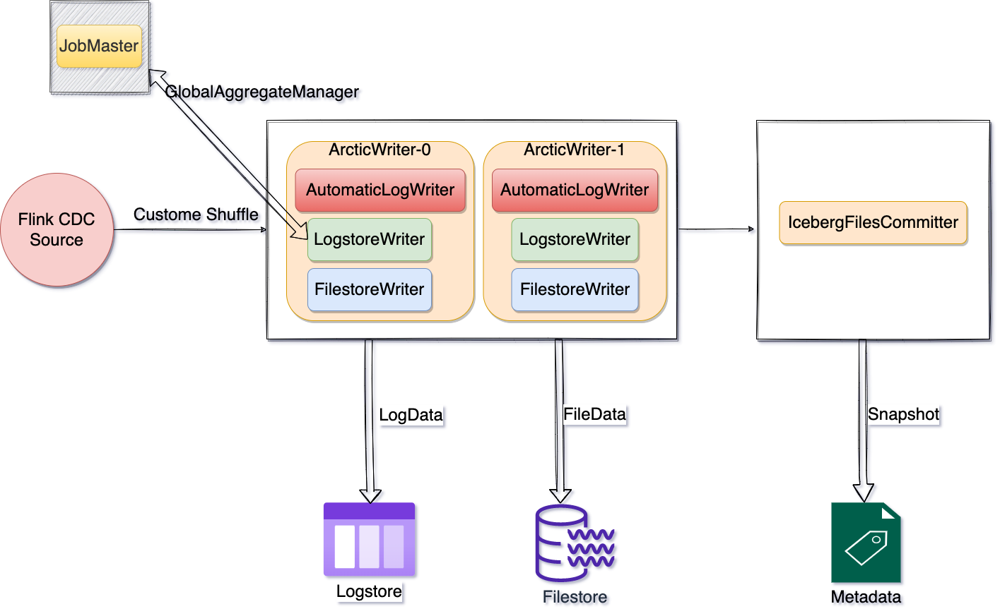

#Flink CDC 入湖 Arctic
CDC 是 Change Data Capture 的缩写，这是一个宽泛的概念，只要能捕捉到变化的数据，就可以称为CDC。Flink CDC 是一个基于 Log 消息的数据捕获工具，所有存量和增量数据都可以被捕获。以 Mysql 为例，其可以轻松通过 Debezium 采集 Binlog 数据并实时处理计算发送到 Arctic 数据湖中。后续可以通过其他引擎查询 Arctic 数据湖。

{:height="80%" width="80%"}

## 入湖
Flink CDC Connector 捕获数据库数据包含四种 RowKind: UPDATE_BEFORE, UPDATE_AFTER, DELETE and INSERT，Flink on Arctic Connector 也支持四种数据写入到 Arctic 数据湖。
后续通过 Flink 引擎增量读取 Arctic 数据湖，也可以回放 CDC 数据。

以下简单案例将 MySQL CDC 数据写入到 Arctic 数据湖
```sql
CREATE TABLE user_info (
    id int,
    name string,
    insert_time timestamp,
    primary key (id) not enforced)
WITH (
 'connector'='mysql-cdc',
 'hostname'='localhost',
 'port' = '3306',
 'username' = 'root',
 'password' = '123456',
 'database-name' = 'testdb',
 'table-name'='user_info');
 
CREATE TABLE IF NOT EXISTS arctic.db.user_info(
    id int,
    name string, 
    insert_time timestamp,
    primary key (id) not enforced
);

INSERT INTO arctic.db.user_info select * from user_info;
```

### 自动开启双写
可通过以下方式，Flink 入湖任务自动将数据写入到 LogStore，而不需要手动重启任务。适用场景：数据库存量加增量数据入湖，存量数据写入 FileStore 进行批计算，最新数据写入 LogStore 进行实时计算。

```sql
CREATE TABLE source (
    id int,
    opt timestamp(3),
    WATERMARK FOR opt AS opt,
) WITH (
    'connector'='mysql-cdc'...
);

INSERT INTO arctic.db.table 
/*+ OPTIONS('arctic.emit.mode'='auto','arctic.emit.auto-write-to-logstore.watermark-gap'='60s') */
 SELECT * FROM source;
```
> 
> 前提
>
> - Arctic 表需要开启 LogStore。
> 
> - Source 表需要配置 Watermark。

{:height="80%" width="80%"}

当 AutomaticLogWriter 算子收到的 Watermark 大于等于当前时间减去配置的 GAP 时间，便会将后面新的数据写入到 LogStore。

### 开启 Upsert 功能
开启 UPSERT 功能后相同主键的多条 insert 数据会在表结构优化过程中合并，保留后面插入的 insert 数据。

```sql
INSERT INTO arctic.db.user_info
/*+ OPTIONS('arctic.emit.mode'='file','write.upsert.enabled'='true') */
select * from user_info;
```

> LIMITATION
> 
> 目前不支持部分字段更新


### 增量一体化读取
CDC 数据入湖后，可以在通过 Flink 引擎在一个任务读取存量和增量数据，不需要任务重启，并且能够保证数据一致性读取。Arctic Source 会将 File Offset 信息保存在 Flink State。

```sql
-- 在当前 session 中以流的模式运行 Flink 任务
SET execution.runtime-mode = streaming;

-- 以无界的方式读取存量和增量数据
SELECT * FROM arctic.db.user_info
/*+ OPTIONS('arctic.read.mode'='file','streaming'='true') */
```
相关参数配置可以参考[这里](flink-dml.md#filestore_1)

### Changelog 增量读取
可以通过 Flink 引擎增量读取 Arctic 数据湖 ChangeStore 中 CDC 数据。

```sql
-- 在当前 session 中以流的模式运行 Flink 任务
SET execution.runtime-mode = streaming;

-- 以无界的方式增量数据
SELECT * FROM arctic.db.user_info
/*+ OPTIONS('arctic.read.mode'='file','streaming'='true','scan.startup.mode'='latest') */
```

相关参数配置可以参考[这里](flink-dml.md#filestore_1)
