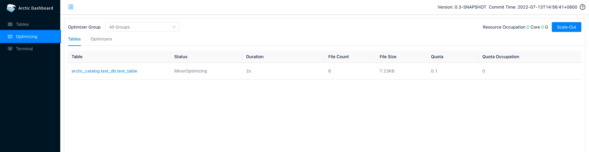
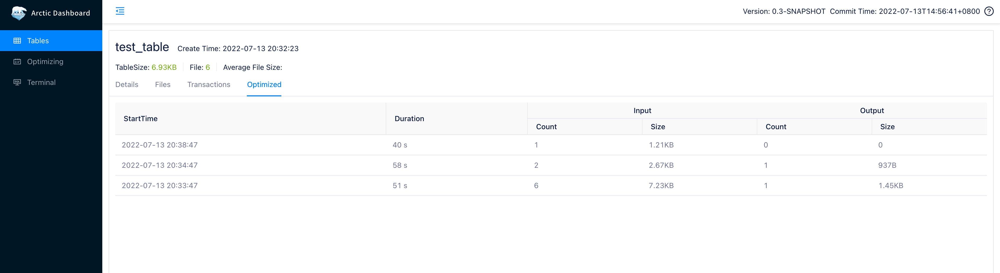
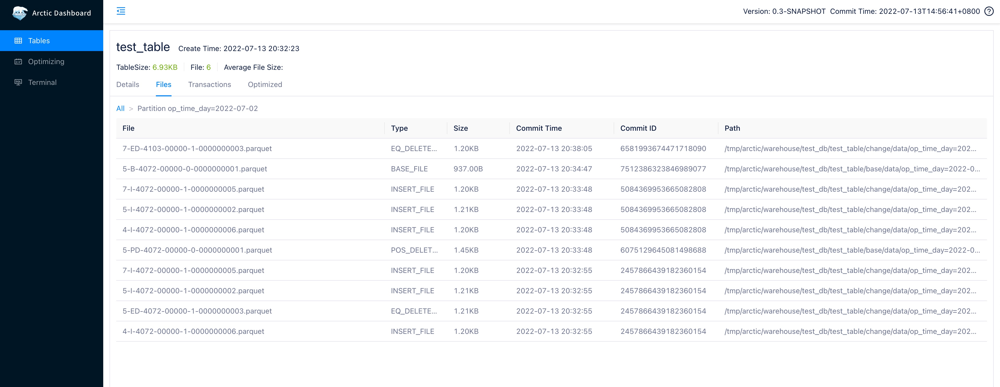

# 快速开始

## 部署AMS

如[概述](index.md)中所述，AMS(Arctic Meta Service)是Arctic中负责元数据管理与结构优化的独立服务，使用Arctic的第一步就是部署AMS。

**1.下载AMS安装包**

AMS依赖 Java8 环境，你可以通过以下命令来检查 Java 是否已经安装正确。
```shell
java -version
```
[下载](https://github.com/NetEase/arctic/releases/download/v0.3.0-rc1/arctic-0.3.0-bin.zip)最新版的AMS并解压。

**2.启动AMS**

通过如下命令启动AMS：

```shell
./bin/ams.sh start
```

启动后即可通过 [AMS Dashboard](http://localhost:1630) 来访问ams页面，默认的用户名密码为：`admin/admin`。

**3.启动Optimizer**

AMS中的optimizer负责自动为表进行结构优化，AMS默认配置下会有一个类型为local的optimizer group，这里需要在此group下创建一个optimizer。
进入AMS的Optimizing页面，选择Optimizers。


点击`Scale-Out`按钮选择对应`Optimizer Group`并且配置optimizer并发度，点击OK后即完成了optimizer的创建。


## 建表

登录并进入[AMS Dashboard](http://localhost:1630)，通过左侧菜单进入`Terminal`页面，在SQL输入框中输入下面的SQL并执行：

```sql
create database test_db;
create table test_db.test_table(
  id int,
  name string,
  op_time timestamp,
  primary key(id)
) partitioned by(days(op_time)) using arctic;
```

## 实时写入与读取
入门试用推荐使用 [Flink SQL Client](https://nightlies.apache.org/flink/flink-docs-release-1.12/dev/table/sqlClient.html),
将任务提交到 [Flink Standalone](https://nightlies.apache.org/flink/flink-docs-release-1.12/deployment/resource-providers/standalone/)
的集群上运行。

**1.准备环境**

下载flink和相关依赖：

```shell
FLINK_VERSION=1.12.7
SCALA_VERSION=2.12
APACHE_FLINK_URL=archive.apache.org/dist/flink
HADOOP_VERSION=2.7.5

## 下载 Flink 1.12.x 包，目前 Arctic-flink-runtime jar 包使用 scala 2.12
wget ${APACHE_FLINK_URL}/flink-${FLINK_VERSION}/flink-${FLINK_VERSION}-bin-scala_${SCALA_VERSION}.tgz
## 解压文件
tar -zxvf flink-1.12.7-bin-scala_2.12.tgz

# 下载 hadoop 依赖
wget https://repo1.maven.org/maven2/org/apache/flink/flink-shaded-hadoop-2-uber/${HADOOP_VERSION}-10.0/flink-shaded-hadoop-2-uber-${HADOOP_VERSION}-10.0.jar
# 下载 arctic flink connector
wget https://github.com/NetEase/arctic/releases/download/v0.3.0-rc1/arctic-flink-runtime-1.12-0.3.0.jar
```

修改 Flink 相关配置文件：

```shell
cd flink-1.12.7
vim conf/flink-conf.yaml
```
修改下面的配置：

```yaml
# 需要同时运行两个流任务，增加 slot
taskmanager.numberOfTaskSlots: 4
# 开启 Checkpoint。只有开启 Checkpoint，写入 file 的数据才可见
execution.checkpointing.interval: 10s
```

将依赖移到 Flink 的 lib 目录中：

```shell
# 用于创建 socket connector，以便通过 socket 输入 CDC 数据
cp examples/table/ChangelogSocketExample.jar lib
cp ../arctic-flink-runtime-1.12-0.3.0.jar lib
cp ../flink-shaded-hadoop-2-uber-${HADOOP_VERSION}-10.0.jar lib
```

启动flink sql client:

```shell
./bin/start-cluster.sh
./bin/sql-client.sh embedded
```

**2.启动 Flink 实时任务**

在sql client中输入下面的sql:

```sql
-- 创建 catalog
CREATE CATALOG arctic WITH (
  'type' = 'arctic',
  'metastore.url'='thrift://localhost:1260/local_catalog'
);
-- 创建 CDC Socket 源表
CREATE TABLE cdc_source(
  id      INT,
  name    STRING,
  op_time STRING
) WITH (
    'connector' = 'socket',
    'hostname' = 'localhost',
    'port' = '9999',
    'format' = 'changelog-csv',
    'changelog-csv.column-delimiter' = '|'
);
-- 往 Arctic 表实时写入数据
INSERT INTO arctic.test_db.test_table
SELECT id,
       name,
       CAST(TO_TIMESTAMP(op_time) AS TIMESTAMP(6) WITH LOCAL TIME ZONE) op_time
FROM cdc_source;

-- 打开表的动态配置 HINT
SET table.dynamic-table-options.enabled=true;

-- 读 Arctic 表的 CDC 数据，观察主键表的聚合结果
SELECT id, `name` FROM arctic.test_db.test_table/*+OPTIONS('streaming' = 'true')*/;
```

**3.模拟测试数据**

打开新的窗口，执行下面的命令以往socket中写入CDC数据：

```shell
nc -lk 9999
```

输入测试数据，可以一条一条输入观察中间过程，也可以全量复制粘贴，观察最终结果。

```text
INSERT|1|eric|2022-07-01 12:32:00
INSERT|2|frank|2022-07-02 09:11:00
DELETE|2|frank|2022-07-02 09:11:00
INSERT|3|lee|2022-07-01 10:11:00
INSERT|4|rock|2022-07-02 09:01:00
INSERT|5|jack|2022-07-02 12:11:40
INSERT|6|mars|2022-07-02 11:19:10
```

此时预期的结果集为：

```text
+---+----+
| id|name|
+---+----+
|  1|eric|
|  3|lee |
|  4|rock|
|  5|jack|
|  6|mars|
+---+----+
```

继续输入数据：

```text
DELETE|1|eric|2022-07-01 12:32:00
INSERT|7|randy|2022-07-03 19:11:00
DELETE|4|rock|2022-07-02 09:01:00
DELETE|3|lee|2022-07-01 10:11:00
```

此时预期的结果集为：

```text
+---+-----+
| id|name |
+---+-----+
|  5|jack |
|  6|mars |
|  7|randy|
+---+-----+
```

## 批量修改

**1.查询已有数据**

登录并进入[AMS Dashboard](http://localhost:1630)，通过左侧菜单进入`Terminal`页面，如果按照流程完成了[实时写入与读取](#_3)，在SQL窗口输入并执行如下SQL：

```sql
select * from test_db.test_table order by id;
```

预期将会得到如下结果：

```text
+---+-----+-------------------+
| id| name|            op_time|
+---+-----+-------------------+
|  5| jack|2022-07-02 12:11:40|
|  6| mars|2022-07-02 11:19:10|
|  7|randy|2022-07-03 19:11:00|
+---+-----+-------------------+
```

如若未完成[实时写入与读取](#_3)，也可以通过下面的SQL补充数据：

```sql
insert overwrite 
  test_db.test_table
values
  (5, 'jack', timestamp('2022-07-02 12:11:40')),
  (6, 'mars', timestamp('2022-07-02 11:19:10')),
  (7, 'randy', timestamp('2022-07-03 19:11:00'));
```

**2.批量修改数据**

可以通过下执行下面的SQL批量修改表中的数据：

```sql
set spark.sql.sources.partitionOverwriteMode=DYNAMIC;
insert overwrite 
  test_db.test_table
values
  (5, 'peter', timestamp('2022-07-02 08:11:40')),
  (8, 'alice', timestamp('2022-07-04 19:11:00'));
```

**3.查询修改结果**

重新查询表中的数据：

```sql
select * from test_db.test_table order by id;
```

预期将会得到如下结果：

```text
+---+-----+-------------------+
| id| name|            op_time|
+---+-----+-------------------+
|  5|peter|2022-07-02 08:11:40|
|  7|randy|2022-07-03 19:11:00|
|  8|alice|2022-07-04 19:11:00|
+---+-----+-------------------+
```

## 结构优化

**1.查看结构优化状态**

启动optimizer之后，表的结构优化会自动触发。
登录并进入[AMS Dashboard](http://localhost:1630)，从左侧菜单进入到`Optimizing`页面，在`Tables`目录下可以看到当前所有表的结构优化状态。



其中：

- Status：结构优化的状态，可能为：Idle，Pending，MinorOptimizing，MajorOptimizing

- Duration：进入到该状态的持续时间

- File Count：准备或者正在进行合并的文件个数

- File size：准备或者正在进行合并的文件大小

- Quota：表的资源配额

- Quota Occupation：最近1个小时内，该表的实际配额占用百分比

**2.查看结构优化历史**

从左侧菜单进入到`Tables`页面，选择测试表并进入到`Optimized目录`可以看到表的历史结构优化记录。
如果已经完成[实时写入与读取](#_3)，测试表预期会进行两次结构优化，分别是一次minor optimize, 一次major optimize。



上图中，第一行提交为 major optimize，第二行提交为 minor optimize，其中：

- StartTime：结构优化的开始时间

- Duration：结构优化的持续时间

- Input：合并之前的文件个数和文件大小

- Output：合并生成的文件个数和文件大小

两次 Optimize 之后，文件情况如下



新增的4个 pos-delete 是 minor optimize 的结果，而新增的一个 base file 是 major optimize 的最终结果，由于当前的 pos-delete 的数据量还比较少，因此 major optimize 并没有将它们删除。

更多有关结构优化的相关信息可以查看[结构优化的具体介绍](table-structure.md#_3)。

## 更多

### 使用MySQL作为AMS系统库

**1.修改配置文件**

为使用MySQL作为AMS的系统库需要修改配置文件`conf/config.yaml`将Derby（默认系统数据库）配置修改为MySQL配置，需要修改配置项包括：

```yaml
arctic.ams.mybatis.ConnectionURL: jdbc:mysql://{host}:{port}/{database}  #MySQL服务url
arctic.ams.mybatis.ConnectionDriverClassName: com.mysql.jdbc.Driver      #MySQL jdbc driver
arctic.ams.mybatis.ConnectionUserName: {user}                            #MySQL访问用户名
arctic.ams.mybatis.ConnectionPassword: {password}                        #MySQL访问密码
arctic.ams.database.type: mysql                                          #系统库类型
```

???+note "目前只支持 MySQL 5.x 版本，不支持 MySQL 8"

**2.初始化MySQL表**

根据`conf/ams-init.sql`初始化AMS所需表：

```shell
mysql -h {mysql_host} -P {mysql_port} -u {user} -p {password} {database} < {AMS_HOME_DIR}/conf/ams-init.sql
```

**3.重启AMS**

参考 [AMS重启](#ams_1)

### 使用Flink执行结构优化

**1.新增flink类型container**

新增container通过在`conf/config.yaml`中`containers`增加以下配置:

```yaml
  - name: flinkContainer                                 #Container名称
    type: flink                                          #Container类型，目前支持flink和local两种
    properties:
      FLINK_HOME: /opt/flink/                            #flink安装目录，用于启动flink类型Optimizer
      HADOOP_CONF_DIR: /etc/hadoop/conf/                 #flink任务运行所需hadoop集群配置文件所在目录
      HADOOP_USER_NAME: hadoop                           #提交到yarn集群用户
      JVM_ARGS: -Djava.security.krb5.conf=/opt/krb5.conf #flink任务启动参数，例如需要指定kerberos配置文件
      FLINK_CONF_DIR: /etc/hadoop/conf/                  #flink配置文件所在目录
```

**2.新增optimizer group**

新增optimizer group通过在`conf/config.yaml`中`optimize_group`增加以下配置:

```yaml
  - name: flinkOG                     #optimize group名称，在ams页面中可见
    container: flinkContainer         #optimize group对应flink类型container名称
    properties:
      taskmanager.memory: 1024        #flink job TM内存大小，单位为MB
      jobmanager.memory: 1024         #flink job JM内存大小，单位为MB
```

???+ note

    修改配置文件后需重启AMS服务才可生效，参考[AMS重启](#ams_1)

**3.启动optimizer**

新配置的optimize group中还未启动任何的optimizer，所以还需要登录[AMS Dashboard](http://localhost:1630)手动启动至少一个optimizer。

### 导入hadoop集群

将数据存储在hadoop集群中需新增一个catalog，并在创建和使用arctic表时使用该catalog即可。

新增catalog通过在`conf/config.yaml`中`catalogs`中增加以下配置：

```yaml
  - name:                           #catalog名称
    type: hadoop
    storage_config:
      storage.type: hdfs
      core-site:                    #hadoop集群core-site.xml配置文件绝对路径
      hdfs-site:                    #hadoop集群hdfs-site.xml配置文件绝对路径
    auth_config:
      type: SIMPLE                  #认证类型，目前支持KERBEROS和SIMPLE两种类型
      hadoop_username: hadoop       #访问hadoop集群用户名
    properties:
      warehouse.dir: hdfs://default/default/warehouse         #hadoop集群仓库地址
```

如果需要使用KERBEROS认证方式访问hadoop集群可以修改catalog中auth_config如下：

```yaml
    auth_config:
      type: KERBEROS                       #认证类型，目前支持KERBEROS和SIMPLE两种类型
      principal: user/admin@EXAMPLE.COM    #kerberos认证主体
      keytab: /etc/user.keytab             #kerberos密钥文件
      krb5: /etc/user.conf                 #kerberos配置文件
```

???+ note

    修改配置文件后需重启AMS服务才可生效，参考[AMS重启](#ams_1)

### 修改系统配置

AMS所有配置项同样在`conf/config.yaml`文件中:

```yaml
  arctic.ams.server-host: 127.0.0.1                #ams thrift服务绑定host，需配置ams所在机器ip或可访问的hostname
  arctic.ams.thrift.port: 1260                     #thrift服务端口
  arctic.ams.http.port: 1630                       #http服务端口，即ams页面端口
  arctic.ams.optimize.check.thread.pool-size: 10   #table optimize task任务运行时信息同步任务线程池大小
  arctic.ams.optimize.commit.thread.pool-size: 10  #optimize task异步commit线程池大小
  arctic.ams.expire.thread.pool-size: 10           #执行arctic表快照过期任务线程池大小
  arctic.ams.orphan.clean.thread.pool-size: 10     #删除arctic表过期快照及文件任务线程池大小
  arctic.ams.file.sync.thread.pool-size: 10        #同步表文件信息任务线程池大小
```

???+ note

    修改配置文件后需重启AMS服务才可生效，参考[AMS重启](#ams_1)

### AMS重启

所有`conf/config.yaml`的需改都需要重启后才能生效，可以通过下面的名称重启AMS：

```shell
./bin/ams.sh restart
```