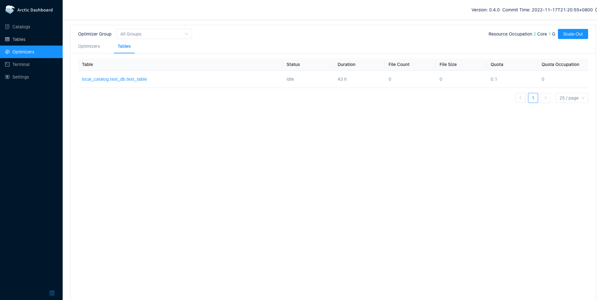
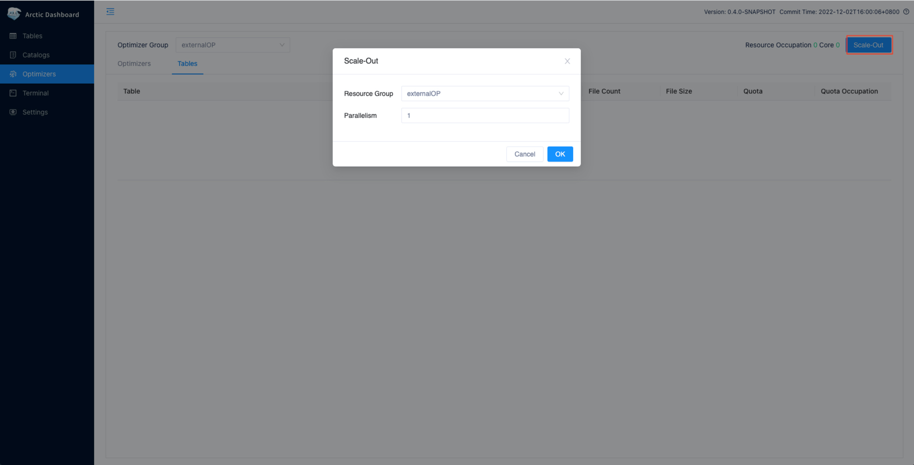
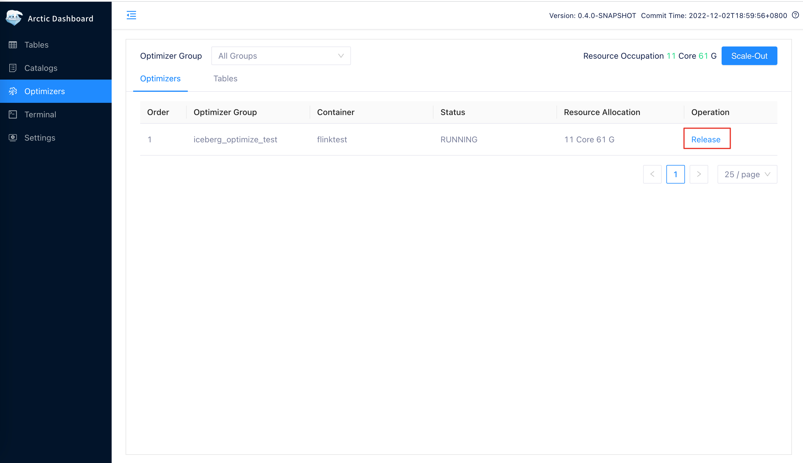

随着业务发展，需要 optimizer 的表越来越多，你需要扩容你的 optimizer 资源。反之，如果一开始创建了过多的 optimizer 资源，你可以释放掉部分来减少资源占用。在此之前，你需要先点击 Optimizers , 进入到管理页面。


## Optimizer Container
在使用 Self-optimizing 前，需要在配置文件中配置 container 类型和 optimize group。container 本身不是服务，它只代表了一组具体的运行环境配置，以及在该运行环境下 optimizer 的调度方案， 目前 optimizer container 包括 flink、local、external 三种类型。

### LocalContainer
Local Container 的 type 为 local，它通过本地进程方式启动 Optimizer 的一种方式，支持 Optimizer 任务的多线程执行。 建议只使用在演示阶段或本地部署的场景下。 如果没有配置 jdk 的环境变量，用户可以配置 java_home 指向 jdk 根目录。如果已经配置了，可以忽略这个配置项。
```shell
containers:
  - name: localContainer
    container-impl: com.netease.arctic.optimizer.LocalOptimizerContainer
    properties:
      memory: 1024
      export.JAVA_HOME: /opt/java   # JDK environment
```
### FlinkContainer
Flink Container 的 type 为 flink, 是通过 Flink 作业启动 Optimizer 的一种方式，借助 Flink 可以方便地将 Optimizer 部署在 yarn 集群上，从而支持大规模数据场景下的使用。使用 flink 类型 需要添加 type 为 flink 的 container，container 的配置项包括:

- FLINK_HOME， 下载 Flink 安装包并解压缩。以 Flink-1.12.7 为例，下载 https://archive.apache.org/dist/flink/flink-1.12.7/flink-1.12.7-bin-scala_2.12.tgz ,  假设解压缩到 /opt/ 目录下，那么配置值  /opt/flink-1.12.7/
- 因为 Flink 发行包已经不会带 hadoop 兼容包 flink-shaded-hadoop-2-uber-x.y.z.jar，需要用户额外下载 并且把它拷贝到 FLINK_HOME/lib 目录下。 flink-shaded-hadoop-2-uber-2.7.5-10.0.jar 一般就可以满足要求，下载地址：https://repo.maven.apache.org/maven2/org/apache/flink/flink-shaded-hadoop-2-uber/2.7.5-10.0/flink-shaded-hadoop-2-uber-2.7.5-10.0.jar
- HADOOP_CONF_DIR，存放 hadoop 集群的配置文件（ 包括 hdfs-site.xml，core-site.xml，yarn-site.xml )。 如果 hadoop 集群开启了kerberos认证， 需要额外准备 krb5.conf 和  用来提交任务的用户的 keytab 文件
- JVM_ARGS， 可以配置 flink 运行额外配置的参数，这里以配置 krb5.conf 为例，通过 -Djava.security.krb5.conf=/opt/krb5.conf  指定 Flink 提交时 使用的 krb5.conf 的地址
- HADOOP_USER_NAME，用来向 yarn 提交任务使用的用户名
- FLINK_CONF_DIR， flink_conf.yaml 所在的目录
```shell
containers:
  - name: flinkContainer
    container-impl: com.netease.arctic.optimizer.FlinkOptimizerContainer
    properties:
      flink-home: /opt/flink/                              #Flink install home
      jvm-args: -Djava.security.krb5.conf=/opt/krb5.conf   #Flink launch jvm args, like kerberos config when ues kerberos
      export.HADOOP_CONF_DIR: /etc/hadoop/conf/            #Hadoop config dir
      export.HADOOP_USER_NAME: hadoop                      #Hadoop user submit on yarn
      export.FLINK_CONF_DIR: /etc/hadoop/conf/             #Flink config dir
```
### ExternalContainer
从 *0.4.0* 开始，支持在用户从 AMS 外提交 optimizer 任务，并且系统内置了一个名为 external 的 container 来管理这类 optimizer。
不过在启动外部 optimizer 之前我们仍然需要配置一个 external container 下的 optimizer group，配置好后即可使用下面的命令来启动外部 optimizer。

```
用户可以在自己的 Flink 任务开发平台 或者 本地 Flink 环境 通过以下配置提交 optimizer 任务。主要参数包括：
```shell
flink run -m yarn-cluster  -ytm {TASK_MANAGER_MEMORY} -yjm {JOB_MANAGER_MEMORY}  -c com.netease.arctic.optimizer.flink.FlinkOptimizer  {ARCTIC_HOME}/plugin/optimize/OptimizeJob.jar -a {AMS_THRIFT_SERVER_URL} -g {OPTIMIZER_GROUP_NAME} -p {OPTIMIZER_PARALLELISM} -m {OPTIMIZER_MEMORY}  -hb 60000
```
相关参数说明如下表：

| 参数                             | 说明                                                         |
| -------------------------------- | ------------------------------------------------------------ |
| -ytm TASK_MANAGER_MEMORY | Flink 任务 Task Manager 内存大小。                                       |
| -yjm JOB_MANAGER_MEMORY  | Flink 任务 Job Manager 内存大小。                                        |
| ARCTIC_HOME                      | Arctic 根目录。                                                 |
| -a AMS_THRIFT_SERVER_URL         | AMS 的 thrift 服务地址， 比如：thrift://10.196.98.23:18112， 可从 config.yaml 的配置中获取。 |
| -g OPTIMIZER_GROUP_NAME          | optimizer group 的名称， 在 config.yaml 有配置，也可在前端 Optimizer-->Optimizer group里查看， 这个 group 必须在 external container 之下。 |
| -p OPTIMIZER_PARALLELISM         | 任务并行度。                                             |
| -m OPTIMIZER_MEMORY              | 执行内存，包含 Flink 任务的 JM 的内存和 TM 的内存的总和， 用来上报给 AMS 来统计 optimizer 的资源占用。 |
| -hb                              | optimizer 心跳上报间隔。                                        |

## Optimizer Group
Optimizer Group (Optimizer 资源组)是为了划分 Optimizer 资源而引入的概念，一个 Optimizer Group 可以包含若干个具有相同 container 类型的 optimizer，方便对该资源组进行扩缩容。

- name， optimize group 名称，可以在前端页面 optimizer group 列表看到。
- container， containers 里配置的某一个 container 的名称。
- scheduling_policy，optimizer group 调度策略，默认值为 quota 会按照每个表配置的 quota 资源进行调度，表配置 quota 越大那么就可以占用更多的 optimizer 资源。还有一种配置 balanced 会均衡的调度每一张表，越久没有做 optimize 的表会具有越高的调度优先级。
- properties，这个 group 下的默认配置，当在 optimize 页面进行 scale out 扩容的时候，会作为任务的配置参数。

```shell
optimize_group:
  - name: flinkOp                  
    container: flinkContainer      # container name, should be in the names of containers  
    properties:
      scheduling-policy: balanced  # schedule policy, quota or balanced
      task-manager.memory: 2048
      job-manager.memory: 1024
```
## Optimizers 扩缩容

用户可以在 dashboard 的 optimizers 模块中点击右上角 Scale-Out 实现快速扩容，通过 Resource Group 设置要扩容的 optimizer group，通过 Parallelism 配置单个 optimizer 任务的并发度， 点击 OK 完成创建。 列表中会新加一条状态为STARTING的记录，如果运行正常，刷新页面会状态会变成RUNNING。

也可以由用户在自己的调度平台中灵活地提交 Optimizer 任务。

用户可以在 dashboard 的 optimizers 的Optimizers 列表中，点击记录后的 release 释放这个 optimizer 任务。

???+ 注意

    > 当前仅支持释放通过 dashboard 扩容的 optimizer 任务。