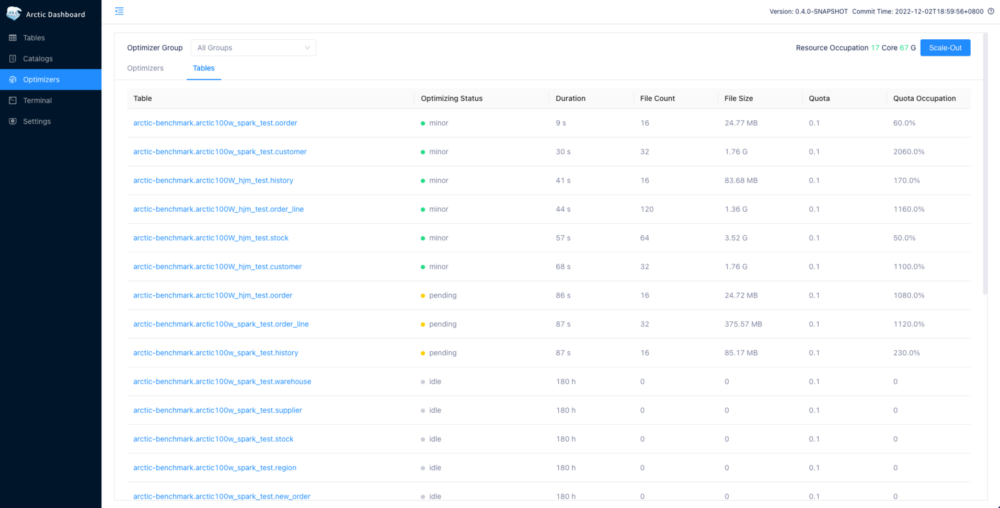

# Metrics

Arctic在 提供了表级和平台级的 metrics ，帮助用户来了解当前表的运行时状态。
## Table Metrics
Arctic Tables 详情页提供了多个 Tab， 从多个维度对表的状态进行展示。主要包括

| **Tab 页**   | **说明**                                               |
| ------------ | ------------------------------------------------------------ |
| Details      | 展示表的Schema、主键配置、分区配置、属性；以及 ChangeStore 和 BaseStore 存储的文件的 Metric 信息，包括文件数和平均文件大小，以及文件的最近提交时间 |
| Transactions | 展示的是 transaction 列表，不包括 Self-optimizing 生成的快照                                    |
| Optimized    | 展示表所有历史 Optimize记录，每一条记录展示了 Optimize 前、后的文件数及平均文件大小，以及每次 Optimize 的执行耗时 |
| Operations   | 展示当前表的 DDL 历史变更记录                                |

## Self-optimizing Metrics
Optimizers 页面展示的是平台级的 Self-optimizing 信息，包含不同分组下的资源总量以及资源用量， 同时展示了分组下所有执行 Self-optimizing 的表的状态和资源占用情况。

| **Metric 名称**   | **说明**                                                     |
| ----------------- | ------------------------------------------------------------ |
| Optimizing Status | 表当前Optimizing状态，包括minor, major, full, idle, pending  |
| Duration          | 表示当前状态持续的时间                                       |
| File Count        | 当前Self-optimizing 涉及的文件总数 ，包含base、insert、eq-delete、 pos-delete文件类型 |
| File Size         | 当前Self-optimizing 涉及的文件大小总和                       |
| Quota             | optimizer执行时分配给该表task的时间占比                      |
| Quota Occupation  | 该表实际占用的资源占比，当optimizer资源空闲时，会出现        |

