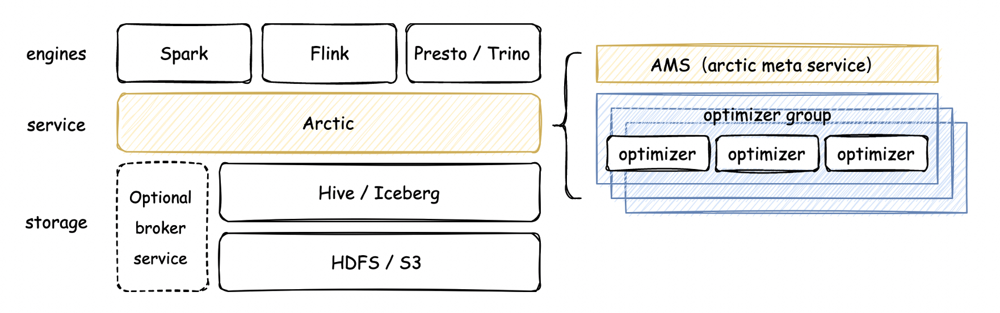

# 总览
欢迎使用 arctic，arctic 是由网易开源的流式湖仓系统，arctic 在 iceberg 和 hive 之上添加了更多实时场景的能力，并且面向 dataops 提供流批统一，开箱即用的元数据服务，让数据湖更加好用和实用。

### 概述

Arctic是搭建在 apache iceberg 表格式之上的流式湖仓服务（streaming lakehouse service）。通过 arctic，用户可以在 flink、spark、trino等引擎上实现更加优化的 CDC，流式更新，olap 等功能，
结合数据湖高效的离线处理能力，arctic 能够服务于更多流批混用的场景；同时，arctic 的结构自优化、并发冲突解决以及标准化的湖仓管理功能，可以有效减少用户在数据湖管理和优化上的负担。

Arctic 服务通过部署 AMS 来展现，AMS 可以认为是 HMS（Hive Metastore）的下一代产品，或者是面向 iceberg 的 HMS。
Arctic 依赖 iceberg 作为基础表格式，但 arctic 没有侵入 iceberg 实现，而是将 iceberg 作为一个 lib 使用，
在 flink、spark、trino 等计算引擎来看，arctic 首先是一个独立数据源，具有流式湖仓的特性，
其次也可以将 arctic 表当做一个或多个 iceberg 表来使用，考虑到 hive 依然有很大的用户体量，
arctic 在设计时考虑了 hive 的兼容性。Arctic 开放的叠加式架构，可以帮助已具规模的离线数据湖快速批量升级为实时数据湖，
而不用担心和原有数据湖的兼容性问题，让数据湖满足更多实时分析，实时风控，实时训练，特征工程等场景。

### Arctic 特性

* 基于主键高效地流式更新
* 数据自动分桶，结构自优化（self-optimized）
* 支持将数据湖和消息队列封装成统一的表，实现更低延迟的流批一体
* 提供流式数仓标准化的度量，dashboard 和相关管理工具
* 支持 spark 和 flink 读写数据，支持 trino 查询数据
* 百分百兼容 iceberg / hive 的表格式和语法
* 为流批并发写入提供事务性保障

### 架构与概念
Arctic 的组件包括 AMS，optimizer 以及 dashboard，如下所示：

**AMS**

Arctic Meta Service，在 arctic 架构中，AMS 定义为新一代 HMS，AMS 管理 arctic 所有 schema，向计算引擎提供元数据服务和事务 API，以及负责触发后台结构优化任务。

**Transaction**

Arctic 将一次数据提交定义为事务，并且保障流和批并发写入下的事务一致性语义，与 iceberg 提供的 ACID 不同，arctic 因为支持 CDC 摄取和流式更新，需要保障基于主键的数据一致性。

**TableStore**

TableStore 是 arctic 在数据湖上存储的表格式实体，TableStore 类似于数据库中的 cluster index，代表独立的存储结构，实现中一个 TableStore 是一张 iceberg 表，数据流式写入和批式写入会分别进入 arctic 的 ChangeStore 和 BaseStore，在查询时 arctic 会在多个 TableStore 上提供整合的视图，后续在 arctic 上扩展 sort key 或 aggregate key 也将通过扩展 TableStore 来实现。

**Optimizing**

Arctic 作为流式湖仓服务，会在后台持续进行文件结构优化操作，并致力于这些优化任务的可视化和可测量，优化操作包括但不限于小文件合并，数据分区，数据在 TableStore 之间的合并转化。

- `Optimizing planner` 决定了优化任务的调度策略，Arctic 支持在表属性中设置 quota，以此影响 Optimizing planner 在单表结构优化占用的资源。
- `Optimizer container` 是 optimizing 任务调度的容器，目前支持两种调度：standalone 和 yarn，standalone 在 AMS 本地调度，适合测试，arctic 支持用户扩展 optimizer container 实现。
- `Optimizer group` 用于资源隔离，optimizing container 下可以设置一个或多个 optimizer group，也可以通过 optimizer group 保障优先级，在 yarn 上 optimizer container 对应队列。

