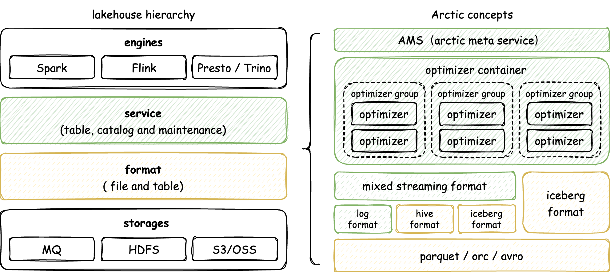

### Introduction

Arctic 是一个开放式架构下的湖仓管理系统，在开放的数据湖格式之上，Arctic 提供更多面向流和更新场景的优化，以及一套可插拔的数据自优化机制和管理服务。基于 Arctic 可以帮助各类数据平台，工具和产品快速搭建开箱即用，流批统一的湖仓。

### Architecture

Arctic 开放式架构如下所示：

{:height="85%" width="85%"}

目前 Arctic 是搭建在 Iceberg format 之上的湖仓管理系统，得益于 [Apache Iceberg](https://iceberg.apache.org/) 繁荣的生态，可以使用 Flink、Spark、Trino、Impala 等多种引擎在私有化场景和各个公有云平台上使用 Arctic，Arctic 的核心组件有：

- AMS — Arctic Management Service，负责提供湖仓管理功能，调度自优化任务，AMS 可以同时管理 Hive 表和新型表格式，像 [HMS](https://docs.cloudera.com/runtime/7.2.1/hive-hms-overview/topics/hive-hms-introduction.html) 一样具备元数据存储和管理的功能，可以和 HMS 或其他 Metastore 协同使用，AMS 配套的 dashboard 可执行管理操作，查看 metrics，对计算资源和数据资源的伸缩做出决策，请参阅：[Admin Guide](guides/managing-catalogs.md)

Arctic 为流和更新的场景提供更多可插拔的组件：

- [Optimizers](concepts/self-optimizing.md#introduction) — 数据自优化的执行引擎插件，为流式湖仓数据异步地执行合并、排序、去重，layout 优化，optimizer 被设计为湖仓中的后台执行器，执行过程像虚拟机中的垃圾回收器一样对用户透明。
- [LogStore](flink/using-logstore.md) — Arctic 内置的 mixed streaming format 可以在表上配置 LogStore，利用 Kafka、Pulsar 等消息队列为实时数据加工提供毫秒到秒级的 SLA，LogStore 本身也会作为一种表格式使用。
- [Kyuubi](https://kyuubi.apache.org/) — Arctic 提供的 SQL 工具可以对接 Kyuubi 实现 SQLGateway 功能

### Multiple formats

AMS 可以管理不同 table format 的表，类似于 MySQL/ClickHouse 可以选择不同存储引擎，Arctic 通过使用不同的 table format 满足多样的用户需求，目前 Arctic 支持两种 table format：

- [Iceberg format](concepts/table-formats.md#iceberg-format) — aka. native Iceberg format，使用 Iceberg 社区原生的 table format，具备所有 Iceberg 功能和特性
- [Mixed streaming format](concepts/table-formats.md#mixed-streaming-format) — Arctic 在 Hive 和 Iceberg 之上构建的 format，可以用 LogStore 加速数据处理，在 CDC 摄取，流式更新，fresh OLAP 上有自己的优化，mixed format 根据兼容性可分为:
    * [Mixed Hive format](concepts/table-formats.md#mixed-hive-format) —  schema、partition、types 与 Hive 完全兼容，支持 Hive 表原地升级和原生读写
    * [Mixed Iceberg format](concepts/table-formats.md#mixed-iceberg-format) — schema、partition、types 与 Iceberg 完全兼容，但是在 stream upsert, CDC, Merge on read 实现上与 mixed Hive format 保持一致，测试结果请参阅：[Benchmark](benchmark/benchmark.md)

### What makes difference

如果你是 Iceberg 用户，或在调研 Hudi/Iceberg/Delta 这类新型数据湖表格式，希望在生产场景中应用它，可以尝试用 Arctic 来管理原生 Iceberg 表，在 Iceberg 之上，Arctic 提供了：

- [Self-optimizing](concepts/self-optimizing.md) — 对用户无感的异步数据自优化功能，可以同时作为离线数仓和实时数仓使用
- Extensible scheduling — 目前支持本地，yarn 调度 optimizer，可以通过 API 扩展到不同的调度平台，支持按需伸缩
- More managment features
    * 可视化的 [catalog](concepts/catalogs.md) 和 表管理
    * 轻量化的 SQL 终端，可以 [对接 Kyuubi](guides/using-kyuubi.md) 提供 SQLGateway 功能
    * 丰富的表与数据优化任务的 [metrics](guides/metrics.md)

如果你更加关注数据加工延迟和实时场景下的 MPP 性能，或者作为 Hive format 用户，希望在自建的 data platform 或 DataOps 生产范式中快速落地湖仓架构，可以尝试 Arctic 提供的 [Mixed streaming format](concepts/table-formats.md#mixed-streaming-format)， 除了上文提到数据自优化和管理特性外，Mixed streaming format 主要有以下的不同：

- Defining keys — 支持在 Mixed format 表上定义主键，支持 Flink 和 Spark 读写数据的主键约束，未来计划支持更多类型的 key
- Format compatible — 支持 Hive 或 Iceberg 的原生读写，即通过 Hive/Iceberg connector 读写 Mixed format 表
- Better data pipeline SLA — 利用 LogStore 提升提升流式处理的时效性，从分钟级提升到毫秒与秒级
- Concurrent conflicts resolving — Arctic 会自动解决引擎并发写入，用户优化任务和自优化任务之间的数据冲突
