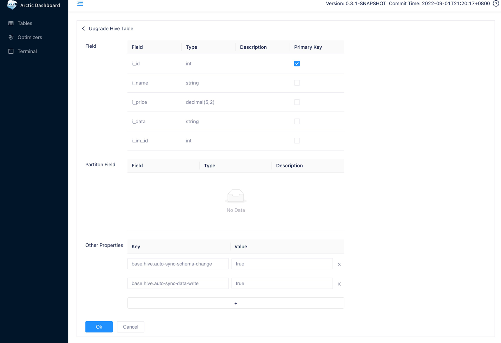

# 表管理
[AMS Dashboard](http://localhost:1630) 中提供了命令行工具`Terminal`帮组用户快速完成表的创建、修改与删除操作。
同时还可以在 [Spark](../spark/spark-ddl.md) 和 [Flink](../flink/flink-ddl.md) 等引擎中使用 SQL 完成表的管理。

## 升级 Hive 表
Arctic 从 v0.3.1 版本开始支持了 Hive 表，可以对已有的 Hive 表进行升级以获得 Arctic 提供的流批一体能力。有关升级后 Hive 表拥有的功能可以参考 [Hive Format](../table-fomat/hive-format.md)。

登录 [AMS Dashboard](http://localhost:1630) 后，从菜单中的 `Tables` 中选择 Hive 集群中的一张表，即可进行升级操作。


点击表详情右上角的 `Upgrade` 按钮。



在升级界面为表选择主键，并添加额外的参数，之后点击 `OK` 完成 Hive 表的升级操作。

## 新建表
登录 [AMS Dashboard](http://localhost:1630) 后，进入`Terminal`，输入建表语句并执行即可完成表的创建。
下面是一个建表的例子：

```sql
create table test_db.test_log_store(
  id int,
  name string,
  op_time timestamp,
  primary key(id)
) using arctic
partitioned by(days(op_time))
tblproperties(
  'log-store.enable' = 'true',
  'log-store.type' = 'kafka',
  'log-store.address' = '127.0.0.1:9092',
  'log-store.topic' = 'local_catalog.test_db.test_log_store.log_store');
```

当前 Terminal 使用 Spark Engine 完成 SQL 的执行，更多有关建表的语法参考 [Spark DDL](../spark/spark-ddl.md#create-table)。

### 配置 Logstore
如 [Tablestore](../table-format/table-store.md) 所述，一张 Arctic 表可能由几部分共同组成，一般来说 Basestore 与 Changestore 会随着表的创建而自动创建，
Logstore 作为可选组件则需要另外的配置来指明，有关 Logstore 的完整配置可以参考 [Logstore相关配置](table-properties.md#logstore)。

上面的例子中将 kafka 集群：`127.0.0.1:9092`中的 topic：`local_catalog.test_db.test_log_store.log_store`作为了新建表的 Logstore,
而在执行上面的语句之前你还需要手动去对应的 Kafka 集群中创建对应的 topic，或者打开集群的自动创建 topic 功能。

### 参数配置
Logstore 的相关配置是通过表的额外属性在表创建之时写入表的配置当中的，[Table Config](table-properties.md) 中有当前表的所有的可用配置，
它们大部分都已经被设置了合理的默认值，你也可以按需在创建语句中进行设置。

## 修改表

登录 [AMS Dashboard](http://localhost:1630) 后，进入`Terminal`，输入修改语句并执行即可完成表的修改。
下面是一个新增字段的的例子：

```sql
ALTER TABLE test_db.test_log_store ADD COLUMN new_column string comment 'new_column docs';
```

当前 Terminal 使用 Spark Engine 完成 SQL 的执行，更多有关修改表的语法参考 [Spark DDL](../spark/spark-ddl.md#alter-table)。

## 删除表

登录 [AMS Dashboard](http://localhost:1630) 后，进入`Terminal`，输入修改语句并执行即可完成表的修改。
下面是一个删除表的的例子：

```sql
DROP TABLE test_db.test_log_store;
```

当前 Terminal 使用 Spark Engine 完成 SQL 的执行，更多有关删除表的语法参考 [Spark DDL](../spark/spark-ddl.md#drop-table)。