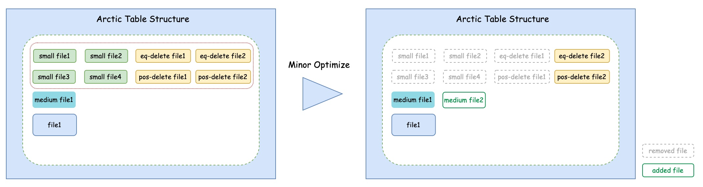
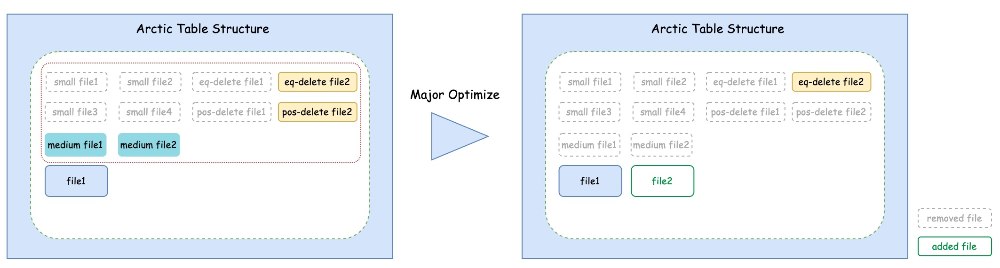
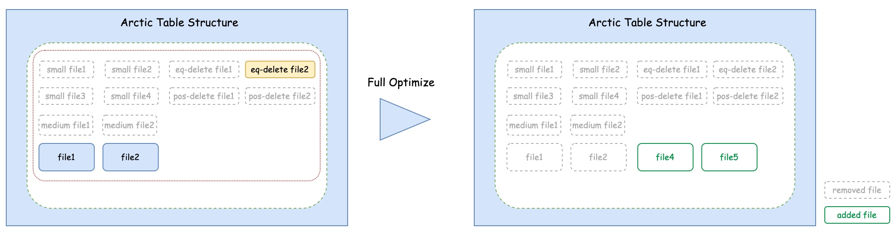

# Optimizing

结构优化（Optimize）功能为 Arctic 表提供了自动化的文件治理能力，主要面向解决小文件积压和数据冗余问题。

小文件积压主要出现在实时数据写入的场景：为了保证数据写入的实效性，需要进行频繁的数据提交，从而产生大量的小文件，积压的小文件一方面会影响数据的查询性能，另一方面也会对文件系统带来压力。

数据冗余主要出现在数据更新的场景：为了避免数据更新时频繁重写文件，造成写放大问题，引入了 delete 文件对数据进行标记删除，而不断积累的 delete 文件会造成数据冗余，不仅占用磁盘空间，也会影响查询性能。

Arctic 引入了 Optimize 功能来解决上述问题，通过文件的移动、转化、合并等操作满足文件合并、数据去重、数据排序等需求，Arctic 的 Optimize 主要有如下几个核心特点：

- 自动化流式执行：后台任务持续监听文件变化，异步执行结构优化

- 资源隔离和共享：允许资源在表级隔离和共享，以及设置资源配额

- 灵活的部署方式：执行节点支持多种部署方式，便捷的扩缩容

## Optimize 的分类

从功能上划分为三类：[Minor Optimize](#minor-optimize)、[Major Optimize](#major-optimize) 和 [Full Optimize](#full-optimize)。

其中 Minor Optimize 只合并小文件，超过小文件大小阈值的文件一般不再参与 Minor Optimize，其主要目标是削减小文件数量，进而带来查询性能的提升；

Major Optimize 将未达到到目标大小的数据文件以及 delete 文件进行合并，生成接近理想目标大小的文件，主要目标是提升平均文件大小到接近目标值、以及减少冗余数据，进而进一步提升查询性能以及释放磁盘空间；

Full Optimize 一次性触发所有文件的合并，达到彻底的文件规整、消除冗余数据的目标。

### Minor Optimize

Minor Optimize 只处理小文件，Arctic 支持为每张表独立配置小文件的阈值，文件大小低于阈值的文件即小文件。



在合并小文件时，与这些小文件相关的 delete 文件也会参与，而被 delete 文件删除的数据不会输出到合并后的文件中；并且，如果 delete 文件只和这些小文件相关，合并完成后，delete 文件也会被清理。

由于只处理小文件，Minor Optimize 只能将 Arctic 表的平均文件大小提升到一个比较低的值，但是带来的好处是，Minor Optimize 的执行代价相对较低，因此执行频率可以更加激进一些，一般可以配置为几分钟到几十分钟。

需要特殊说明的是，在 Arctic 有主键表场景下，Minor Optimize 不仅负责小文件的合并，也负责 Changestore 到 Basestore 的数据迁移。


Changestore 中的文件都被视作小文件参与 Minor Optimize，包括：

- 将 Changestore 中的 insert 文件合并到 Basestore 中

- 将 Changestore 中的 eq-delete 文件合并为 Basestore 中的 pos-delete 文件（需要读取 Basestore 中的数据）

对有主键表来说，Minor Optimize 不仅削减了小文件数量，也提升了 Basestore 的数据实效性，同时由于 eq-delete 转化成了 pos-delete，对查询性能的提升也有帮助。

### Major Optimize

Major Optimize 的核心目标是提升平均文件大小、清理冗余数据。



Major Optimize 时，未达到到目标大小的数据文件以及相关的 delete 文件都会参与合并，合并完成之后，无用的 delete 文件会被清理。

相比于 Minor Optimize 只能将文件大小合并到一个比较低的值，Major Optimize 合并后的文件大小趋近于配置的理想的目标文件大小。

由于要读写的文件体量更大, Major Optimize 的执行代价也更高，只有在 delete 文件足够多的情况下，才值得触发 Major Optimize。


### Full Optimize

Full Optimize 的目标是彻底的文件规整，并消除冗余数据。



Full Optimize 将重写所有的数据文件，合并完成之后，所有的 delete 文件都将被删除，从而实现彻底的文件治理。

由于要读写所有文件，Full Optimize 的执行代价也最高，只有 Major Optimize 仍然无法清理的 delete 文件积累到一定程度，才会触发 Full Optimize。

## Optimize 的流式执行

Optimize 通过异步的方式在后台持续执行结构优化，执行过程分为 Plan、Execute、Commit 三个步骤

- Plan：AMS 持续监听 Arctic 表文件的变化情况，触发 plan，生成一系列可以并发执行的 task
- Execute：Optimizer 从 AMS 获取 task、执行 task、上报执行结果给 AMS
- Commit：AMS 将执行完成的 task 集中提交

### Optimizer

Optimizer 是结构优化（Optimize）功能的执行组件，结构优化时数据的转化、合并等文件读写操作，都依赖 Optimizer 来完成。

每个 Optimizer 都是一个独立于 AMS 的实际运行的服务，它的运行方式不受限制，可以是一个本地进程，也可以是运行在分布式资源管理系统（如 yarn）上的作业。

## Optimize 的资源隔离和共享

### Optimizer Group

Optimizer Group（Optimizer 资源组）是为了划分 Optimizer 资源而引入的概念，一个 Optimizer Group 包含了若干个属于同一资源池的 Optimizer 服务，而一个 Optimizer 服务只能属于一个 Optimizer Group。

### Optimizer 的资源隔离

Optimizer Group 可以解决不同 Arctic 表之间 Optimizer 资源的隔离问题，不同 Optimizer Group 的 Arctic 表，它们的 Optimizer 资源是隔离的。

一张 Arctic 表只能归属于一个 Optimizer Group，这个属性可以设置；如果 Arctic 表未设置 Optimizer Group，将归属于名称为 'default' 的默认 Optimizer Group。

设置 Arctic 表 Optimizer Group 属性的方式如下：

```sql
alter table test_db.test_table set tblproperties (
    'optimize.group' = 'optimize-group-name');
```

### Optimizer 的资源共享和均衡

归属于同一个 Optimizer Group 的多张 Arctic 表，共享这部分 Optimizer 资源，用 quota（配额）来均衡每张表占用资源的多少。

quota 表示一段时间内累计占用cpu的时间占比，计算方式是：并发数 * 实际执行时间 / 总时间。

quota 使用率表示一段时间之内 quota 的实际消耗值与设定值的比例。

默认情况下，Optimizer Group 下所有表占用资源的权重是相同的，每张 Arctic 表设定的 quota 均为 0.1，可以修改这一配置，改变表的权重，修改方式如下：

```sql
alter table test_db.test_table set tblproperties (
    'optimize.quota' = '0.2');
```

Optimizer 资源是动态均衡的，目前的动态均衡策略如下：

当有 Optimizer 资源闲置时，根据此时 quota 使用率对 Arctic 表进行优先级排序，quota 使用率越低优先级越高，优先级最高的 Arctic 表会优先尝试进行 Optimize，如果该表没有 Optimize 的需要，则第二优先级的表尝试执行，依此类推。

上述 quota 使用率的计算是动态变化的，时间区间从上次 optimize 的开始时间算起，因此随着 optimize 的持续推进，quota 的计算区间也不断推进，从而反映出最近的资源占用情况。

在这样的设计下，Optimize 的效果也随着 Optimizer 资源的多少动态变化，提供的 Optimizer 资源越多，表的 Optimize 就越激进，数据时效性也就越高，文件治理效果也就越好。

当发现 Arctic 表的 Optimize 效果欠佳时，可以选择对 Optimizer 资源池进行扩容，或者增大这张表的 quota 设定值。


## Optimizer 的部署和扩展

Optimizer 支持在不同类型的运行环境下的提供多种实现方案，每个运行环境称为一个 Optimizer Container。
Arctic 已经提供了两种环境下 Optimizer 的实现，分别是 LocalOptimizer 和 FlinkOptimizer，用来支持在本地和 Flink 集群上运行 Optimizer，用户也可以自定义新的 Optimizer。

### Optimizer Container

Optimizer Container（Optimizer 容器）是 Optimizer 的运行容器，用来解决 Optimizer 的在不同运行环境下的加载、停止等调度问题。

Optimizer Container 可以有多种类型（type），Arctic 已经提供了 local 和 flink 两种类型的实现，分别支持 Optimizer 运行在本地环境和 Flink 集群。

Optimizer Container 本身不是服务，它只代表了一组具体的运行环境配置，以及在该运行环境下 Optimizer 的调度方案。

创建 Optimizer Group 需要指定它的 Optimizer Container，即定义这个 Optimizer Group 下的 Optimizer 的运行环境，当前一个 Optimizer Group 只能设置一个运行环境。

### LocalOptimizer

LocalOptimizer 通过本地进程方式启动的 Optimizer 的一种方式，支持 Optimize 任务的多线程执行，在演示阶段或单机部署的场景下，LocalOptimizer 是最简单的一种调度方式。

LocalOptimizer 的配置方式，参照 [Arctic Dashboard](meta-service/dashboard.md) 部分`conf/config.yaml`中的默认配置。

### FlinkOptimizer

FlinkOptimizer 是通过 Flink 作业启动 Optimizer 的一种方式，借助 Flink 可以方便地将 Optimizer 部署在 yarn 集群上，从而支持大规模数据场景下的使用。

FlinkOptimizer 的启动和配置方式，参照 [使用 Flink 执行结构优化](meta-service/dashboard.md#flink)。

### 自定义 Optimizer

自定义 Optimizer 需要依赖 arctic-optimizer 包，maven 配置如下：

```xml
<dependency>
    <groupId>com.netease.arctic</groupId>
    <artifactId>arctic-optimizer</artifactId>
</dependency>
```

用户需要定义 Optimizer 如何从 AMS 获取待执行的任务、执行任务、将任务执行结果上报给 AMS 等三个步骤，arctic-optimizer 包提供了通用的实现类，需要用户按照运行环境的要求进行组装，详见`com.netease.arctic.optimizer.operator`下的类。

为了将上述 Optimizer 纳入 AMS 的管控，并实现 AMS 启停 Optimizer，还需要实现 arctic-optimizer 包中的两个接口，分别是：

- `com.netease.arctic.optimizer.factory.OptimizerFactory`：定义 Optimizer 的类型命名（identity）和构造方法
- `com.netease.arctic.optimizer.Optimizer`：定义 Optimizer 的启动和停止方式

用户将的 OptimizerFactory 的实现类写入`META-INF/services/com.netease.arctic.optimizer.factory.OptimizerFactory`中，并将 jar 包放到到 AMS 的 lib 目录下，AMS 即可通过 SPI 机制识别到用户自定义的 Optimizer 实现。

AMS 中添加自定义的 Optimizer Container，需要在`conf/config.yaml`中`containers`增加配置：

```yaml
  - name: userContainerName           # Container 名称
    type: typeIdentity                # Container 类型，即 OptimizerFactory 的 identity
    properties:
      key1: value1                    # 自定义的属性，主要指具体的容器环境配置
```

定义好 Optimizer Container 之后，Optimizer Group 就可以使用这个 Optimizer Container 了， 在`conf/config.yaml`中`optimize_group`增加以下配置:

```yaml
  - name: groupName                   # Optimizer Group 名称，在 AMS 页面中可见
    container: userContainerName      # Optimizer Group 对应的自定义 container 名称
    properties:
      key1: value1                    # 自定义的 Optimizer Group 的属性
```

用户可以灵活定义 Optimizer Container 和 Optimizer Group 中的 properties，在构造 Optimizer 时，这些 properties 都会传递到 Optimizer，具体可以参考`com.netease.arctic.ams.server.service.impl.OptimizeExecuteService.startOptimizer`。

### 自定义 Optimizer 的生命周期管理

首先用户需要在AMS中配置Container和Optimizer group(参考[新增 optimizer group](meta-service/dashboard.md#flink))，其中container类型为external，
且Container以及Optimizer group的properties无需配置。

用户可以在本身已有的任务调度系统中管理Optimizer生命周期，只需提供以下Optimizer启动所需参数即可自动注册并启动Optimizer：
```text
AMS_THRIFT_SERVER_URL：AMS Thrift Server地址
OPTIMIZE_GROUP_NAME：Optimizer所属Optimizer Group名称，AMS中可见
EXECUTOR_PARALLELISM：Optimizer并行度
EXECUTOR_MEMORY：Optimizer内存，一般在flink场景下EXECUTOR_MEMORY = EXECUTOR_JOBMANAGER_MEMORY + EXECUTOR_PARALLELISM * EXECUTOR_TASKMANAGER_MEMORY
```

下面以FlinkOptimizer为例介绍如何通过用户任务调度系统管理和注册Optimizer。

用户可以通过已有调度系统启动FlinkOptimizer，例如flink run方式提交任务如下：

```shell
flink run -m yarn-cluster  -ytm {EXECUTOR_TASKMANAGER_MEMORY} 
-yjm {EXECUTOR_JOBMANAGER_MEMORY} 
-c com.netease.arctic.optimizer.flink.FlinkOptimizer 
/ARCTIC_HOME/plugin/optimize/OptimizeJob.jar -a {AMS_THRIFT_SERVER_URL} 
-qn {OPTIMIZE_GROUP_NAME} -p {EXECUTOR_PARALLELISM} -m {EXECUTOR_MEMORY} 
--heart-beat 60000
```
