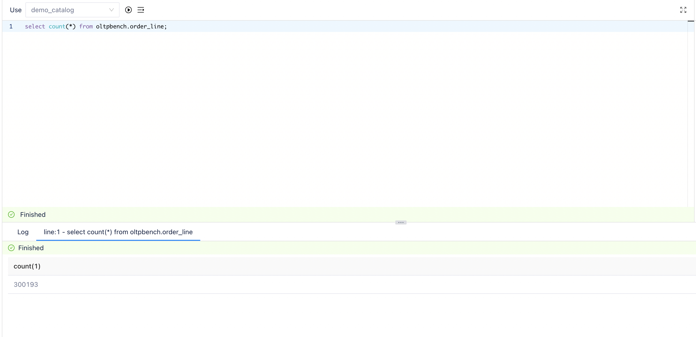

这篇文档将演示通过 FlinkCDC 同步 MySQL 数据变更到 Arctic 的过程。这里采用的是 [lakehouse-benchmark](https://github.com/NetEase/lakehouse-benchmark) 项目中提供的 TPCC 数据集，模拟真实业务场景下对 MySQL 的读写， 并使用 [lakehouse-benchmark-ingestion](https://github.com/NetEase/lakehouse-benchmark-ingestion) 工具完成数据通过 Binlog 从 MySQL 到 Arctic 的同步。需要提前通过 [Setup from Docker-Compose](./setup.md#setup-from-docker-compose) 完成集群的部署，并完成 [Quick demo](./quick-demo.md) 中，创建 catalog 并启动 Optimizer 的部分。


### Step1. initialize tables


通过以下命令完成测试数据的初始化：

```shell

docker exec -it lakehouse-benchmark java \
  -jar lakehouse-benchmark.jar -b tpcc,chbenchmark \
  -c config/mysql/sample_chbenchmark_config.xml \
  --create=true --load=true
  
```

等待命令执行完成，以上命令会在 MySQL 中初始化一个 oltpbench 的数据库，并且创建一系列业务表，并完成表数据的初始化，输入下面的命令登陆 MySQL 容器可以查看创建的表和导入的数据：

```shell
docker exec -it mysql mysql -ppassword oltpbench
```

预期可以在 MySQL 中看到：
```sql
mysql> show tables;
+---------------------+
| Tables_in_oltpbench |
+---------------------+
| customer            |
| district            |
| history             |
| item                |
| nation              |
| new_order           |
| oorder              |
| order_line          |
| region              |
| stock               |
| supplier            |
| warehouse           |
+---------------------+
12 rows in set (0.01 sec)

mysql> select * from warehouse;
+------+-----------+--------+--------+-------------------+---------------------+--------------------+---------+-----------+
| w_id | w_ytd     | w_tax  | w_name | w_street_1        | w_street_2          | w_city             | w_state | w_zip     |
+------+-----------+--------+--------+-------------------+---------------------+--------------------+---------+-----------+
|    1 | 300000.00 | 0.1591 | sblyvr | whthbdoldxinpnkpz | pkgqqoyrficypgbipgg | jbqjquxazxhvmvbdwb | TE      | 123456789 |
+------+-----------+--------+--------+-------------------+---------------------+--------------------+---------+-----------+
1 row in set (0.01 sec)
```

### Step2. start streaming ingestion

在命令行中输入以下指令完成 Ingestion 任务的启动：

```shell
docker exec -it lakehouse-benchmark-ingestion java \
  -jar lakehouse-benchmark-ingestion-1.0-SNAPSHOT.jar \
  -confDir /usr/lib/lakehouse_benchmark_ingestion/conf \
  -sinkType arctic \
  -sinkDatabase oltpbench
```

该任务会启动一个 Flink cluster 将 oltpbench 数据库实时同步到指定的 demo_catalog 中，并自动创建同名 database 和 table，开启后可以在 AMS Tables 页面查看到 Table 信息已经同步到 Arctic，这时表中只有初始化后的数据，可以通过 Terminal 执行 SQL 查询 Arctic 上同步的存量数据。

可以通过 [Flink Dashboard](http://localhost:8082) 访问 Flink Web UI 查看 Ingestion 任务信息。


### Step3. start tpcc benchmark

打开一个新的命令行，复制以下指令可以持续在测试库上执行 TPCC 测试：

```shell
docker exec -it lakehouse-benchmark java \
  -jar lakehouse-benchmark.jar -b tpcc,chbenchmark \
  -c config/mysql/sample_chbenchmark_config.xml -\
  -execute=true
```

此命令会一直不断的在测试库上执行 OLTP 操作，直到程序退出。在 TPCC 执行过程中，可以回到 [Arctic Dashboard](http://localhost:1630) 的 Terminal 页面，通过 Spark SQL 查询到  MySQL 上的数据变更会随着 Ingestion 任务不断的同步到 Arctic Table 上。

???+note "Ingestion 任务的 Checkpoint 周期为 60s,  所以 Arctic 数据湖和 MySQL 的数据变更有 60s 的延迟。"


### Step 4. check table result

整个 TPCC Benchmark 会执行 30min，可以 `Ctrl + C` 随时中断 TPCC 的执行，在 TPCC 执行完成后，可以通过以下命令登录 MySQL 容器

```shell
docker exec -it mysql mysql -ppassword oltpbench
```

通过在 MySQL 和 AMS 上执行 select 对比最终数据是否一致。比如我们可以对比 order_line 这张表最终的数据量是否一致：

```sql
mysql> select count(*) from order_line;
+----------+
| count(*) |
+----------+
|   300193 |
+----------+
1 row in set (0.08 sec)
```

