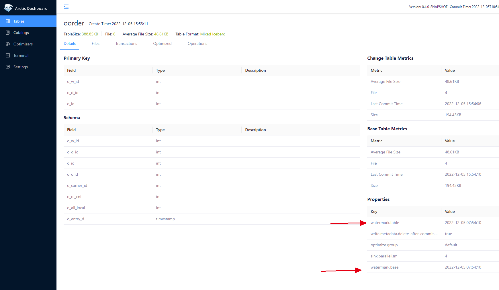

这篇文档将演示通过 FlinkCDC 同步 MySQL 数据变更到 Arctic 的过程。这里采用的是 [lakehouse-benchmark](https://github.com/NetEase/lakehouse-benchmark) 项目中提供的 TPCC 数据集，模拟真实业务场景下对 MySQL 的读写， 并使用 [lakehouse-benchmark-ingestion](https://github.com/NetEase/lakehouse-benchmark-ingestion) 工具完成数据通过 Binlog 从 MySQL 到 Arctic 的同步。需要提前通过 [Setup from Docker-Compose](./setup.md#setup-from-docker-compose) 完成集群的部署，并完成 [Quick demo](./quick-demo.md) 中，创建 catalog 并启动 Optimizer 的部分。


### Step1. initialize tables


通过以下命令完成测试数据的初始化：

```shell

docker exec -it lakehouse-benchmark java \
  -jar lakehouse-benchmark.jar -b tpcc,chbenchmark \
  -c config/mysql/sample_chbenchmark_config.xml \
  --create=true --load=true
  
```

等待命令执行完成，以上命令会在 MySQL 中初始化一个 oltpbench 的数据库，并且创建一系列业务表，并完成表数据的初始化。

### Step2. start streaming ingestion

登录到 Ingestion 容器，通过以下命令完成 Ingestion 任务的启动：

```shell
docker exec -it lakehouse-benchmark-ingestion java \
  -jar lakehouse-benchmark-ingestion-1.0-SNAPSHOT.jar \
  -confDir /usr/lib/lakehouse_benchmark_ingestion/conf \
  -sinkType arctic \
  -sinkDatabase oltpbench
```

开启后可以在 AMS Tables 页面查看到 Table 信息已经同步到 Arctic ，您可以通过 Terminal 执行 SQL 以查询 Arctic 上同步的数据。
Ingestion 容器也是一个 Flink Job， 您可以通过 [Flink Dashboard](http://localhost:8082)  访问 Flink Web UI 以查看 Ingestion 任务信息。


### Step3. start tpcc benchmark

重新回到 Benchmark 容器，通过以下命令可以持续在测试库上执行有业务含义的 OLTP 操作

```shell
docker exec -it lakehouse-benchmark java \
  -jar lakehouse-benchmark.jar -b tpcc,chbenchmark \
  -c config/mysql/sample_chbenchmark_config.xml -\
  -execute=true
```

此命令会一直不断的在测试库上执行 OLTP 操作，直到程序退出。
此时可以回到 AMS 的 Terminal 页面，通过 Spark SQL 查询到  MySQL 上的数据变更会随着 Ingestion 任务不断的同步到 Arctic Table 上。

???+note "Ingestion 任务的 Checkpoint 周期为 60s,  所以 Arctic 数据湖和 MySQL 的数据变更有 60s 的延迟。"


### Step 4. check table result

整个 TPCC Benchmark 会执行 10min，在 tpcc benchmark 执行完成后，可以通过以下命令登录 mysql 容器

```shell
docker exec -it mysql mysql -ppassword oltpbench
```

然后通过在 MySQL 和 AMS 上执行 Select 对比最终数据是否正确。

切换到 Tables 页面，在对应的 Table 详情页，可以查看到 Table 对应的 `watermark` 推进的时间节点。

