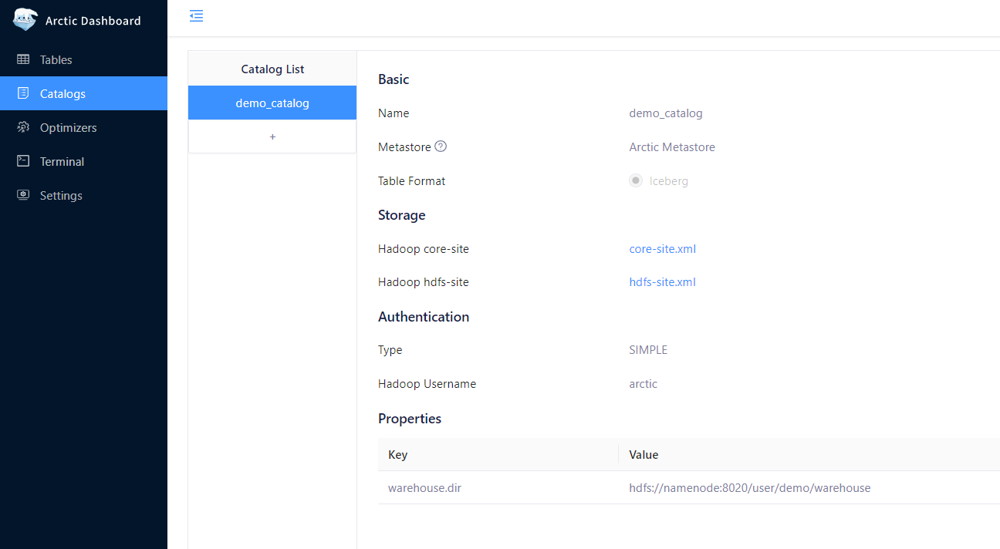
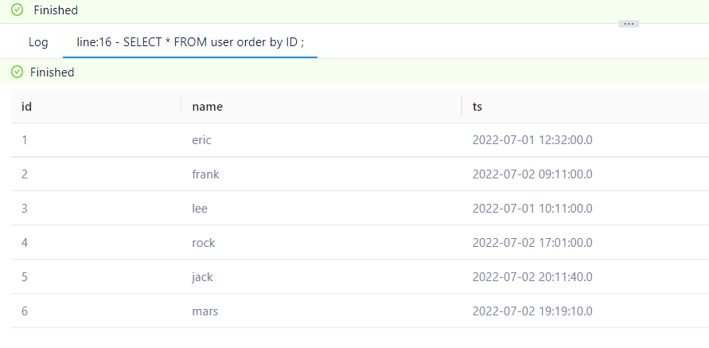
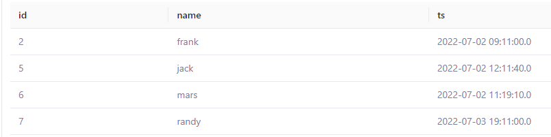
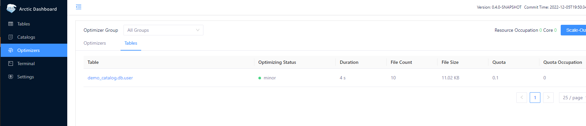
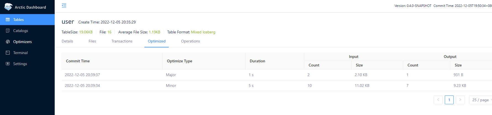
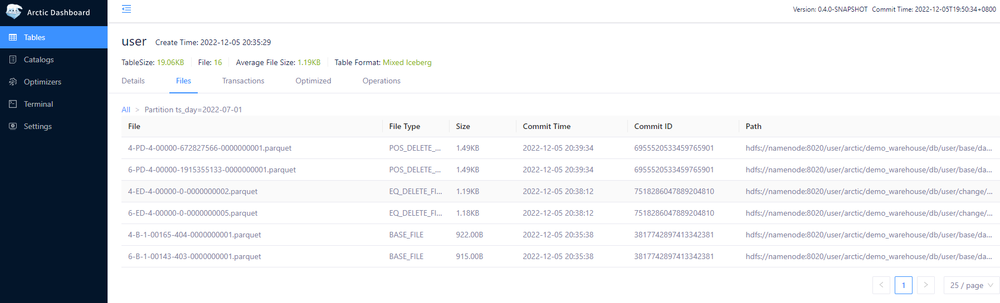

在快速开始 Arctic 之前，需要一些步骤完成必要的环境准备，这里提供了两种方式来完成 Arctic quick demo 所必须的准备工作：

- [Setup from docker](setup.md#setup-from-docker-compose)
- [Setup from binary release](setup.md#setup-from-binary-release)


### Prepare 1: create catalog

在浏览器打开 [http://localhost:1630](http://localhost:1630) 输入 admin/admin 登录 dashboard，点击侧边栏 Catalogs ，点击 Catalog List 下的 `+` 按钮，添加第一个 catalog， 设置其名字为 `demo_catalog`。
并添加一属性 `warehouse` 对应值为：

`hdfs://namenode:8020/user/arctic/demo_warehouse`。

> **TIPS**
>
>  请填写真实 `warehouse` 地址。

其余部分请按照以下截图设置 catalog 基本配置:



> 对于 Hadoop 配置文件，如果是采用 Docker setup，配置文件在 `<ARCIT-WORKSPACE>/hadoop-config` 目录，否则不用上传任何文件。

> 对于 warehouse 属性，如果是本地部署，填写一个有 Hadoop Username 对应的用户有权限访问的本地目录即可。

### Prepare 2: start optimizers

AMS 默认配置下会有一个类型为 local 的 optimizer group，在此 group 下创建一个 optimizer，进入 AMS 的 Optimizing 页面，选择 Optimizers。


点击 `Scale-Out` 按钮选择对应 `Optimizer Group` 并且配置 optimizer 并发度，点击 `OK` 完成 optimizer 的创建。


### Step 1: initialize table

在左侧菜单栏切换到  Terminal 页面，这里我们可以进行建表，数据读写等操作，Terminal SQL 语法为 Spark SQL 语法，切换到 demo_catalog 后输入以下 SQL 初始化表。

```shell

CREATE DATABASE IF NOT EXISTS db;
USE db;
CREATE TABLE IF NOT EXISTS user (
    id INT,
    name string,
    ts TIMESTAMP,
    PRIMARY KEY(id)
) USING arctic 
PARTITIONED BY (days(ts));

INSERT OVERWRITE user VALUES 
(1, "eric", timestamp("2022-07-01 12:32:00")),
(2, "frank", timestamp("2022-07-02 09:11:00")),
(3, "lee", timestamp("2022-07-01 10:11:00"));

SELECT * FROM user ;

```

点击 SQL Editor 上方的 RUN 按钮，等待 SQL 执行完成后，可以在当前页面看到 SQL 的查询结果。

### Step 2: execute flink upsert

如果是通过 Docker 完成环境准备，Flink Cluster 已经自动启动，可以直接通过 [http://localhost:8081](http://localhost:8081) 打开 Flink Dashboard，如果是通过二进制包进行本地部署，可以通过以下命令启动 Standalone 的 Flink Cluster。

```shell
cd <FLINK_DIR>
./bin/start-cluster.sh
```

然后启动 Flink SQL Client 

```shell
# 登录 Flink 容器, 非 docker 启动跳过此步骤
docker exec -it flink bash

./bin/sql-client.sh embedded
```

然后输入以下SQL（由于 Flink SQL Client 不支持批量 SQL 输入，需要逐条输入以下 SQL)

```SQL
-- 创建 catalog，非 docker 启动将 url 替换为 'thrift://localhost:1260/demo_catalog'
CREATE CATALOG arctic WITH (
  'type' = 'arctic',
  'metastore.url'='thrift://ams:1260/demo_catalog'
);

-- 创建 CDC Socket 源表
CREATE TABLE cdc_source(
  id      INT,
  name    STRING,
  op_time STRING
) WITH (
    'connector' = 'socket',
    'hostname' = 'localhost',
    'port' = '9999',
    'format' = 'changelog-csv',
    'changelog-csv.column-delimiter' = '|'
);

-- 关闭 Flink 引擎对 Delete 数据的过滤
set table.exec.sink.upsert-materialize=none;

-- 往 Arctic 表实时写入数据
INSERT INTO `arctic`.`db`.`user`
SELECT id,
       name,
       CAST(TO_TIMESTAMP(op_time) AS TIMESTAMP(6) WITH LOCAL TIME ZONE) ts
FROM cdc_source;
```

然后重新打开一个 Terminal 窗口，然后进入 flink 容器（容器中已安装netcat）：

```shell
docker exec -it flink bash
```
执行以下命令往 socket 中写入 CDC 数据：

```shell
nc -lk 9999
```

然后输入测试数据(需要回车以输入最后一行数据)：

```shell
INSERT|4|rock|2022-07-02 09:01:00
INSERT|5|jack|2022-07-02 12:11:40
INSERT|6|mars|2022-07-02 11:19:10

```


等待至少 10s (取决于 flink-conf.yaml 中配置的 checkpoint 间隔），打开 Dashboard 并进入 Terminal 页面，执行： 

```shell
SELECT * FROM db.user ORDER BY id ;
```

此时的预期结果为:



继续输入数据:

```shell
DELETE|1|eric|2022-07-01 12:32:00
INSERT|7|randy|2022-07-03 19:11:00
DELETE|4|rock|2022-07-02 09:01:00
DELETE|3|lee|2022-07-01 10:11:00

```

然后通过 Terminal 查询数据，预期数据为：



### Step3: check self-optimizing

启动 optimizer 之后，表的 self-optimizing 会自动触发。可以分别在 Optimizers 页面和 Table optimized 页面查看当前正在执行的 self-optimizing 任务和执行完成的历史 self-optimizing 任务：




如下图所示，如果已经完成实时写入与读取，测试表预期会进行 2 次 minor optimizing, 1 次 major optimizing。




经过 Optimizing 之后，以分区 `ts_day=2022-07-01` 为例，其文件情况如下



2 个 `BASE_FILE` 来自 Spark insert overwrite 写入，2 个 `EQ_DELETE_FILE` 来自 Flink upsert 写入，经过 self-optimizing，
两个 `EQ_DELETE_FILE` 被转换为 2 个 `POS_DELETE_FILE`。 

更多 self-optimizing 的介绍可以参考 [Self-optimizing](../concepts/self-optimizing.md)