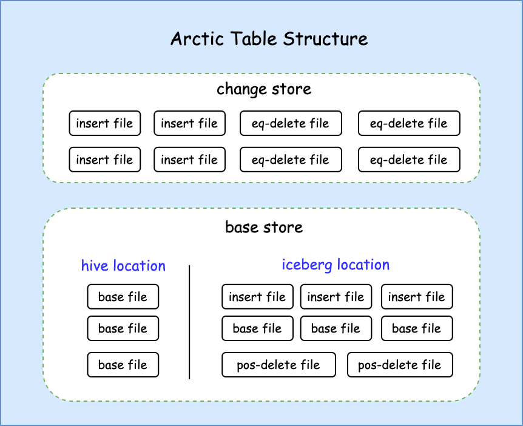

# Hive Format

正如 [Tablestore](table-store.md) 中所述，Arctic 在数据湖中的数据分为 Basestore 与 Changestore。
为了让广大的 Hive 用户能低成本的接入 Arctic， Arctic支持将 Hive 表作为 Basestore。
使用 Hive 表作为 Basestore 的表具有如下特性：

* 兼容 Hive 表的读、写、配置方式
* 具备 Arctic 表的所有特性，具体参考 [Arctic 特性](../index.md#arctic) 
* 已经存在的 Hive 表能轻松得升级为 Arctic表，升级过程中不发生数据文件的重写

## 存储结构

Arctic 在核心特性的实现上会使用 delete file 来存储 row-level 的行级变更以减少数据更新时的写放大问题，同时在实时场景下会有频繁的数据写入操作，这就需要 Tablestore 具有较好的ACID特性，
然而这些都是 Hive table 现阶段所不具备的，为了支持完整的 Arctic 特性，在实现上 Basetore 在保持兼容 Hive 元数据的基础上仍然会使用到 Iceberg 以提供 ACID 的特性。具体结构如下：

{:height="60%" width="60%"}

重点我们关注 Basestore 下的结构，其中区分了两个目录空间：

* hive location: Hive 表（或分区）的目录空间，会记录在 Hive Meta Store 中，用原生的 Hive reader 会读到这部分数据。
* iceberg location: 存储近实时写入数据的目录空间，用 Iceberg 管理，包含 insert file 与 delete file，原生的 Hive reader 无法读取到其中的数据， Arctic reader 能读取到。

两个目录空间的设计保障了支持 Arctic 完整特性的基础之上仍然兼容 Hive 原生读取。

## 操作

## 实时写入与读取

实时场景下的写入与读取仍然操作 Changestore(based on Iceberg) 或者 Logstore(based on MQ)，故其实与 Basestore 的 table format 选项无关。

## 离线写入

Arctic 在 Spark/Flink 等引擎下扩展了 Hive 表的写入实现，除了仍然支持 Insert/Insert overwrite 等常规写入方式，还支持了 Delete/Update/MergeInto 等高效的 row-level 写入方式。
Insert overwrite 会直接写入 hive location 下以保证写入的数据对于 Hive 立即可见，而 Delete/Update/MergeInto 等操作则会操作 Changestore，所以需要使用 Arctic connector 才能读到近实时数据。

### Hive 原生离线写入

即使不使用 Arctic 扩展的 Spark/Trino/Flink Connector，我们仍然能使用 Hive 原生的写入方式来写入数据，这使得 Arctic 能很好的兼容用户已有的一些写入方式。

## 离线读取

Arctic 在 Spark/Flink 等引擎下扩展了 Hive 表的读取实现，使得在读取时不仅读取 hive location 下的数据，还会结合 iceberg location 下的数据使用 Merge-On-Read 机制读取到近实时的数据。

### Hive 原生离线读取

即使不使用 Arctic 扩展的 Spark/Trino/Flink Connector，我们仍然能使用 Hive 原生的读取方式来读取数据，但是由于只能读到 hive location 下的数据，相较于 Arctic 的读取方式会有更大的延迟。

## 表结构变更

Hive 表的结构仍然会存储在 Hive Meta Store 中，Arctic 在不同引擎中都有 DDL 的实现，当然也可以仍然使用已经熟悉的工具来修改表结构。受限于 Hive 本身结构变更支持的限制，建议只在 Hive 表上做新增列的操作。

## 结构优化

[结构优化](table-store/#_3) 中所描述的所有过程对于使用 Hive 作为 Basestore 的表仍然受用。
* Major Optimize 在表（或分区）下没有position-delete文件时，会合并非hive目录下的小文件，并将输出文件移动到hive表（或分区）当前的目录
* Full Optimize 则会合并表（或分区）下所有的文件，将合并后的新文件写到临时目录，在提交时alter hive location，以达到更新 Hive 原生读取内容的目的

