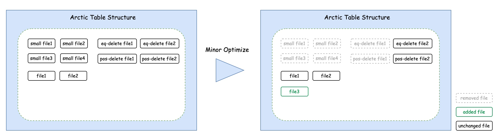
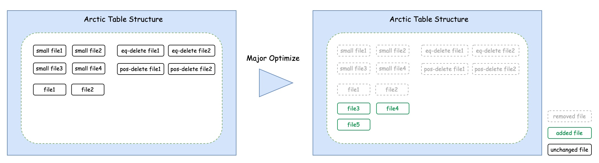
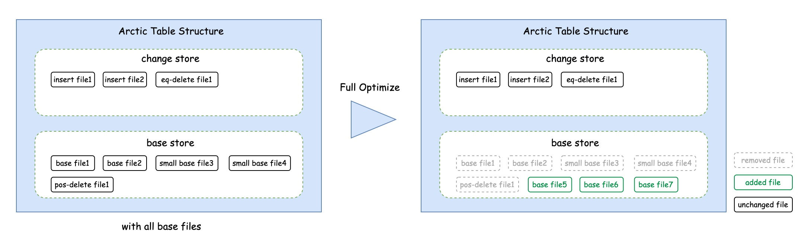

# 表结构
Arctic 能够兼容已有的存储介质(如 HDFS、OSS)和表结构(如 Hive、Iceberg)，并在之上提供透明的流批一体表服务。
同时 Arctic 提供自动的结构优化，以帮组用户解决数据湖常见的小文件、读放大、写放大等问题。

## 存储结构
对于一张定义了主键的 Arctic 表，存储结构上最多可以拆分为三部分：Changestore、Basestore、Logstore。

### Changestore
Changestore 中存储了表上最近的变更数据。
它通常由 Apache Flink 任务实时写入，并用于下游 Flink 任务进行近实时的流式消费。
同时也可以对它直接进行批量计算或联合 Basestore 里的数据一起通过 Merge-On-Read 的查询方式提供分钟级延迟的批量查询能力。

Arctic 内 Changestore 一般是一张单独的 Iceberg 表，它与 Arctic 表拥有相同的表结构和分区配置。
Changestore 内包含了存储插入数据的 insert file 和存储删除数据的 equality delete file，更新数据会被拆分为更新前项和更新后项分别存储在 delete file 与 insert file中。

### Basestore
Basestore 中存储了表的存量数据。
它通常由 Apache Spark 等引擎完成第一次写入，再之后则通过自动的结构优化过程将 Changestore 中的数据转化之后写入。

Arctic 内 Basestore 现阶段支持 Hive Table 与 Iceberg Table 并可以支持更多的扩展，它与 Arctic 表拥有相同的表结构和分区规则。
Basestore 内包含了存储数据文件的 base file 和存储已经被删除数据的 positional delete file，相较于 Changestore 中的 equality delete file，positional delete file 拥有更好的 merge-on-read 性能。

### Logstore
尽管 Changestore 已经能够为表提供近实时的 CDC 能力，但在对延迟有更高要求的场景仍然需要诸如 Apache Kafka 这样的消息队列提供毫秒级的 CDC 数据分发能力。
而消息队列在 Arctic 表中被封装为 Logstore。它由 Flink 任务实时写入，并用于下游 Flink 任务进行实时消费。

## 结构优化

Arctic 表的文件治理通过结构优化（Optimize）功能来实现。

Arctic 表支持实时数据的流式写入，为了保证数据的实效性，需要进行频繁的数据提交，从而产生大量的小文件，积压的小文件一方面会影响数据的查询性能，另一方面也会对文件系统带来压力。

Arctic 引入了 Optimize 功能来解决上述问题，Arctic 的 Optimize 主要有如下几个核心特点：

- 自动化流式执行：后台任务持续监听文件变化，异步执行结构优化

- 资源隔离和共享：允许资源在表级隔离和共享，以及设置资源配额

- 灵活的部署方式：执行节点支持多种部署方式，便捷的扩缩容

Optimize 主要包括文件的移动、转化、合并等操作，从功能上划分为两类：[Minor Optimize](#minor-optimize) 和 [Major Optimize](#major-optimize)。

其中 Minor Optimize 主要进行 Changestore 到 Basestore 的文件移动和转化，主要目标是提升查询性能以及缩短 Basestore 的数据可见延迟；

Major Optimize 主要进行 Basestore 内部的文件合并，主要目标是解决小文件问题，同时也可以进一步提升查询性能。

### Minor Optimize

Minor Optimize 将 Changestore 中的文件合并到 Basestore 中，只对有主键表有效，包括

- Changestore 中的 insert 文件移动到 Basestore 中

- Changestore 中的 eq-delete 文件转化为 Basestore 中的 pos-delete 文件，替换旧的 pos-delete 文件

由于上述两个操作的执行代价都不高， Minor Optimize 的执行频率可以更加激进一些，一般可以配置为几分钟到几十分钟，执行代价较低的原因在于：

一方面 insert 文件并不会进行物理层面的文件移动或复制，只会将文件索引到 Basestore 的元数据中；

另一方面处理 eq-delete 时，新产生的 pos-delete 文件只有文件路径和偏移量两列，数据量少，写入代价低。

Minor Optimize 提升了 Basestore 的数据实效性，同时由于 eq-delete 转化成了 pos-delete，对查询性能的提升也有帮助。

### Major Optimize

Major Optimize 只对 Basestore 中的文件进行合并，因此对有主键表、无主键表都生效。

无主键表的 Major Optimize 逻辑比较简单，将小文件合并成大文件，Arctic 支持每张表独立配置是否是小文件的大小阈值。

对于有主键表，参与合并的文件既包括 base 文件，只有 base 文件中的小文件与 pos-delete 文件进行合并，小文件合并生成新的 base 文件。

Major Optimize 只处理小文件，执行代价相对低一些，但是 pos-delete 文件和无效数据不能得到清理。

Major Optimize 的核心目标是解决小文件问题，减轻对文件系统的压力，同时文件数量的减少也可以进一步提升查询性能。

### Full Optimize

Full Optimize 只对 Basestore 中的所有文件进行合并，因此对有主键表、无主键表都生效。

无主键表的 Full Optimize 逻辑比较简单，将所有文件进行合并。

对于有主键表，所有的 base 文件 与 pos-delete 文件合并，重写所有 base 文件，删除 pos-delete 文件。

Full Optimize 的核心目标是清理无效数据，消除 pos-delete 文件。

Full Optimize 需要重写所有历史 base 文件，执行代价高，好处是可以彻底清理掉 pos-delete 文件以及 base 文件中的无效数据。

实际应用中，具体使用 Full 还是 Major 是根据 pos-delete 文件的大小自动判断的，用户可以修改这一阈值。
