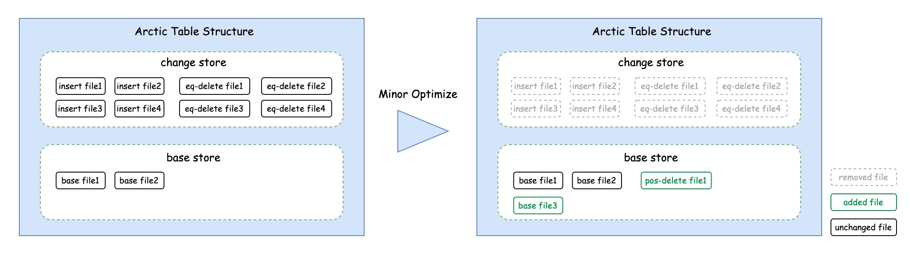

# 表结构
Arctic 能够兼容已有的存储介质(如 HDFS、OSS)和表结构(如 Hive、Iceberg)，并在之上提供透明的流批一体表服务。
同时 Arctic 提供自动的结构优化，以帮组用户解决数据湖常见的小文件、读放大、写放大等问题。

## 存储结构
对于一张定义了主键的 Arctic 表，存储结构上最多可以拆分为三部分：Changestore、Basestore、Logstore。

{:height="70%" width="70%"}

### Changestore
Changestore 中存储了表上最近的变更数据。
它通常由 Apache Flink 任务实时写入，并用于下游 Flink 任务进行近实时的流式消费。
同时也可以对它直接进行批量计算或联合 Basestore 里的数据一起通过 Merge-On-Read 的查询方式提供分钟级延迟的批量查询能力。

Arctic 内 Changestore 一般是一张单独的 Iceberg 表，它与 Arctic 表拥有相同的表结构和分区配置。
Changestore 内包含了存储插入数据的 insert file 和存储删除数据的 equality delete file，更新数据会被拆分为更新前项和更新后项分别存储在 delete file 与 insert file中。

### Basestore
Basestore 中存储了表的存量数据。
它通常由 Apache Spark 等引擎完成第一次写入，再之后则通过自动的结构优化过程将 Changestore 中的数据转化之后写入。

Arctic 内 Basestore 现阶段支持 Hive Table 与 Iceberg Table 并可以支持更多的扩展，它与 Arctic 表拥有相同的表结构和分区规则。
Basestore 内包含了存储数据文件的 base file 和存储已经被删除数据的 positional delete file，相较于 Changestore 中的 equality delete file，positional delete file 拥有更好的 merge-on-read 性能。

### Logstore
尽管 Changestore 已经能够为表提供近实时的 CDC 能力，但在对延迟有更高要求的场景仍然需要诸如 Apache Kafka 这样的消息队列提供毫秒级的 CDC 数据分发能力。
而消息队列在 Arctic 表中被封装为 Logstore。它由 Flink 任务实时写入，并用于下游 Flink 任务进行实时消费。

## 结构优化

Arctic 表的文件治理通过结构优化（Optimize）功能来实现。

Arctic 表支持实时数据的流式写入，为了保证数据的实效性，需要进行频繁的数据提交，从而产生大量的小文件，积压的小文件一方面会影响数据的查询性能，另一方面也会对文件系统带来压力。

Arctic 引入了 Optimize 功能来解决上述问题，Arctic 的 Optimize 主要有如下几个核心特点：

- 自动化流式执行：后台任务持续监听文件变化，异步执行结构优化

- 资源隔离和共享：允许资源在表级隔离和共享，以及设置资源配额

- 灵活的部署方式：执行节点支持多种部署方式，便捷的扩缩容

Optimize 主要包括文件的移动、转化、合并等操作，从功能上划分为两类：[Minor Optimize](#minor-optimize) 和 [Major Optimize](#major-optimize)。

其中 Minor Optimize 只合并小文件，超过小文件大小阈值的文件一般不再参与 Minor Optimize，其主要目标是削减小文件数量，进而带来查询性能的提升；

Major Optimize 将包括 delete 文件在内所有文件进行合并，生成接近理想目标大小的文件，主要目标是删除冗余数据、排序等，也可以进一步提升查询性能以及释放磁盘空间。

### Minor Optimize

Minor Optimize 只处理小文件，Arctic 支持为每张表独立配置小文件的阈值，文件大小低于阈值的文件即小文件。

在合并小文件时，与这些小文件相关的 delete 文件也会参与，而被 delete 文件删除的数据不会输出到合并后的文件中；并且，如果 delete 文件只和这些小文件相关，合并完成后，delete 文件也会被清理。

由于只处理小文件，Minor Optimize 只能将 Arctic 表的平均文件大小提升到一个比较低的值，但是带来的好处是，Minor Optimize 的执行代价相对较低，因此执行频率可以更加激进一些，一般可以配置为几分钟到几十分钟。

需要特殊说明的是，在 Arctic 有主键表场景下，Minor Optimize 不仅负责小文件的合并，也负责 Changestore 到 Basestore 的数据迁移。

Changestore 中的文件都被视作小文件参与 Minor Optimize，包括：

- 将 Changestore 中的 insert 文件合并到 Basestore 中

- 将 Changestore 中的 eq-delete 文件合并为 Basestore 中的 pos-delete 文件（需要读取 Basestore 中的数据）

对有主键表来说，Minor Optimize 不仅削减了小文件数量，也提升了 Basestore 的数据实效性，同时由于 eq-delete 转化成了 pos-delete，对查询性能的提升也有帮助。

### Major Optimize

Major Optimize 的核心目标是清理冗余数据，冗余数据是指被 delete 文件标记删除的数据，另外，数据排序等需求也可以在 Major Optimize 中实现。

Major Optimize 时，包括 delete 文件在内的所有文件都会参与合并，合并完成之后，所有的 delete 文件都会被清理。

相比于 Minor Optimize 只能将文件大小合并到一个比较低的值，Major Optimize 合并后的文件大小趋近于配置的理想的目标文件大小，从而实现彻底的文件治理。

由于要读写所有文件, Major Optimize 的执行代价也更高，只有在 delete 文件足够多、或者占比足够大的情况下，才值得触发 Major Optimize。
