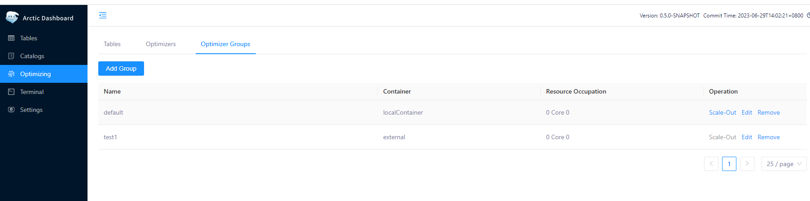
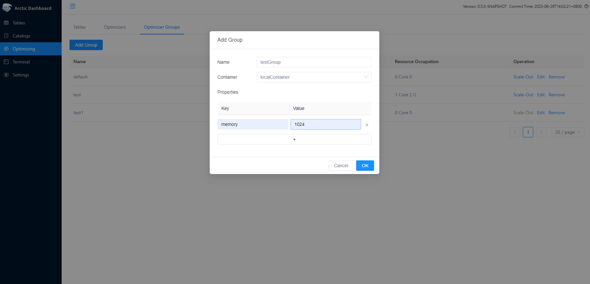
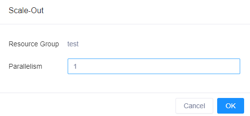
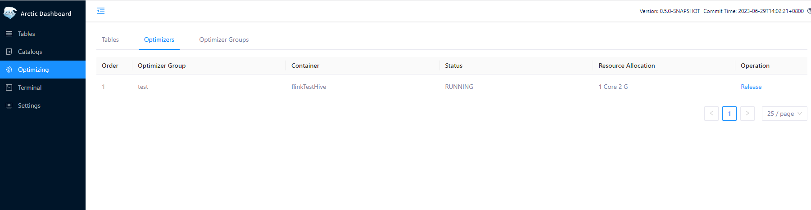

As your business grows and more tables need optimizers, you need to expand your optimizer resources. Conversely, if you created too many optimizer resources at the beginning, you can release some of them to reduce the resource usage. Before you do that, you need to click Optimizers and go to the administration page.


## Optimizer Container
Before using Self-optimizing, you need to configure the container type and optimize group in the configuration file. container itself is not a service, it only represents a specific set of runtime environment configuration, and the scheduling scheme of optimizer in that runtime environment. container includes three types: flink, local, and external.

### LocalContainer
The type of Local Container is local, which is a way to start Optimizer by local process and supports multi-threaded execution of Optimizer tasks. It is recommended to be used only in demo or local deployment scenarios. If the environment variable for jdk is not configured, the user can configure java_home to point to the jdk root directory. If already configured, this configuration item can be ignored.

```shell
containers:
  - name: localContainer
    container-impl: com.netease.arctic.optimizer.LocalOptimizerContainer
    properties:
      export.JAVA_HOME: "/opt/java"   # JDK environment
```
### FlinkContainer
Flink Container of type flink is a way to start Optimizer through Flink jobs. With Flink, you can easily deploy Optimizer 
on yarn clusters to support large-scale data scenarios. To use flink type, you need to add a container of type flink.
The required properties include "flink-home", and all environment variables that need to be exported can be configured 
in the "export.{env_arg}" property of the container's properties. The commonly used configurations are as follows:

- flink-home, download the Flink installation package and unzip it. Take Flink-1.12.7 as an example, 
download https://archive.apache.org/dist/flink/flink-1.12.7/flink-1.12.7-bin-scala_2.12.tgz , assuming that it is 
extracted to /opt/ directory, then configure the value /opt/flink-1.12.7/. Since the Flink distribution does not come 
with the hadoop compatible package flink-shaded-hadoop-2-uber-x.y.z.jar, you need to download it and copy it to the 
FLINK_HOME/lib directory. The flink-shaded-hadoop-2-uber-2.7.5-10.0.jar is generally sufficient and can be downloaded 
at: https://repo.maven.apache.org/maven2/org/apache/flink/flink-shaded-hadoop-2-uber/2.7.5-10.0/flink-shaded-hadoop-2-uber-2.7.5-10.0.jar
- HADOOP_CONF_DIR, which holds the configuration files for the hadoop cluster (including hdfs-site.xml, core-site.xml, yarn-site.xml ). If the hadoop cluster has kerberos authentication enabled, you need to prepare an additional krb5.conf and a keytab file for the user to submit tasks
- JVM_ARGS, you can configure flink to run additional configuration parameters, here is an example of configuring krb5.conf, specify the address of krb5.conf to be used by Flink when committing via -Djava.security.krb5.conf=/opt/krb5.conf
- HADOOP_USER_NAME, the username used to submit tasks to yarn
- FLINK_CONF_DIR, the directory where flink_conf.yaml is located
```shell
containers:
  - name: flinkContainer
    container-impl: com.netease.arctic.optimizer.FlinkOptimizerContainer
    properties:
      flink-home: /opt/flink/        #flink install home
      export.HADOOP_CONF_DIR: /etc/hadoop/conf/       #hadoop config dir
      export.HADOOP_USER_NAME: hadoop       #hadoop user submit on yarn
      export.JVM_ARGS: -Djava.security.krb5.conf=/opt/krb5.conf       #flink launch jvm args, like kerberos config when ues kerberos
      export.FLINK_CONF_DIR: /etc/hadoop/conf/        #flink config dir
```
### ExternalContainer

External Container of type external, starting from *0.4.0*, supports submitting optimizer tasks from outside AMS.

Users can submit optimizer tasks in their own Flink task development platform or local Flink environment with the following configuration. The main parameters include:
```shell
flink run -m yarn-cluster  -ytm {EXECUTOR_TASKMANAGER_MEMORY} -yjm {EXECUTOR_JOBMANAGER_MEMORY}  -c com.netease.arctic.optimizer.flink.FlinkOptimizer  {ARCTIC_HOME}/plugin/optimize/OptimizeJob.jar -a {AMS_THRIFT_SERVER_URL} -g {OPTIMIZE_GROUP_NAME} -p {EXECUTOR_PARALLELISM} -m {EXECUTOR_MEMORY}  --hb 10000
```
The description of the relevant parameters is shown in the following table:

| Property                         | Description                                                                                                                                                                                                                                                                                                        |
|----------------------------------|--------------------------------------------------------------------------------------------------------------------------------------------------------------------------------------------------------------------------------------------------------------------------------------------------------------------|
| -ytm EXECUTOR_TASKMANAGER_MEMORY | Flink Task TM Memory Size                                                                                                                                                                                                                                                                                          |
| -yjm EXECUTOR_JOBMANAGER_MEMORY  | Flink Task JM Memory Size                                                                                                                                                                                                                                                                                          |
| ARCTIC_HOME                      | Arctic  root directory                                                                                                                                                                                                                                                                                             |
| -a AMS_THRIFT_SERVER_URL         | The address of the AMS thrift service, for example: thrift://10.196.98.23:18112, can be obtained from the config.yaml configuration.                                                                                                                                                                               |
| -g OPTIMIZE_GROUP_NAME           | The name of the optimize group is configured in config.yaml and can also be found in the front-end Optimizer-->Optimizer group, the container in this group must be of external type.                                                                                                                              |
| -p EXECUTOR_PARALLELISM          | Flink Task Parallelism                                                                                                                                                                                                                                                                                             |
| -m EXECUTOR_MEMORY               | Execution memory, the sum of JM's memory and TM's memory for the Flink task, is used to report to AMS to count the optimizer's resource usage.                                                                                                                                                                     |
| -hb EXECUTOR_HEARTBEAT_INTERVAL  | optimizer heartbeat reporting interval. Note that the configured value cannot exceed the value of optimizer.heart-beat-timeout on the server side, otherwise it will cause the optimizer to have a longer heartbeat interval, which will be considered unhealthy by the server and suspend the execution of tasks. |
## Optimizer Group
Optimizer Group (Optimizer resource group) is a concept introduced to divide Optimizer resources. An Optimizer Group can 
contain several optimizers with the same container type to facilitate the expansion and contraction of the resource group.

### Add Optimizer Group

You can add an optimizer group on the Arctic frontend page by following these steps:

1.Click the "Add Group" button in the top left corner of the "Optimizer Groups" page.


2.Configure the newly added Optimizer group.


The following configuration needs to be filled in:

- name: the name of the optimizer group, which can be seen in the list of optimizer groups on the front-end page.
- container: the name of a container configured in containers.
- properties: the default configuration under this group, is used as a configuration parameter for tasks when the optimize page is scaled out.

The optimizer group supports the following properties:

Common Properties.

| Property            | Default | Description                                           |
|---------------------|----------| ----------------------------------------------------------- |
| scheduling-policy   | quota    | the scheduler group scheduling policy, the default value is quota, it will be scheduled according to the quota resources configured for each table, the larger the table quota is, the more optimizer resources it can take. There is also a configuration balanced that will balance the scheduling of each table, the longer the table has not been optimized, the higher the scheduling priority will be. |

Properties of the optimizer group for flink type containers.

| Property             | Description                          |
|----------------------|--------------------------------------|
| taskmanager.memory   | The memory size of Flink TaskManager |
| jobmanager.memory    | The memory size of Flink JobManager  |

Properties of the optimizer group for local type containers.

| Property | Description                                           |
|----------| ----------------------------------------------------- |
| memory   | The memory size of the local optimizer Java process|

### Edit Optimizer Group

You can click the "edit" button on the Optimizer groups page to modify the configuration of the Optimizer group.

### Remove Optimizer Group

You can click the "remove" button on the "Optimizer groups" page to delete the Optimizer group, but only if the group is 
not referenced by any catalog or table and no optimizer belonging to this group is running.

## Optimizer Capacity Expansion and Reduction

You can click the "Scale-Out" button on the "Optimizer Groups" page to scale out the optimizer for the corresponding optimizer 
group, and then click "OK" to start the optimizer for this optimizer group according to the Parallelism configuration. 
If the optimizer runs normally, you will see an optimizer with the status "RUNNING" on the "Optimizers" page.



Users can also flexibly submit Optimizer tasks in their own scheduling platforms. For information on the parameters required for Optimizer tasks, please refer to the Deployment section [external](#external) .

You can click the "Release" button on the "Optimizer" page to release the optimizer.


???+ attention

    > Currently, only Optimizer tasks scaled through the dashboard can be released.