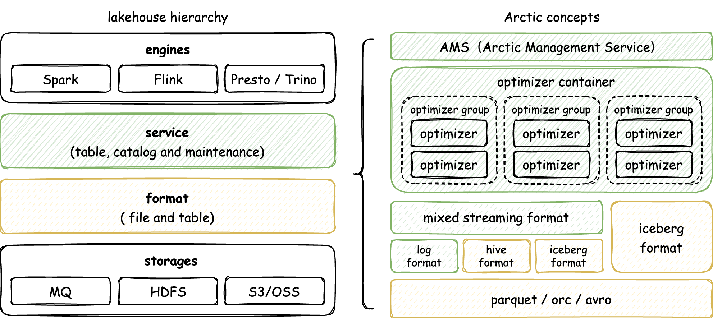

Arctic is a LakeHouse management system built on open data lake formats. Working with compute engines including Flink, Spark, and Trino, Arctic brings pluggable and self-managed features for LakeHouse to provide out-of-the-box data warehouse experience, and helps data platforms or products easily build infra-decoupled, stream-and-batch-fused and lake-native architecture.

### Architecture

The architecture of Arctic is as follows:

{:height="85%" width="85%"}
{:height="85%" width="85%"}

The core components of Arctic include:

- AMS — Arctic Meta Service，AMS is responsible for providing LakeHouse management functions, scheduling self-optimized tasks. AMS can manage both Hive tables and new table formats, and has metadata storage and management functions similar to [HMS](https://docs.cloudera.com/runtime/7.2.1/hive-hms-overview/topics/hive-hms-introduction.html), which can work together with HMS or other Metastores. The AMS-embedded dashboard can perform management operations, view metrics, and make decisions on the scalability of computing and data resources. Please refer to [Admin Guide](guides/managing-catalogs.md).

For streaming and upsert scenarios, Arctic provides more pluggable components, include:

- [Optimizers](concepts/self-optimizing.md#introduction) — The self-optimizing execution engine plugin asynchronously performs merging, sorting, deduplication, layout optimization, and other operations on streaming LakeHouse data. The optimizer is designed as a background executor in the LakeHouse, and the execution process is transparent to users, similar to a garbage collector in JVM.
- [LogStore](flink/hidden-kafka.md) — The built-in Mixed Format of Arctic can be configured with a LogStore on tables, and can utilize message queues(such as Kafka and Pulsar) to provide millisecond to second-level SLAs for real-time data processing. LogStore itself can also be used as a table format.
- [Kyuubi](https://kyuubi.apache.org/) — The SQL tool provided by Arctic can be integrated with Kyuubi, bringing the ability of SQLGateway.

### User cases

#### 1.Self-optimizing for the Real-time Data Lake

Arctic makes it easier for users to handle the challenges of writing to a real-time data lake, such as ingesting append-only event logs or CDC data from databases.
In these scenarios, the rapid increase of fragment and redundant files cannot be ignored.
To address this issue, Arctic provides a pluggable streaming data self-managed mechanism that automatically compacts fragment files and removes expired data, ensuring high-quality table queries while reducing system costs.

#### 2.Building a Product on Top of a Lake-Native Architecture

Currently, most data platforms and products are tightly coupled with their underlying infrastructure(such as the storage layer). The migration of infrastructure, such as switching to cloud-native OSS, may require extensive adaptation efforts or even be impossible. However, Arctic provides an infra-decoupled, lake-native architecture built on top of the infrastructure. This allows products based on Arctic to interact with the underlying infrastructure through a unified interface (Arctic Catalog service), protecting upper-layer products from the impact of infrastructure switch.

#### 3.Replacement for Traditional Data Warehouse
In order to fully leverage the complementary features of different data lake and data warehouse technologies, users tend to deploy multiple type of data clusters, which results in the same data being stored separately in data lake and data warehouse clusters, leading to issues such as data redundancy, data inconsistency, and data silos. Arctic provides self-optimizing, data constraints, monitoring, permissions management and other capabilities on top of the data lake, enhancing the data management capabilities of the data lake technology. This enables it to replace traditional data warehouses and achieve integrated storage.

